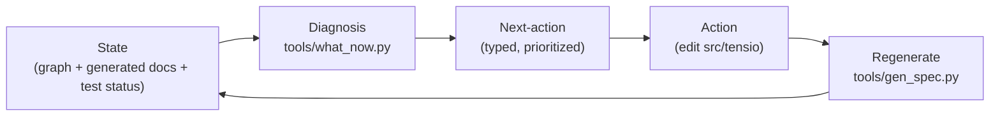

# CLAUDE.md

Operating contract for Claude Code (claude.ai/code) and maintainers. Public
description is in [`README.md`](README.md); this file is about **how to work and
never get lost**. Working language of artifacts: English.

## What this repository is

**Tensio** — an executable methodology for the lifecycle of contradictory
business requirements (many, constantly changing, mutually contradictory),
modeled as a **tension graph**. The deliberate inverse of a consistency spec:
dev-coin (the reference) proves ONE non-contradictory canon and forbids drift;
Tensio makes contradictions **visible and keeps them visible over time**. A
contradiction is a first-class object with status, steward, rationale and
history — never silently "fixed".

The store is **docs-as-code**: the framework's source of truth is the executable
model `spec/src/tensio/*.py` (the ontology + invariants + loader + generator;
**content-free by design**), and the domain's source of truth is
`spec/content/graph.py:build_graph()` (your requirements). Each framework
docstring carries three layers, exactly like dev-coin: a RULE + a `Canon:§N`
label + a `WHY:` block (incl. anti-relitigation markers `RESOLVED — REPLACES …`
/ `REJECTED …`). The human layer (`docs/gen/*.md`) is **generated**, never
written by hand.

## Framework vs content (content-free framework)

The framework (`spec/src/tensio/`) ships ZERO business data — no example
requirements, no example axes. **Tensio is a blank kit.** Domains populate
content under `spec/content/`; an empty content slot is the legitimate ship
state ("no content yet"). The worked example for tests/exploration lives
outside the framework under `spec/tests/fixtures/seed.py` and is loaded only
via the explicit `--demo` flag of the tools.

## Commands

From `spec/` (edit order when changing the model: format → regen → tests):

```bash
uv run ruff check --fix && uv run ruff format   # lint / format

# Default = your domain (spec/content/graph.py); empty in a fresh framework.
uv run python tools/what_now.py                 # the harness: prioritized next actions
uv run python tools/gen_spec.py                 # regen docs/gen/{REQUIREMENTS,TENSIONS,OPEN}.md

# Opt-in: explore the worked example fixture (spec/tests/fixtures/seed.py).
uv run python tools/what_now.py --demo          # diagnose the demo graph
uv run python tools/gen_spec.py --demo          # write docs/demo/ (NOT docs/gen/)

uv run pytest -q                                # tests (81 passed) incl. anti-drift meta-test
```

(If `uv` is unavailable: `python tools/what_now.py`, `python -m pytest -q` with
`PYTHONPATH=src`.)

## How to populate (your domain)

The framework discovers ONE file by convention:

```
spec/content/graph.py   →   def build_graph() -> tensio.graph.TensionGraph: ...
```

Drop in that file and the tools pick it up automatically. A minimal skeleton:

```python
from tensio.axis import Axis
from tensio.graph import TensionGraph
from tensio.requirement import Requirement
from tensio.stakeholder import Stakeholder


def build_graph() -> TensionGraph:
    return TensionGraph(
        axes=(Axis(slug="speed-vs-quality", description="…"),),
        stakeholders=(Stakeholder(id="product", name="Product", domain="customer"),),
        requirements=(
            Requirement(
                id="R-1",
                claim="The system shall …",
                owner="product",
                status="DRAFT",
                why="…",
            ),
        ),
    )
```

Then run `tools/what_now.py` to see what to do next. Every domain owns its own
axis vocabulary — `axes` lives on the graph, not as a global registry. See
[`spec/content/README.md`](spec/content/README.md) for the full guide.

## The closed loop — THE operating procedure (why an agent is never lost)

dev-coin makes **drift** structurally impossible. Tensio generalizes that into
**being lost** is structurally impossible. An agent dropped into the repo in ANY
state runs `what_now` and deterministically derives the next correct action:



`State → Diagnosis → Next-action → Action → regenerate → State`. The harness
aggregates every diagnostic into one priority-ordered list:

| Band | Kind | What it surfaces |
|---|---|---|
| P1 | STRUCTURE | failing structural invariants (malformed form, dangling refs, conflict missing axis/context/steward). Outranks all — a malformed graph makes softer diagnosis unreliable. |
| P2 | DRIFT_FALLOUT | DEAD assumptions with live dependents: every Requirement/Conflict resting on them to revisit (context drift). One dead assumption re-opens a cluster. |
| P3 | CONFLICT_STALLED | conflicts stuck DETECTED/ACKNOWLEDGED with no steward resolution. |
| P4 | OPEN_ITEM | `OPEN(question)` requirements awaiting a steward decision. |
| P5 | LATENT_CONNECTOR | HEURISTIC: requirement pairs that SHOULD have a C-node but don't ("for AI review"). Lowest band — a suspicion, never acted on unilaterally. |

If the list is empty, the graph is well-formed and every contradiction is
visible, stewarded and up to date — and the harness says so.

## The central insight — Conflict is a connector NODE, not an edge

A naive model makes conflict an edge `conflicts_with` between R-87 and R-203.
That edge holds nothing. A **Conflict is a first-class NODE** (a mediator)
through which two otherwise-unconnectable requirements first lie in one
structure: `R-87 → C-12 ← R-203`. C-12 carries knowledge belonging to NEITHER
member: the **tension axis** (along what dimension they diverge), the **shared
context** (the scenario where they collide), the **shared assumption** they
interpret differently (often the real root). Therefore "surface a contradiction"
= **materialize the missing connector node**. The ontology makes the naive edge
*unwritable*: Requirement has only supportive relations (`supports`, `refines`,
`depends_on`); a conflict belongs to neither requirement, so it cannot be a
Requirement field.

Consequences modeled: conflicts **cluster** by axis (a cluster = one
architectural choice, see `TENSIONS.md`); conflicts **spawn** requirements
(`Conflict.derived` = lineage); conflicts **inherit drift** (kill
`shared_assumption` → the whole cluster revives, surfaced as DRIFT_FALLOUT).

## The three invisibilities the methodology surfaces

1. **Direct contradictions** — two requirements that cannot both hold. Caught
   when machine-readable; otherwise materialized as a Conflict node.
2. **Hidden dependencies** — A silently relies on an assumption B negates.
   Contradiction *through a chain* — needs the graph (`graph.requirements_on_assumption`).
3. **Context drift** — a requirement meaningful under assumption X, X long false,
   nobody revisited it. Caught only because Assumptions carry their own lifecycle
   (HOLDS/UNCERTAIN/DEAD); a DEAD assumption lights up its dependents.

## The inverted spec-stack (what each level guarantees)

Same tools as dev-coin, purpose mirrored from "prove no conflict" to "detect &
hold conflict". **Calibration rule: weight of apparatus ∝ cost of an unnoticed
conflict.** Heavy formal layers only for the critical core (money, access, SLA,
workflow); the bulk runs as graph + EARS-claims with an AI + structural detector.

| Lvl | Mechanism | Guarantees | Status |
|---|---|---|---|
| 1 | Frozen dataclass validity (ruff/lint) | objects are well-formed | **CORE** |
| 2 | Structural graph invariants — `invariants.check_*` | every conflict has axis+context+steward; no dangling refs; OPEN states its question; DECIDED justifies itself; steward ≠ member owner | **CORE** |
| 3 | Visibility of the open — `OPEN(question)` + generated `OPEN.md` | open holes & unresolved conflicts cannot hide | **CORE** |
| 4 | Property-detector of latent conflicts — Hypothesis hunts requirement tuples for missing connectors | catches the *invisible*, not the recorded | DEFERRED (stub: `graph.latent_connector_suspects`) |
| 5 | Formal detector on the critical core — Z3 as a *conflict detector* (produce a model where two requirements are jointly violated) | machine proof a pair collides | DEFERRED |
| 6 | Behavioral/temporal conflicts — Quint/Apalache for process requirements | workflow/temporal contradiction | DEFERRED |
| 7 | Stateful PBT of graph evolution | dead assumption revives dependents, across histories | DEFERRED |
| 8 | Mutation testing of the detectors — cosmic-ray, semantic operators | detectors are not phantom | DEFERRED (roadmap) |
| 9 | Human layer + structural anti-drift — `gen_spec.py` + meta-test → `REQUIREMENTS.md`, `TENSIONS.md`, `OPEN.md` | generated text cannot drift from the model | **CORE** |

CORE built now: layers 1–3, 9, the harness, this contract. DEFERRED layers carry
their dependencies (`cosmic-ray`, `z3-solver` in the dev group) but are unused;
see [`docs/development/ROADMAP.md`](docs/development/ROADMAP.md).

## Files (layers)

- `spec/src/tensio/*.py` — **FRAMEWORK (content-free)**: the ontology + loader +
  invariants; module = section; docstrings carry RULE + `Canon:§N` + `WHY:`.
  - `requirement.py`, `conflict.py`, `assumption.py`, `axis.py`,
    `stakeholder.py` — the frozen-dataclass ontology.
  - `graph.py` — `TensionGraph` container + `load_content_graph()` +
    traversal helpers (no business data lives here).
  - `invariants.py` — structural `check_*` invariants (return `[Violation]`).
- `spec/content/graph.py` — **YOUR DOMAIN**: `build_graph() -> TensionGraph`.
  Empty by default (the legitimate ship state).
- `spec/tests/fixtures/seed.py` — worked example used by tests and `--demo`.
  Lives outside the framework because it is example business content.
- `docs/gen/REQUIREMENTS.md` / `TENSIONS.md` / `OPEN.md` — **GENERATED** from
  spec/content (never edit by hand; the meta-test fails on any drift).
- `docs/demo/*.md` — generated by `gen_spec.py --demo` from the fixture.
  Transient/exploration output; not subject to the anti-drift test.
- `spec/tools/gen_spec.py` — deterministic generator (LF, utf-8, no timestamps).
- `spec/tools/what_now.py` — the harness (the Diagnosis step of the loop).
- `docs/methodology/README.md` — the philosophy + the loop (human-written).
- `docs/development/ROADMAP.md` — phased rollout + trust-anchoring ritual.

## The AI's three roles + the HARD BOUNDARY

- **Detector** — on a new requirement: "this tensions with R-114 (owner: Finance)
  along latency-vs-completeness; here is a scenario where both break." Proposes
  *materializing the missing C-node*.
- **Socratic partner** — does not resolve; surfaces hidden assumptions: "R-87
  assumes a single customer; R-203 introduces multi-user orgs — does that hold?"
- **Historian** — every decision carries rationale + revisit-condition; the AI
  recalls: "you decided this in Q2 for reason Y; revisit-condition 'if an
  enterprise segment appears' has now triggered."
- **HARD BOUNDARY:** the AI **NEVER** closes a conflict silently. It presents,
  justifies, asks. The decision and its recording stay with the human steward —
  otherwise invisibility returns, now AI-created. This boundary is also
  *structural*: `check_steward_not_a_member_owner` forbids the holder of a
  tension from being a party that owns either claim.

## How to work in this repository (the edit cycle)

**Edit = data/docstring + tests + regen in one change.** Order: `ruff format` →
`gen_spec.py` → `pytest`. `pytest` must stay green.

**Do not edit generated files.** `docs/gen/*.md` are generated; the meta-test
`test_docs_gen.py` fails on any divergence. Edit `spec/content/graph.py` (your
domain) and/or the framework docstrings, then regenerate.

**Framework edits go into `spec/src/tensio/`** (ontology, invariants, loader,
generator, harness). Framework changes must keep the empty content slot green
and must not introduce business data — example data goes into
`spec/tests/fixtures/seed.py` (the fixture), never into `src/`.

**A new requirement** = a `Requirement(...)` row in your
`spec/content/graph.py:build_graph()` with an owner, status, assumptions and
WHY. Run `what_now` — it will flag latent connectors and any structural gap.

**A new conflict** = materialize the connector node in your `build_graph()`:
pick an `axis` from your domain's `axes` tuple (or add an `Axis(slug, …)` row to
that tuple — no near-duplicates), write the colliding `context`, set `members`
(≥2), assign a `steward` who is NOT a member owner, and its
`id = conflict_identity(axis, context)`. Lifecycle starts `DETECTED`.

**Resolved is recorded, not deleted.** A conflict moves to `DECIDED(<why>)` (with
rationale and/or a `derived` requirement) or `REVISIT_WHEN(<condition>)`.
REJECTED requirements stay for history. Before reopening a settled decision,
check the `revisit_marker` and the anti-relitigation prose.

**Assumptions have a lifecycle.** Flip one to `DEAD` and the harness surfaces its
dependents at once (DRIFT_FALLOUT) — never drop a dead assumption silently.

**Repo hygiene.** LF newlines (`.gitattributes`); dual license MIT OR Apache-2.0;
build/cache artifacts in `.gitignore`, not committed. Do not bump versions.

## OPEN methodology decisions (we practice what we preach)

These are the framework's own defaulted decisions — each is implemented but
flagged OPEN until the user confirms or overrides. They are the methodology's
equivalent of dev-coin's genesis-number list.

| # | Decision | Default (implemented) | `OPEN(question)` |
|---|---|---|---|
| M1 | Package name | `tensio` | OPEN(keep `tensio`, or `reqgraph`, or another name?) |
| M2 | Conflict identity | `hash(axis, context)` (`conflict_identity`) — node survives member rename/split, only edges update | OPEN(is (axis, context) the right identity key, or should members participate?) |
| M3 | Axis vocabulary location | per-graph (`TensionGraph.axes`); admission by manual edit of `build_graph()` | OPEN(when do we switch on the AI duplicate-gatekeeper for new axes? should some axes be cross-domain / framework-supplied?) |
| M4 | Steward mandatory & distinct | every Conflict needs a `steward`, structurally barred from owning a member | OPEN(is mandatory-distinct-steward always feasible, or are there single-stakeholder tensions?) |
| M5 | Trust anchor | periodic stakeholder cryptographic signature on the tension map per domain (described, not built — ROADMAP) | OPEN(what signature mechanism / cadence anchors the internal loop to a living human?) |
| M6 | Latent-connector heuristic | "shares ≥1 assumption AND no existing C-node" (`graph.latent_connector_suspects`) | OPEN(is shared-assumption the right cheap signal, and does it over-flag derived requirements?) |
| M7 | Critical-core scope for formal layers | none yet (all DEFERRED) | OPEN(which requirement domains are "critical core" warranting Z3/Quint/mutation?) |
| M8 | Content layout | single file `spec/content/graph.py` exposing `build_graph()` (discovered by `load_content_graph()`) | OPEN(one file forever, or split per sub-domain into `spec/content/<domain>.py` and aggregate?) |
| M9 | Multi-domain composition | a graph is one whole; multiple domains live in one `build_graph()` | OPEN(how does the methodology compose graphs across teams — federation, namespacing, or a single merged graph?) |
