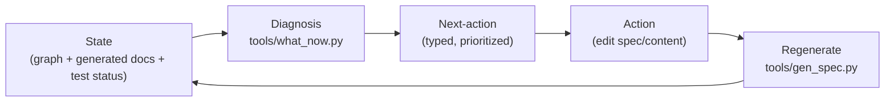

# CLAUDE.md

Operating contract for Claude Code (claude.ai/code) and maintainers. Public
description is in [`README.md`](README.md); this file is about **how to work and
never get lost**. Working language of artifacts: English.

## What this repository is

**Tensio** — an executable methodology for the lifecycle of contradictory
business requirements (many, constantly changing, mutually contradictory),
modeled as a **tension graph**. The deliberate inverse of a consistency spec:
dev-coin (the reference) proves ONE non-contradictory canon and forbids drift;
Tensio makes contradictions **visible and keeps them visible over time**. A
contradiction is a first-class object with status, steward, rationale and
history — never silently "fixed".

The store is **docs-as-code**: the framework's source of truth is the executable
model `spec/src/tensio/*.py` (the ontology + invariants + loader + generator;
**content-free by design**), and the domain's source of truth is
`spec/content/graph.py:build_graph()` (your requirements). Each framework
docstring carries three layers, exactly like dev-coin: a RULE + a `Canon:§N`
label + a `WHY:` block (incl. anti-relitigation markers `RESOLVED — REPLACES …`
/ `REJECTED …`). The human layer (`docs/gen/*.md`) is **generated**, never
written by hand.

## Operator boot ritual — read this in every new turn

You — the operator (OP-director, `R-operator-acting-facet`) — are loaded into
every turn through THIS file. The other generated docs (CONSTITUTION.md,
UNENFORCED.md, HISTORY.md, DECISIONS.md, GLOSSARY.md) are *referenceable*
but NOT auto-loaded — that's why the load-bearing rituals live here.

### Three-cipher pulse (cite in the first sentence of any substantive reply)

Before you propose, decide, or act, you should be able to name three numbers:

- **context** — your working-context fullness (§Context; cite it like `context 47%`).
  The substrate is free (`R-working-vs-substrate-budget`); only working context counts.
- **top action** — the band + target of the current `what_now` head.
- **debt** — the count of unenforced SETTLED + the count of DRAFT.

The live values are in the **Live state** block below, regenerated by
`tools/gen_spec.py` on every run — cite from there, never from memory.

<!-- LIVE-STATE:BEGIN -->
### Live state (autogenerated by tools/gen_spec.py — do not hand-edit)

- **top action:** [P0] REFLECTION on `enforcement-gradient` — 46 SETTLED requirements are PROSE/STRUCTURAL — claimed but not guaranteed, soft context-debt. See docs/gen/UNENFORCED.md.
- **debt:** 56/102 SETTLED ENFORCED · 21 DRAFT · 13 OPEN · 46 SETTLED-unenforced
- **graph:** 169 nodes (req+conflict+assumption); OP-director budget 200 (headroom 31)
- **crystal:** CLAUDE.md well under φ-cap (618033 tokens) — no split needed
- context: UNMEASURED (R-measure-context-size; hook deferred)
<!-- LIVE-STATE:END -->

<!-- CONSTITUTION:BEGIN -->
<!-- (generated by tools/gen_spec.py — do not hand-edit) -->

### Constitutional Digest (all SETTLED requirements)

**Operator**

- **R-agent-declares-purpose** — *Every spec/agents/<name>/scope.py shall define a non-empty module-level constant PURPOSE describing what the agent stewards in one line.* [ENFORCED·test_every_agent_declares_purpose]
- **R-agent-has-own-crystal** — *Each domain-agent shall carry its own `CLAUDE.md` file as its operator-prompt crystal.* [PROSE]
- **R-agent-has-own-tools-dir** — *Each domain-agent shall carry a `tools/` subdirectory holding its private tools.* [PROSE]
- **R-agent-is-a-directory** — *A domain-agent shall be represented as a directory at `spec/agents/<name>/`.* [PROSE]
- **R-agent-is-recursive-director** — *Every agent at `spec/agents/<a>/` or `domains/*/agents/<a>/` is a director of its SCOPE and contains its own `agents/` subdirectory for recursive sub-agents; the recursion's leaf is an empty `agents/` folder.* [STRUCTURAL]
- **R-agent-map-generated** — *CLAUDE.md shall contain an AGENT-MAP block listing every spec/agents/<name>/ with its PURPOSE, SCOPE prefixes, count of SETTLED atoms in scope, count of private and shared tools, and crystal path.* [ENFORCED·test_agent_map_complete]
- **R-agent-never-lost** — *The system shall let an agent dropped into the repo in any state, at any moment, deterministically derive the next correct action via tools/what_now.py.* [PROSE]
- **R-agent-scoped-constitution** — *For each spec/agents/<name>/ directory, gen_spec.py shall regenerate that agent's CLAUDE.md CONSTITUTION block filtered by the agent's SCOPE tuple of R-id prefixes.* [ENFORCED·test_agent_scoped_constitution]
- **R-context-bounded-delegation** — *The methodology shall relieve an over-budget operator by splitting its domain into a bounded sub-domain owned by a spawned sub-operator (the horizontal lever).* [STRUCTURAL·check_operator_within_budget]
- **R-context-budget-rule** — *An operator's owned domain shall not exceed its context budget: size(domain) <= budget.limit; exceeding it is a structural OVERLOADED contradiction the harness surfaces.* [ENFORCED·check_operator_within_budget·test_operator.py::test_check_operator_within_budget_fires·test_operator.py::test_director_within_budget]
- **R-crystal-is-claude-md** — *Each operator's crystallized substrate shall be its own CLAUDE.md file.* [STRUCTURAL]
- **R-crystal-reload-by-reference** — *An operator shall reload its crystal (CLAUDE.md) by reference rather than re-carrying it in working context.* [STRUCTURAL]
- **R-crystal-tree-hierarchy** — *The delegation hierarchy shall be a tree of CLAUDE.md crystals, one per operator, each bounded by its context budget.* [STRUCTURAL·test_constitution_gen.py]
- **R-operator-has-context-budget** — *An Operator shall carry a ContextBudget with a positive limit and a declared measure.* [ENFORCED·check_operator_within_budget·test_operator.py]
- **R-operator-is-frozen-dataclass** — *An Operator shall be a frozen dataclass in tensio.operator with typed anchor 'OP-'.* [ENFORCED·check_typed_anchors·test_operator.py]
- **R-operator-may-have-parent** — *An Operator.parent shall reference another Operator.id or be None (root).* [STRUCTURAL]
- **R-operator-not-self-approve** — *An Operator shall not steward a Conflict in which its underlying Stakeholder owns one of the members.* [ENFORCED·check_operator_steward_not_self·test_operator.py::test_check_operator_steward_not_self_fires]
- **R-operator-prompt-from-substrate** — *The operator-prompt CLAUDE.md shall include a CONSTITUTION block listing all SETTLED requirements grouped by category, generated deterministically from spec/content/graph.py.* [ENFORCED·test_constitution_block_generated]
- **R-operator-references-stakeholder** — *An Operator.stakeholder shall reference an existing Stakeholder.id.* [ENFORCED·check_no_dangling_ids·test_operator.py]

**Substrate / Anchoring**

- **R-anchor-everything** — *Every object shall carry a stable, short, typed anchor (prefix names the kind: R-/C-/A-/OP-/GOAL-/...).* [ENFORCED·check_typed_anchors·check_section_anchors_known·test_glossary_sync.py]
- **R-claude-md-live-state-generated** — *The live numeric state in CLAUDE.md (top action, debt counts, graph size, crystal headroom, context) shall be generated by gen_spec into a sentinel-delimited block, never hand-written.* [ENFORCED·test_docs_gen.py::test_claude_md_live_state_up_to_date]
- **R-speak-by-reference** — *An operator shall communicate by reference: every assertion cites >= 1 concrete anchor in the info-space; no ungrounded prose.* [ENFORCED·test_glossary_sync.py·check_section_anchors_known·docs/playbooks/]
- **R-stale-substrate** — *Crystallized knowledge whose enforcing assumption has died shall be surfaced as stale (enforced-but-wrong, a bad habit).* [STRUCTURAL·test_conscience.py::test_real_meta_domain_passes_critical_core]

**Discipline**

- **R-active-loop-apply-tool** — *A tool tools/apply_proposal.py shall consume an approved Proposed* JSON and mechanically apply the change to spec/content/.* [ENFORCED·test_apply_proposal.py]
- **R-active-loop-playbook-doc** — *At least one band-specific playbook shall exist under docs/playbooks/ describing the agent's role for that band.* [STRUCTURAL]
- **R-active-loop-protocol** — *Three Proposed* dataclass types (ProposedRequirement, ProposedConflictTransition, ProposedRejection) shall exist as the protocol for steward-approved operator changes.* [ENFORCED·test_proposal.py]
- **R-crystallize-before-split** — *On overload, an operator shall crystallize first, re-measure, and delegate (split) only if still over budget.* [STRUCTURAL]
- **R-crystallize-knowledge-to-code** — *An operator shall continuously crystallize working knowledge into requirement-code (the substrate); crystallized knowledge does not count against context — it is the offload instrument (like human automaticity/subconscious).* [STRUCTURAL]
- **R-delegation-conclusions-only** — *When an operator delegates a sub-domain to a sub-operator, the sub-operator shall return CONCLUSIONS, not raw detail; shared objects are declared as an explicit border.* [STRUCTURAL]
- **R-prefer-tool-over-hand** — *The operator shall prefer creating a reusable tool over performing the same action by hand; one-off acts are permitted only for genuine bootstrap or single-occurrence events.* [STRUCTURAL·CLAUDE.md§Operator boot ritual·docs/methodology/discipline.md]
- **R-shared-tools-in-spec-tools** — *Tools available to all agents shall live in `spec/tools/`.* [STRUCTURAL·file layout·docs/methodology/discipline.md]
- **R-task-vs-action-distinct-altitudes** — *The methodology's Task node type (a modeled work item) and the harness's Action (a fix-the-graph instruction) shall remain distinct types at distinct altitudes — never merged.* [STRUCTURAL]
- **R-verify-closure-per-action** — *After an applied proposal lands (write + regen + pytest pass), the system shall verify the action that triggered the proposal is no longer present in the post-apply what_now diagnosis.* [ENFORCED·test_closure.py·tools/closure.py::check_closure]
- **R-working-vs-substrate-budget** — *The context budget shall bound only the WORKING store (active, uncrystallized knowledge); the crystallized substrate is free and unbounded.* [STRUCTURAL·test_reflection.py]

**Check / Invariant**

- **R-axis-controlled-vocab** — *Every Conflict.axis shall be the slug of an Axis declared in the graph's `axes` tuple.* [ENFORCED·check_axis_in_registry]
- **R-bijection-r-to-enforcer** — *Every SETTLED/ENFORCED requirement shall name an existing check_* in tensio.invariants.ALL_INVARIANTS or a real test_* in spec/tests/.* [ENFORCED·check_bijection_r_to_enforcer]
- **R-conflict-is-connector-node** — *A contradiction shall be modeled as a first-class Conflict NODE carrying axis + context + shared_assumption + steward, never as a `conflicts_with` edge between requirements.* [STRUCTURAL]
- **R-conflict-min-two-members** — *Every Conflict node shall contain at least two distinct Requirement ids in its members tuple.* [ENFORCED·check_conflict_min_two_members]
- **R-conflict-structurally-visible** — *Every Conflict node shall carry a non-empty axis, context, and steward.* [ENFORCED·check_conflict_has_axis_context_steward]
- **R-decided-conflict-justifies-itself** — *Every Conflict in DECIDED lifecycle shall carry either a non-empty rationale in DECIDED(...) or at least one derived Requirement.* [ENFORCED·check_decided_has_rationale_or_derived]
- **R-decided-needs-human-signoff** — *A Conflict in DECIDED(...) lifecycle shall carry a decided_by: Stakeholder.id field (later: a cryptographic signature) — enforced by a new invariant.* [ENFORCED·check_decided_has_decided_by]
- **R-enforcement-levels-declared** — *A requirement shall carry an enforcement level from the set PROSE, STRUCTURAL, ENFORCED.* [ENFORCED·check_enforced_names_invariant]
- **R-m-tag-format-valid** — *Every Requirement.m_tag (when non-empty) shall match `^M[1-9][0-9]*$`, be unique across the graph, and appear only on OPEN requirements.* [ENFORCED·check_m_tag_format]
- **R-open-states-question** — *Every requirement whose status begins with 'OPEN' shall carry a non-empty question of the form OPEN(<question>).* [ENFORCED·check_open_has_question]
- **R-requirement-enforced** — *A SETTLED requirement should name an enforcing invariant or test; one that does not is UNENFORCED (claimed-but-not-guaranteed, soft context-debt).* [ENFORCED·check_enforced_names_invariant·test_docs_gen.py::test_unenforced_md_up_to_date]
- **R-stable-conflict-identity** — *A Conflict's id shall equal conflict_identity(axis, context) — the deterministic hash of its tension, not its members.* [ENFORCED·check_conflict_id_matches_identity]
- **R-statemachine-deterministic** — *A Lifecycle's transitions shall be deterministic — no two transitions with the same (src, event) and overlapping guards.* [ENFORCED·check_canonical_lifecycles_wellformed]
- **R-statemachine-guard-on-assumption** — *A Transition.guard may name an Assumption it rests on (drift seam) — when that Assumption dies, the guard is surfaced.* [STRUCTURAL]
- **R-statemachine-reachable** — *Every state in a canonical Lifecycle shall be reachable from the initial state.* [ENFORCED·check_canonical_lifecycles_wellformed]
- **R-statemachine-terminal-or-cyclic** — *Every non-cyclic Lifecycle shall reach at least one terminal/quiescent state.* [ENFORCED·check_canonical_lifecycles_wellformed]
- **R-steward-distinct-from-owners** — *Every Conflict's steward shall be a Stakeholder who is NOT the owner of any of the conflict's members.* [ENFORCED·check_steward_not_a_member_owner]

**Framework Self**

- **R-content-free-no-business-data** — *The framework spec/src/tensio/ shall ship no business data (no example requirements, no example axes, no business stakeholders).* [STRUCTURAL]
- **R-content-free-no-examples** — *The framework shall not include illustrative example Requirement(...) calls in its source modules; worked examples live under spec/tests/fixtures/seed.py and are loaded only via --demo.* [STRUCTURAL]
- **R-content-free-no-seed-graph** — *The framework shall not embed a seed TensionGraph; load_content_graph() discovers the user's spec/content/graph.py:build_graph() by convention.* [STRUCTURAL]
- **R-deterministic-generation** — *tools/gen_spec.py shall produce byte-stable LF utf-8 output with no timestamps or randomness — two runs over an unchanged graph yield identical bytes.* [ENFORCED·test_docs_gen.py::test_generator_is_deterministic]
- **R-drift-structurally-impossible** — *The generated docs/gen/*.md shall equal the regeneration of the current spec/content + framework docstrings, byte-for-byte.* [ENFORCED·test_docs_gen.py::test_requirements_md_up_to_date·test_docs_gen.py::test_tensions_md_up_to_date·test_docs_gen.py::test_open_md_up_to_date·test_docs_gen.py::test_unenforced_md_up_to_date]
- **R-empty-content-calm-banner** — *When spec/content/graph.py is absent, tools/what_now.py shall render a calm 'no content yet' banner, not an error.* [ENFORCED·test_what_now.py::test_main_empty_content_prints_calm_banner]
- **R-empty-content-gen-notice** — *When spec/content/graph.py is absent, tools/gen_spec.py shall emit a 'no content yet' notice into docs/gen/*.md, not fail.* [ENFORCED·test_docs_gen.py::test_empty_graph_renders_no_content_notice]
- **R-empty-content-wellformed** — *A freshly-cloned framework with no spec/content/graph.py shall pass all structural invariants — an empty graph is well-formed.* [ENFORCED·test_invariants.py::test_empty_graph_is_wellformed]
- **R-rejected-preserved-not-deleted** — *Requirements that are rejected shall be marked REJECTED and kept in the graph for history, never deleted.* [PROSE]
- **R-two-altitude-ontology** — *The methodology shall use ONE ontology at two altitudes: operator is to the methodology as actor is to the business (the methodology plane is the business plane applied reflexively).* [PROSE]

**Lifecycle / Process / Goal**

- **R-goal-is-first-class-type** — *Goal shall be its own frozen dataclass type (not a Requirement facet) with typed anchor 'GOAL-'.* [ENFORCED·test_goal.py·check_typed_anchors]
- **R-goal-owner-is-operator** — *Goal.owner shall reference an existing Operator.id.* [ENFORCED·check_goal_owner_is_operator·check_no_dangling_ids]
- **R-goal-target-kind-known** — *Goal.target_state.kind shall be one of the declared TARGET_KINDS.* [ENFORCED·check_goal_target_kind_known]
- **R-lifecycle-type-exists** — *A generic tensio.lifecycle module shall define State, Transition, and Lifecycle types.* [ENFORCED·test_lifecycle.py]
- **R-lifecycle-validates-conflict** — *Conflict.lifecycle shall validate against the framework-supplied CONFLICT_LIFECYCLE.* [ENFORCED·check_status_in_lifecycle]
- **R-lifecycle-validates-requirement** — *Requirement.status shall validate against the framework-supplied REQUIREMENT_STATUS_LIFECYCLE.* [ENFORCED·check_status_in_lifecycle]
- **R-process-goal-owner-is-operator-aspect** — *Every Goal.owner shall reference an existing Operator.id, validated by check_goal_owner_is_operator.* [ENFORCED·check_goal_owner_is_operator]
- **R-process-lifecycle-wellformed-aspect** — *Every Process node shall have a well-formed lifecycle validated by check_process_lifecycle_wellformed.* [ENFORCED·check_process_lifecycle_wellformed]
- **R-process-opt-in** — *The Process aspect shall be opt-in: TensionGraph.processes defaults to an empty tuple.* [STRUCTURAL]
- **R-process-roles-declared-aspect** — *Every role referenced in a Process step shall be declared in the Process roles_required tuple.* [ENFORCED·check_process_roles_declared]
- **R-process-typed-anchors-extended** — *check_typed_anchors shall validate PR- and GOAL- prefixes for Process and Goal nodes.* [ENFORCED·check_typed_anchors]
- **R-process-types-exist** — *tensio.process shall define Process, Step, Goal, TargetState, PROCESS_LIFECYCLE, and GOAL_LIFECYCLE types.* [ENFORCED·test_process.py]

**Boot / Glossary / History / Docs**

- **R-boot-cite-in-first-sentence** — *The operator shall cite at least one of the three substrate facts in the first sentence of any substantive reply.* [PROSE]
- **R-boot-reload-three-facts** — *The operator shall begin every new turn by re-loading three facts from the substrate: current context %, the top what_now action, and the SETTLED-DRAFT-UNENFORCED ratio.* [STRUCTURAL]
- **R-docs-generated-from-requirements** — *Per-topic narrative files under `docs/methodology/atoms/<topic>.md` shall be generated from SETTLED requirements grouped by topic; hand-edits are forbidden by a meta-test.* [ENFORCED·test_docs_gen.py::test_methodology_atoms_up_to_date·tools/gen_spec.py::build_methodology_atoms]
- **R-glossary-drift-stable** — *The committed docs/gen/GLOSSARY.md shall equal the regeneration of the current graph byte-for-byte.* [ENFORCED·test_docs_gen.py::test_glossary_md_up_to_date]
- **R-glossary-generated** — *A controlled vocabulary of methodology terms shall be generated under docs/gen/GLOSSARY.md.* [ENFORCED·test_docs_gen.py::test_glossary_md_up_to_date]
- **R-glossary-sync-fails-dead** — *The glossary sync test shall fail when a defined vocabulary term is not used anywhere in the framework.* [ENFORCED·test_glossary_sync.py]
- **R-glossary-sync-fails-unused** — *The glossary sync test shall fail when a section-anchor token used in the framework is absent from the glossary.* [ENFORCED·test_glossary_sync.py]
- **R-history-generated-from-decided** — *docs/gen/HISTORY.md shall include entries generated from DECIDED and REVISIT_WHEN lifecycle states on Conflicts.* [ENFORCED·test_history_gen.py·test_docs_gen.py::test_history_md_up_to_date]
- **R-history-generated-from-rejected** — *docs/gen/HISTORY.md shall include entries generated from REJECTED markers in requirement WHY blocks.* [ENFORCED·test_history_gen.py·test_docs_gen.py::test_history_md_up_to_date]

**Other**

- **R-ai-presents-not-decides** — *The AI agent shall NEVER close a Conflict silently. It presents, justifies, and asks; the decision and its recording stay with the human steward.* [STRUCTURAL]
- **R-critical-core-methodology** — *The methodology's own critical core shall be the six invariants in CRITICAL_CORE_INVARIANTS, property-tested by test_conscience.py.* [ENFORCED·test_conscience.py]
- **R-critical-core-per-domain** — *Business-domain critical core (money, access, SLA) shall be a separate per-domain calibration, not framework-imposed.* [PROSE]
- **R-dependency-drives-parallel** — *Independent sub-graphs in the dependency network may be delegated to parallel sub-operators.* [STRUCTURAL]
- **R-dependency-drives-sequential** — *Dependency chains in the network shall be processed sequentially.* [STRUCTURAL]
- **R-dependency-tracked** — *The system shall track the dependency network between requirements via Requirement.relations (depends_on, supports, refines).* [STRUCTURAL]
- **R-director-agent-required-per-domain** — *Every domain must contain a `director` agent at `domains/<name>/agents/director/` as the entry point operator.* [STRUCTURAL]
- **R-domain-declares-director** — *Every domain's `manifest.py` DIRECTOR constant must resolve to a real agent directory at `domains/<name>/agents/<DIRECTOR>/`.* [STRUCTURAL]
- **R-domain-has-manifest** — *Every `domains/<name>/` directory contains `manifest.py` defining top-level constants ID, DESCRIPTION, GOALS, DIRECTOR.* [STRUCTURAL]
- **R-domain-is-a-directory** — *A business domain is represented as a directory at `domains/<name>/`.* [STRUCTURAL]
- **R-domain-map-generated** — *The root `CLAUDE.md` shall contain a DOMAIN-MAP block listing every `domains/<name>/` with id, description, goals, director, path, atoms-count.* [STRUCTURAL]
- **R-domain-owns-claude-md** — *Each `domains/<name>/CLAUDE.md` is the domain-scoped operator-prompt, generated by `gen_spec.py`.* [STRUCTURAL]
- **R-domain-owns-docs-gen** — *Each `domains/<name>/docs/gen/` holds the markdown generated from that domain's graph; no cross-domain doc files.* [STRUCTURAL]
- **R-domain-owns-graph-py** — *Each `domains/<name>/` owns its `graph.py` defining `build_graph() -> TensionGraph`.* [STRUCTURAL]
- **R-domain-owns-tools-and-agents** — *Each `domains/<name>/` owns its `tools/` (private tools) and its `agents/` (sub-operators); both directories MUST exist (may be empty).* [STRUCTURAL]
- **R-enforced-names-enforcer** — *An ENFORCED requirement shall name its enforcing invariant or test in enforced_by.* [ENFORCED·check_enforced_names_invariant·test_docs_gen.py::test_unenforced_md_up_to_date]
- **R-framework-claude-md-is-domain-free** — *The root `CLAUDE.md` contains framework-only content and references domains only through the DOMAIN-MAP block; no domain-specific atoms appear in it.* [STRUCTURAL]
- **R-repo-map-generated** — *CLAUDE.md shall contain a REPO-MAP block listing every spec/src/tensio/*.py, spec/tools/*.py, docs/gen/*.md, and spec/content/*.py with a one-line role from its module docstring or front matter.* [ENFORCED·test_repo_map_complete]
- **R-tool-is-its-own-requirement** — *Every tool in spec/tools/ whose module docstring opens with 'Canon: §<topic> — <claim>' shall be projected into a SETTLED requirement R-tool-<basename> with that claim text, enforced by spec/tests/test_tool_<basename>.py when it exists.* [STRUCTURAL]
- **R-uncrystallizable-is-missing-type** — *Knowledge an operator cannot crystallize as any existing node shall be RECORDED as a candidate missing ontology type for steward review (not auto-acted).* [STRUCTURAL·test_conscience.py·CRITICAL_CORE_INVARIANTS]

**Tool-derived requirements**

- **R-tool-apply-proposal** — *mechanical writer for steward-approved JSON proposals.* [STRUCTURAL·tool · §Proposal] [enforcer: (none)]
- **R-tool-audit-atomicity** — *surfaces Requirements with compound claims and check_* functions with compound conditions, both structural signals for decomposition.* [STRUCTURAL·tool · §Invariants] [enforcer: (none)]
- **R-tool-closure** — *per-action verify: did the proposal remove its diagnosis?* [STRUCTURAL·tool · §Closure] [enforcer: (none)]
- **R-tool-context** — *the operator's working-context measurement (reader).* [STRUCTURAL·tool · §Context] [enforcer: (none)]
- **R-tool-create-agent** — *scaffolds spec/agents/<name>/ as a self-contained sub-operator directory with its own CLAUDE.md, scope.py, tools/, agents/, and README.md.* [STRUCTURAL·tool · §Agent] [enforcer: `test_tool_create_agent`]
- **R-tool-create-domain** — *scaffolds domains/<name>/ as a self-contained business domain with manifest.py, graph.py, tools/, agents/director/, docs/gen/, and CLAUDE.md.* [STRUCTURAL·tool · §Domain] [enforcer: `test_tool_create_domain`]
- **R-tool-gen-spec** — *regenerates docs/gen/ from the executable model (docstrings + graph), making drift structurally impossible.* [STRUCTURAL·tool · §Generator] [enforcer: (none)]
- **R-tool-invoke-agent** — *invokes a sub-agent by loading its spec/agents/<name>/CLAUDE.md as the operator-prompt and printing it to stdout.* [STRUCTURAL·tool · §Agent] [enforcer: `test_tool_invoke_agent`]
- **R-tool-tick** — *the closed-loop diagnostic driver (advisory, M32 conservative).* [STRUCTURAL·tool · §Tick] [enforcer: (none)]
- **R-tool-what-now** — *derives the prioritized next correct action from any graph state, making being-lost structurally impossible.* [STRUCTURAL·tool · §Harness] [enforcer: (none)]
<!-- CONSTITUTION:END -->

<!-- REPO-MAP:BEGIN -->
<!-- (generated by tools/gen_spec.py — do not hand-edit) -->

### Repository Map

**Framework body** (`spec/src/tensio/`)

- `spec/src/tensio/assumption.py` — a claim with its OWN lifecycle (the root of context drift).
- `spec/src/tensio/axis.py` — controlled vocabulary of tension dimensions.
- `spec/src/tensio/conflict.py` — the first-class connector NODE (the centerpiece).
- `spec/src/tensio/glossary.py` — the methodology's controlled vocabulary (framework-side).
- `spec/src/tensio/graph.py` — the tension graph store and its traversal helpers.
- `spec/src/tensio/invariants.py` — structural form of the tension graph (the check_* layer).
- `spec/src/tensio/lifecycle.py` — the generic state-machine value-type (framework keystone).
- `spec/src/tensio/operator.py` — the acting facet of a Stakeholder (M20: NEW TYPE).
- `spec/src/tensio/process.py` — opt-in behavioral aspect (M12).
- `spec/src/tensio/proposal.py` — structured operator-→-steward change proposals.
- `spec/src/tensio/requirement.py` — a business requirement as a node in the tension graph.
- `spec/src/tensio/stakeholder.py` — who owns requirements and stewards conflicts.

**Tools** (`spec/tools/`)

- `spec/tools/apply_proposal.py` — mechanical writer for steward-approved JSON proposals.  →  R-tool-apply-proposal
- `spec/tools/audit_atomicity.py` — surfaces Requirements with compound claims and check_* functions with compound conditions, both structural signals for decomposition.  →  R-tool-audit-atomicity
- `spec/tools/closure.py` — per-action verify: did the proposal remove its diagnosis?  →  R-tool-closure
- `spec/tools/context.py` — the operator's working-context measurement (reader).  →  R-tool-context
- `spec/tools/create_agent.py` — scaffolds spec/agents/<name>/ as a self-contained sub-operator directory with its own CLAUDE.md, scope.py, tools/, agents/, and README.md.  →  R-tool-create-agent
- `spec/tools/create_domain.py` — scaffolds domains/<name>/ as a self-contained business domain with manifest.py, graph.py, tools/, agents/director/, docs/gen/, and CLAUDE.md.  →  R-tool-create-domain
- `spec/tools/gen_spec.py` — regenerates docs/gen/ from the executable model (docstrings + graph), making drift structurally impossible.  →  R-tool-gen-spec
- `spec/tools/invoke_agent.py` — invokes a sub-agent by loading its spec/agents/<name>/CLAUDE.md as the operator-prompt and printing it to stdout.  →  R-tool-invoke-agent
- `spec/tools/tick.py` — the closed-loop diagnostic driver (advisory, M32 conservative).  →  R-tool-tick
- `spec/tools/what_now.py` — derives the prioritized next correct action from any graph state, making being-lost structurally impossible.  →  R-tool-what-now

**Domain content** (`spec/content/`)

- `spec/content/graph.py` — Tensio modeling itself — the meta-domain (the framework's own design).

**Generated docs** (`docs/gen/`)

- `docs/gen/AUDIT.md` — Atomicity Audit
- `docs/gen/CONSTITUTION.md` — The operator's boot sequence
- `docs/gen/DECISIONS.md` — Open methodology decisions
- `docs/gen/GLOSSARY.md` — Methodology controlled vocabulary
- `docs/gen/HISTORY.md` — Methodology decision history
- `docs/gen/OPEN.md` — Open registry
- `docs/gen/REQUIREMENTS.md` — Requirement roster & methodology
- `docs/gen/TENSIONS.md` — The tension map
- `docs/gen/UNENFORCED.md` — Burn-down meter
<!-- REPO-MAP:END -->

<!-- AGENT-MAP:BEGIN -->
<!-- (generated by tools/gen_spec.py — do not hand-edit) -->

### Agent Map

#### framework-agent
- **purpose** — Stewards the framework's structural invariants: atomicity audits, R↔check bijection, atom decomposition proposals. Operates only on spec/src/tensio/ + ALL_INVARIANTS; never edits spec/content/graph.py directly (returns ProposedRequirement JSON via apply_proposal queue).
- **scope** — `R-check-` · `R-bijection-` · `R-tool-` · `R-atomicity-` · `R-statemachine-` · `R-conflict-` · `R-decided-` · `R-m-tag-` · `R-typed-` · `R-axis-` · `R-anchor-` · `R-speak-`
- **atoms** — 15 SETTLED in scope
- **tools** — 0 private · 10 shared
- **crystal** — `spec/agents/framework-agent/CLAUDE.md`
<!-- AGENT-MAP:END -->


If you cannot cite all three honestly, you are NOT loaded. Run the boot
sequence below.

### Boot sequence (the substrate is fresh; the operator is not)

In a new turn, before substantive action:

1. `uv run pytest -q` (from `spec/`) — the suite must be green; if not, stop.
2. `uv run python tools/what_now.py | head -20` — read the top action.
3. `uv run python tools/tick.py` — the advisory cadence agrees.
4. (skim) `docs/gen/UNENFORCED.md` — what's claimed but not guaranteed.
5. (skim) `docs/gen/DECISIONS.md` — which M-decisions are open.
6. (one of) `docs/gen/CONSTITUTION.md` if reconstituting cold; or the
   relevant playbook in `docs/playbooks/` for the top action's band.

Cite the head of `what_now` output (the band + target) at the start of
your reply. This anchors EVERY response in the live substrate, not in
session memory (`R-boot-from-substrate`, `R-speak-by-reference`).

### Act through the proposal protocol — not by hand

Every content edit (`spec/content/graph.py`, `CLAUDE.md` M-table, etc.)
goes through:

1. Emit a `Proposed*` JSON object (or have a delegated `sh` agent return
   one) — `ProposedRequirement` / `ProposedConflictTransition` /
   `ProposedRejection` (`tensio.proposal`, `R-active-loop-playbooks`).
2. Steward (the human) approves; the steward's id becomes `decided_by`.
3. Mechanical apply: `uv run python tools/apply_proposal.py
   --triggering-kind <BAND> <approved.json>`. This refuses DECIDED
   transitions without `decided_by`, runs `gen_spec`, runs `pytest`,
   then runs the closure check (`R-verify-closure-per-action`).
4. Exit codes: 0 = advanced, 1 = pytest failed, 2 = action still in
   diagnosis (write landed but did not advance — tick must not count
   this as progress).

Delegating to `sh`/`oxx`/other agents is allowed — but they should
return `Proposed*` JSON, not edit `spec/content/` directly. That keeps
the operator on the right side of `R-ai-presents-not-decides`.

### Reflection FIRST (the operator audits itself before the domain)

The harness ranks P0 REFLECTION above P1 STRUCTURE because an operator
that can't see its own state is worse than a malformed graph. Your
first sentence in a substantive turn should reflect that priority:
quote a P0 REFLECTION fact (the three-cipher pulse) before any P3/P4
domain commentary.

## Director's map — the operator's crystal

> Read the **Operator boot ritual** section above first if you're starting a new turn — it carries the three-cipher pulse and the apply_proposal discipline that anchor every reply in the live substrate.

> **Operator boot:** read `docs/gen/CONSTITUTION.md` first if you arrive without context — it is the generated reconstitution from the substrate (M33 resolved: the constitution is GENERATED, not hand-written; `docs/checkpoints/` remains a snapshot crutch, not the authoritative boot).

This CLAUDE.md is the director-operator's crystallized substrate
(`R-operator-crystal-is-claude-md`) — an anchored map reloaded by reference, not
re-carried; sub-operators carry their own CLAUDE.md for their sub-domains, while
this one holds the overall graph and points to them.

**Code handles (the substrate).**
- Framework types — `spec/src/tensio/*.py` (`requirement.py`, `conflict.py`,
  `assumption.py`, `axis.py`, `stakeholder.py`, `graph.py`, `invariants.py`).
- Meta-domain, source of truth — `spec/content/graph.py:build_graph()`.
- Harness (Diagnosis) — `spec/tools/what_now.py`.
- Generator — `spec/tools/gen_spec.py`.
- Generated map — `docs/gen/{REQUIREMENTS,TENSIONS,OPEN}.md`.
- Decisions table M1–M31 — the "OPEN methodology decisions" section below.

**The overall graph** (from `spec/content/graph.py`):
- Stakeholders (4): `framework-author`, `ai-agent`, `domain-user`,
  `framework-reviewer`.
- Axes (9): `agent-autonomy-vs-human-control`, `framework-purity-vs-helpfulness`,
  `core-vs-aspect`, `apparatus-weight-vs-coverage`, `formalization-vs-prose`,
  `single-altitude-vs-multi-altitude`, `offload-vs-carry`,
  `horizontal-vs-vertical-relief`, `sequential-vs-parallel`.
- Requirements by status:
  - SETTLED (13): `R-agent-never-lost`, `R-drift-structurally-impossible`,
    `R-conflict-is-connector-node`, `R-content-free-framework`,
    `R-deterministic-generation`, `R-ai-presents-not-decides`,
    `R-steward-distinct-from-owners`, `R-empty-content-is-legitimate`,
    `R-open-states-question`, `R-rejected-preserved-not-deleted`,
    `R-axis-controlled-vocab`, `R-stable-conflict-identity`,
    `R-two-altitude-ontology`.
  - DRAFT (25): `R-active-loop-playbooks`, `R-decided-needs-human-signoff`,
    `R-glossary-sync-test`, `R-history-from-rejected-markers`, `R-smoke-test`,
    `R-lifecycle-abstraction`, `R-process-aspect-first`,
    `R-task-vs-action-distinct-altitudes`, `R-operator-acting-facet`,
    `R-context-budget-rule`, `R-delegation-conclusions-only`,
    `R-goal-as-target-state`, `R-context-bounded-delegation`,
    `R-dependency-graph-parallelism`, `R-operator-crystal-is-claude-md`,
    `R-statemachine-wellformedness`, `R-crystallize-knowledge-to-code`,
    `R-anchor-everything`, `R-speak-by-reference`, `R-crystallize-before-split`,
    `R-working-vs-substrate-budget`, `R-enforcement-gradient`,
    `R-requirement-enforced`, `R-uncrystallizable-is-missing-type`,
    `R-stale-substrate`.
  - OPEN (13): `R-trust-anchor-mechanism`, `R-critical-core-scope`,
    `R-axis-gatekeeper-policy`, `R-content-layout-evolution`, `R-budget-measure`,
    `R-partition-vs-border`, `R-goal-type-vs-facet`, `R-operator-type-vs-facet`,
    `R-observation-evidence-scope`, `R-rules-as-data`,
    `R-enforcement-first-class`, `R-anchor-taxonomy`,
    `R-uncrystallizable-automated`.
  - REJECTED (3): `R-seed-in-src`, `R-rdf-store`, `R-axes-as-module-constant`.
- Conflicts (6):
  - `C-186c4347` — `agent-autonomy-vs-human-control` — DECIDED.
  - `C-c3911f28` — `framework-purity-vs-helpfulness` — DECIDED.
  - `C-8600b1b8` — `core-vs-aspect` — **DETECTED** (the live P3 — the open front).
  - `C-06e2d84e` — `apparatus-weight-vs-coverage` — DECIDED.
  - `C-d210d6d0` — `horizontal-vs-vertical-relief` — DECIDED.
  - `C-d4f3eadf` — `sequential-vs-parallel` — DECIDED.

**The recursive structure.**
- Delegation hierarchy = a tree of CLAUDE.md crystals, one per operator
  (`R-operator-crystal-is-claude-md`), each bounded by its context budget
  (`R-context-budget-rule`).
- Dependency edges decide parallel vs sequential delegation
  (`R-dependency-graph-parallelism`); split a domain along its lines of
  independence.
- Relieve overload by crystallizing first, splitting only if still over budget
  (`R-crystallize-before-split`); the operator proposes, a steward approves
  (`R-ai-presents-not-decides`).

**Anchoring discipline.** Cite anchors (`R-`/`C-`/`A-`/`§`/`file:line`) in every
reference — no ungrounded prose (`R-anchor-everything`, `R-speak-by-reference`).

## Framework vs content (content-free framework)

The framework (`spec/src/tensio/`) ships ZERO business data — no example
requirements, no example axes. **Tensio is a blank kit.** Domains populate
content under `spec/content/`; an empty content slot is the legitimate ship
state ("no content yet"). The worked example for tests/exploration lives
outside the framework under `spec/tests/fixtures/seed.py` and is loaded only
via the explicit `--demo` flag of the tools.

## Commands

From `spec/` (edit order when changing the model: format → regen → tests):

```bash
uv run ruff check --fix && uv run ruff format   # lint / format

# Default = your domain (spec/content/graph.py); empty in a fresh framework.
uv run python tools/what_now.py                 # the harness: prioritized next actions
uv run python tools/gen_spec.py                 # regen docs/gen/{REQUIREMENTS,TENSIONS,OPEN}.md

# Opt-in: explore the worked example fixture (spec/tests/fixtures/seed.py).
uv run python tools/what_now.py --demo          # diagnose the demo graph
uv run python tools/gen_spec.py --demo          # write docs/demo/ (NOT docs/gen/)

uv run pytest -q                                # tests (the suite — incl. anti-drift meta-test)
```

(If `uv` is unavailable: `python tools/what_now.py`, `python -m pytest -q` with
`PYTHONPATH=src`.)

## How to populate (your domain)

The framework discovers ONE file by convention:

```
spec/content/graph.py   →   def build_graph() -> tensio.graph.TensionGraph: ...
```

Drop in that file and the tools pick it up automatically. A minimal skeleton:

```python
from tensio.axis import Axis
from tensio.graph import TensionGraph
from tensio.requirement import Requirement
from tensio.stakeholder import Stakeholder


def build_graph() -> TensionGraph:
    return TensionGraph(
        axes=(Axis(slug="speed-vs-quality", description="…"),),
        stakeholders=(Stakeholder(id="product", name="Product", domain="customer"),),
        requirements=(
            Requirement(
                id="R-1",
                claim="The system shall …",
                owner="product",
                status="DRAFT",
                why="…",
            ),
        ),
    )
```

Then run `tools/what_now.py` to see what to do next. Every domain owns its own
axis vocabulary — `axes` lives on the graph, not as a global registry. See
[`spec/content/README.md`](spec/content/README.md) for the full guide.

## The closed loop — THE operating procedure (why an agent is never lost)

dev-coin makes **drift** structurally impossible. Tensio generalizes that into
**being lost** is structurally impossible. An agent dropped into the repo in ANY
state runs `what_now` and deterministically derives the next correct action:



`State → Diagnosis → Next-action → Action → regenerate → State`. The harness
aggregates every diagnostic into one priority-ordered list:

| Band | Kind | What it surfaces |
|---|---|---|
| P1 | STRUCTURE | failing structural invariants (malformed form, dangling refs, conflict missing axis/context/steward). Outranks all — a malformed graph makes softer diagnosis unreliable. |
| P2 | DRIFT_FALLOUT | DEAD assumptions with live dependents: every Requirement/Conflict resting on them to revisit (context drift). One dead assumption re-opens a cluster. |
| P3 | CONFLICT_STALLED | conflicts stuck DETECTED/ACKNOWLEDGED with no steward resolution. |
| P4 | OPEN_ITEM | `OPEN(question)` requirements awaiting a steward decision. |
| P5 | LATENT_CONNECTOR | HEURISTIC: requirement pairs that SHOULD have a C-node but don't ("for AI review"). Lowest band — a suspicion, never acted on unilaterally. |

If the list is empty, the graph is well-formed and every contradiction is
visible, stewarded and up to date — and the harness says so.

## The central insight — Conflict is a connector NODE, not an edge

A naive model makes conflict an edge `conflicts_with` between R-87 and R-203.
That edge holds nothing. A **Conflict is a first-class NODE** (a mediator)
through which two otherwise-unconnectable requirements first lie in one
structure: `R-87 → C-12 ← R-203`. C-12 carries knowledge belonging to NEITHER
member: the **tension axis** (along what dimension they diverge), the **shared
context** (the scenario where they collide), the **shared assumption** they
interpret differently (often the real root). Therefore "surface a contradiction"
= **materialize the missing connector node**. The ontology makes the naive edge
*unwritable*: Requirement has only supportive relations (`supports`, `refines`,
`depends_on`); a conflict belongs to neither requirement, so it cannot be a
Requirement field.

Consequences modeled: conflicts **cluster** by axis (a cluster = one
architectural choice, see `TENSIONS.md`); conflicts **spawn** requirements
(`Conflict.derived` = lineage); conflicts **inherit drift** (kill
`shared_assumption` → the whole cluster revives, surfaced as DRIFT_FALLOUT).

## The three invisibilities the methodology surfaces

1. **Direct contradictions** — two requirements that cannot both hold. Caught
   when machine-readable; otherwise materialized as a Conflict node.
2. **Hidden dependencies** — A silently relies on an assumption B negates.
   Contradiction *through a chain* — needs the graph (`graph.requirements_on_assumption`).
3. **Context drift** — a requirement meaningful under assumption X, X long false,
   nobody revisited it. Caught only because Assumptions carry their own lifecycle
   (HOLDS/UNCERTAIN/DEAD); a DEAD assumption lights up its dependents.

## The inverted spec-stack (what each level guarantees)

Same tools as dev-coin, purpose mirrored from "prove no conflict" to "detect &
hold conflict". **Calibration rule: weight of apparatus ∝ cost of an unnoticed
conflict.** Heavy formal layers only for the critical core (money, access, SLA,
workflow); the bulk runs as graph + EARS-claims with an AI + structural detector.

| Lvl | Mechanism | Guarantees | Status |
|---|---|---|---|
| 1 | Frozen dataclass validity (ruff/lint) | objects are well-formed | **CORE** |
| 2 | Structural graph invariants — `invariants.check_*` | every conflict has axis+context+steward; no dangling refs; OPEN states its question; DECIDED justifies itself; steward ≠ member owner | **CORE** |
| 3 | Visibility of the open — `OPEN(question)` + generated `OPEN.md` | open holes & unresolved conflicts cannot hide | **CORE** |
| 4 | Property-detector of latent conflicts — Hypothesis hunts requirement tuples for missing connectors | catches the *invisible*, not the recorded | DEFERRED (stub: `graph.latent_connector_suspects`) |
| 5 | Formal detector on the critical core — Z3 as a *conflict detector* (produce a model where two requirements are jointly violated) | machine proof a pair collides | DEFERRED |
| 6 | Behavioral/temporal conflicts — Quint/Apalache for process requirements | workflow/temporal contradiction | DEFERRED |
| 7 | Stateful PBT of graph evolution | dead assumption revives dependents, across histories | DEFERRED |
| 8 | Mutation testing of the detectors — cosmic-ray, semantic operators | detectors are not phantom | DEFERRED (roadmap) |
| 9 | Human layer + structural anti-drift — `gen_spec.py` + meta-test → `REQUIREMENTS.md`, `TENSIONS.md`, `OPEN.md` | generated text cannot drift from the model | **CORE** |

CORE built now: layers 1–3, 9, the harness, this contract. DEFERRED layers carry
their dependencies (`cosmic-ray`, `z3-solver` in the dev group) but are unused;
see [`docs/development/ROADMAP.md`](docs/development/ROADMAP.md).

## Files (layers)

- `spec/src/tensio/*.py` — **FRAMEWORK (content-free)**: the ontology + loader +
  invariants; module = section; docstrings carry RULE + `Canon:§N` + `WHY:`.
  - `requirement.py`, `conflict.py`, `assumption.py`, `axis.py`,
    `stakeholder.py` — the frozen-dataclass ontology.
  - `graph.py` — `TensionGraph` container + `load_content_graph()` +
    traversal helpers (no business data lives here).
  - `invariants.py` — structural `check_*` invariants (return `[Violation]`).
- `spec/content/graph.py` — **YOUR DOMAIN**: `build_graph() -> TensionGraph`.
  Empty by default (the legitimate ship state).
- `spec/tests/fixtures/seed.py` — worked example used by tests and `--demo`.
  Lives outside the framework because it is example business content.
- `docs/gen/REQUIREMENTS.md` / `TENSIONS.md` / `OPEN.md` — **GENERATED** from
  spec/content (never edit by hand; the meta-test fails on any drift).
- `docs/demo/*.md` — generated by `gen_spec.py --demo` from the fixture.
  Transient/exploration output; not subject to the anti-drift test.
- `spec/tools/gen_spec.py` — deterministic generator (LF, utf-8, no timestamps).
- `spec/tools/what_now.py` — the harness (the Diagnosis step of the loop).
- `docs/methodology/README.md` — the philosophy + the loop (human-written).
- `docs/development/ROADMAP.md` — phased rollout + trust-anchoring ritual.

## The AI's three roles + the HARD BOUNDARY

- **Detector** — on a new requirement: "this tensions with R-114 (owner: Finance)
  along latency-vs-completeness; here is a scenario where both break." Proposes
  *materializing the missing C-node*.
- **Socratic partner** — does not resolve; surfaces hidden assumptions: "R-87
  assumes a single customer; R-203 introduces multi-user orgs — does that hold?"
- **Historian** — every decision carries rationale + revisit-condition; the AI
  recalls: "you decided this in Q2 for reason Y; revisit-condition 'if an
  enterprise segment appears' has now triggered."
- **HARD BOUNDARY:** the AI **NEVER** closes a conflict silently. It presents,
  justifies, asks. The decision and its recording stay with the human steward —
  otherwise invisibility returns, now AI-created. This boundary is also
  *structural*: `check_steward_not_a_member_owner` forbids the holder of a
  tension from being a party that owns either claim.

## How to work in this repository (the edit cycle)

**Edit = data/docstring + tests + regen in one change.** Order: `ruff format` →
`gen_spec.py` → `pytest`. `pytest` must stay green.

**Do not edit generated files.** `docs/gen/*.md` are generated; the meta-test
`test_docs_gen.py` fails on any divergence. Edit `spec/content/graph.py` (your
domain) and/or the framework docstrings, then regenerate.

**Framework edits go into `spec/src/tensio/`** (ontology, invariants, loader,
generator, harness). Framework changes must keep the empty content slot green
and must not introduce business data — example data goes into
`spec/tests/fixtures/seed.py` (the fixture), never into `src/`.

**A new requirement** = a `Requirement(...)` row in your
`spec/content/graph.py:build_graph()` with an owner, status, assumptions and
WHY. Run `what_now` — it will flag latent connectors and any structural gap.

**A new conflict** = materialize the connector node in your `build_graph()`:
pick an `axis` from your domain's `axes` tuple (or add an `Axis(slug, …)` row to
that tuple — no near-duplicates), write the colliding `context`, set `members`
(≥2), assign a `steward` who is NOT a member owner, and its
`id = conflict_identity(axis, context)`. Lifecycle starts `DETECTED`.

**Resolved is recorded, not deleted.** A conflict moves to `DECIDED(<why>)` (with
rationale and/or a `derived` requirement) or `REVISIT_WHEN(<condition>)`.
REJECTED requirements stay for history. Before reopening a settled decision,
check the `revisit_marker` and the anti-relitigation prose.

**Assumptions have a lifecycle.** Flip one to `DEAD` and the harness surfaces its
dependents at once (DRIFT_FALLOUT) — never drop a dead assumption silently.

**Repo hygiene.** LF newlines (`.gitattributes`); dual license MIT OR Apache-2.0;
build/cache artifacts in `.gitignore`, not committed. Do not bump versions.

## OPEN methodology decisions (we practice what we preach)

**The canonical M-registry is generated as [`docs/gen/DECISIONS.md`](docs/gen/DECISIONS.md) from the graph's OPEN requirements (those carrying an `m_tag`). The table below is a HUMAN-FRIENDLY VIEW maintained for now to summarize each decision; the cross-anchor `(see R-…)` notes link each row to its canonical Requirement. The bijection is enforced by `test_decisions_bijection.py` — drift is structurally impossible.**

These are the framework's own defaulted decisions — each is implemented but
flagged OPEN until the user confirms or overrides. They are the methodology's
equivalent of dev-coin's genesis-number list.

| # | Decision | Default (implemented) | `OPEN(question)` |
|---|---|---|---|
| M1 | Package name | `tensio` | OPEN(keep `tensio`, or `reqgraph`, or another name?) (no req mirror yet) |
| M2 | Conflict identity | `hash(axis, context)` (`conflict_identity`) — node survives member rename/split, only edges update | OPEN(is (axis, context) the right identity key, or should members participate?) (no req mirror yet) |
| M3 | Axis vocabulary location | per-graph (`TensionGraph.axes`); admission by manual edit of `build_graph()` | OPEN(when do we switch on the AI duplicate-gatekeeper for new axes? should some axes be cross-domain / framework-supplied?) (see `R-axis-gatekeeper-policy`) |
| M4 | Steward mandatory & distinct | every Conflict needs a `steward`, structurally barred from owning a member | OPEN(is mandatory-distinct-steward always feasible, or are there single-stakeholder tensions?) (no req mirror yet) |
| M5 | Trust anchor | periodic stakeholder cryptographic signature on the tension map per domain (described, not built — ROADMAP) | OPEN(what signature mechanism / cadence anchors the internal loop to a living human?) (see `R-trust-anchor-mechanism`) |
| M6 | Latent-connector heuristic | "shares ≥1 assumption AND no existing C-node" (`graph.latent_connector_suspects`) | OPEN(is shared-assumption the right cheap signal, and does it over-flag derived requirements?) (no req mirror yet) |
| M7 | Critical-core scope for formal layers | the six invariants in CRITICAL_CORE_INVARIANTS (P6 — §Conscience); property-tested by test_conscience.py | DECIDED (P6) — R-critical-core-scope SETTLED |
| M8 | Content layout | single file `spec/content/graph.py` exposing `build_graph()` (discovered by `load_content_graph()`) | OPEN(one file forever, or split per sub-domain into `spec/content/<domain>.py` and aggregate?) (see `R-content-layout-evolution`) |
| M9 | Multi-domain composition | a graph is one whole; multiple domains live in one `build_graph()` | OPEN(how does the methodology compose graphs across teams — federation, namespacing, or a single merged graph?) (absorbed into M8 / R-content-layout-evolution; no separate req mirror yet) |
| M10 | Task vs Action altitudes | both modeled, distinct | OPEN(ever unified?) (no req mirror yet) |
| M11 | status/lifecycle via generic Lifecycle | keep stored string + validating invariant | OPEN(adopt generic Lifecycle?) (no req mirror yet) |
| M12 | Entity/Process/Task core or aspect | Lifecycle is core; Process/Entity/Task are opt-in aspects; P9 ships Process only | DECIDED (P9) — tensio.process ships as first opt-in behavioral aspect; Entity deferred; Task deferred; Process declares drives_entities as forward-compat string refs |
| M13 | formalize guards/preconditions | prose + optional machine_check; Z3 only critical core | OPEN(how far?) (no req mirror yet) |
| M14 | Conflict.members Requirement-only or behavioral ids | Requirement-only; behaviors via Requirement.subject | OPEN(widen?) (no req mirror yet) |
| M15 | Role new type or Stakeholder facet | facet | OPEN(confirm?) (no req mirror yet) |
| M16 | two-processes-one-entity incompatibility | structural where explicit else heuristic | OPEN(which?) (no req mirror yet) |
| M17 | context budget measure | node-count | OPEN(node/token/complexity?) (see `R-budget-measure`) |
| M18 | partition vs declared border | none | OPEN(partition or border-overlap?) (see `R-partition-vs-border`) |
| M19 | Goal type vs facet | own first-class type (Goal with TargetState + GOAL_LIFECYCLE) | DECIDED (P9) — Goal is its own type in tensio.process; preserves the Gap as a moving target distinct from a static Requirement claim; GOAL-burn-down-zero instantiated in meta-domain |
| M20 | Operator type vs facet | split (role vs acting) | OPEN(type or Stakeholder facet?) (see `R-operator-type-vs-facet`) |
| M21 | Observation/Evidence scope | defer | OPEN(model belief↔reality drift?) (see `R-observation-evidence-scope`) |
| M22 | rules-as-data | resist (code + meta-domain reqs) | OPEN(promote rules to data?) (see `R-rules-as-data`) |
| M23 | goal-conflict reuse Conflict | reuse existing Conflict connector node on a goal-tension axis; no new GoalConflict type | DECIDED (P9) — conflict is one node type; a Goal conflict is two incompatible TargetStates mediated by the existing Conflict on a goal-tension axis |
| M24 | content split automatic vs steward-approved | steward-approved | OPEN(automate the split?) (no req mirror yet) |
| M25 | working vs substrate measure | none | OPEN(what counts as working context?) (no req mirror yet) |
| M26 | enforcement first-class field | yes | OPEN(field or derived report?) (see `R-enforcement-first-class`) |
| M27 | context-debt detectability | structural for size, self-reported for working set | OPEN(trust which?) (no req mirror yet) |
| M28 | anchor prefix taxonomy | none | OPEN(frozen prefix set?) (see `R-anchor-taxonomy`) |
| M29 | prose-cite-anchor enforcement | discipline + optional resolvability check on structured why | OPEN(machine-check?) (no req mirror yet) |
| M30 | uncrystallizable → missing-type | human judgment (operator records, steward decides) | OPEN(automate?) (see `R-uncrystallizable-automated`) |
| M31 | crystallize-before-split enforcement | none | OPEN(enforced or advisory?) (no req mirror yet) |
| M33 | operator reconstitution | generated docs/gen/CONSTITUTION.md from SETTLED constitution-set requirements | DECIDED (P7) — the constitution is GENERATED, not hand-written; docs/checkpoints/ remains a snapshot crutch, not the authoritative boot |
| M36 | can an Operator steward a Conflict in which its own Stakeholder owns a side? | NO — structurally enforced | SETTLED (see R-operator-not-self-approve, check_operator_steward_not_self) |
| M37 | which backends beyond Claude Code are real targets for the OperatorBackend protocol? | none yet — Claude Code is the only backend; protocol DRAFT behind this decision | OPEN(which backends beyond Claude Code are real targets — CI runner / a different coding agent / a programmatic or human steward?) (see `R-backend-scope`) |
