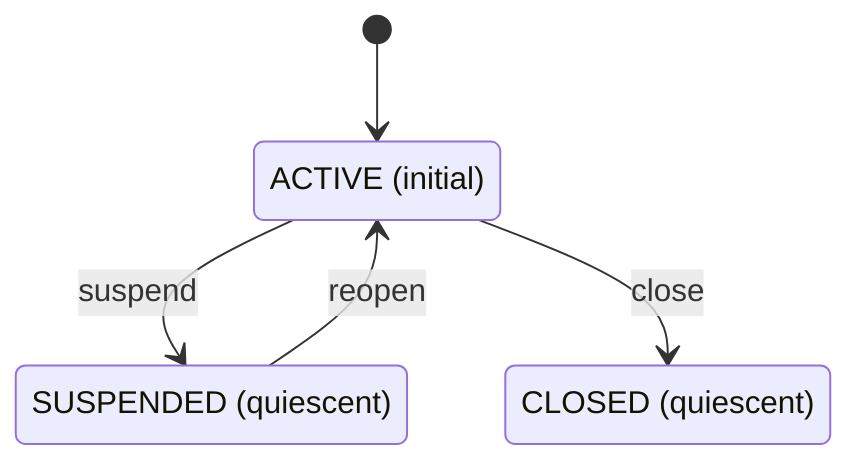

<!-- AUTOGENERATED from spec/src/tensio + spec/content — do not edit by hand. Edits: docstrings/content -> uv run python tools/gen_spec.py -->

# Entities

> Generated by `spec/tools/gen_spec.py` from the active domain's `graph.py:build_graph()`. Do not hand-edit.

## customer

A paying account that may be ACTIVE, SUSPENDED, or CLOSED.

### Lifecycle

- States: `ACTIVE` (initial), `SUSPENDED` (quiescent), `CLOSED` (quiescent)
- Transitions: `suspend`, `close`, `reopen`
- Cyclic: false

### Fields

| name | kind | required | ref_target |
|------|------|----------|------------|
| email | string | true |  |
| tier | enum | false |  |
| owner | reference | true | stakeholder |

### Covered by

- `check_entity_type_lifecycle_wellformed`
- `check_entity_instance_state_in_lifecycle`
- `check_entity_instance_required_fields`
- `check_entity_instance_id_prefix`
- `check_entity_instance_refs_resolve`
- `check_entity_field_kind_known`
- `check_typed_anchors_entity`

### Instances

| id | state | email | tier | owner |
| --- | ----- | ----- | ---- | ----- |
| ENT-customer-acme | ACTIVE | billing@acme.com | gold | finance |

## Entity-state tensions

- `PR-auto-suspend-fraud` × `PR-billing-close-delinquent` — both drive entity 'customer' but to disjoint resting states: ['SUSPENDED'] vs ['CLOSED'] — likely conflict on axis behavioral-customer-state
