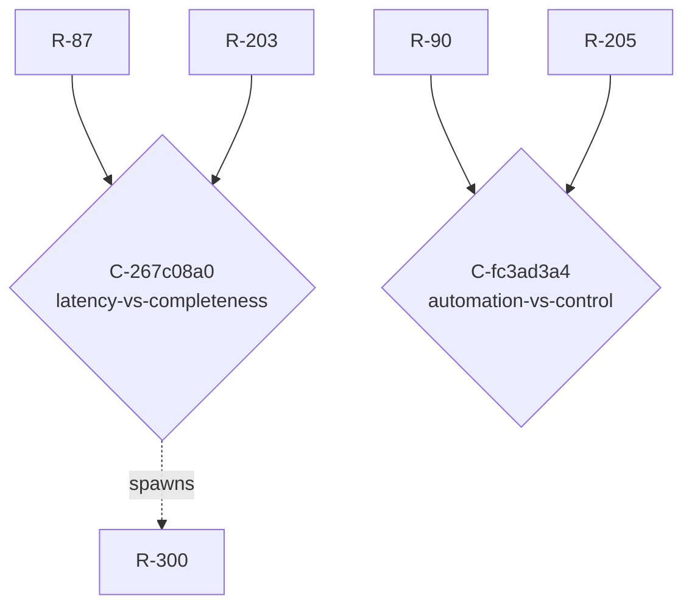

<!-- AUTOGENERATED from spec/src/tensio + spec/content — do not edit by hand. Edits: docstrings/content -> uv run python tools/gen_spec.py -->

# TENSIONS.md — The tension map (Tensio)

Generated from `spec/content/graph.py` (the domain's tension graph). A **Conflict** is a first-class connector NODE — `R-a -> C <- R-b` — carrying the tension axis, the colliding context, and the shared assumption that belong to neither requirement. Conflicts CLUSTER by axis: a cluster of size > 1 is one unresolved architectural choice, not N local disputes.

---

## Clusters by axis

### Axis `latency-vs-completeness` — 1 conflict(s), single tension

#### `C-267c08a0` — latency-vs-completeness

- **context:** approving a payment at checkout
- **members:** `R-87`, `R-203`
- **steward:** `architecture`
- **lifecycle:** DECIDED(fast-path the sync AML check via async pre-screening; see R-300)
- **shared assumption:** `A-sync-budget`
- **spawned (lineage):** `R-300`
- **revisit marker:** REVISIT if A-sync-budget dies (sync budget changes invalidate the fast-path math).

### Axis `automation-vs-control` — 1 conflict(s), single tension

#### `C-fc3ad3a4` — automation-vs-control

- **context:** acting inside a multi-user organization
- **members:** `R-90`, `R-205`
- **steward:** `security`
- **lifecycle:** DETECTED
- **shared assumption:** `A-single-customer`

## Tension map (Mermaid)

## Controlled vocabulary of axes (this domain)

| axis slug | description |
|---|---|
| `latency-vs-completeness` | Fast response now vs fully complete/validated result. Tightening latency tends to drop synchronous completeness, and vice versa. |
| `cost-vs-flexibility` | Cheap/simple/fixed implementation vs configurable/general one. Flexibility usually costs build, run, and reasoning budget. |
| `privacy-vs-analytics` | Minimizing data collection/retention vs maximizing data available for analytics, personalization, and audit. |
| `consistency-vs-availability` | Strong/synchronous correctness vs staying available and responsive under partition or load (the CAP tension, business-side). |
| `automation-vs-control` | Automatic decisioning/throughput vs mandatory human review and override. Automation raises throughput, lowers human control. |

## Latent-connector suspicions (heuristic, for AI review)

Requirement pairs that SHOULD perhaps have a connector node but do not. This is a heuristic stub for the deferred detector — a suspicion to judge, never an auto-materialized conflict.

| left | right | hint |
|---|---|---|
| `R-150` | `R-90` | shares assumption(s): A-single-customer |
| `R-203` | `R-300` | shares assumption(s): A-sync-budget |
| `R-300` | `R-87` | shares assumption(s): A-sync-budget |
