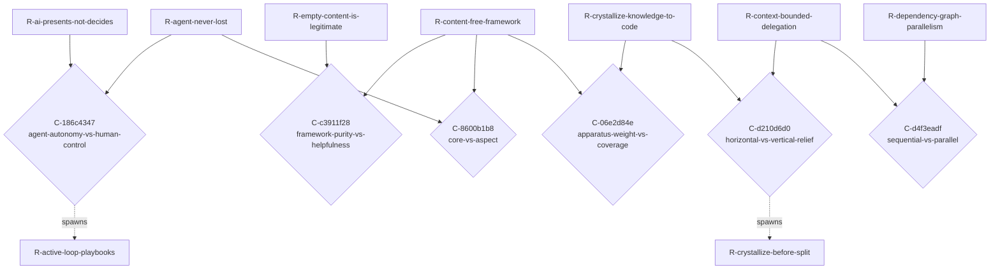

<!-- AUTOGENERATED from spec/src/tensio + spec/content — do not edit by hand. Edits: docstrings/content -> uv run python tools/gen_spec.py -->

# TENSIONS.md — The tension map (Tensio)

Generated from `spec/content/graph.py` (the domain's tension graph). A **Conflict** is a first-class connector NODE — `R-a -> C <- R-b` — carrying the tension axis, the colliding context, and the shared assumption that belong to neither requirement. Conflicts CLUSTER by axis: a cluster of size > 1 is one unresolved architectural choice, not N local disputes.

---

## Clusters by axis

### Axis `agent-autonomy-vs-human-control` — 1 conflict(s), single tension

#### `C-186c4347` — agent-autonomy-vs-human-control

- **context:** the agent develops requirements, integrates new ones, finds contradictions, proposes resolutions, formalizes back into code, runs tests
- **members:** `R-agent-never-lost`, `R-ai-presents-not-decides`
- **steward:** `framework-author`
- **lifecycle:** DECIDED(structured proposal protocol — the AI emits ProposedRequirement / ProposedConflict / ProposedResolution as JSON; the human steward approves; tools/apply_proposal.py mechanically writes the change into spec/content/; see derived R-active-loop-playbooks)
- **shared assumption:** `A-stakeholders-care`
- **spawned (lineage):** `R-active-loop-playbooks`
- **revisit marker:** REVISIT if domain-users report the playbook overhead negates the harness's directness (the loop becomes slower than free manual editing) — then re-calibrate band-by-band.

### Axis `framework-purity-vs-helpfulness` — 1 conflict(s), single tension

#### `C-c3911f28` — framework-purity-vs-helpfulness

- **context:** the methodology's own design needs to be modeled to demonstrate the framework end-to-end
- **members:** `R-content-free-framework`, `R-empty-content-is-legitimate`
- **steward:** `framework-reviewer`
- **lifecycle:** DECIDED(the meta-domain lives in spec/content/graph.py exactly as any user's domain would; the framework code stays empty of business data; the worked-example fixture stays under spec/tests/fixtures/. The framework's own design is content for the methodology's reference domain.)
- **shared assumption:** `A-content-free-honest`
- **revisit marker:** REVISIT if a fresh framework clone needs the meta-domain to self-bootstrap (cf. M8 content-layout evolution).

### Axis `core-vs-aspect` — 1 conflict(s), single tension

#### `C-8600b1b8` — core-vs-aspect

- **context:** extending the framework to surface behavioral contradictions (dead states, two processes one entity)
- **members:** `R-content-free-framework`, `R-agent-never-lost`
- **steward:** `domain-user`
- **lifecycle:** DETECTED
- **shared assumption:** `A-prose-suffices`

### Axis `apparatus-weight-vs-coverage` — 1 conflict(s), single tension

#### `C-06e2d84e` — apparatus-weight-vs-coverage

- **context:** crystallizing the full accumulated design into the methodology vs keeping the framework minimal
- **members:** `R-crystallize-knowledge-to-code`, `R-content-free-framework`
- **steward:** `framework-reviewer`
- **lifecycle:** DECIDED(crystallize the design as DRAFT/OPEN requirements — recorded but UNBUILT; the status itself marks them proposed-not-built, so coverage rises without adding apparatus weight to src/tensio. The substrate grows; the framework code stays minimal.)
- **shared assumption:** `A-content-free-honest`
- **revisit marker:** REVISIT if the DRAFT backlog grows faster than it is built — then prune or promote.

### Axis `horizontal-vs-vertical-relief` — 1 conflict(s), single tension

#### `C-d210d6d0` — horizontal-vs-vertical-relief

- **context:** an operator approaching its context budget must choose how to relieve pressure
- **members:** `R-context-bounded-delegation`, `R-crystallize-knowledge-to-code`
- **steward:** `domain-user`
- **lifecycle:** DECIDED(crystallize-before-split — the operator crystallizes first and re-measures (see R-crystallize-before-split); delegation/splitting is the vertical lever of last resort, used only when knowledge is irreducible and the operator is still over budget.)
- **shared assumption:** `A-finite-context-operators`
- **spawned (lineage):** `R-crystallize-before-split`

### Axis `sequential-vs-parallel` — 1 conflict(s), single tension

#### `C-d4f3eadf` — sequential-vs-parallel

- **context:** splitting an over-budget operator domain for parallel sub-operators when some sub-parts are coupled by dependencies
- **members:** `R-context-bounded-delegation`, `R-dependency-graph-parallelism`
- **steward:** `framework-reviewer`
- **lifecycle:** DECIDED(the dependency graph decides — parallelize independent components, sequence coupled chains; cut the domain along lines of independence, never arbitrarily.)
- **shared assumption:** `A-finite-context-operators`

## Tension map (Mermaid)

## Controlled vocabulary of axes (this domain)

| axis slug | description |
|---|---|
| `agent-autonomy-vs-human-control` | How far the AI agent acts vs how strictly it presents/asks. Autonomy makes the loop fast; human control keeps invisibility from being AI-created. |
| `framework-purity-vs-helpfulness` | Content-free shipping (zero business data in src/tensio) vs out-of-the-box utility for a fresh adopter. Purity is honest; helpfulness lowers adoption cost. |
| `core-vs-aspect` | What stays in the minimal framework core vs what becomes an opt-in pluggable aspect. Core costs every domain; aspects cost only those who load them. |
| `apparatus-weight-vs-coverage` | Heavy formal machinery (Z3 / Quint / mutation testing) catches more contradictions but slows the loop. Calibration rule: weight of apparatus ∝ cost of an unnoticed conflict. |
| `formalization-vs-prose` | Machine-checkable predicate (deterministic, narrow) vs EARS / free-prose claim (broad, ambiguous). Most claims are prose; the critical core is formalized. |
| `single-altitude-vs-multi-altitude` | Conflating the methodology's own concepts with the modeled domain's (Task-vs-Action; Conflict-as-methodology-node vs Conflict-as-business-event). Two altitudes must stay separable. |
| `offload-vs-carry` | Crystallize knowledge into the free substrate (graph + invariants + generated docs) vs hold it in expensive working context. Substrate knowledge is enforced/regenerable/addressable, so it does not count against an operator's context budget. |
| `horizontal-vs-vertical-relief` | Relieve operator context pressure by delegating/splitting the domain (horizontal) vs by crystallizing knowledge into the substrate (vertical). Splitting is for irreducible size; crystallizing is for un-offloaded knowledge. |
| `sequential-vs-parallel` | Coupled work (dependency edges between requirements/operators/entities) must be processed sequentially; independent sub-graphs can be delegated to parallel sub-operators. The dependency-graph topology — not a guess — decides which, and domains are split along lines of independence. |

## Latent-connector suspicions (heuristic, for AI review)

Requirement pairs that SHOULD perhaps have a connector node but do not. This is a heuristic stub for the deferred detector — a suspicion to judge, never an auto-materialized conflict.

| left | right | hint |
|---|---|---|
| `R-active-loop-playbooks` | `R-agent-never-lost` | shares assumption(s): A-stakeholders-care |
| `R-active-loop-playbooks` | `R-ai-presents-not-decides` | shares assumption(s): A-stakeholders-care |
| `R-active-loop-playbooks` | `R-axis-controlled-vocab` | shares assumption(s): A-prose-suffices |
| `R-active-loop-playbooks` | `R-axis-gatekeeper-policy` | shares assumption(s): A-prose-suffices |
| `R-active-loop-playbooks` | `R-critical-core-scope` | shares assumption(s): A-prose-suffices |
| `R-active-loop-playbooks` | `R-decided-needs-human-signoff` | shares assumption(s): A-stakeholders-care |
| `R-active-loop-playbooks` | `R-glossary-sync-test` | shares assumption(s): A-prose-suffices |
| `R-active-loop-playbooks` | `R-history-from-rejected-markers` | shares assumption(s): A-prose-suffices |
| `R-active-loop-playbooks` | `R-open-states-question` | shares assumption(s): A-prose-suffices |
| `R-active-loop-playbooks` | `R-operator-not-self-approve` | shares assumption(s): A-stakeholders-care |
| `R-active-loop-playbooks` | `R-process-aspect-first` | shares assumption(s): A-prose-suffices |
| `R-active-loop-playbooks` | `R-rejected-preserved-not-deleted` | shares assumption(s): A-stakeholders-care |
| `R-active-loop-playbooks` | `R-steward-distinct-from-owners` | shares assumption(s): A-stakeholders-care |
| `R-active-loop-playbooks` | `R-trust-anchor-mechanism` | shares assumption(s): A-stakeholders-care |
| `R-agent-never-lost` | `R-decided-needs-human-signoff` | shares assumption(s): A-stakeholders-care |
| `R-agent-never-lost` | `R-operator-not-self-approve` | shares assumption(s): A-stakeholders-care |
| `R-agent-never-lost` | `R-rejected-preserved-not-deleted` | shares assumption(s): A-stakeholders-care |
| `R-agent-never-lost` | `R-steward-distinct-from-owners` | shares assumption(s): A-stakeholders-care |
| `R-agent-never-lost` | `R-trust-anchor-mechanism` | shares assumption(s): A-stakeholders-care |
| `R-ai-presents-not-decides` | `R-decided-needs-human-signoff` | shares assumption(s): A-stakeholders-care |
| `R-ai-presents-not-decides` | `R-operator-not-self-approve` | shares assumption(s): A-stakeholders-care |
| `R-ai-presents-not-decides` | `R-rejected-preserved-not-deleted` | shares assumption(s): A-stakeholders-care |
| `R-ai-presents-not-decides` | `R-steward-distinct-from-owners` | shares assumption(s): A-stakeholders-care |
| `R-ai-presents-not-decides` | `R-trust-anchor-mechanism` | shares assumption(s): A-stakeholders-care |
| `R-anchor-everything` | `R-anchor-taxonomy` | shares assumption(s): A-bootstrap-self-applies |
| `R-anchor-everything` | `R-boot-from-substrate` | shares assumption(s): A-bootstrap-self-applies |
| `R-anchor-everything` | `R-content-layout-evolution` | shares assumption(s): A-bootstrap-self-applies |
| `R-anchor-everything` | `R-goal-as-target-state` | shares assumption(s): A-bootstrap-self-applies |
| `R-anchor-everything` | `R-goal-type-vs-facet` | shares assumption(s): A-bootstrap-self-applies |
| `R-anchor-everything` | `R-lifecycle-abstraction` | shares assumption(s): A-bootstrap-self-applies |
| `R-anchor-everything` | `R-operator-crystal-is-claude-md` | shares assumption(s): A-bootstrap-self-applies |
| `R-anchor-everything` | `R-operator-type-vs-facet` | shares assumption(s): A-bootstrap-self-applies |
| `R-anchor-everything` | `R-process-aspect-first` | shares assumption(s): A-bootstrap-self-applies |
| `R-anchor-everything` | `R-rules-as-data` | shares assumption(s): A-bootstrap-self-applies |
| `R-anchor-everything` | `R-speak-by-reference` | shares assumption(s): A-bootstrap-self-applies |
| `R-anchor-everything` | `R-statemachine-wellformedness` | shares assumption(s): A-bootstrap-self-applies |
| `R-anchor-everything` | `R-task-vs-action-distinct-altitudes` | shares assumption(s): A-bootstrap-self-applies |
| `R-anchor-everything` | `R-trust-anchor-mechanism` | shares assumption(s): A-bootstrap-self-applies |
| `R-anchor-everything` | `R-two-altitude-ontology` | shares assumption(s): A-bootstrap-self-applies |
| `R-anchor-taxonomy` | `R-boot-from-substrate` | shares assumption(s): A-bootstrap-self-applies |
| `R-anchor-taxonomy` | `R-content-layout-evolution` | shares assumption(s): A-bootstrap-self-applies |
| `R-anchor-taxonomy` | `R-goal-as-target-state` | shares assumption(s): A-bootstrap-self-applies |
| `R-anchor-taxonomy` | `R-goal-type-vs-facet` | shares assumption(s): A-bootstrap-self-applies |
| `R-anchor-taxonomy` | `R-lifecycle-abstraction` | shares assumption(s): A-bootstrap-self-applies |
| `R-anchor-taxonomy` | `R-operator-crystal-is-claude-md` | shares assumption(s): A-bootstrap-self-applies |
| `R-anchor-taxonomy` | `R-operator-type-vs-facet` | shares assumption(s): A-bootstrap-self-applies |
| `R-anchor-taxonomy` | `R-process-aspect-first` | shares assumption(s): A-bootstrap-self-applies |
| `R-anchor-taxonomy` | `R-rules-as-data` | shares assumption(s): A-bootstrap-self-applies |
| `R-anchor-taxonomy` | `R-speak-by-reference` | shares assumption(s): A-bootstrap-self-applies |
| `R-anchor-taxonomy` | `R-statemachine-wellformedness` | shares assumption(s): A-bootstrap-self-applies |
| `R-anchor-taxonomy` | `R-task-vs-action-distinct-altitudes` | shares assumption(s): A-bootstrap-self-applies |
| `R-anchor-taxonomy` | `R-trust-anchor-mechanism` | shares assumption(s): A-bootstrap-self-applies |
| `R-anchor-taxonomy` | `R-two-altitude-ontology` | shares assumption(s): A-bootstrap-self-applies |
| `R-axis-controlled-vocab` | `R-axis-gatekeeper-policy` | shares assumption(s): A-prose-suffices |
| `R-axis-controlled-vocab` | `R-critical-core-scope` | shares assumption(s): A-prose-suffices |
| `R-axis-controlled-vocab` | `R-glossary-sync-test` | shares assumption(s): A-prose-suffices |
| `R-axis-controlled-vocab` | `R-history-from-rejected-markers` | shares assumption(s): A-prose-suffices |
| `R-axis-controlled-vocab` | `R-open-states-question` | shares assumption(s): A-prose-suffices |
| `R-axis-controlled-vocab` | `R-process-aspect-first` | shares assumption(s): A-prose-suffices |
| `R-axis-gatekeeper-policy` | `R-critical-core-scope` | shares assumption(s): A-prose-suffices |
| `R-axis-gatekeeper-policy` | `R-glossary-sync-test` | shares assumption(s): A-prose-suffices |
| `R-axis-gatekeeper-policy` | `R-history-from-rejected-markers` | shares assumption(s): A-prose-suffices |
| `R-axis-gatekeeper-policy` | `R-open-states-question` | shares assumption(s): A-prose-suffices |
| `R-axis-gatekeeper-policy` | `R-process-aspect-first` | shares assumption(s): A-prose-suffices |
| `R-boot-from-substrate` | `R-content-layout-evolution` | shares assumption(s): A-bootstrap-self-applies |
| `R-boot-from-substrate` | `R-crystallize-knowledge-to-code` | shares assumption(s): A-compaction-loses-working |
| `R-boot-from-substrate` | `R-goal-as-target-state` | shares assumption(s): A-bootstrap-self-applies |
| `R-boot-from-substrate` | `R-goal-type-vs-facet` | shares assumption(s): A-bootstrap-self-applies |
| `R-boot-from-substrate` | `R-lifecycle-abstraction` | shares assumption(s): A-bootstrap-self-applies |
| `R-boot-from-substrate` | `R-operator-crystal-is-claude-md` | shares assumption(s): A-bootstrap-self-applies, A-compaction-loses-working |
| `R-boot-from-substrate` | `R-operator-type-vs-facet` | shares assumption(s): A-bootstrap-self-applies |
| `R-boot-from-substrate` | `R-process-aspect-first` | shares assumption(s): A-bootstrap-self-applies |
| `R-boot-from-substrate` | `R-rules-as-data` | shares assumption(s): A-bootstrap-self-applies |
| `R-boot-from-substrate` | `R-speak-by-reference` | shares assumption(s): A-bootstrap-self-applies |
| `R-boot-from-substrate` | `R-stale-substrate` | shares assumption(s): A-compaction-loses-working |
| `R-boot-from-substrate` | `R-statemachine-wellformedness` | shares assumption(s): A-bootstrap-self-applies |
| `R-boot-from-substrate` | `R-task-vs-action-distinct-altitudes` | shares assumption(s): A-bootstrap-self-applies |
| `R-boot-from-substrate` | `R-trust-anchor-mechanism` | shares assumption(s): A-bootstrap-self-applies |
| `R-boot-from-substrate` | `R-two-altitude-ontology` | shares assumption(s): A-bootstrap-self-applies |
| `R-budget-measure` | `R-context-bounded-delegation` | shares assumption(s): A-finite-context-operators |
| `R-budget-measure` | `R-context-budget-rule` | shares assumption(s): A-finite-context-operators |
| `R-budget-measure` | `R-crystallize-before-split` | shares assumption(s): A-finite-context-operators |
| `R-budget-measure` | `R-delegation-conclusions-only` | shares assumption(s): A-finite-context-operators |
| `R-budget-measure` | `R-dependency-graph-parallelism` | shares assumption(s): A-finite-context-operators |
| `R-budget-measure` | `R-measure-context-size` | shares assumption(s): A-finite-context-operators |
| `R-budget-measure` | `R-operator-acting-facet` | shares assumption(s): A-finite-context-operators |
| `R-budget-measure` | `R-partition-vs-border` | shares assumption(s): A-finite-context-operators |
| `R-budget-measure` | `R-verify-closure-per-action` | shares assumption(s): A-finite-context-operators |
| `R-budget-measure` | `R-working-vs-substrate-budget` | shares assumption(s): A-finite-context-operators |
| `R-claude-md-live-state-generated` | `R-deterministic-generation` | shares assumption(s): A-python-stack |
| `R-claude-md-live-state-generated` | `R-drift-structurally-impossible` | shares assumption(s): A-python-stack |
| `R-claude-md-live-state-generated` | `R-glossary-sync-test` | shares assumption(s): A-python-stack |
| `R-claude-md-live-state-generated` | `R-smoke-test` | shares assumption(s): A-python-stack |
| `R-claude-md-live-state-generated` | `R-stable-conflict-identity` | shares assumption(s): A-python-stack |
| `R-conflict-is-connector-node` | `R-content-free-framework` | shares assumption(s): A-content-free-honest |
| `R-conflict-is-connector-node` | `R-empty-content-is-legitimate` | shares assumption(s): A-content-free-honest |
| `R-content-layout-evolution` | `R-goal-as-target-state` | shares assumption(s): A-bootstrap-self-applies |
| `R-content-layout-evolution` | `R-goal-type-vs-facet` | shares assumption(s): A-bootstrap-self-applies |
| `R-content-layout-evolution` | `R-lifecycle-abstraction` | shares assumption(s): A-bootstrap-self-applies |
| `R-content-layout-evolution` | `R-operator-crystal-is-claude-md` | shares assumption(s): A-bootstrap-self-applies |
| `R-content-layout-evolution` | `R-operator-type-vs-facet` | shares assumption(s): A-bootstrap-self-applies |
| `R-content-layout-evolution` | `R-process-aspect-first` | shares assumption(s): A-bootstrap-self-applies |
| `R-content-layout-evolution` | `R-rules-as-data` | shares assumption(s): A-bootstrap-self-applies |
| `R-content-layout-evolution` | `R-speak-by-reference` | shares assumption(s): A-bootstrap-self-applies |
| `R-content-layout-evolution` | `R-statemachine-wellformedness` | shares assumption(s): A-bootstrap-self-applies |
| `R-content-layout-evolution` | `R-task-vs-action-distinct-altitudes` | shares assumption(s): A-bootstrap-self-applies |
| `R-content-layout-evolution` | `R-trust-anchor-mechanism` | shares assumption(s): A-bootstrap-self-applies |
| `R-content-layout-evolution` | `R-two-altitude-ontology` | shares assumption(s): A-bootstrap-self-applies |
| `R-context-bounded-delegation` | `R-context-budget-rule` | shares assumption(s): A-finite-context-operators |
| `R-context-bounded-delegation` | `R-crystallize-before-split` | shares assumption(s): A-finite-context-operators |
| `R-context-bounded-delegation` | `R-delegation-conclusions-only` | shares assumption(s): A-finite-context-operators |
| `R-context-bounded-delegation` | `R-measure-context-size` | shares assumption(s): A-finite-context-operators |
| `R-context-bounded-delegation` | `R-operator-acting-facet` | shares assumption(s): A-finite-context-operators |
| `R-context-bounded-delegation` | `R-partition-vs-border` | shares assumption(s): A-finite-context-operators |
| `R-context-bounded-delegation` | `R-verify-closure-per-action` | shares assumption(s): A-finite-context-operators |
| `R-context-bounded-delegation` | `R-working-vs-substrate-budget` | shares assumption(s): A-finite-context-operators |
| `R-context-budget-rule` | `R-crystallize-before-split` | shares assumption(s): A-finite-context-operators |
| `R-context-budget-rule` | `R-delegation-conclusions-only` | shares assumption(s): A-finite-context-operators |
| `R-context-budget-rule` | `R-dependency-graph-parallelism` | shares assumption(s): A-finite-context-operators |
| `R-context-budget-rule` | `R-measure-context-size` | shares assumption(s): A-finite-context-operators |
| `R-context-budget-rule` | `R-operator-acting-facet` | shares assumption(s): A-finite-context-operators |
| `R-context-budget-rule` | `R-partition-vs-border` | shares assumption(s): A-finite-context-operators |
| `R-context-budget-rule` | `R-verify-closure-per-action` | shares assumption(s): A-finite-context-operators |
| `R-context-budget-rule` | `R-working-vs-substrate-budget` | shares assumption(s): A-finite-context-operators |
| `R-critical-core-scope` | `R-glossary-sync-test` | shares assumption(s): A-prose-suffices |
| `R-critical-core-scope` | `R-history-from-rejected-markers` | shares assumption(s): A-prose-suffices |
| `R-critical-core-scope` | `R-open-states-question` | shares assumption(s): A-prose-suffices |
| `R-critical-core-scope` | `R-process-aspect-first` | shares assumption(s): A-prose-suffices |
| `R-crystallize-before-split` | `R-delegation-conclusions-only` | shares assumption(s): A-finite-context-operators |
| `R-crystallize-before-split` | `R-dependency-graph-parallelism` | shares assumption(s): A-finite-context-operators |
| `R-crystallize-before-split` | `R-measure-context-size` | shares assumption(s): A-finite-context-operators |
| `R-crystallize-before-split` | `R-operator-acting-facet` | shares assumption(s): A-finite-context-operators |
| `R-crystallize-before-split` | `R-partition-vs-border` | shares assumption(s): A-finite-context-operators |
| `R-crystallize-before-split` | `R-verify-closure-per-action` | shares assumption(s): A-finite-context-operators |
| `R-crystallize-before-split` | `R-working-vs-substrate-budget` | shares assumption(s): A-finite-context-operators |
| `R-crystallize-knowledge-to-code` | `R-operator-crystal-is-claude-md` | shares assumption(s): A-compaction-loses-working |
| `R-crystallize-knowledge-to-code` | `R-stale-substrate` | shares assumption(s): A-compaction-loses-working |
| `R-decided-needs-human-signoff` | `R-operator-not-self-approve` | shares assumption(s): A-stakeholders-care |
| `R-decided-needs-human-signoff` | `R-rejected-preserved-not-deleted` | shares assumption(s): A-stakeholders-care |
| `R-decided-needs-human-signoff` | `R-steward-distinct-from-owners` | shares assumption(s): A-stakeholders-care |
| `R-decided-needs-human-signoff` | `R-trust-anchor-mechanism` | shares assumption(s): A-stakeholders-care |
| `R-delegation-conclusions-only` | `R-dependency-graph-parallelism` | shares assumption(s): A-finite-context-operators |
| `R-delegation-conclusions-only` | `R-measure-context-size` | shares assumption(s): A-finite-context-operators |
| `R-delegation-conclusions-only` | `R-operator-acting-facet` | shares assumption(s): A-finite-context-operators |
| `R-delegation-conclusions-only` | `R-partition-vs-border` | shares assumption(s): A-finite-context-operators |
| `R-delegation-conclusions-only` | `R-verify-closure-per-action` | shares assumption(s): A-finite-context-operators |
| `R-delegation-conclusions-only` | `R-working-vs-substrate-budget` | shares assumption(s): A-finite-context-operators |
| `R-dependency-graph-parallelism` | `R-measure-context-size` | shares assumption(s): A-finite-context-operators |
| `R-dependency-graph-parallelism` | `R-operator-acting-facet` | shares assumption(s): A-finite-context-operators |
| `R-dependency-graph-parallelism` | `R-partition-vs-border` | shares assumption(s): A-finite-context-operators |
| `R-dependency-graph-parallelism` | `R-verify-closure-per-action` | shares assumption(s): A-finite-context-operators |
| `R-dependency-graph-parallelism` | `R-working-vs-substrate-budget` | shares assumption(s): A-finite-context-operators |
| `R-deterministic-generation` | `R-drift-structurally-impossible` | shares assumption(s): A-python-stack |
| `R-deterministic-generation` | `R-glossary-sync-test` | shares assumption(s): A-python-stack |
| `R-deterministic-generation` | `R-smoke-test` | shares assumption(s): A-python-stack |
| `R-deterministic-generation` | `R-stable-conflict-identity` | shares assumption(s): A-python-stack |
| `R-drift-structurally-impossible` | `R-glossary-sync-test` | shares assumption(s): A-python-stack |
| `R-drift-structurally-impossible` | `R-smoke-test` | shares assumption(s): A-python-stack |
| `R-drift-structurally-impossible` | `R-stable-conflict-identity` | shares assumption(s): A-python-stack |
| `R-enforcement-first-class` | `R-enforcement-gradient` | shares assumption(s): A-most-knowledge-crystallizable |
| `R-enforcement-first-class` | `R-observation-evidence-scope` | shares assumption(s): A-most-knowledge-crystallizable |
| `R-enforcement-first-class` | `R-requirement-enforced` | shares assumption(s): A-most-knowledge-crystallizable |
| `R-enforcement-first-class` | `R-uncrystallizable-automated` | shares assumption(s): A-most-knowledge-crystallizable |
| `R-enforcement-first-class` | `R-uncrystallizable-is-missing-type` | shares assumption(s): A-most-knowledge-crystallizable |
| `R-enforcement-gradient` | `R-observation-evidence-scope` | shares assumption(s): A-most-knowledge-crystallizable |
| `R-enforcement-gradient` | `R-requirement-enforced` | shares assumption(s): A-most-knowledge-crystallizable |
| `R-enforcement-gradient` | `R-uncrystallizable-automated` | shares assumption(s): A-most-knowledge-crystallizable |
| `R-enforcement-gradient` | `R-uncrystallizable-is-missing-type` | shares assumption(s): A-most-knowledge-crystallizable |
| `R-glossary-sync-test` | `R-history-from-rejected-markers` | shares assumption(s): A-prose-suffices |
| `R-glossary-sync-test` | `R-open-states-question` | shares assumption(s): A-prose-suffices |
| `R-glossary-sync-test` | `R-process-aspect-first` | shares assumption(s): A-prose-suffices |
| `R-glossary-sync-test` | `R-smoke-test` | shares assumption(s): A-python-stack |
| `R-glossary-sync-test` | `R-stable-conflict-identity` | shares assumption(s): A-python-stack |
| `R-goal-as-target-state` | `R-goal-type-vs-facet` | shares assumption(s): A-bootstrap-self-applies |
| `R-goal-as-target-state` | `R-lifecycle-abstraction` | shares assumption(s): A-bootstrap-self-applies |
| `R-goal-as-target-state` | `R-operator-crystal-is-claude-md` | shares assumption(s): A-bootstrap-self-applies |
| `R-goal-as-target-state` | `R-operator-type-vs-facet` | shares assumption(s): A-bootstrap-self-applies |
| `R-goal-as-target-state` | `R-process-aspect-first` | shares assumption(s): A-bootstrap-self-applies |
| `R-goal-as-target-state` | `R-rules-as-data` | shares assumption(s): A-bootstrap-self-applies |
| `R-goal-as-target-state` | `R-speak-by-reference` | shares assumption(s): A-bootstrap-self-applies |
| `R-goal-as-target-state` | `R-statemachine-wellformedness` | shares assumption(s): A-bootstrap-self-applies |
| `R-goal-as-target-state` | `R-task-vs-action-distinct-altitudes` | shares assumption(s): A-bootstrap-self-applies |
| `R-goal-as-target-state` | `R-trust-anchor-mechanism` | shares assumption(s): A-bootstrap-self-applies |
| `R-goal-as-target-state` | `R-two-altitude-ontology` | shares assumption(s): A-bootstrap-self-applies |
| `R-goal-type-vs-facet` | `R-lifecycle-abstraction` | shares assumption(s): A-bootstrap-self-applies |
| `R-goal-type-vs-facet` | `R-operator-crystal-is-claude-md` | shares assumption(s): A-bootstrap-self-applies |
| `R-goal-type-vs-facet` | `R-operator-type-vs-facet` | shares assumption(s): A-bootstrap-self-applies |
| `R-goal-type-vs-facet` | `R-process-aspect-first` | shares assumption(s): A-bootstrap-self-applies |
| `R-goal-type-vs-facet` | `R-rules-as-data` | shares assumption(s): A-bootstrap-self-applies |
| `R-goal-type-vs-facet` | `R-speak-by-reference` | shares assumption(s): A-bootstrap-self-applies |
| `R-goal-type-vs-facet` | `R-statemachine-wellformedness` | shares assumption(s): A-bootstrap-self-applies |
| `R-goal-type-vs-facet` | `R-task-vs-action-distinct-altitudes` | shares assumption(s): A-bootstrap-self-applies |
| `R-goal-type-vs-facet` | `R-trust-anchor-mechanism` | shares assumption(s): A-bootstrap-self-applies |
| `R-goal-type-vs-facet` | `R-two-altitude-ontology` | shares assumption(s): A-bootstrap-self-applies |
| `R-history-from-rejected-markers` | `R-open-states-question` | shares assumption(s): A-prose-suffices |
| `R-history-from-rejected-markers` | `R-process-aspect-first` | shares assumption(s): A-prose-suffices |
| `R-lifecycle-abstraction` | `R-operator-crystal-is-claude-md` | shares assumption(s): A-bootstrap-self-applies |
| `R-lifecycle-abstraction` | `R-operator-type-vs-facet` | shares assumption(s): A-bootstrap-self-applies |
| `R-lifecycle-abstraction` | `R-process-aspect-first` | shares assumption(s): A-bootstrap-self-applies |
| `R-lifecycle-abstraction` | `R-rules-as-data` | shares assumption(s): A-bootstrap-self-applies |
| `R-lifecycle-abstraction` | `R-speak-by-reference` | shares assumption(s): A-bootstrap-self-applies |
| `R-lifecycle-abstraction` | `R-statemachine-wellformedness` | shares assumption(s): A-bootstrap-self-applies |
| `R-lifecycle-abstraction` | `R-task-vs-action-distinct-altitudes` | shares assumption(s): A-bootstrap-self-applies |
| `R-lifecycle-abstraction` | `R-trust-anchor-mechanism` | shares assumption(s): A-bootstrap-self-applies |
| `R-lifecycle-abstraction` | `R-two-altitude-ontology` | shares assumption(s): A-bootstrap-self-applies |
| `R-measure-context-size` | `R-operator-acting-facet` | shares assumption(s): A-finite-context-operators |
| `R-measure-context-size` | `R-partition-vs-border` | shares assumption(s): A-finite-context-operators |
| `R-measure-context-size` | `R-verify-closure-per-action` | shares assumption(s): A-finite-context-operators |
| `R-measure-context-size` | `R-working-vs-substrate-budget` | shares assumption(s): A-finite-context-operators |
| `R-observation-evidence-scope` | `R-requirement-enforced` | shares assumption(s): A-most-knowledge-crystallizable |
| `R-observation-evidence-scope` | `R-uncrystallizable-automated` | shares assumption(s): A-most-knowledge-crystallizable |
| `R-observation-evidence-scope` | `R-uncrystallizable-is-missing-type` | shares assumption(s): A-most-knowledge-crystallizable |
| `R-open-states-question` | `R-process-aspect-first` | shares assumption(s): A-prose-suffices |
| `R-operator-acting-facet` | `R-partition-vs-border` | shares assumption(s): A-finite-context-operators |
| `R-operator-acting-facet` | `R-verify-closure-per-action` | shares assumption(s): A-finite-context-operators |
| `R-operator-acting-facet` | `R-working-vs-substrate-budget` | shares assumption(s): A-finite-context-operators |
| `R-operator-crystal-is-claude-md` | `R-operator-type-vs-facet` | shares assumption(s): A-bootstrap-self-applies |
| `R-operator-crystal-is-claude-md` | `R-process-aspect-first` | shares assumption(s): A-bootstrap-self-applies |
| `R-operator-crystal-is-claude-md` | `R-rules-as-data` | shares assumption(s): A-bootstrap-self-applies |
| `R-operator-crystal-is-claude-md` | `R-speak-by-reference` | shares assumption(s): A-bootstrap-self-applies |
| `R-operator-crystal-is-claude-md` | `R-stale-substrate` | shares assumption(s): A-compaction-loses-working |
| `R-operator-crystal-is-claude-md` | `R-statemachine-wellformedness` | shares assumption(s): A-bootstrap-self-applies |
| `R-operator-crystal-is-claude-md` | `R-task-vs-action-distinct-altitudes` | shares assumption(s): A-bootstrap-self-applies |
| `R-operator-crystal-is-claude-md` | `R-trust-anchor-mechanism` | shares assumption(s): A-bootstrap-self-applies |
| `R-operator-crystal-is-claude-md` | `R-two-altitude-ontology` | shares assumption(s): A-bootstrap-self-applies |
| `R-operator-not-self-approve` | `R-rejected-preserved-not-deleted` | shares assumption(s): A-stakeholders-care |
| `R-operator-not-self-approve` | `R-steward-distinct-from-owners` | shares assumption(s): A-stakeholders-care |
| `R-operator-not-self-approve` | `R-trust-anchor-mechanism` | shares assumption(s): A-stakeholders-care |
| `R-operator-type-vs-facet` | `R-process-aspect-first` | shares assumption(s): A-bootstrap-self-applies |
| `R-operator-type-vs-facet` | `R-rules-as-data` | shares assumption(s): A-bootstrap-self-applies |
| `R-operator-type-vs-facet` | `R-speak-by-reference` | shares assumption(s): A-bootstrap-self-applies |
| `R-operator-type-vs-facet` | `R-statemachine-wellformedness` | shares assumption(s): A-bootstrap-self-applies |
| `R-operator-type-vs-facet` | `R-task-vs-action-distinct-altitudes` | shares assumption(s): A-bootstrap-self-applies |
| `R-operator-type-vs-facet` | `R-trust-anchor-mechanism` | shares assumption(s): A-bootstrap-self-applies |
| `R-operator-type-vs-facet` | `R-two-altitude-ontology` | shares assumption(s): A-bootstrap-self-applies |
| `R-partition-vs-border` | `R-verify-closure-per-action` | shares assumption(s): A-finite-context-operators |
| `R-partition-vs-border` | `R-working-vs-substrate-budget` | shares assumption(s): A-finite-context-operators |
| `R-process-aspect-first` | `R-rules-as-data` | shares assumption(s): A-bootstrap-self-applies |
| `R-process-aspect-first` | `R-speak-by-reference` | shares assumption(s): A-bootstrap-self-applies |
| `R-process-aspect-first` | `R-statemachine-wellformedness` | shares assumption(s): A-bootstrap-self-applies |
| `R-process-aspect-first` | `R-task-vs-action-distinct-altitudes` | shares assumption(s): A-bootstrap-self-applies |
| `R-process-aspect-first` | `R-trust-anchor-mechanism` | shares assumption(s): A-bootstrap-self-applies |
| `R-process-aspect-first` | `R-two-altitude-ontology` | shares assumption(s): A-bootstrap-self-applies |
| `R-rejected-preserved-not-deleted` | `R-steward-distinct-from-owners` | shares assumption(s): A-stakeholders-care |
| `R-rejected-preserved-not-deleted` | `R-trust-anchor-mechanism` | shares assumption(s): A-stakeholders-care |
| `R-requirement-enforced` | `R-uncrystallizable-automated` | shares assumption(s): A-most-knowledge-crystallizable |
| `R-requirement-enforced` | `R-uncrystallizable-is-missing-type` | shares assumption(s): A-most-knowledge-crystallizable |
| `R-rules-as-data` | `R-speak-by-reference` | shares assumption(s): A-bootstrap-self-applies |
| `R-rules-as-data` | `R-statemachine-wellformedness` | shares assumption(s): A-bootstrap-self-applies |
| `R-rules-as-data` | `R-task-vs-action-distinct-altitudes` | shares assumption(s): A-bootstrap-self-applies |
| `R-rules-as-data` | `R-trust-anchor-mechanism` | shares assumption(s): A-bootstrap-self-applies |
| `R-rules-as-data` | `R-two-altitude-ontology` | shares assumption(s): A-bootstrap-self-applies |
| `R-smoke-test` | `R-stable-conflict-identity` | shares assumption(s): A-python-stack |
| `R-speak-by-reference` | `R-statemachine-wellformedness` | shares assumption(s): A-bootstrap-self-applies |
| `R-speak-by-reference` | `R-task-vs-action-distinct-altitudes` | shares assumption(s): A-bootstrap-self-applies |
| `R-speak-by-reference` | `R-trust-anchor-mechanism` | shares assumption(s): A-bootstrap-self-applies |
| `R-speak-by-reference` | `R-two-altitude-ontology` | shares assumption(s): A-bootstrap-self-applies |
| `R-statemachine-wellformedness` | `R-task-vs-action-distinct-altitudes` | shares assumption(s): A-bootstrap-self-applies |
| `R-statemachine-wellformedness` | `R-trust-anchor-mechanism` | shares assumption(s): A-bootstrap-self-applies |
| `R-statemachine-wellformedness` | `R-two-altitude-ontology` | shares assumption(s): A-bootstrap-self-applies |
| `R-steward-distinct-from-owners` | `R-trust-anchor-mechanism` | shares assumption(s): A-stakeholders-care |
| `R-task-vs-action-distinct-altitudes` | `R-trust-anchor-mechanism` | shares assumption(s): A-bootstrap-self-applies |
| `R-task-vs-action-distinct-altitudes` | `R-two-altitude-ontology` | shares assumption(s): A-bootstrap-self-applies |
| `R-trust-anchor-mechanism` | `R-two-altitude-ontology` | shares assumption(s): A-bootstrap-self-applies |
| `R-uncrystallizable-automated` | `R-uncrystallizable-is-missing-type` | shares assumption(s): A-most-knowledge-crystallizable |
| `R-verify-closure-per-action` | `R-working-vs-substrate-budget` | shares assumption(s): A-finite-context-operators |
