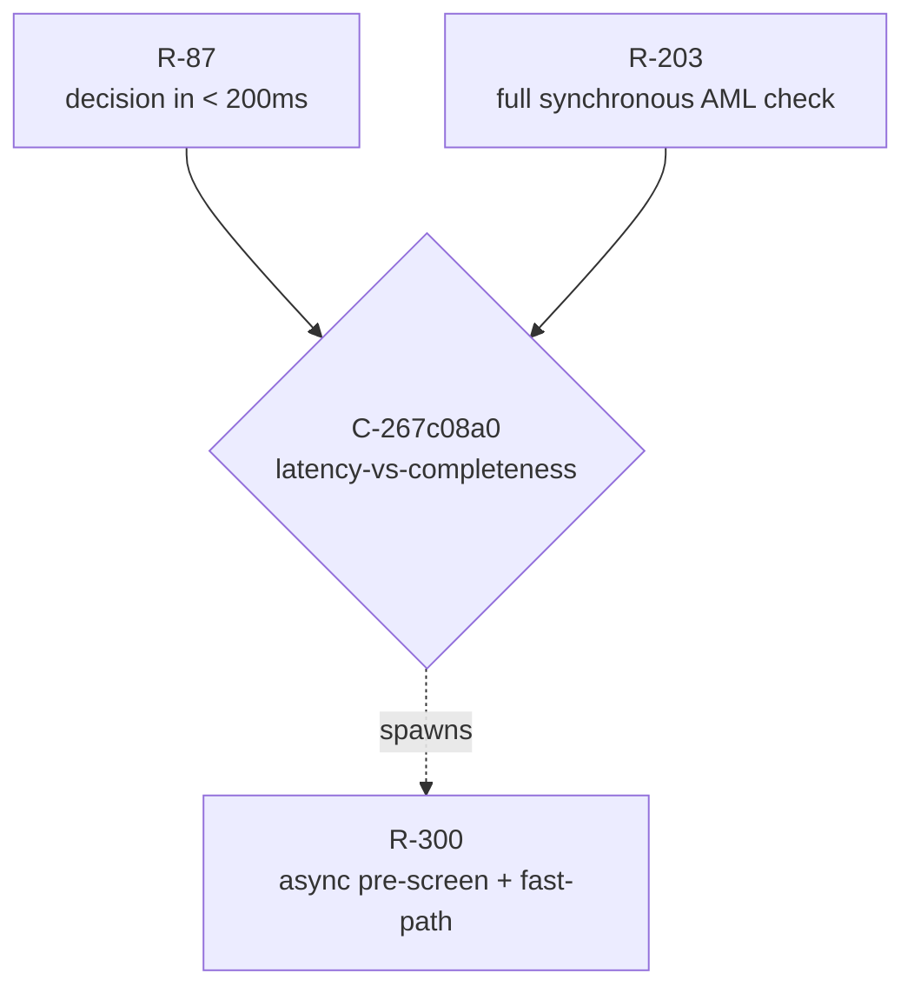
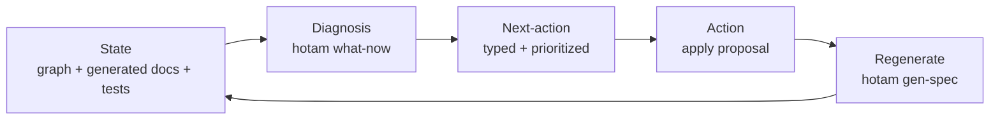

<!-- LEGACY (Python-era) command/path references below (`spec/src/hotam_spec`,
     `pytest`, `spec/tools/what_now.py`); not an instruction to run as-is —
     see README.md and docs/QUICKSTART-CONSUMER.md for current commands
     (`hotam what-now`, `hotam gen-spec`, `go test`). The CONCEPTS this file
     explains (tension graph, Conflict-as-connector-node, the closed loop)
     are still the current model; only the literal tool/path names are
     stale. -->

# Methodology — the tension graph and its closed loop

This is the human-written companion to the executable model in
`internal/ontology` + `internal/invariants` (originally `spec/src/hotam_spec`
in the Python prototype). It explains the philosophy and the operating
procedure; the normative detail is generated into [`../gen/`](../gen/) and
the working contract is [`../../CLAUDE.md`](../../CLAUDE.md).

## 1. The inversion

The reference project HotamChain is a docs-as-code blockchain spec that proves
**consistency**: one non-contradictory canon, drift forbidden, every conflict
mechanism closed forever (zero open mechanisms). Hotam-Spec reuses that machinery for
the **opposite** purpose. Business requirements are many, change constantly, and
contradict each other; the goal is not to eliminate contradictions but to make
them **visible and keep them visible over time**.

So the ontology is **requirements-as-tension-graph**, not
requirements-as-truth. A contradiction is a first-class object with a status, a
steward, a rationale and a history. It is never silently "fixed" — it transitions
through a lifecycle.

What stays identical to HotamChain: the store is the Python code (frozen
dataclasses whose `status`/`lifecycle` field is the source of truth); a
deterministic AST/import-based generator; a meta-test that makes regeneration ==
committed byte-for-byte so the human layer cannot drift; the three-layer
docstring discipline (RULE + `Canon:§N` + WHY) with anti-relitigation markers.

What inverts: the invariants do not assert "no contradiction" — they assert the
contradictions are **well-formed and visible**. A green run means every conflict
has an axis, a context and a steward; no edge dangles; every open hole states its
question; every decision justifies itself. The one forbidden thing is an
*invisible* contradiction.

## 2. Conflict is a connector node

A naive model makes a conflict an edge `conflicts_with` between R-87 and R-203.
The edge holds nothing: remove it and the two requirements fall apart into
isolation. Hotam-Spec makes a **Conflict a first-class node** — a mediator through
which the two otherwise-unconnectable requirements first come to lie in one
structure:

The node carries what belongs to **neither** requirement:

- the **tension axis** — the dimension of divergence (latency vs completeness).
  It exists only because the two met; neither requirement "has" an axis alone.
- the **shared context** — the precise scenario where they collide (approving a
  payment at checkout). Outside it they might coexist peacefully.
- the **shared assumption** — the belief they interpret differently
  (`A-sync-budget`), frequently the real root of the dispute.

Because the knowledge lives on the node, three things become representable that an
edge-list cannot express:

- **Clustering.** Group conflicts by axis. A cluster of size > 1 is one
  unresolved *architectural* choice, surfaced as such in `TENSIONS.md`.
- **Lineage.** A conflict can *spawn* a requirement (`Conflict.derived`) that
  dissolves the tension — R-300 above is the child of the conflict, not a free
  requirement.
- **Inherited drift.** If the shared assumption dies, every conflict resting on
  it revives at once — one trigger re-opens a whole semantic cluster.

The ontology enforces the insight structurally: a `Requirement` has only
*supportive* relations (`supports`, `refines`, `depends_on`). A conflict belongs
to neither requirement, so it **cannot** be written as a requirement field — the
naive `conflicts_with` edge is unwritable by construction.

### Detection redefined

Surfacing a contradiction = **materializing the missing connector node**. The
detector therefore hunts requirement pairs that *should* have a node but don't —
latent connectors — which is stronger than checking already-recorded invariants,
because it points at the invisible. The current heuristic
(`graph.latent_connector_suspects`: two non-rejected requirements share an
assumption and have no node between them) is a deliberate stub; the real semantic
detector is deferred (see the roadmap). The hard boundary holds throughout: a
suspect is presented to a human, never auto-materialized.

## 3. The three invisibilities

1. **Direct contradiction** — two requirements that cannot both hold. Caught by a
   machine check where the claim is machine-readable, otherwise materialized as a
   node by a human/AI.
2. **Hidden dependency** — requirement A silently relies on an assumption that
   requirement B negates. This is a contradiction *through a chain*; it needs the
   graph (`graph.requirements_on_assumption` walks it), not a flat list.
3. **Context drift** — a requirement was meaningful under assumption X, X has long
   been false, nobody revisited it. This is a contradiction *with time*; it is
   catchable only because each `Assumption` carries its own lifecycle
   (HOLDS / UNCERTAIN / DEAD). When an assumption flips to DEAD, its dependents
   light up.

## 4. The closed loop — the operating procedure

The centerpiece. HotamChain makes an agent never-lost narrowly: run `pytest`,
read `HOLES.md`, follow the edit cycle. Hotam-Spec generalizes that into a single
deterministic question — *what now?* — answerable from any state:

`hotam what-now` (`internal/diagnose` + `cmd/hotam/what_now.go`) loads the
whole graph and emits a priority-ordered list of typed actions, each with a
kind, a target object id, a human imperative and a priority band:

1. **STRUCTURE** — failing structural invariants. Highest priority: a malformed
   graph makes every softer diagnosis unreliable.
2. **DRIFT_FALLOUT** — dead assumptions with live dependents (the revived
   cluster).
3. **CONFLICT_STALLED** — conflicts still DETECTED/ACKNOWLEDGED with no steward
   resolution.
4. **OPEN_ITEM** — `OPEN(question)` requirements awaiting a decision.
5. **LATENT_CONNECTOR** — heuristic missing-connector suspects, for AI review
   only.

An empty list is itself an answer: the graph is well-formed and every
contradiction is visible, stewarded and current.

## 5. The AI's three roles and the hard boundary

- **Detector** — proposes materializing a missing connector node, with a concrete
  collision scenario.
- **Socratic partner** — surfaces hidden assumptions; it questions, it does not
  resolve.
- **Historian** — every decision carries rationale plus a revisit condition, so
  the AI can say "you decided this in Q2 for reason Y; the revisit condition has
  now triggered."

**Hard boundary:** the AI never closes a conflict silently. It presents,
justifies, asks; the decision and its recording stay with the human steward —
otherwise invisibility returns, now AI-authored. The boundary is also structural:
the steward of a conflict is, by invariant, not the owner of any member
requirement, so a tension is never adjudicated by an interested party.

See [`../development/ROADMAP.md`](../development/ROADMAP.md) for the deferred
formal layers and the external trust-anchoring ritual that binds this entire
internal contour to a living stakeholder.
