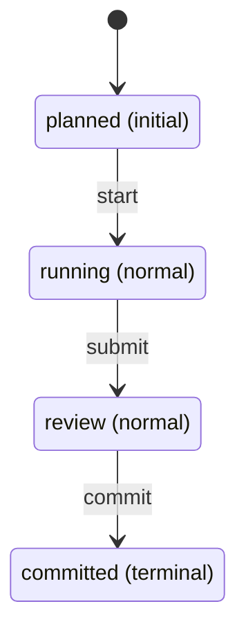

<!-- AUTOGENERATED from spec/src/hotam_spec + spec/content — do not edit by hand. Edits: docstrings/content -> python tools/gen_spec.py -->
reader: (unresolved-reader)

# Entities

> Generated by `spec/tools/gen_spec.py` from `domains/hotam-dev/graph.py:build_graph()`. Do not hand-edit.

## wave

A development wave of the Hotam-Spec repository: a bundle of proposals landed and verified together, closed by a signed steward review and a commit.

### Lifecycle

- States: `planned` (initial), `running` (normal), `review` (normal), `committed` (terminal)
- Transitions: `start`, `submit`, `commit`
- Cyclic: false

### Fields

| name | kind | required | ref_target |
|------|------|----------|------------|
| number | number | true |  |
| commit_hash | string | false |  |
| review_verdict | string | false |  |

### Covered by

- `check_entity_type_lifecycle_wellformed`
- `check_entity_instance_state_in_lifecycle`
- `check_entity_instance_required_fields`
- `check_entity_instance_id_prefix`
- `check_entity_instance_refs_resolve`
- `check_entity_field_kind_known`
- `check_typed_anchors_entity`

### Instances

| id | state | number | commit_hash | review_verdict |
| --- | ----- | ------ | ----------- | -------------- |
| ENT-wave-case-be22cdd1 | committed | 0 | a6dd56e | C-be22cdd1 DECIDED via V-unfreeze-entity-projection + entity projection guard -- committed |
| ENT-wave-w1 | committed | 1 | 0b9dc5d | crystal budget honesty wave 1 -- landed & T2-green |
| ENT-wave-w2 | committed | 2 | 08b7534 | DRAFT cleanup + atomicity ratchets wave 2 -- landed & T2-green |
| ENT-wave-w3 | committed | 3 | e498c1b | wave 3 atomization + OPEN closures + DRAFT promotions -- landed & T2-green |
| ENT-wave-w4 | committed | 4 | 5ed7c02 | scope-as-projection + overlap visibility + single presenter -- landed & T2-green |
| ENT-wave-w5 | committed | 5 | f543212 | discipline slices measured -- spawn-log isolation + boot-cite meter -- landed & T2-green |
| ENT-wave-w6 | committed | 6 | cc3dee3 | second domain hotam-dev + conditional consolidation + active-domain fix -- landed & T2-green |
| ENT-wave-w7 | committed | 7 | 2bf332c | domain jurisdictions + axis gatekeeper + delegation ledger + assumption split -- self pulse clean |
| ENT-wave-w8 | committed | 8 | f287a0a | compound burn-down 21+6 -> 0, atomicity cores ENFORCED -- landed & T2-green |

## Entity-state tensions

_(no entity-state tensions surfaced — clean)_
