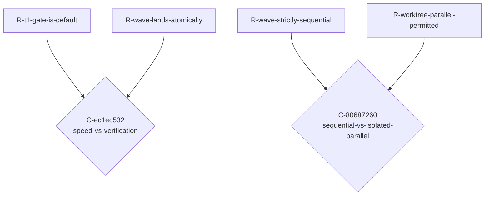

<!-- AUTOGENERATED from spec/src/hotam_spec + spec/content — do not edit by hand. Edits: docstrings/content -> uv run python tools/gen_spec.py -->
reader: (unresolved-reader)

# TENSIONS.md — The tension map (Hotam-Spec)

Generated from `spec/content/graph.py` (the domain's tension graph). A **Conflict** is a first-class connector NODE — `R-a -> C <- R-b` — carrying the tension axis, the colliding context, and the shared assumption that belong to neither requirement. Conflicts CLUSTER by axis: a cluster of size > 1 is one unresolved architectural choice, not N local disputes.

---

## Clusters by axis

### Axis `speed-vs-verification` — 1 conflict(s), single tension

#### `C-ec1ec532` — speed-vs-verification

- **context:** T1 targeted-enforcer gate on every apply_proposal call vs mandatory full T2 pytest suite at wave/commit boundaries -- T2 runs have hit multi-minute timeouts in this repo (observed Wave 2), creating real pressure to skip or shrink T2, which would undermine R-wave-lands-atomically
- **members:** `R-t1-gate-is-default`, `R-wave-lands-atomically`
- **steward:** `dev-steward`
- **lifecycle:** DETECTED
- **shared assumption:** `A-runtime-logs-append-only`

### Axis `sequential-vs-isolated-parallel` — 1 conflict(s), single tension

#### `C-80687260` — sequential-vs-isolated-parallel

- **context:** R-wave-strictly-sequential demands that waves touching overlapping files/scopes run strictly sequentially (never concurrently) to avoid racing a shared working tree, while R-worktree-parallel-permitted sanctions running mutating pipeline agents in parallel when each is isolated in its own git worktree -- the same pipeline both forbids overlapping-scope concurrency and permits isolated concurrency, and the boundary (when is isolation sufficient to relax strict sequencing?) is undecided
- **members:** `R-wave-strictly-sequential`, `R-worktree-parallel-permitted`
- **steward:** `dev-steward`
- **lifecycle:** DETECTED
- **shared assumption:** `A-single-steward-session`

## Hotam-Specn map (Mermaid)

## Controlled vocabulary of axes (this domain)

| axis slug | description |
|---|---|
| `speed-vs-verification` | T1 targeted-enforcer gate on every apply_proposal call (fast, per-move) vs the mandatory full T2 pytest suite at wave/commit boundaries (slow, complete). T2 has hit multi-minute timeouts in this repo, creating real pressure to skip or shrink it -- which would undermine wave atomicity. |
| `sequential-vs-isolated-parallel` | Waves touching overlapping scopes run strictly sequentially to avoid racing a shared working tree, vs mutating agents running in parallel when isolated in per-agent git worktrees so their edits cannot collide. |

## Latent-connector suspicions (heuristic, for AI review)

Requirement pairs that SHOULD perhaps have a connector node but do not. This is a heuristic stub for the deferred detector — a suspicion to judge, never an auto-materialized conflict.

| left | right | hint |
|---|---|---|
| `R-commit-follows-review` | `R-push-only-on-request` | shares assumption(s): A-single-steward-session |
| `R-commit-follows-review` | `R-wave-lands-atomically` | shares assumption(s): A-single-steward-session |
| `R-commit-follows-review` | `R-wave-strictly-sequential` | shares assumption(s): A-single-steward-session |
| `R-commit-follows-review` | `R-worktree-parallel-permitted` | shares assumption(s): A-single-steward-session |
| `R-host-spawn-leaves-trace` | `R-land-leaves-trace` | shares assumption(s): A-runtime-logs-append-only |
| `R-host-spawn-leaves-trace` | `R-spawn-logged` | shares assumption(s): A-runtime-logs-append-only |
| `R-host-spawn-leaves-trace` | `R-t1-gate-is-default` | shares assumption(s): A-runtime-logs-append-only |
| `R-host-spawn-leaves-trace` | `R-wave-lands-atomically` | shares assumption(s): A-runtime-logs-append-only |
| `R-land-leaves-trace` | `R-spawn-logged` | shares assumption(s): A-runtime-logs-append-only |
| `R-land-leaves-trace` | `R-t1-gate-is-default` | shares assumption(s): A-runtime-logs-append-only |
| `R-land-leaves-trace` | `R-wave-lands-atomically` | shares assumption(s): A-runtime-logs-append-only |
| `R-push-only-on-request` | `R-wave-lands-atomically` | shares assumption(s): A-single-steward-session |
| `R-push-only-on-request` | `R-wave-strictly-sequential` | shares assumption(s): A-single-steward-session |
| `R-push-only-on-request` | `R-worktree-parallel-permitted` | shares assumption(s): A-single-steward-session |
| `R-spawn-logged` | `R-t1-gate-is-default` | shares assumption(s): A-runtime-logs-append-only |
| `R-spawn-logged` | `R-wave-lands-atomically` | shares assumption(s): A-runtime-logs-append-only |
| `R-wave-lands-atomically` | `R-wave-strictly-sequential` | shares assumption(s): A-single-steward-session |
| `R-wave-lands-atomically` | `R-worktree-parallel-permitted` | shares assumption(s): A-single-steward-session |
