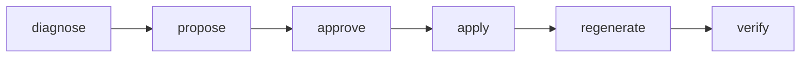

<!-- AUTOGENERATED from the domain graph.json — do not edit by hand. Edits: methodology/graph -> hotam gen-spec -->
reader: (unresolved-reader)

# PIPELINE.md — Domain overview: how this is put together, stage by stage (Hotam-Spec)

> Generated by `hotam gen-spec` from `domains/hotam-spec-self/graph.json`. Do not hand-edit.

Generated from the domain's own `Process` nodes (§Process, the opt-in behavioral aspect: a Lifecycle + ordered Steps + roles_required + drives_entities) and the EntityTypes those processes drive — a whole-domain narrative answering "how does this work end to end?" without reading the source prose (docs/AUTHORED-SPEC-CONTRACT.md §9, R-domain-overview-projection).

---

## Process `PR-closed-loop`

The methodology's own process modeled as a Process node — eating its own dog food at the behavioral altitude (R-process-aspect-first).

### Stages

| Стадия | Вход | Выход | Gate | Кто утверждает |
|---|---|---|---|---|
| diagnose | — | — | — | `operator` |
| propose | — | — | — | `operator` |
| approve | — | — | — | `steward` |
| apply | — | — | — | `operator` |
| regenerate | — | — | — | `operator` |
| verify | — | — | — | `operator` |

### Flow

