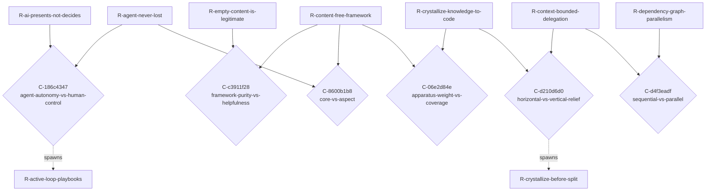

<!-- AUTOGENERATED from spec/src/hotam_spec + spec/content — do not edit by hand. Edits: docstrings/content -> uv run python tools/gen_spec.py -->

# TENSIONS.md — The tension map (Hotam-Spec)

Generated from `spec/content/graph.py` (the domain's tension graph). A **Conflict** is a first-class connector NODE — `R-a -> C <- R-b` — carrying the tension axis, the colliding context, and the shared assumption that belong to neither requirement. Conflicts CLUSTER by axis: a cluster of size > 1 is one unresolved architectural choice, not N local disputes.

---

## Clusters by axis

### Axis `agent-autonomy-vs-human-control` — 1 conflict(s), single tension

#### `C-186c4347` — agent-autonomy-vs-human-control

- **context:** the agent develops requirements, integrates new ones, finds contradictions, proposes resolutions, formalizes back into code, runs tests
- **members:** `R-agent-never-lost`, `R-ai-presents-not-decides`
- **steward:** `framework-author`
- **lifecycle:** DECIDED(structured proposal protocol — the AI emits ProposedRequirement / ProposedConflict / ProposedResolution as JSON; the human steward approves; tools/apply_proposal.py mechanically writes the change into spec/content/; see derived R-active-loop-playbooks)
- **shared assumption:** `A-stakeholders-care`
- **spawned (lineage):** `R-active-loop-playbooks`
- **revisit marker:** REVISIT if domain-users report the playbook overhead negates the harness's directness (the loop becomes slower than free manual editing) — then re-calibrate band-by-band.

### Axis `framework-purity-vs-helpfulness` — 1 conflict(s), single tension

#### `C-c3911f28` — framework-purity-vs-helpfulness

- **context:** the methodology's own design needs to be modeled to demonstrate the framework end-to-end
- **members:** `R-content-free-framework`, `R-empty-content-is-legitimate`
- **steward:** `framework-reviewer`
- **lifecycle:** DECIDED(the meta-domain lives in spec/content/graph.py exactly as any user's domain would; the framework code stays empty of business data; the worked-example fixture stays under spec/tests/fixtures/. The framework's own design is content for the methodology's reference domain.)
- **shared assumption:** `A-content-free-honest`
- **revisit marker:** REVISIT if a fresh framework clone needs the meta-domain to self-bootstrap (cf. M8 content-layout evolution).

### Axis `core-vs-aspect` — 1 conflict(s), single tension

#### `C-8600b1b8` — core-vs-aspect

- **context:** extending the framework to surface behavioral contradictions (dead states, two processes one entity)
- **members:** `R-content-free-framework`, `R-agent-never-lost`
- **steward:** `domain-user`
- **lifecycle:** ACKNOWLEDGED
- **shared assumption:** `A-prose-suffices`
- **revisit marker:** REVISIT when a second opt-in behavioral aspect (Entity or Task) is proposed — at that point the core-vs-aspect boundary must be formally decided.

### Axis `apparatus-weight-vs-coverage` — 1 conflict(s), single tension

#### `C-06e2d84e` — apparatus-weight-vs-coverage

- **context:** crystallizing the full accumulated design into the methodology vs keeping the framework minimal
- **members:** `R-crystallize-knowledge-to-code`, `R-content-free-framework`
- **steward:** `framework-reviewer`
- **lifecycle:** DECIDED(crystallize the design as DRAFT/OPEN requirements — recorded but UNBUILT; the status itself marks them proposed-not-built, so coverage rises without adding apparatus weight to src/hotam_spec. The substrate grows; the framework code stays minimal.)
- **shared assumption:** `A-content-free-honest`
- **revisit marker:** REVISIT if the DRAFT backlog grows faster than it is built — then prune or promote.

### Axis `horizontal-vs-vertical-relief` — 1 conflict(s), single tension

#### `C-d210d6d0` — horizontal-vs-vertical-relief

- **context:** an operator approaching its context budget must choose how to relieve pressure
- **members:** `R-context-bounded-delegation`, `R-crystallize-knowledge-to-code`
- **steward:** `domain-user`
- **lifecycle:** DECIDED(crystallize-before-split — the operator crystallizes first and re-measures (see R-crystallize-before-split); delegation/splitting is the vertical lever of last resort, used only when knowledge is irreducible and the operator is still over budget.)
- **shared assumption:** `A-finite-context-operators`
- **spawned (lineage):** `R-crystallize-before-split`

### Axis `sequential-vs-parallel` — 1 conflict(s), single tension

#### `C-d4f3eadf` — sequential-vs-parallel

- **context:** splitting an over-budget operator domain for parallel sub-operators when some sub-parts are coupled by dependencies
- **members:** `R-context-bounded-delegation`, `R-dependency-graph-parallelism`
- **steward:** `framework-reviewer`
- **lifecycle:** DECIDED(the dependency graph decides — parallelize independent components, sequence coupled chains; cut the domain along lines of independence, never arbitrarily.)
- **shared assumption:** `A-finite-context-operators`

## Hotam-Specn map (Mermaid)

## Controlled vocabulary of axes (this domain)

| axis slug | description |
|---|---|
| `agent-autonomy-vs-human-control` | How far the AI agent acts vs how strictly it presents/asks. Autonomy makes the loop fast; human control keeps invisibility from being AI-created. |
| `framework-purity-vs-helpfulness` | Content-free shipping (zero business data in src/hotam_spec) vs out-of-the-box utility for a fresh adopter. Purity is honest; helpfulness lowers adoption cost. |
| `core-vs-aspect` | What stays in the minimal framework core vs what becomes an opt-in pluggable aspect. Core costs every domain; aspects cost only those who load them. |
| `apparatus-weight-vs-coverage` | Heavy formal machinery (Z3 / Quint / mutation testing) catches more contradictions but slows the loop. Calibration rule: weight of apparatus ∝ cost of an unnoticed conflict. |
| `formalization-vs-prose` | Machine-checkable predicate (deterministic, narrow) vs EARS / free-prose claim (broad, ambiguous). Most claims are prose; the critical core is formalized. |
| `single-altitude-vs-multi-altitude` | Conflating the methodology's own concepts with the modeled domain's (Task-vs-Action; Conflict-as-methodology-node vs Conflict-as-business-event). Two altitudes must stay separable. |
| `offload-vs-carry` | Crystallize knowledge into the free substrate (graph + invariants + generated docs) vs hold it in expensive working context. Substrate knowledge is enforced/regenerable/addressable, so it does not count against an operator's context budget. |
| `horizontal-vs-vertical-relief` | Relieve operator context pressure by delegating/splitting the domain (horizontal) vs by crystallizing knowledge into the substrate (vertical). Splitting is for irreducible size; crystallizing is for un-offloaded knowledge. |
| `sequential-vs-parallel` | Coupled work (dependency edges between requirements/operators/entities) must be processed sequentially; independent sub-graphs can be delegated to parallel sub-operators. The dependency-graph topology — not a guess — decides which, and domains are split along lines of independence. |

## Latent-connector suspicions (heuristic, for AI review)

Requirement pairs that SHOULD perhaps have a connector node but do not. This is a heuristic stub for the deferred detector — a suspicion to judge, never an auto-materialized conflict.

| left | right | hint |
|---|---|---|
| `R-active-loop-protocol` | `R-agent-never-lost` | shares assumption(s): A-stakeholders-care |
| `R-active-loop-protocol` | `R-ai-presents-not-decides` | shares assumption(s): A-stakeholders-care |
| `R-active-loop-protocol` | `R-axis-controlled-vocab` | shares assumption(s): A-prose-suffices |
| `R-active-loop-protocol` | `R-axis-gatekeeper-policy` | shares assumption(s): A-prose-suffices |
| `R-active-loop-protocol` | `R-check-method-is-atomic` | shares assumption(s): A-prose-suffices |
| `R-active-loop-protocol` | `R-conflict-min-two-members` | shares assumption(s): A-stakeholders-care |
| `R-active-loop-protocol` | `R-conflict-structurally-visible` | shares assumption(s): A-stakeholders-care |
| `R-active-loop-protocol` | `R-critical-core-methodology` | shares assumption(s): A-prose-suffices |
| `R-active-loop-protocol` | `R-critical-core-per-domain` | shares assumption(s): A-prose-suffices |
| `R-active-loop-protocol` | `R-decided-conflict-justifies-itself` | shares assumption(s): A-stakeholders-care |
| `R-active-loop-protocol` | `R-decided-needs-human-signoff` | shares assumption(s): A-stakeholders-care |
| `R-active-loop-protocol` | `R-entity-field-kind-known` | shares assumption(s): A-prose-suffices |
| `R-active-loop-protocol` | `R-entity-instance-id-prefix` | shares assumption(s): A-prose-suffices |
| `R-active-loop-protocol` | `R-entity-instance-refs-resolve` | shares assumption(s): A-prose-suffices |
| `R-active-loop-protocol` | `R-entity-instance-required-fields` | shares assumption(s): A-prose-suffices |
| `R-active-loop-protocol` | `R-entity-instance-state-in-lifecycle` | shares assumption(s): A-prose-suffices |
| `R-active-loop-protocol` | `R-entity-type-lifecycle-wellformed` | shares assumption(s): A-prose-suffices |
| `R-active-loop-protocol` | `R-entity-typed-anchors` | shares assumption(s): A-prose-suffices |
| `R-active-loop-protocol` | `R-glossary-drift-stable` | shares assumption(s): A-prose-suffices |
| `R-active-loop-protocol` | `R-glossary-generated` | shares assumption(s): A-prose-suffices |
| `R-active-loop-protocol` | `R-glossary-sync-fails-dead` | shares assumption(s): A-prose-suffices |
| `R-active-loop-protocol` | `R-glossary-sync-fails-unused` | shares assumption(s): A-prose-suffices |
| `R-active-loop-protocol` | `R-history-generated-from-decided` | shares assumption(s): A-prose-suffices |
| `R-active-loop-protocol` | `R-history-generated-from-rejected` | shares assumption(s): A-prose-suffices |
| `R-active-loop-protocol` | `R-m-tag-format-valid` | shares assumption(s): A-prose-suffices |
| `R-active-loop-protocol` | `R-open-states-question` | shares assumption(s): A-prose-suffices |
| `R-active-loop-protocol` | `R-operator-not-self-approve` | shares assumption(s): A-stakeholders-care |
| `R-active-loop-protocol` | `R-prefer-tool-over-hand` | shares assumption(s): A-stakeholders-care |
| `R-active-loop-protocol` | `R-process-drives-existing-entities` | shares assumption(s): A-prose-suffices |
| `R-active-loop-protocol` | `R-process-goal-owner-is-operator-aspect` | shares assumption(s): A-prose-suffices |
| `R-active-loop-protocol` | `R-process-lifecycle-wellformed-aspect` | shares assumption(s): A-prose-suffices |
| `R-active-loop-protocol` | `R-process-opt-in` | shares assumption(s): A-prose-suffices |
| `R-active-loop-protocol` | `R-process-roles-declared-aspect` | shares assumption(s): A-prose-suffices |
| `R-active-loop-protocol` | `R-process-typed-anchors-extended` | shares assumption(s): A-prose-suffices |
| `R-active-loop-protocol` | `R-process-types-exist` | shares assumption(s): A-prose-suffices |
| `R-active-loop-protocol` | `R-rejected-preserved-not-deleted` | shares assumption(s): A-stakeholders-care |
| `R-active-loop-protocol` | `R-requirement-claim-is-atomic` | shares assumption(s): A-prose-suffices |
| `R-active-loop-protocol` | `R-step-invokes-known-transition` | shares assumption(s): A-prose-suffices |
| `R-active-loop-protocol` | `R-steward-distinct-from-owners` | shares assumption(s): A-stakeholders-care |
| `R-active-loop-protocol` | `R-trust-anchor-mechanism` | shares assumption(s): A-stakeholders-care |
| `R-agent-declares-purpose` | `R-agent-has-docs-dir` | shares assumption(s): A-python-stack |
| `R-agent-declares-purpose` | `R-agent-is-recursive-director` | shares assumption(s): A-python-stack |
| `R-agent-declares-purpose` | `R-agent-map-generated` | shares assumption(s): A-python-stack |
| `R-agent-declares-purpose` | `R-agent-references-shared-docs` | shares assumption(s): A-python-stack |
| `R-agent-declares-purpose` | `R-agent-scoped-constitution` | shares assumption(s): A-python-stack |
| `R-agent-declares-purpose` | `R-audit-atomicity-tool` | shares assumption(s): A-python-stack |
| `R-agent-declares-purpose` | `R-claude-md-live-state-generated` | shares assumption(s): A-python-stack |
| `R-agent-declares-purpose` | `R-content-free-no-business-data` | shares assumption(s): A-python-stack |
| `R-agent-declares-purpose` | `R-content-free-no-examples` | shares assumption(s): A-python-stack |
| `R-agent-declares-purpose` | `R-content-free-no-seed-graph` | shares assumption(s): A-python-stack |
| `R-agent-declares-purpose` | `R-deterministic-generation` | shares assumption(s): A-python-stack |
| `R-agent-declares-purpose` | `R-director-agent-required-per-domain` | shares assumption(s): A-python-stack |
| `R-agent-declares-purpose` | `R-docs-generated-from-requirements` | shares assumption(s): A-python-stack |
| `R-agent-declares-purpose` | `R-domain-declares-director` | shares assumption(s): A-python-stack |
| `R-agent-declares-purpose` | `R-domain-has-docs-dir` | shares assumption(s): A-python-stack |
| `R-agent-declares-purpose` | `R-domain-has-manifest` | shares assumption(s): A-python-stack |
| `R-agent-declares-purpose` | `R-domain-is-a-directory` | shares assumption(s): A-python-stack |
| `R-agent-declares-purpose` | `R-domain-map-generated` | shares assumption(s): A-python-stack |
| `R-agent-declares-purpose` | `R-domain-owns-claude-md` | shares assumption(s): A-python-stack |
| `R-agent-declares-purpose` | `R-domain-owns-docs-gen` | shares assumption(s): A-python-stack |
| `R-agent-declares-purpose` | `R-domain-owns-graph-py` | shares assumption(s): A-python-stack |
| `R-agent-declares-purpose` | `R-domain-owns-tools-and-agents` | shares assumption(s): A-python-stack |
| `R-agent-declares-purpose` | `R-drift-structurally-impossible` | shares assumption(s): A-python-stack |
| `R-agent-declares-purpose` | `R-empty-content-calm-banner` | shares assumption(s): A-python-stack |
| `R-agent-declares-purpose` | `R-empty-content-gen-notice` | shares assumption(s): A-python-stack |
| `R-agent-declares-purpose` | `R-empty-content-wellformed` | shares assumption(s): A-python-stack |
| `R-agent-declares-purpose` | `R-entities-md-generated` | shares assumption(s): A-python-stack |
| `R-agent-declares-purpose` | `R-entity-checks-by-iteration` | shares assumption(s): A-python-stack |
| `R-agent-declares-purpose` | `R-entity-derived-requirement` | shares assumption(s): A-python-stack |
| `R-agent-declares-purpose` | `R-entity-is-declarative` | shares assumption(s): A-python-stack |
| `R-agent-declares-purpose` | `R-entity-reuses-lifecycle` | shares assumption(s): A-python-stack |
| `R-agent-declares-purpose` | `R-entity-state-conflict-surfaced` | shares assumption(s): A-python-stack |
| `R-agent-declares-purpose` | `R-framework-claude-md-is-domain-free` | shares assumption(s): A-python-stack |
| `R-agent-declares-purpose` | `R-framework-shared-docs-generated` | shares assumption(s): A-python-stack |
| `R-agent-declares-purpose` | `R-glossary-drift-stable` | shares assumption(s): A-python-stack |
| `R-agent-declares-purpose` | `R-glossary-generated` | shares assumption(s): A-python-stack |
| `R-agent-declares-purpose` | `R-glossary-sync-fails-dead` | shares assumption(s): A-python-stack |
| `R-agent-declares-purpose` | `R-glossary-sync-fails-unused` | shares assumption(s): A-python-stack |
| `R-agent-declares-purpose` | `R-method-matches-docstring` | shares assumption(s): A-python-stack |
| `R-agent-declares-purpose` | `R-no-hand-edit-graph` | shares assumption(s): A-python-stack |
| `R-agent-declares-purpose` | `R-operator-prompt-loaded-at-session-start` | shares assumption(s): A-python-stack |
| `R-agent-declares-purpose` | `R-post-compact-regen-from-substrate` | shares assumption(s): A-python-stack |
| `R-agent-declares-purpose` | `R-private-tools-in-agent-folder` | shares assumption(s): A-python-stack |
| `R-agent-declares-purpose` | `R-project-name-hotam-spec` | shares assumption(s): A-python-stack |
| `R-agent-declares-purpose` | `R-recently-rejected-surfaced` | shares assumption(s): A-python-stack |
| `R-agent-declares-purpose` | `R-repo-map-generated` | shares assumption(s): A-python-stack |
| `R-agent-declares-purpose` | `R-root-claude-md-contains-domain-crystal` | shares assumption(s): A-python-stack |
| `R-agent-declares-purpose` | `R-root-claude-md-is-sentinel-only` | shares assumption(s): A-python-stack |
| `R-agent-declares-purpose` | `R-setup-claude-generates-settings` | shares assumption(s): A-python-stack |
| `R-agent-declares-purpose` | `R-shared-thinking-doc-from-canon-sections` | shares assumption(s): A-python-stack |
| `R-agent-declares-purpose` | `R-shared-tool-doc-from-docstring-and-help` | shares assumption(s): A-python-stack |
| `R-agent-declares-purpose` | `R-shared-tools-in-spec-tools` | shares assumption(s): A-python-stack |
| `R-agent-declares-purpose` | `R-smoke-test` | shares assumption(s): A-python-stack |
| `R-agent-declares-purpose` | `R-stable-conflict-identity` | shares assumption(s): A-python-stack |
| `R-agent-declares-purpose` | `R-three-cipher-pulse-structurally-injected` | shares assumption(s): A-python-stack |
| `R-agent-declares-purpose` | `R-tool-is-its-own-requirement` | shares assumption(s): A-python-stack |
| `R-agent-declares-purpose` | `R-tools-registry-generated` | shares assumption(s): A-python-stack |
| `R-agent-has-docs-dir` | `R-agent-is-recursive-director` | shares assumption(s): A-python-stack |
| `R-agent-has-docs-dir` | `R-agent-map-generated` | shares assumption(s): A-python-stack |
| `R-agent-has-docs-dir` | `R-agent-references-shared-docs` | shares assumption(s): A-python-stack |
| `R-agent-has-docs-dir` | `R-agent-scoped-constitution` | shares assumption(s): A-python-stack |
| `R-agent-has-docs-dir` | `R-audit-atomicity-tool` | shares assumption(s): A-python-stack |
| `R-agent-has-docs-dir` | `R-claude-md-live-state-generated` | shares assumption(s): A-python-stack |
| `R-agent-has-docs-dir` | `R-content-free-no-business-data` | shares assumption(s): A-python-stack |
| `R-agent-has-docs-dir` | `R-content-free-no-examples` | shares assumption(s): A-python-stack |
| `R-agent-has-docs-dir` | `R-content-free-no-seed-graph` | shares assumption(s): A-python-stack |
| `R-agent-has-docs-dir` | `R-deterministic-generation` | shares assumption(s): A-python-stack |
| `R-agent-has-docs-dir` | `R-director-agent-required-per-domain` | shares assumption(s): A-python-stack |
| `R-agent-has-docs-dir` | `R-docs-generated-from-requirements` | shares assumption(s): A-python-stack |
| `R-agent-has-docs-dir` | `R-domain-declares-director` | shares assumption(s): A-python-stack |
| `R-agent-has-docs-dir` | `R-domain-has-docs-dir` | shares assumption(s): A-python-stack |
| `R-agent-has-docs-dir` | `R-domain-has-manifest` | shares assumption(s): A-python-stack |
| `R-agent-has-docs-dir` | `R-domain-is-a-directory` | shares assumption(s): A-python-stack |
| `R-agent-has-docs-dir` | `R-domain-map-generated` | shares assumption(s): A-python-stack |
| `R-agent-has-docs-dir` | `R-domain-owns-claude-md` | shares assumption(s): A-python-stack |
| `R-agent-has-docs-dir` | `R-domain-owns-docs-gen` | shares assumption(s): A-python-stack |
| `R-agent-has-docs-dir` | `R-domain-owns-graph-py` | shares assumption(s): A-python-stack |
| `R-agent-has-docs-dir` | `R-domain-owns-tools-and-agents` | shares assumption(s): A-python-stack |
| `R-agent-has-docs-dir` | `R-drift-structurally-impossible` | shares assumption(s): A-python-stack |
| `R-agent-has-docs-dir` | `R-empty-content-calm-banner` | shares assumption(s): A-python-stack |
| `R-agent-has-docs-dir` | `R-empty-content-gen-notice` | shares assumption(s): A-python-stack |
| `R-agent-has-docs-dir` | `R-empty-content-wellformed` | shares assumption(s): A-python-stack |
| `R-agent-has-docs-dir` | `R-entities-md-generated` | shares assumption(s): A-python-stack |
| `R-agent-has-docs-dir` | `R-entity-checks-by-iteration` | shares assumption(s): A-python-stack |
| `R-agent-has-docs-dir` | `R-entity-derived-requirement` | shares assumption(s): A-python-stack |
| `R-agent-has-docs-dir` | `R-entity-is-declarative` | shares assumption(s): A-python-stack |
| `R-agent-has-docs-dir` | `R-entity-reuses-lifecycle` | shares assumption(s): A-python-stack |
| `R-agent-has-docs-dir` | `R-entity-state-conflict-surfaced` | shares assumption(s): A-python-stack |
| `R-agent-has-docs-dir` | `R-framework-claude-md-is-domain-free` | shares assumption(s): A-python-stack |
| `R-agent-has-docs-dir` | `R-framework-shared-docs-generated` | shares assumption(s): A-python-stack |
| `R-agent-has-docs-dir` | `R-glossary-drift-stable` | shares assumption(s): A-python-stack |
| `R-agent-has-docs-dir` | `R-glossary-generated` | shares assumption(s): A-python-stack |
| `R-agent-has-docs-dir` | `R-glossary-sync-fails-dead` | shares assumption(s): A-python-stack |
| `R-agent-has-docs-dir` | `R-glossary-sync-fails-unused` | shares assumption(s): A-python-stack |
| `R-agent-has-docs-dir` | `R-method-matches-docstring` | shares assumption(s): A-python-stack |
| `R-agent-has-docs-dir` | `R-no-hand-edit-graph` | shares assumption(s): A-python-stack |
| `R-agent-has-docs-dir` | `R-operator-prompt-loaded-at-session-start` | shares assumption(s): A-python-stack |
| `R-agent-has-docs-dir` | `R-post-compact-regen-from-substrate` | shares assumption(s): A-python-stack |
| `R-agent-has-docs-dir` | `R-private-tools-in-agent-folder` | shares assumption(s): A-python-stack |
| `R-agent-has-docs-dir` | `R-project-name-hotam-spec` | shares assumption(s): A-python-stack |
| `R-agent-has-docs-dir` | `R-recently-rejected-surfaced` | shares assumption(s): A-python-stack |
| `R-agent-has-docs-dir` | `R-repo-map-generated` | shares assumption(s): A-python-stack |
| `R-agent-has-docs-dir` | `R-root-claude-md-contains-domain-crystal` | shares assumption(s): A-python-stack |
| `R-agent-has-docs-dir` | `R-root-claude-md-is-sentinel-only` | shares assumption(s): A-python-stack |
| `R-agent-has-docs-dir` | `R-setup-claude-generates-settings` | shares assumption(s): A-python-stack |
| `R-agent-has-docs-dir` | `R-shared-thinking-doc-from-canon-sections` | shares assumption(s): A-python-stack |
| `R-agent-has-docs-dir` | `R-shared-tool-doc-from-docstring-and-help` | shares assumption(s): A-python-stack |
| `R-agent-has-docs-dir` | `R-shared-tools-in-spec-tools` | shares assumption(s): A-python-stack |
| `R-agent-has-docs-dir` | `R-smoke-test` | shares assumption(s): A-python-stack |
| `R-agent-has-docs-dir` | `R-stable-conflict-identity` | shares assumption(s): A-python-stack |
| `R-agent-has-docs-dir` | `R-three-cipher-pulse-structurally-injected` | shares assumption(s): A-python-stack |
| `R-agent-has-docs-dir` | `R-tool-is-its-own-requirement` | shares assumption(s): A-python-stack |
| `R-agent-has-docs-dir` | `R-tools-registry-generated` | shares assumption(s): A-python-stack |
| `R-agent-has-own-crystal` | `R-agent-has-own-tools-dir` | shares assumption(s): A-finite-context-operators |
| `R-agent-has-own-crystal` | `R-agent-is-a-directory` | shares assumption(s): A-finite-context-operators |
| `R-agent-has-own-crystal` | `R-backend-scope` | shares assumption(s): A-finite-context-operators |
| `R-agent-has-own-crystal` | `R-boot-cite-in-first-sentence` | shares assumption(s): A-compaction-loses-working |
| `R-agent-has-own-crystal` | `R-boot-reload-three-facts` | shares assumption(s): A-compaction-loses-working |
| `R-agent-has-own-crystal` | `R-budget-measure` | shares assumption(s): A-finite-context-operators |
| `R-agent-has-own-crystal` | `R-claude-md-budget-phi-cap` | shares assumption(s): A-finite-context-operators |
| `R-agent-has-own-crystal` | `R-claude-md-tree-of-crystals` | shares assumption(s): A-finite-context-operators |
| `R-agent-has-own-crystal` | `R-context-bounded-delegation` | shares assumption(s): A-finite-context-operators |
| `R-agent-has-own-crystal` | `R-context-budget-rule` | shares assumption(s): A-finite-context-operators |
| `R-agent-has-own-crystal` | `R-context-hook-piggybacks-cah-stamp` | shares assumption(s): A-finite-context-operators |
| `R-agent-has-own-crystal` | `R-crystal-is-claude-md` | shares assumption(s): A-compaction-loses-working |
| `R-agent-has-own-crystal` | `R-crystal-reload-by-reference` | shares assumption(s): A-compaction-loses-working |
| `R-agent-has-own-crystal` | `R-crystal-tree-hierarchy` | shares assumption(s): A-compaction-loses-working |
| `R-agent-has-own-crystal` | `R-crystallize-before-split` | shares assumption(s): A-finite-context-operators |
| `R-agent-has-own-crystal` | `R-crystallize-knowledge-to-code` | shares assumption(s): A-compaction-loses-working |
| `R-agent-has-own-crystal` | `R-delegation-conclusions-only` | shares assumption(s): A-finite-context-operators |
| `R-agent-has-own-crystal` | `R-dependency-drives-parallel` | shares assumption(s): A-finite-context-operators |
| `R-agent-has-own-crystal` | `R-dependency-drives-sequential` | shares assumption(s): A-finite-context-operators |
| `R-agent-has-own-crystal` | `R-dependency-tracked` | shares assumption(s): A-finite-context-operators |
| `R-agent-has-own-crystal` | `R-domain-delegation-as-node` | shares assumption(s): A-finite-context-operators |
| `R-agent-has-own-crystal` | `R-domain-delegation-persists` | shares assumption(s): A-finite-context-operators |
| `R-agent-has-own-crystal` | `R-measure-context-size` | shares assumption(s): A-finite-context-operators |
| `R-agent-has-own-crystal` | `R-operator-backend-protocol` | shares assumption(s): A-finite-context-operators |
| `R-agent-has-own-crystal` | `R-operator-has-context-budget` | shares assumption(s): A-finite-context-operators |
| `R-agent-has-own-crystal` | `R-operator-is-frozen-dataclass` | shares assumption(s): A-finite-context-operators |
| `R-agent-has-own-crystal` | `R-operator-may-have-parent` | shares assumption(s): A-finite-context-operators |
| `R-agent-has-own-crystal` | `R-operator-prompt-from-substrate` | shares assumption(s): A-compaction-loses-working |
| `R-agent-has-own-crystal` | `R-operator-references-stakeholder` | shares assumption(s): A-finite-context-operators |
| `R-agent-has-own-crystal` | `R-partition-vs-border` | shares assumption(s): A-finite-context-operators |
| `R-agent-has-own-crystal` | `R-stale-substrate` | shares assumption(s): A-compaction-loses-working |
| `R-agent-has-own-crystal` | `R-subagent-gets-its-claude-md` | shares assumption(s): A-finite-context-operators |
| `R-agent-has-own-crystal` | `R-task-spawn-is-ephemeral` | shares assumption(s): A-finite-context-operators |
| `R-agent-has-own-crystal` | `R-task-spawn-log-runtime` | shares assumption(s): A-finite-context-operators |
| `R-agent-has-own-crystal` | `R-tree-of-crystals-cognitive-trigger` | shares assumption(s): A-finite-context-operators |
| `R-agent-has-own-crystal` | `R-verify-closure-per-action` | shares assumption(s): A-finite-context-operators |
| `R-agent-has-own-crystal` | `R-working-vs-substrate-budget` | shares assumption(s): A-finite-context-operators |
| `R-agent-has-own-tools-dir` | `R-agent-is-a-directory` | shares assumption(s): A-finite-context-operators |
| `R-agent-has-own-tools-dir` | `R-backend-scope` | shares assumption(s): A-finite-context-operators |
| `R-agent-has-own-tools-dir` | `R-budget-measure` | shares assumption(s): A-finite-context-operators |
| `R-agent-has-own-tools-dir` | `R-claude-md-budget-phi-cap` | shares assumption(s): A-finite-context-operators |
| `R-agent-has-own-tools-dir` | `R-claude-md-tree-of-crystals` | shares assumption(s): A-finite-context-operators |
| `R-agent-has-own-tools-dir` | `R-context-bounded-delegation` | shares assumption(s): A-finite-context-operators |
| `R-agent-has-own-tools-dir` | `R-context-budget-rule` | shares assumption(s): A-finite-context-operators |
| `R-agent-has-own-tools-dir` | `R-context-hook-piggybacks-cah-stamp` | shares assumption(s): A-finite-context-operators |
| `R-agent-has-own-tools-dir` | `R-crystallize-before-split` | shares assumption(s): A-finite-context-operators |
| `R-agent-has-own-tools-dir` | `R-delegation-conclusions-only` | shares assumption(s): A-finite-context-operators |
| `R-agent-has-own-tools-dir` | `R-dependency-drives-parallel` | shares assumption(s): A-finite-context-operators |
| `R-agent-has-own-tools-dir` | `R-dependency-drives-sequential` | shares assumption(s): A-finite-context-operators |
| `R-agent-has-own-tools-dir` | `R-dependency-tracked` | shares assumption(s): A-finite-context-operators |
| `R-agent-has-own-tools-dir` | `R-domain-delegation-as-node` | shares assumption(s): A-finite-context-operators |
| `R-agent-has-own-tools-dir` | `R-domain-delegation-persists` | shares assumption(s): A-finite-context-operators |
| `R-agent-has-own-tools-dir` | `R-measure-context-size` | shares assumption(s): A-finite-context-operators |
| `R-agent-has-own-tools-dir` | `R-operator-backend-protocol` | shares assumption(s): A-finite-context-operators |
| `R-agent-has-own-tools-dir` | `R-operator-has-context-budget` | shares assumption(s): A-finite-context-operators |
| `R-agent-has-own-tools-dir` | `R-operator-is-frozen-dataclass` | shares assumption(s): A-finite-context-operators |
| `R-agent-has-own-tools-dir` | `R-operator-may-have-parent` | shares assumption(s): A-finite-context-operators |
| `R-agent-has-own-tools-dir` | `R-operator-references-stakeholder` | shares assumption(s): A-finite-context-operators |
| `R-agent-has-own-tools-dir` | `R-partition-vs-border` | shares assumption(s): A-finite-context-operators |
| `R-agent-has-own-tools-dir` | `R-subagent-gets-its-claude-md` | shares assumption(s): A-finite-context-operators |
| `R-agent-has-own-tools-dir` | `R-task-spawn-is-ephemeral` | shares assumption(s): A-finite-context-operators |
| `R-agent-has-own-tools-dir` | `R-task-spawn-log-runtime` | shares assumption(s): A-finite-context-operators |
| `R-agent-has-own-tools-dir` | `R-tree-of-crystals-cognitive-trigger` | shares assumption(s): A-finite-context-operators |
| `R-agent-has-own-tools-dir` | `R-verify-closure-per-action` | shares assumption(s): A-finite-context-operators |
| `R-agent-has-own-tools-dir` | `R-working-vs-substrate-budget` | shares assumption(s): A-finite-context-operators |
| `R-agent-imports-framework` | `R-conflict-is-connector-node` | shares assumption(s): A-content-free-honest |
| `R-agent-is-a-directory` | `R-backend-scope` | shares assumption(s): A-finite-context-operators |
| `R-agent-is-a-directory` | `R-budget-measure` | shares assumption(s): A-finite-context-operators |
| `R-agent-is-a-directory` | `R-claude-md-budget-phi-cap` | shares assumption(s): A-finite-context-operators |
| `R-agent-is-a-directory` | `R-claude-md-tree-of-crystals` | shares assumption(s): A-finite-context-operators |
| `R-agent-is-a-directory` | `R-context-bounded-delegation` | shares assumption(s): A-finite-context-operators |
| `R-agent-is-a-directory` | `R-context-budget-rule` | shares assumption(s): A-finite-context-operators |
| `R-agent-is-a-directory` | `R-context-hook-piggybacks-cah-stamp` | shares assumption(s): A-finite-context-operators |
| `R-agent-is-a-directory` | `R-crystallize-before-split` | shares assumption(s): A-finite-context-operators |
| `R-agent-is-a-directory` | `R-delegation-conclusions-only` | shares assumption(s): A-finite-context-operators |
| `R-agent-is-a-directory` | `R-dependency-drives-parallel` | shares assumption(s): A-finite-context-operators |
| `R-agent-is-a-directory` | `R-dependency-drives-sequential` | shares assumption(s): A-finite-context-operators |
| `R-agent-is-a-directory` | `R-dependency-tracked` | shares assumption(s): A-finite-context-operators |
| `R-agent-is-a-directory` | `R-domain-delegation-as-node` | shares assumption(s): A-finite-context-operators |
| `R-agent-is-a-directory` | `R-domain-delegation-persists` | shares assumption(s): A-finite-context-operators |
| `R-agent-is-a-directory` | `R-measure-context-size` | shares assumption(s): A-finite-context-operators |
| `R-agent-is-a-directory` | `R-operator-backend-protocol` | shares assumption(s): A-finite-context-operators |
| `R-agent-is-a-directory` | `R-operator-has-context-budget` | shares assumption(s): A-finite-context-operators |
| `R-agent-is-a-directory` | `R-operator-is-frozen-dataclass` | shares assumption(s): A-finite-context-operators |
| `R-agent-is-a-directory` | `R-operator-may-have-parent` | shares assumption(s): A-finite-context-operators |
| `R-agent-is-a-directory` | `R-operator-references-stakeholder` | shares assumption(s): A-finite-context-operators |
| `R-agent-is-a-directory` | `R-partition-vs-border` | shares assumption(s): A-finite-context-operators |
| `R-agent-is-a-directory` | `R-subagent-gets-its-claude-md` | shares assumption(s): A-finite-context-operators |
| `R-agent-is-a-directory` | `R-task-spawn-is-ephemeral` | shares assumption(s): A-finite-context-operators |
| `R-agent-is-a-directory` | `R-task-spawn-log-runtime` | shares assumption(s): A-finite-context-operators |
| `R-agent-is-a-directory` | `R-tree-of-crystals-cognitive-trigger` | shares assumption(s): A-finite-context-operators |
| `R-agent-is-a-directory` | `R-verify-closure-per-action` | shares assumption(s): A-finite-context-operators |
| `R-agent-is-a-directory` | `R-working-vs-substrate-budget` | shares assumption(s): A-finite-context-operators |
| `R-agent-is-recursive-director` | `R-agent-map-generated` | shares assumption(s): A-python-stack |
| `R-agent-is-recursive-director` | `R-agent-references-shared-docs` | shares assumption(s): A-python-stack |
| `R-agent-is-recursive-director` | `R-agent-scoped-constitution` | shares assumption(s): A-python-stack |
| `R-agent-is-recursive-director` | `R-audit-atomicity-tool` | shares assumption(s): A-python-stack |
| `R-agent-is-recursive-director` | `R-claude-md-live-state-generated` | shares assumption(s): A-python-stack |
| `R-agent-is-recursive-director` | `R-content-free-no-business-data` | shares assumption(s): A-python-stack |
| `R-agent-is-recursive-director` | `R-content-free-no-examples` | shares assumption(s): A-python-stack |
| `R-agent-is-recursive-director` | `R-content-free-no-seed-graph` | shares assumption(s): A-python-stack |
| `R-agent-is-recursive-director` | `R-deterministic-generation` | shares assumption(s): A-python-stack |
| `R-agent-is-recursive-director` | `R-director-agent-required-per-domain` | shares assumption(s): A-python-stack |
| `R-agent-is-recursive-director` | `R-docs-generated-from-requirements` | shares assumption(s): A-python-stack |
| `R-agent-is-recursive-director` | `R-domain-declares-director` | shares assumption(s): A-python-stack |
| `R-agent-is-recursive-director` | `R-domain-has-docs-dir` | shares assumption(s): A-python-stack |
| `R-agent-is-recursive-director` | `R-domain-has-manifest` | shares assumption(s): A-python-stack |
| `R-agent-is-recursive-director` | `R-domain-is-a-directory` | shares assumption(s): A-python-stack |
| `R-agent-is-recursive-director` | `R-domain-map-generated` | shares assumption(s): A-python-stack |
| `R-agent-is-recursive-director` | `R-domain-owns-claude-md` | shares assumption(s): A-python-stack |
| `R-agent-is-recursive-director` | `R-domain-owns-docs-gen` | shares assumption(s): A-python-stack |
| `R-agent-is-recursive-director` | `R-domain-owns-graph-py` | shares assumption(s): A-python-stack |
| `R-agent-is-recursive-director` | `R-domain-owns-tools-and-agents` | shares assumption(s): A-python-stack |
| `R-agent-is-recursive-director` | `R-drift-structurally-impossible` | shares assumption(s): A-python-stack |
| `R-agent-is-recursive-director` | `R-empty-content-calm-banner` | shares assumption(s): A-python-stack |
| `R-agent-is-recursive-director` | `R-empty-content-gen-notice` | shares assumption(s): A-python-stack |
| `R-agent-is-recursive-director` | `R-empty-content-wellformed` | shares assumption(s): A-python-stack |
| `R-agent-is-recursive-director` | `R-entities-md-generated` | shares assumption(s): A-python-stack |
| `R-agent-is-recursive-director` | `R-entity-checks-by-iteration` | shares assumption(s): A-python-stack |
| `R-agent-is-recursive-director` | `R-entity-derived-requirement` | shares assumption(s): A-python-stack |
| `R-agent-is-recursive-director` | `R-entity-is-declarative` | shares assumption(s): A-python-stack |
| `R-agent-is-recursive-director` | `R-entity-reuses-lifecycle` | shares assumption(s): A-python-stack |
| `R-agent-is-recursive-director` | `R-entity-state-conflict-surfaced` | shares assumption(s): A-python-stack |
| `R-agent-is-recursive-director` | `R-framework-claude-md-is-domain-free` | shares assumption(s): A-python-stack |
| `R-agent-is-recursive-director` | `R-framework-shared-docs-generated` | shares assumption(s): A-python-stack |
| `R-agent-is-recursive-director` | `R-glossary-drift-stable` | shares assumption(s): A-python-stack |
| `R-agent-is-recursive-director` | `R-glossary-generated` | shares assumption(s): A-python-stack |
| `R-agent-is-recursive-director` | `R-glossary-sync-fails-dead` | shares assumption(s): A-python-stack |
| `R-agent-is-recursive-director` | `R-glossary-sync-fails-unused` | shares assumption(s): A-python-stack |
| `R-agent-is-recursive-director` | `R-method-matches-docstring` | shares assumption(s): A-python-stack |
| `R-agent-is-recursive-director` | `R-no-hand-edit-graph` | shares assumption(s): A-python-stack |
| `R-agent-is-recursive-director` | `R-operator-prompt-loaded-at-session-start` | shares assumption(s): A-python-stack |
| `R-agent-is-recursive-director` | `R-post-compact-regen-from-substrate` | shares assumption(s): A-python-stack |
| `R-agent-is-recursive-director` | `R-private-tools-in-agent-folder` | shares assumption(s): A-python-stack |
| `R-agent-is-recursive-director` | `R-project-name-hotam-spec` | shares assumption(s): A-python-stack |
| `R-agent-is-recursive-director` | `R-recently-rejected-surfaced` | shares assumption(s): A-python-stack |
| `R-agent-is-recursive-director` | `R-repo-map-generated` | shares assumption(s): A-python-stack |
| `R-agent-is-recursive-director` | `R-root-claude-md-contains-domain-crystal` | shares assumption(s): A-python-stack |
| `R-agent-is-recursive-director` | `R-root-claude-md-is-sentinel-only` | shares assumption(s): A-python-stack |
| `R-agent-is-recursive-director` | `R-setup-claude-generates-settings` | shares assumption(s): A-python-stack |
| `R-agent-is-recursive-director` | `R-shared-thinking-doc-from-canon-sections` | shares assumption(s): A-python-stack |
| `R-agent-is-recursive-director` | `R-shared-tool-doc-from-docstring-and-help` | shares assumption(s): A-python-stack |
| `R-agent-is-recursive-director` | `R-shared-tools-in-spec-tools` | shares assumption(s): A-python-stack |
| `R-agent-is-recursive-director` | `R-smoke-test` | shares assumption(s): A-python-stack |
| `R-agent-is-recursive-director` | `R-stable-conflict-identity` | shares assumption(s): A-python-stack |
| `R-agent-is-recursive-director` | `R-three-cipher-pulse-structurally-injected` | shares assumption(s): A-python-stack |
| `R-agent-is-recursive-director` | `R-tool-is-its-own-requirement` | shares assumption(s): A-python-stack |
| `R-agent-is-recursive-director` | `R-tools-registry-generated` | shares assumption(s): A-python-stack |
| `R-agent-map-generated` | `R-agent-references-shared-docs` | shares assumption(s): A-python-stack |
| `R-agent-map-generated` | `R-agent-scoped-constitution` | shares assumption(s): A-python-stack |
| `R-agent-map-generated` | `R-audit-atomicity-tool` | shares assumption(s): A-python-stack |
| `R-agent-map-generated` | `R-claude-md-live-state-generated` | shares assumption(s): A-python-stack |
| `R-agent-map-generated` | `R-content-free-no-business-data` | shares assumption(s): A-python-stack |
| `R-agent-map-generated` | `R-content-free-no-examples` | shares assumption(s): A-python-stack |
| `R-agent-map-generated` | `R-content-free-no-seed-graph` | shares assumption(s): A-python-stack |
| `R-agent-map-generated` | `R-deterministic-generation` | shares assumption(s): A-python-stack |
| `R-agent-map-generated` | `R-director-agent-required-per-domain` | shares assumption(s): A-python-stack |
| `R-agent-map-generated` | `R-docs-generated-from-requirements` | shares assumption(s): A-python-stack |
| `R-agent-map-generated` | `R-domain-declares-director` | shares assumption(s): A-python-stack |
| `R-agent-map-generated` | `R-domain-has-docs-dir` | shares assumption(s): A-python-stack |
| `R-agent-map-generated` | `R-domain-has-manifest` | shares assumption(s): A-python-stack |
| `R-agent-map-generated` | `R-domain-is-a-directory` | shares assumption(s): A-python-stack |
| `R-agent-map-generated` | `R-domain-map-generated` | shares assumption(s): A-python-stack |
| `R-agent-map-generated` | `R-domain-owns-claude-md` | shares assumption(s): A-python-stack |
| `R-agent-map-generated` | `R-domain-owns-docs-gen` | shares assumption(s): A-python-stack |
| `R-agent-map-generated` | `R-domain-owns-graph-py` | shares assumption(s): A-python-stack |
| `R-agent-map-generated` | `R-domain-owns-tools-and-agents` | shares assumption(s): A-python-stack |
| `R-agent-map-generated` | `R-drift-structurally-impossible` | shares assumption(s): A-python-stack |
| `R-agent-map-generated` | `R-empty-content-calm-banner` | shares assumption(s): A-python-stack |
| `R-agent-map-generated` | `R-empty-content-gen-notice` | shares assumption(s): A-python-stack |
| `R-agent-map-generated` | `R-empty-content-wellformed` | shares assumption(s): A-python-stack |
| `R-agent-map-generated` | `R-entities-md-generated` | shares assumption(s): A-python-stack |
| `R-agent-map-generated` | `R-entity-checks-by-iteration` | shares assumption(s): A-python-stack |
| `R-agent-map-generated` | `R-entity-derived-requirement` | shares assumption(s): A-python-stack |
| `R-agent-map-generated` | `R-entity-is-declarative` | shares assumption(s): A-python-stack |
| `R-agent-map-generated` | `R-entity-reuses-lifecycle` | shares assumption(s): A-python-stack |
| `R-agent-map-generated` | `R-entity-state-conflict-surfaced` | shares assumption(s): A-python-stack |
| `R-agent-map-generated` | `R-framework-claude-md-is-domain-free` | shares assumption(s): A-python-stack |
| `R-agent-map-generated` | `R-framework-shared-docs-generated` | shares assumption(s): A-python-stack |
| `R-agent-map-generated` | `R-glossary-drift-stable` | shares assumption(s): A-python-stack |
| `R-agent-map-generated` | `R-glossary-generated` | shares assumption(s): A-python-stack |
| `R-agent-map-generated` | `R-glossary-sync-fails-dead` | shares assumption(s): A-python-stack |
| `R-agent-map-generated` | `R-glossary-sync-fails-unused` | shares assumption(s): A-python-stack |
| `R-agent-map-generated` | `R-method-matches-docstring` | shares assumption(s): A-python-stack |
| `R-agent-map-generated` | `R-no-hand-edit-graph` | shares assumption(s): A-python-stack |
| `R-agent-map-generated` | `R-operator-prompt-loaded-at-session-start` | shares assumption(s): A-python-stack |
| `R-agent-map-generated` | `R-post-compact-regen-from-substrate` | shares assumption(s): A-python-stack |
| `R-agent-map-generated` | `R-private-tools-in-agent-folder` | shares assumption(s): A-python-stack |
| `R-agent-map-generated` | `R-project-name-hotam-spec` | shares assumption(s): A-python-stack |
| `R-agent-map-generated` | `R-recently-rejected-surfaced` | shares assumption(s): A-python-stack |
| `R-agent-map-generated` | `R-repo-map-generated` | shares assumption(s): A-python-stack |
| `R-agent-map-generated` | `R-root-claude-md-contains-domain-crystal` | shares assumption(s): A-python-stack |
| `R-agent-map-generated` | `R-root-claude-md-is-sentinel-only` | shares assumption(s): A-python-stack |
| `R-agent-map-generated` | `R-setup-claude-generates-settings` | shares assumption(s): A-python-stack |
| `R-agent-map-generated` | `R-shared-thinking-doc-from-canon-sections` | shares assumption(s): A-python-stack |
| `R-agent-map-generated` | `R-shared-tool-doc-from-docstring-and-help` | shares assumption(s): A-python-stack |
| `R-agent-map-generated` | `R-shared-tools-in-spec-tools` | shares assumption(s): A-python-stack |
| `R-agent-map-generated` | `R-smoke-test` | shares assumption(s): A-python-stack |
| `R-agent-map-generated` | `R-stable-conflict-identity` | shares assumption(s): A-python-stack |
| `R-agent-map-generated` | `R-three-cipher-pulse-structurally-injected` | shares assumption(s): A-python-stack |
| `R-agent-map-generated` | `R-tool-is-its-own-requirement` | shares assumption(s): A-python-stack |
| `R-agent-map-generated` | `R-tools-registry-generated` | shares assumption(s): A-python-stack |
| `R-agent-never-lost` | `R-conflict-min-two-members` | shares assumption(s): A-stakeholders-care |
| `R-agent-never-lost` | `R-conflict-structurally-visible` | shares assumption(s): A-stakeholders-care |
| `R-agent-never-lost` | `R-decided-conflict-justifies-itself` | shares assumption(s): A-stakeholders-care |
| `R-agent-never-lost` | `R-decided-needs-human-signoff` | shares assumption(s): A-stakeholders-care |
| `R-agent-never-lost` | `R-operator-not-self-approve` | shares assumption(s): A-stakeholders-care |
| `R-agent-never-lost` | `R-prefer-tool-over-hand` | shares assumption(s): A-stakeholders-care |
| `R-agent-never-lost` | `R-rejected-preserved-not-deleted` | shares assumption(s): A-stakeholders-care |
| `R-agent-never-lost` | `R-steward-distinct-from-owners` | shares assumption(s): A-stakeholders-care |
| `R-agent-never-lost` | `R-trust-anchor-mechanism` | shares assumption(s): A-stakeholders-care |
| `R-agent-references-shared-docs` | `R-agent-scoped-constitution` | shares assumption(s): A-python-stack |
| `R-agent-references-shared-docs` | `R-audit-atomicity-tool` | shares assumption(s): A-python-stack |
| `R-agent-references-shared-docs` | `R-claude-md-live-state-generated` | shares assumption(s): A-python-stack |
| `R-agent-references-shared-docs` | `R-content-free-no-business-data` | shares assumption(s): A-python-stack |
| `R-agent-references-shared-docs` | `R-content-free-no-examples` | shares assumption(s): A-python-stack |
| `R-agent-references-shared-docs` | `R-content-free-no-seed-graph` | shares assumption(s): A-python-stack |
| `R-agent-references-shared-docs` | `R-deterministic-generation` | shares assumption(s): A-python-stack |
| `R-agent-references-shared-docs` | `R-director-agent-required-per-domain` | shares assumption(s): A-python-stack |
| `R-agent-references-shared-docs` | `R-docs-generated-from-requirements` | shares assumption(s): A-python-stack |
| `R-agent-references-shared-docs` | `R-domain-declares-director` | shares assumption(s): A-python-stack |
| `R-agent-references-shared-docs` | `R-domain-has-docs-dir` | shares assumption(s): A-python-stack |
| `R-agent-references-shared-docs` | `R-domain-has-manifest` | shares assumption(s): A-python-stack |
| `R-agent-references-shared-docs` | `R-domain-is-a-directory` | shares assumption(s): A-python-stack |
| `R-agent-references-shared-docs` | `R-domain-map-generated` | shares assumption(s): A-python-stack |
| `R-agent-references-shared-docs` | `R-domain-owns-claude-md` | shares assumption(s): A-python-stack |
| `R-agent-references-shared-docs` | `R-domain-owns-docs-gen` | shares assumption(s): A-python-stack |
| `R-agent-references-shared-docs` | `R-domain-owns-graph-py` | shares assumption(s): A-python-stack |
| `R-agent-references-shared-docs` | `R-domain-owns-tools-and-agents` | shares assumption(s): A-python-stack |
| `R-agent-references-shared-docs` | `R-drift-structurally-impossible` | shares assumption(s): A-python-stack |
| `R-agent-references-shared-docs` | `R-empty-content-calm-banner` | shares assumption(s): A-python-stack |
| `R-agent-references-shared-docs` | `R-empty-content-gen-notice` | shares assumption(s): A-python-stack |
| `R-agent-references-shared-docs` | `R-empty-content-wellformed` | shares assumption(s): A-python-stack |
| `R-agent-references-shared-docs` | `R-entities-md-generated` | shares assumption(s): A-python-stack |
| `R-agent-references-shared-docs` | `R-entity-checks-by-iteration` | shares assumption(s): A-python-stack |
| `R-agent-references-shared-docs` | `R-entity-derived-requirement` | shares assumption(s): A-python-stack |
| `R-agent-references-shared-docs` | `R-entity-is-declarative` | shares assumption(s): A-python-stack |
| `R-agent-references-shared-docs` | `R-entity-reuses-lifecycle` | shares assumption(s): A-python-stack |
| `R-agent-references-shared-docs` | `R-entity-state-conflict-surfaced` | shares assumption(s): A-python-stack |
| `R-agent-references-shared-docs` | `R-framework-claude-md-is-domain-free` | shares assumption(s): A-python-stack |
| `R-agent-references-shared-docs` | `R-framework-shared-docs-generated` | shares assumption(s): A-python-stack |
| `R-agent-references-shared-docs` | `R-glossary-drift-stable` | shares assumption(s): A-python-stack |
| `R-agent-references-shared-docs` | `R-glossary-generated` | shares assumption(s): A-python-stack |
| `R-agent-references-shared-docs` | `R-glossary-sync-fails-dead` | shares assumption(s): A-python-stack |
| `R-agent-references-shared-docs` | `R-glossary-sync-fails-unused` | shares assumption(s): A-python-stack |
| `R-agent-references-shared-docs` | `R-method-matches-docstring` | shares assumption(s): A-python-stack |
| `R-agent-references-shared-docs` | `R-no-hand-edit-graph` | shares assumption(s): A-python-stack |
| `R-agent-references-shared-docs` | `R-operator-prompt-loaded-at-session-start` | shares assumption(s): A-python-stack |
| `R-agent-references-shared-docs` | `R-post-compact-regen-from-substrate` | shares assumption(s): A-python-stack |
| `R-agent-references-shared-docs` | `R-private-tools-in-agent-folder` | shares assumption(s): A-python-stack |
| `R-agent-references-shared-docs` | `R-project-name-hotam-spec` | shares assumption(s): A-python-stack |
| `R-agent-references-shared-docs` | `R-recently-rejected-surfaced` | shares assumption(s): A-python-stack |
| `R-agent-references-shared-docs` | `R-repo-map-generated` | shares assumption(s): A-python-stack |
| `R-agent-references-shared-docs` | `R-root-claude-md-contains-domain-crystal` | shares assumption(s): A-python-stack |
| `R-agent-references-shared-docs` | `R-root-claude-md-is-sentinel-only` | shares assumption(s): A-python-stack |
| `R-agent-references-shared-docs` | `R-setup-claude-generates-settings` | shares assumption(s): A-python-stack |
| `R-agent-references-shared-docs` | `R-shared-thinking-doc-from-canon-sections` | shares assumption(s): A-python-stack |
| `R-agent-references-shared-docs` | `R-shared-tool-doc-from-docstring-and-help` | shares assumption(s): A-python-stack |
| `R-agent-references-shared-docs` | `R-shared-tools-in-spec-tools` | shares assumption(s): A-python-stack |
| `R-agent-references-shared-docs` | `R-smoke-test` | shares assumption(s): A-python-stack |
| `R-agent-references-shared-docs` | `R-stable-conflict-identity` | shares assumption(s): A-python-stack |
| `R-agent-references-shared-docs` | `R-three-cipher-pulse-structurally-injected` | shares assumption(s): A-python-stack |
| `R-agent-references-shared-docs` | `R-tool-is-its-own-requirement` | shares assumption(s): A-python-stack |
| `R-agent-references-shared-docs` | `R-tools-registry-generated` | shares assumption(s): A-python-stack |
| `R-agent-scoped-constitution` | `R-audit-atomicity-tool` | shares assumption(s): A-python-stack |
| `R-agent-scoped-constitution` | `R-claude-md-live-state-generated` | shares assumption(s): A-python-stack |
| `R-agent-scoped-constitution` | `R-content-free-no-business-data` | shares assumption(s): A-python-stack |
| `R-agent-scoped-constitution` | `R-content-free-no-examples` | shares assumption(s): A-python-stack |
| `R-agent-scoped-constitution` | `R-content-free-no-seed-graph` | shares assumption(s): A-python-stack |
| `R-agent-scoped-constitution` | `R-deterministic-generation` | shares assumption(s): A-python-stack |
| `R-agent-scoped-constitution` | `R-director-agent-required-per-domain` | shares assumption(s): A-python-stack |
| `R-agent-scoped-constitution` | `R-docs-generated-from-requirements` | shares assumption(s): A-python-stack |
| `R-agent-scoped-constitution` | `R-domain-declares-director` | shares assumption(s): A-python-stack |
| `R-agent-scoped-constitution` | `R-domain-has-docs-dir` | shares assumption(s): A-python-stack |
| `R-agent-scoped-constitution` | `R-domain-has-manifest` | shares assumption(s): A-python-stack |
| `R-agent-scoped-constitution` | `R-domain-is-a-directory` | shares assumption(s): A-python-stack |
| `R-agent-scoped-constitution` | `R-domain-map-generated` | shares assumption(s): A-python-stack |
| `R-agent-scoped-constitution` | `R-domain-owns-claude-md` | shares assumption(s): A-python-stack |
| `R-agent-scoped-constitution` | `R-domain-owns-docs-gen` | shares assumption(s): A-python-stack |
| `R-agent-scoped-constitution` | `R-domain-owns-graph-py` | shares assumption(s): A-python-stack |
| `R-agent-scoped-constitution` | `R-domain-owns-tools-and-agents` | shares assumption(s): A-python-stack |
| `R-agent-scoped-constitution` | `R-drift-structurally-impossible` | shares assumption(s): A-python-stack |
| `R-agent-scoped-constitution` | `R-empty-content-calm-banner` | shares assumption(s): A-python-stack |
| `R-agent-scoped-constitution` | `R-empty-content-gen-notice` | shares assumption(s): A-python-stack |
| `R-agent-scoped-constitution` | `R-empty-content-wellformed` | shares assumption(s): A-python-stack |
| `R-agent-scoped-constitution` | `R-entities-md-generated` | shares assumption(s): A-python-stack |
| `R-agent-scoped-constitution` | `R-entity-checks-by-iteration` | shares assumption(s): A-python-stack |
| `R-agent-scoped-constitution` | `R-entity-derived-requirement` | shares assumption(s): A-python-stack |
| `R-agent-scoped-constitution` | `R-entity-is-declarative` | shares assumption(s): A-python-stack |
| `R-agent-scoped-constitution` | `R-entity-reuses-lifecycle` | shares assumption(s): A-python-stack |
| `R-agent-scoped-constitution` | `R-entity-state-conflict-surfaced` | shares assumption(s): A-python-stack |
| `R-agent-scoped-constitution` | `R-framework-claude-md-is-domain-free` | shares assumption(s): A-python-stack |
| `R-agent-scoped-constitution` | `R-framework-shared-docs-generated` | shares assumption(s): A-python-stack |
| `R-agent-scoped-constitution` | `R-glossary-drift-stable` | shares assumption(s): A-python-stack |
| `R-agent-scoped-constitution` | `R-glossary-generated` | shares assumption(s): A-python-stack |
| `R-agent-scoped-constitution` | `R-glossary-sync-fails-dead` | shares assumption(s): A-python-stack |
| `R-agent-scoped-constitution` | `R-glossary-sync-fails-unused` | shares assumption(s): A-python-stack |
| `R-agent-scoped-constitution` | `R-method-matches-docstring` | shares assumption(s): A-python-stack |
| `R-agent-scoped-constitution` | `R-no-hand-edit-graph` | shares assumption(s): A-python-stack |
| `R-agent-scoped-constitution` | `R-operator-prompt-loaded-at-session-start` | shares assumption(s): A-python-stack |
| `R-agent-scoped-constitution` | `R-post-compact-regen-from-substrate` | shares assumption(s): A-python-stack |
| `R-agent-scoped-constitution` | `R-private-tools-in-agent-folder` | shares assumption(s): A-python-stack |
| `R-agent-scoped-constitution` | `R-project-name-hotam-spec` | shares assumption(s): A-python-stack |
| `R-agent-scoped-constitution` | `R-recently-rejected-surfaced` | shares assumption(s): A-python-stack |
| `R-agent-scoped-constitution` | `R-repo-map-generated` | shares assumption(s): A-python-stack |
| `R-agent-scoped-constitution` | `R-root-claude-md-contains-domain-crystal` | shares assumption(s): A-python-stack |
| `R-agent-scoped-constitution` | `R-root-claude-md-is-sentinel-only` | shares assumption(s): A-python-stack |
| `R-agent-scoped-constitution` | `R-setup-claude-generates-settings` | shares assumption(s): A-python-stack |
| `R-agent-scoped-constitution` | `R-shared-thinking-doc-from-canon-sections` | shares assumption(s): A-python-stack |
| `R-agent-scoped-constitution` | `R-shared-tool-doc-from-docstring-and-help` | shares assumption(s): A-python-stack |
| `R-agent-scoped-constitution` | `R-shared-tools-in-spec-tools` | shares assumption(s): A-python-stack |
| `R-agent-scoped-constitution` | `R-smoke-test` | shares assumption(s): A-python-stack |
| `R-agent-scoped-constitution` | `R-stable-conflict-identity` | shares assumption(s): A-python-stack |
| `R-agent-scoped-constitution` | `R-three-cipher-pulse-structurally-injected` | shares assumption(s): A-python-stack |
| `R-agent-scoped-constitution` | `R-tool-is-its-own-requirement` | shares assumption(s): A-python-stack |
| `R-agent-scoped-constitution` | `R-tools-registry-generated` | shares assumption(s): A-python-stack |
| `R-ai-presents-not-decides` | `R-conflict-min-two-members` | shares assumption(s): A-stakeholders-care |
| `R-ai-presents-not-decides` | `R-conflict-structurally-visible` | shares assumption(s): A-stakeholders-care |
| `R-ai-presents-not-decides` | `R-decided-conflict-justifies-itself` | shares assumption(s): A-stakeholders-care |
| `R-ai-presents-not-decides` | `R-decided-needs-human-signoff` | shares assumption(s): A-stakeholders-care |
| `R-ai-presents-not-decides` | `R-operator-not-self-approve` | shares assumption(s): A-stakeholders-care |
| `R-ai-presents-not-decides` | `R-prefer-tool-over-hand` | shares assumption(s): A-stakeholders-care |
| `R-ai-presents-not-decides` | `R-rejected-preserved-not-deleted` | shares assumption(s): A-stakeholders-care |
| `R-ai-presents-not-decides` | `R-steward-distinct-from-owners` | shares assumption(s): A-stakeholders-care |
| `R-ai-presents-not-decides` | `R-trust-anchor-mechanism` | shares assumption(s): A-stakeholders-care |
| `R-anchor-everything` | `R-anchor-taxonomy` | shares assumption(s): A-bootstrap-self-applies |
| `R-anchor-everything` | `R-bijection-r-to-enforcer` | shares assumption(s): A-bootstrap-self-applies |
| `R-anchor-everything` | `R-boot-cite-in-first-sentence` | shares assumption(s): A-bootstrap-self-applies |
| `R-anchor-everything` | `R-boot-reload-three-facts` | shares assumption(s): A-bootstrap-self-applies |
| `R-anchor-everything` | `R-claude-md-tree-of-crystals` | shares assumption(s): A-bootstrap-self-applies |
| `R-anchor-everything` | `R-constituting-requirements-converge` | shares assumption(s): A-bootstrap-self-applies |
| `R-anchor-everything` | `R-content-layout-evolution` | shares assumption(s): A-bootstrap-self-applies |
| `R-anchor-everything` | `R-crystal-is-claude-md` | shares assumption(s): A-bootstrap-self-applies |
| `R-anchor-everything` | `R-crystal-reload-by-reference` | shares assumption(s): A-bootstrap-self-applies |
| `R-anchor-everything` | `R-crystal-tree-hierarchy` | shares assumption(s): A-bootstrap-self-applies |
| `R-anchor-everything` | `R-entity-field-kind-known` | shares assumption(s): A-bootstrap-self-applies |
| `R-anchor-everything` | `R-entity-instance-id-prefix` | shares assumption(s): A-bootstrap-self-applies |
| `R-anchor-everything` | `R-entity-instance-refs-resolve` | shares assumption(s): A-bootstrap-self-applies |
| `R-anchor-everything` | `R-entity-instance-required-fields` | shares assumption(s): A-bootstrap-self-applies |
| `R-anchor-everything` | `R-entity-instance-state-in-lifecycle` | shares assumption(s): A-bootstrap-self-applies |
| `R-anchor-everything` | `R-entity-type-lifecycle-wellformed` | shares assumption(s): A-bootstrap-self-applies |
| `R-anchor-everything` | `R-entity-typed-anchors` | shares assumption(s): A-bootstrap-self-applies |
| `R-anchor-everything` | `R-goal-is-first-class-type` | shares assumption(s): A-bootstrap-self-applies |
| `R-anchor-everything` | `R-goal-owner-is-operator` | shares assumption(s): A-bootstrap-self-applies |
| `R-anchor-everything` | `R-goal-target-kind-known` | shares assumption(s): A-bootstrap-self-applies |
| `R-anchor-everything` | `R-goal-type-vs-facet` | shares assumption(s): A-bootstrap-self-applies |
| `R-anchor-everything` | `R-lifecycle-type-exists` | shares assumption(s): A-bootstrap-self-applies |
| `R-anchor-everything` | `R-lifecycle-validates-conflict` | shares assumption(s): A-bootstrap-self-applies |
| `R-anchor-everything` | `R-lifecycle-validates-goal` | shares assumption(s): A-bootstrap-self-applies |
| `R-anchor-everything` | `R-lifecycle-validates-operator` | shares assumption(s): A-bootstrap-self-applies |
| `R-anchor-everything` | `R-lifecycle-validates-requirement` | shares assumption(s): A-bootstrap-self-applies |
| `R-anchor-everything` | `R-operator-prompt-from-substrate` | shares assumption(s): A-bootstrap-self-applies |
| `R-anchor-everything` | `R-operator-type-vs-facet` | shares assumption(s): A-bootstrap-self-applies |
| `R-anchor-everything` | `R-process-drives-existing-entities` | shares assumption(s): A-bootstrap-self-applies |
| `R-anchor-everything` | `R-process-goal-owner-is-operator-aspect` | shares assumption(s): A-bootstrap-self-applies |
| `R-anchor-everything` | `R-process-lifecycle-wellformed-aspect` | shares assumption(s): A-bootstrap-self-applies |
| `R-anchor-everything` | `R-process-opt-in` | shares assumption(s): A-bootstrap-self-applies |
| `R-anchor-everything` | `R-process-roles-declared-aspect` | shares assumption(s): A-bootstrap-self-applies |
| `R-anchor-everything` | `R-process-typed-anchors-extended` | shares assumption(s): A-bootstrap-self-applies |
| `R-anchor-everything` | `R-process-types-exist` | shares assumption(s): A-bootstrap-self-applies |
| `R-anchor-everything` | `R-rules-as-data` | shares assumption(s): A-bootstrap-self-applies |
| `R-anchor-everything` | `R-speak-by-reference` | shares assumption(s): A-bootstrap-self-applies |
| `R-anchor-everything` | `R-statemachine-deterministic` | shares assumption(s): A-bootstrap-self-applies |
| `R-anchor-everything` | `R-statemachine-guard-on-assumption` | shares assumption(s): A-bootstrap-self-applies |
| `R-anchor-everything` | `R-statemachine-reachable` | shares assumption(s): A-bootstrap-self-applies |
| `R-anchor-everything` | `R-statemachine-terminal-or-cyclic` | shares assumption(s): A-bootstrap-self-applies |
| `R-anchor-everything` | `R-step-invokes-known-transition` | shares assumption(s): A-bootstrap-self-applies |
| `R-anchor-everything` | `R-task-vs-action-distinct-altitudes` | shares assumption(s): A-bootstrap-self-applies |
| `R-anchor-everything` | `R-trust-anchor-mechanism` | shares assumption(s): A-bootstrap-self-applies |
| `R-anchor-everything` | `R-two-altitude-ontology` | shares assumption(s): A-bootstrap-self-applies |
| `R-anchor-taxonomy` | `R-bijection-r-to-enforcer` | shares assumption(s): A-bootstrap-self-applies |
| `R-anchor-taxonomy` | `R-boot-cite-in-first-sentence` | shares assumption(s): A-bootstrap-self-applies |
| `R-anchor-taxonomy` | `R-boot-reload-three-facts` | shares assumption(s): A-bootstrap-self-applies |
| `R-anchor-taxonomy` | `R-claude-md-tree-of-crystals` | shares assumption(s): A-bootstrap-self-applies |
| `R-anchor-taxonomy` | `R-constituting-requirements-converge` | shares assumption(s): A-bootstrap-self-applies |
| `R-anchor-taxonomy` | `R-content-layout-evolution` | shares assumption(s): A-bootstrap-self-applies |
| `R-anchor-taxonomy` | `R-crystal-is-claude-md` | shares assumption(s): A-bootstrap-self-applies |
| `R-anchor-taxonomy` | `R-crystal-reload-by-reference` | shares assumption(s): A-bootstrap-self-applies |
| `R-anchor-taxonomy` | `R-crystal-tree-hierarchy` | shares assumption(s): A-bootstrap-self-applies |
| `R-anchor-taxonomy` | `R-entity-field-kind-known` | shares assumption(s): A-bootstrap-self-applies |
| `R-anchor-taxonomy` | `R-entity-instance-id-prefix` | shares assumption(s): A-bootstrap-self-applies |
| `R-anchor-taxonomy` | `R-entity-instance-refs-resolve` | shares assumption(s): A-bootstrap-self-applies |
| `R-anchor-taxonomy` | `R-entity-instance-required-fields` | shares assumption(s): A-bootstrap-self-applies |
| `R-anchor-taxonomy` | `R-entity-instance-state-in-lifecycle` | shares assumption(s): A-bootstrap-self-applies |
| `R-anchor-taxonomy` | `R-entity-type-lifecycle-wellformed` | shares assumption(s): A-bootstrap-self-applies |
| `R-anchor-taxonomy` | `R-entity-typed-anchors` | shares assumption(s): A-bootstrap-self-applies |
| `R-anchor-taxonomy` | `R-goal-is-first-class-type` | shares assumption(s): A-bootstrap-self-applies |
| `R-anchor-taxonomy` | `R-goal-owner-is-operator` | shares assumption(s): A-bootstrap-self-applies |
| `R-anchor-taxonomy` | `R-goal-target-kind-known` | shares assumption(s): A-bootstrap-self-applies |
| `R-anchor-taxonomy` | `R-goal-type-vs-facet` | shares assumption(s): A-bootstrap-self-applies |
| `R-anchor-taxonomy` | `R-lifecycle-type-exists` | shares assumption(s): A-bootstrap-self-applies |
| `R-anchor-taxonomy` | `R-lifecycle-validates-conflict` | shares assumption(s): A-bootstrap-self-applies |
| `R-anchor-taxonomy` | `R-lifecycle-validates-goal` | shares assumption(s): A-bootstrap-self-applies |
| `R-anchor-taxonomy` | `R-lifecycle-validates-operator` | shares assumption(s): A-bootstrap-self-applies |
| `R-anchor-taxonomy` | `R-lifecycle-validates-requirement` | shares assumption(s): A-bootstrap-self-applies |
| `R-anchor-taxonomy` | `R-operator-prompt-from-substrate` | shares assumption(s): A-bootstrap-self-applies |
| `R-anchor-taxonomy` | `R-operator-type-vs-facet` | shares assumption(s): A-bootstrap-self-applies |
| `R-anchor-taxonomy` | `R-process-drives-existing-entities` | shares assumption(s): A-bootstrap-self-applies |
| `R-anchor-taxonomy` | `R-process-goal-owner-is-operator-aspect` | shares assumption(s): A-bootstrap-self-applies |
| `R-anchor-taxonomy` | `R-process-lifecycle-wellformed-aspect` | shares assumption(s): A-bootstrap-self-applies |
| `R-anchor-taxonomy` | `R-process-opt-in` | shares assumption(s): A-bootstrap-self-applies |
| `R-anchor-taxonomy` | `R-process-roles-declared-aspect` | shares assumption(s): A-bootstrap-self-applies |
| `R-anchor-taxonomy` | `R-process-typed-anchors-extended` | shares assumption(s): A-bootstrap-self-applies |
| `R-anchor-taxonomy` | `R-process-types-exist` | shares assumption(s): A-bootstrap-self-applies |
| `R-anchor-taxonomy` | `R-rules-as-data` | shares assumption(s): A-bootstrap-self-applies |
| `R-anchor-taxonomy` | `R-speak-by-reference` | shares assumption(s): A-bootstrap-self-applies |
| `R-anchor-taxonomy` | `R-statemachine-deterministic` | shares assumption(s): A-bootstrap-self-applies |
| `R-anchor-taxonomy` | `R-statemachine-guard-on-assumption` | shares assumption(s): A-bootstrap-self-applies |
| `R-anchor-taxonomy` | `R-statemachine-reachable` | shares assumption(s): A-bootstrap-self-applies |
| `R-anchor-taxonomy` | `R-statemachine-terminal-or-cyclic` | shares assumption(s): A-bootstrap-self-applies |
| `R-anchor-taxonomy` | `R-step-invokes-known-transition` | shares assumption(s): A-bootstrap-self-applies |
| `R-anchor-taxonomy` | `R-task-vs-action-distinct-altitudes` | shares assumption(s): A-bootstrap-self-applies |
| `R-anchor-taxonomy` | `R-trust-anchor-mechanism` | shares assumption(s): A-bootstrap-self-applies |
| `R-anchor-taxonomy` | `R-two-altitude-ontology` | shares assumption(s): A-bootstrap-self-applies |
| `R-audit-atomicity-tool` | `R-claude-md-live-state-generated` | shares assumption(s): A-python-stack |
| `R-audit-atomicity-tool` | `R-content-free-no-business-data` | shares assumption(s): A-python-stack |
| `R-audit-atomicity-tool` | `R-content-free-no-examples` | shares assumption(s): A-python-stack |
| `R-audit-atomicity-tool` | `R-content-free-no-seed-graph` | shares assumption(s): A-python-stack |
| `R-audit-atomicity-tool` | `R-deterministic-generation` | shares assumption(s): A-python-stack |
| `R-audit-atomicity-tool` | `R-director-agent-required-per-domain` | shares assumption(s): A-python-stack |
| `R-audit-atomicity-tool` | `R-docs-generated-from-requirements` | shares assumption(s): A-python-stack |
| `R-audit-atomicity-tool` | `R-domain-declares-director` | shares assumption(s): A-python-stack |
| `R-audit-atomicity-tool` | `R-domain-has-docs-dir` | shares assumption(s): A-python-stack |
| `R-audit-atomicity-tool` | `R-domain-has-manifest` | shares assumption(s): A-python-stack |
| `R-audit-atomicity-tool` | `R-domain-is-a-directory` | shares assumption(s): A-python-stack |
| `R-audit-atomicity-tool` | `R-domain-map-generated` | shares assumption(s): A-python-stack |
| `R-audit-atomicity-tool` | `R-domain-owns-claude-md` | shares assumption(s): A-python-stack |
| `R-audit-atomicity-tool` | `R-domain-owns-docs-gen` | shares assumption(s): A-python-stack |
| `R-audit-atomicity-tool` | `R-domain-owns-graph-py` | shares assumption(s): A-python-stack |
| `R-audit-atomicity-tool` | `R-domain-owns-tools-and-agents` | shares assumption(s): A-python-stack |
| `R-audit-atomicity-tool` | `R-drift-structurally-impossible` | shares assumption(s): A-python-stack |
| `R-audit-atomicity-tool` | `R-empty-content-calm-banner` | shares assumption(s): A-python-stack |
| `R-audit-atomicity-tool` | `R-empty-content-gen-notice` | shares assumption(s): A-python-stack |
| `R-audit-atomicity-tool` | `R-empty-content-wellformed` | shares assumption(s): A-python-stack |
| `R-audit-atomicity-tool` | `R-entities-md-generated` | shares assumption(s): A-python-stack |
| `R-audit-atomicity-tool` | `R-entity-checks-by-iteration` | shares assumption(s): A-python-stack |
| `R-audit-atomicity-tool` | `R-entity-derived-requirement` | shares assumption(s): A-python-stack |
| `R-audit-atomicity-tool` | `R-entity-is-declarative` | shares assumption(s): A-python-stack |
| `R-audit-atomicity-tool` | `R-entity-reuses-lifecycle` | shares assumption(s): A-python-stack |
| `R-audit-atomicity-tool` | `R-entity-state-conflict-surfaced` | shares assumption(s): A-python-stack |
| `R-audit-atomicity-tool` | `R-framework-claude-md-is-domain-free` | shares assumption(s): A-python-stack |
| `R-audit-atomicity-tool` | `R-framework-shared-docs-generated` | shares assumption(s): A-python-stack |
| `R-audit-atomicity-tool` | `R-glossary-drift-stable` | shares assumption(s): A-python-stack |
| `R-audit-atomicity-tool` | `R-glossary-generated` | shares assumption(s): A-python-stack |
| `R-audit-atomicity-tool` | `R-glossary-sync-fails-dead` | shares assumption(s): A-python-stack |
| `R-audit-atomicity-tool` | `R-glossary-sync-fails-unused` | shares assumption(s): A-python-stack |
| `R-audit-atomicity-tool` | `R-method-matches-docstring` | shares assumption(s): A-python-stack |
| `R-audit-atomicity-tool` | `R-no-hand-edit-graph` | shares assumption(s): A-python-stack |
| `R-audit-atomicity-tool` | `R-operator-prompt-loaded-at-session-start` | shares assumption(s): A-python-stack |
| `R-audit-atomicity-tool` | `R-post-compact-regen-from-substrate` | shares assumption(s): A-python-stack |
| `R-audit-atomicity-tool` | `R-private-tools-in-agent-folder` | shares assumption(s): A-python-stack |
| `R-audit-atomicity-tool` | `R-project-name-hotam-spec` | shares assumption(s): A-python-stack |
| `R-audit-atomicity-tool` | `R-recently-rejected-surfaced` | shares assumption(s): A-python-stack |
| `R-audit-atomicity-tool` | `R-repo-map-generated` | shares assumption(s): A-python-stack |
| `R-audit-atomicity-tool` | `R-root-claude-md-contains-domain-crystal` | shares assumption(s): A-python-stack |
| `R-audit-atomicity-tool` | `R-root-claude-md-is-sentinel-only` | shares assumption(s): A-python-stack |
| `R-audit-atomicity-tool` | `R-setup-claude-generates-settings` | shares assumption(s): A-python-stack |
| `R-audit-atomicity-tool` | `R-shared-thinking-doc-from-canon-sections` | shares assumption(s): A-python-stack |
| `R-audit-atomicity-tool` | `R-shared-tool-doc-from-docstring-and-help` | shares assumption(s): A-python-stack |
| `R-audit-atomicity-tool` | `R-shared-tools-in-spec-tools` | shares assumption(s): A-python-stack |
| `R-audit-atomicity-tool` | `R-smoke-test` | shares assumption(s): A-python-stack |
| `R-audit-atomicity-tool` | `R-stable-conflict-identity` | shares assumption(s): A-python-stack |
| `R-audit-atomicity-tool` | `R-three-cipher-pulse-structurally-injected` | shares assumption(s): A-python-stack |
| `R-audit-atomicity-tool` | `R-tool-is-its-own-requirement` | shares assumption(s): A-python-stack |
| `R-audit-atomicity-tool` | `R-tools-registry-generated` | shares assumption(s): A-python-stack |
| `R-axis-controlled-vocab` | `R-axis-gatekeeper-policy` | shares assumption(s): A-prose-suffices |
| `R-axis-controlled-vocab` | `R-check-method-is-atomic` | shares assumption(s): A-prose-suffices |
| `R-axis-controlled-vocab` | `R-critical-core-methodology` | shares assumption(s): A-prose-suffices |
| `R-axis-controlled-vocab` | `R-critical-core-per-domain` | shares assumption(s): A-prose-suffices |
| `R-axis-controlled-vocab` | `R-entity-field-kind-known` | shares assumption(s): A-prose-suffices |
| `R-axis-controlled-vocab` | `R-entity-instance-id-prefix` | shares assumption(s): A-prose-suffices |
| `R-axis-controlled-vocab` | `R-entity-instance-refs-resolve` | shares assumption(s): A-prose-suffices |
| `R-axis-controlled-vocab` | `R-entity-instance-required-fields` | shares assumption(s): A-prose-suffices |
| `R-axis-controlled-vocab` | `R-entity-instance-state-in-lifecycle` | shares assumption(s): A-prose-suffices |
| `R-axis-controlled-vocab` | `R-entity-type-lifecycle-wellformed` | shares assumption(s): A-prose-suffices |
| `R-axis-controlled-vocab` | `R-entity-typed-anchors` | shares assumption(s): A-prose-suffices |
| `R-axis-controlled-vocab` | `R-glossary-drift-stable` | shares assumption(s): A-prose-suffices |
| `R-axis-controlled-vocab` | `R-glossary-generated` | shares assumption(s): A-prose-suffices |
| `R-axis-controlled-vocab` | `R-glossary-sync-fails-dead` | shares assumption(s): A-prose-suffices |
| `R-axis-controlled-vocab` | `R-glossary-sync-fails-unused` | shares assumption(s): A-prose-suffices |
| `R-axis-controlled-vocab` | `R-history-generated-from-decided` | shares assumption(s): A-prose-suffices |
| `R-axis-controlled-vocab` | `R-history-generated-from-rejected` | shares assumption(s): A-prose-suffices |
| `R-axis-controlled-vocab` | `R-m-tag-format-valid` | shares assumption(s): A-prose-suffices |
| `R-axis-controlled-vocab` | `R-open-states-question` | shares assumption(s): A-prose-suffices |
| `R-axis-controlled-vocab` | `R-process-drives-existing-entities` | shares assumption(s): A-prose-suffices |
| `R-axis-controlled-vocab` | `R-process-goal-owner-is-operator-aspect` | shares assumption(s): A-prose-suffices |
| `R-axis-controlled-vocab` | `R-process-lifecycle-wellformed-aspect` | shares assumption(s): A-prose-suffices |
| `R-axis-controlled-vocab` | `R-process-opt-in` | shares assumption(s): A-prose-suffices |
| `R-axis-controlled-vocab` | `R-process-roles-declared-aspect` | shares assumption(s): A-prose-suffices |
| `R-axis-controlled-vocab` | `R-process-typed-anchors-extended` | shares assumption(s): A-prose-suffices |
| `R-axis-controlled-vocab` | `R-process-types-exist` | shares assumption(s): A-prose-suffices |
| `R-axis-controlled-vocab` | `R-requirement-claim-is-atomic` | shares assumption(s): A-prose-suffices |
| `R-axis-controlled-vocab` | `R-step-invokes-known-transition` | shares assumption(s): A-prose-suffices |
| `R-axis-gatekeeper-policy` | `R-check-method-is-atomic` | shares assumption(s): A-prose-suffices |
| `R-axis-gatekeeper-policy` | `R-critical-core-methodology` | shares assumption(s): A-prose-suffices |
| `R-axis-gatekeeper-policy` | `R-critical-core-per-domain` | shares assumption(s): A-prose-suffices |
| `R-axis-gatekeeper-policy` | `R-entity-field-kind-known` | shares assumption(s): A-prose-suffices |
| `R-axis-gatekeeper-policy` | `R-entity-instance-id-prefix` | shares assumption(s): A-prose-suffices |
| `R-axis-gatekeeper-policy` | `R-entity-instance-refs-resolve` | shares assumption(s): A-prose-suffices |
| `R-axis-gatekeeper-policy` | `R-entity-instance-required-fields` | shares assumption(s): A-prose-suffices |
| `R-axis-gatekeeper-policy` | `R-entity-instance-state-in-lifecycle` | shares assumption(s): A-prose-suffices |
| `R-axis-gatekeeper-policy` | `R-entity-type-lifecycle-wellformed` | shares assumption(s): A-prose-suffices |
| `R-axis-gatekeeper-policy` | `R-entity-typed-anchors` | shares assumption(s): A-prose-suffices |
| `R-axis-gatekeeper-policy` | `R-glossary-drift-stable` | shares assumption(s): A-prose-suffices |
| `R-axis-gatekeeper-policy` | `R-glossary-generated` | shares assumption(s): A-prose-suffices |
| `R-axis-gatekeeper-policy` | `R-glossary-sync-fails-dead` | shares assumption(s): A-prose-suffices |
| `R-axis-gatekeeper-policy` | `R-glossary-sync-fails-unused` | shares assumption(s): A-prose-suffices |
| `R-axis-gatekeeper-policy` | `R-history-generated-from-decided` | shares assumption(s): A-prose-suffices |
| `R-axis-gatekeeper-policy` | `R-history-generated-from-rejected` | shares assumption(s): A-prose-suffices |
| `R-axis-gatekeeper-policy` | `R-m-tag-format-valid` | shares assumption(s): A-prose-suffices |
| `R-axis-gatekeeper-policy` | `R-open-states-question` | shares assumption(s): A-prose-suffices |
| `R-axis-gatekeeper-policy` | `R-process-drives-existing-entities` | shares assumption(s): A-prose-suffices |
| `R-axis-gatekeeper-policy` | `R-process-goal-owner-is-operator-aspect` | shares assumption(s): A-prose-suffices |
| `R-axis-gatekeeper-policy` | `R-process-lifecycle-wellformed-aspect` | shares assumption(s): A-prose-suffices |
| `R-axis-gatekeeper-policy` | `R-process-opt-in` | shares assumption(s): A-prose-suffices |
| `R-axis-gatekeeper-policy` | `R-process-roles-declared-aspect` | shares assumption(s): A-prose-suffices |
| `R-axis-gatekeeper-policy` | `R-process-typed-anchors-extended` | shares assumption(s): A-prose-suffices |
| `R-axis-gatekeeper-policy` | `R-process-types-exist` | shares assumption(s): A-prose-suffices |
| `R-axis-gatekeeper-policy` | `R-requirement-claim-is-atomic` | shares assumption(s): A-prose-suffices |
| `R-axis-gatekeeper-policy` | `R-step-invokes-known-transition` | shares assumption(s): A-prose-suffices |
| `R-backend-scope` | `R-budget-measure` | shares assumption(s): A-finite-context-operators |
| `R-backend-scope` | `R-claude-md-budget-phi-cap` | shares assumption(s): A-finite-context-operators |
| `R-backend-scope` | `R-claude-md-tree-of-crystals` | shares assumption(s): A-finite-context-operators |
| `R-backend-scope` | `R-context-bounded-delegation` | shares assumption(s): A-finite-context-operators |
| `R-backend-scope` | `R-context-budget-rule` | shares assumption(s): A-finite-context-operators |
| `R-backend-scope` | `R-context-hook-piggybacks-cah-stamp` | shares assumption(s): A-finite-context-operators |
| `R-backend-scope` | `R-crystallize-before-split` | shares assumption(s): A-finite-context-operators |
| `R-backend-scope` | `R-delegation-conclusions-only` | shares assumption(s): A-finite-context-operators |
| `R-backend-scope` | `R-dependency-drives-parallel` | shares assumption(s): A-finite-context-operators |
| `R-backend-scope` | `R-dependency-drives-sequential` | shares assumption(s): A-finite-context-operators |
| `R-backend-scope` | `R-dependency-tracked` | shares assumption(s): A-finite-context-operators |
| `R-backend-scope` | `R-domain-delegation-as-node` | shares assumption(s): A-finite-context-operators |
| `R-backend-scope` | `R-domain-delegation-persists` | shares assumption(s): A-finite-context-operators |
| `R-backend-scope` | `R-measure-context-size` | shares assumption(s): A-finite-context-operators |
| `R-backend-scope` | `R-operator-backend-protocol` | shares assumption(s): A-finite-context-operators |
| `R-backend-scope` | `R-operator-has-context-budget` | shares assumption(s): A-finite-context-operators |
| `R-backend-scope` | `R-operator-is-frozen-dataclass` | shares assumption(s): A-finite-context-operators |
| `R-backend-scope` | `R-operator-may-have-parent` | shares assumption(s): A-finite-context-operators |
| `R-backend-scope` | `R-operator-references-stakeholder` | shares assumption(s): A-finite-context-operators |
| `R-backend-scope` | `R-partition-vs-border` | shares assumption(s): A-finite-context-operators |
| `R-backend-scope` | `R-subagent-gets-its-claude-md` | shares assumption(s): A-finite-context-operators |
| `R-backend-scope` | `R-task-spawn-is-ephemeral` | shares assumption(s): A-finite-context-operators |
| `R-backend-scope` | `R-task-spawn-log-runtime` | shares assumption(s): A-finite-context-operators |
| `R-backend-scope` | `R-tree-of-crystals-cognitive-trigger` | shares assumption(s): A-finite-context-operators |
| `R-backend-scope` | `R-verify-closure-per-action` | shares assumption(s): A-finite-context-operators |
| `R-backend-scope` | `R-working-vs-substrate-budget` | shares assumption(s): A-finite-context-operators |
| `R-bijection-r-to-enforcer` | `R-boot-cite-in-first-sentence` | shares assumption(s): A-bootstrap-self-applies |
| `R-bijection-r-to-enforcer` | `R-boot-reload-three-facts` | shares assumption(s): A-bootstrap-self-applies |
| `R-bijection-r-to-enforcer` | `R-claude-md-tree-of-crystals` | shares assumption(s): A-bootstrap-self-applies |
| `R-bijection-r-to-enforcer` | `R-constituting-requirements-converge` | shares assumption(s): A-bootstrap-self-applies |
| `R-bijection-r-to-enforcer` | `R-content-layout-evolution` | shares assumption(s): A-bootstrap-self-applies |
| `R-bijection-r-to-enforcer` | `R-crystal-is-claude-md` | shares assumption(s): A-bootstrap-self-applies |
| `R-bijection-r-to-enforcer` | `R-crystal-reload-by-reference` | shares assumption(s): A-bootstrap-self-applies |
| `R-bijection-r-to-enforcer` | `R-crystal-tree-hierarchy` | shares assumption(s): A-bootstrap-self-applies |
| `R-bijection-r-to-enforcer` | `R-entity-field-kind-known` | shares assumption(s): A-bootstrap-self-applies |
| `R-bijection-r-to-enforcer` | `R-entity-instance-id-prefix` | shares assumption(s): A-bootstrap-self-applies |
| `R-bijection-r-to-enforcer` | `R-entity-instance-refs-resolve` | shares assumption(s): A-bootstrap-self-applies |
| `R-bijection-r-to-enforcer` | `R-entity-instance-required-fields` | shares assumption(s): A-bootstrap-self-applies |
| `R-bijection-r-to-enforcer` | `R-entity-instance-state-in-lifecycle` | shares assumption(s): A-bootstrap-self-applies |
| `R-bijection-r-to-enforcer` | `R-entity-type-lifecycle-wellformed` | shares assumption(s): A-bootstrap-self-applies |
| `R-bijection-r-to-enforcer` | `R-entity-typed-anchors` | shares assumption(s): A-bootstrap-self-applies |
| `R-bijection-r-to-enforcer` | `R-goal-is-first-class-type` | shares assumption(s): A-bootstrap-self-applies |
| `R-bijection-r-to-enforcer` | `R-goal-owner-is-operator` | shares assumption(s): A-bootstrap-self-applies |
| `R-bijection-r-to-enforcer` | `R-goal-target-kind-known` | shares assumption(s): A-bootstrap-self-applies |
| `R-bijection-r-to-enforcer` | `R-goal-type-vs-facet` | shares assumption(s): A-bootstrap-self-applies |
| `R-bijection-r-to-enforcer` | `R-lifecycle-type-exists` | shares assumption(s): A-bootstrap-self-applies |
| `R-bijection-r-to-enforcer` | `R-lifecycle-validates-conflict` | shares assumption(s): A-bootstrap-self-applies |
| `R-bijection-r-to-enforcer` | `R-lifecycle-validates-goal` | shares assumption(s): A-bootstrap-self-applies |
| `R-bijection-r-to-enforcer` | `R-lifecycle-validates-operator` | shares assumption(s): A-bootstrap-self-applies |
| `R-bijection-r-to-enforcer` | `R-lifecycle-validates-requirement` | shares assumption(s): A-bootstrap-self-applies |
| `R-bijection-r-to-enforcer` | `R-operator-prompt-from-substrate` | shares assumption(s): A-bootstrap-self-applies |
| `R-bijection-r-to-enforcer` | `R-operator-type-vs-facet` | shares assumption(s): A-bootstrap-self-applies |
| `R-bijection-r-to-enforcer` | `R-process-drives-existing-entities` | shares assumption(s): A-bootstrap-self-applies |
| `R-bijection-r-to-enforcer` | `R-process-goal-owner-is-operator-aspect` | shares assumption(s): A-bootstrap-self-applies |
| `R-bijection-r-to-enforcer` | `R-process-lifecycle-wellformed-aspect` | shares assumption(s): A-bootstrap-self-applies |
| `R-bijection-r-to-enforcer` | `R-process-opt-in` | shares assumption(s): A-bootstrap-self-applies |
| `R-bijection-r-to-enforcer` | `R-process-roles-declared-aspect` | shares assumption(s): A-bootstrap-self-applies |
| `R-bijection-r-to-enforcer` | `R-process-typed-anchors-extended` | shares assumption(s): A-bootstrap-self-applies |
| `R-bijection-r-to-enforcer` | `R-process-types-exist` | shares assumption(s): A-bootstrap-self-applies |
| `R-bijection-r-to-enforcer` | `R-rules-as-data` | shares assumption(s): A-bootstrap-self-applies |
| `R-bijection-r-to-enforcer` | `R-speak-by-reference` | shares assumption(s): A-bootstrap-self-applies |
| `R-bijection-r-to-enforcer` | `R-statemachine-deterministic` | shares assumption(s): A-bootstrap-self-applies |
| `R-bijection-r-to-enforcer` | `R-statemachine-guard-on-assumption` | shares assumption(s): A-bootstrap-self-applies |
| `R-bijection-r-to-enforcer` | `R-statemachine-reachable` | shares assumption(s): A-bootstrap-self-applies |
| `R-bijection-r-to-enforcer` | `R-statemachine-terminal-or-cyclic` | shares assumption(s): A-bootstrap-self-applies |
| `R-bijection-r-to-enforcer` | `R-step-invokes-known-transition` | shares assumption(s): A-bootstrap-self-applies |
| `R-bijection-r-to-enforcer` | `R-task-vs-action-distinct-altitudes` | shares assumption(s): A-bootstrap-self-applies |
| `R-bijection-r-to-enforcer` | `R-trust-anchor-mechanism` | shares assumption(s): A-bootstrap-self-applies |
| `R-bijection-r-to-enforcer` | `R-two-altitude-ontology` | shares assumption(s): A-bootstrap-self-applies |
| `R-boot-cite-in-first-sentence` | `R-boot-reload-three-facts` | shares assumption(s): A-bootstrap-self-applies, A-compaction-loses-working |
| `R-boot-cite-in-first-sentence` | `R-claude-md-tree-of-crystals` | shares assumption(s): A-bootstrap-self-applies |
| `R-boot-cite-in-first-sentence` | `R-constituting-requirements-converge` | shares assumption(s): A-bootstrap-self-applies |
| `R-boot-cite-in-first-sentence` | `R-content-layout-evolution` | shares assumption(s): A-bootstrap-self-applies |
| `R-boot-cite-in-first-sentence` | `R-crystal-is-claude-md` | shares assumption(s): A-bootstrap-self-applies, A-compaction-loses-working |
| `R-boot-cite-in-first-sentence` | `R-crystal-reload-by-reference` | shares assumption(s): A-bootstrap-self-applies, A-compaction-loses-working |
| `R-boot-cite-in-first-sentence` | `R-crystal-tree-hierarchy` | shares assumption(s): A-bootstrap-self-applies, A-compaction-loses-working |
| `R-boot-cite-in-first-sentence` | `R-crystallize-knowledge-to-code` | shares assumption(s): A-compaction-loses-working |
| `R-boot-cite-in-first-sentence` | `R-entity-field-kind-known` | shares assumption(s): A-bootstrap-self-applies |
| `R-boot-cite-in-first-sentence` | `R-entity-instance-id-prefix` | shares assumption(s): A-bootstrap-self-applies |
| `R-boot-cite-in-first-sentence` | `R-entity-instance-refs-resolve` | shares assumption(s): A-bootstrap-self-applies |
| `R-boot-cite-in-first-sentence` | `R-entity-instance-required-fields` | shares assumption(s): A-bootstrap-self-applies |
| `R-boot-cite-in-first-sentence` | `R-entity-instance-state-in-lifecycle` | shares assumption(s): A-bootstrap-self-applies |
| `R-boot-cite-in-first-sentence` | `R-entity-type-lifecycle-wellformed` | shares assumption(s): A-bootstrap-self-applies |
| `R-boot-cite-in-first-sentence` | `R-entity-typed-anchors` | shares assumption(s): A-bootstrap-self-applies |
| `R-boot-cite-in-first-sentence` | `R-goal-is-first-class-type` | shares assumption(s): A-bootstrap-self-applies |
| `R-boot-cite-in-first-sentence` | `R-goal-owner-is-operator` | shares assumption(s): A-bootstrap-self-applies |
| `R-boot-cite-in-first-sentence` | `R-goal-target-kind-known` | shares assumption(s): A-bootstrap-self-applies |
| `R-boot-cite-in-first-sentence` | `R-goal-type-vs-facet` | shares assumption(s): A-bootstrap-self-applies |
| `R-boot-cite-in-first-sentence` | `R-lifecycle-type-exists` | shares assumption(s): A-bootstrap-self-applies |
| `R-boot-cite-in-first-sentence` | `R-lifecycle-validates-conflict` | shares assumption(s): A-bootstrap-self-applies |
| `R-boot-cite-in-first-sentence` | `R-lifecycle-validates-goal` | shares assumption(s): A-bootstrap-self-applies |
| `R-boot-cite-in-first-sentence` | `R-lifecycle-validates-operator` | shares assumption(s): A-bootstrap-self-applies |
| `R-boot-cite-in-first-sentence` | `R-lifecycle-validates-requirement` | shares assumption(s): A-bootstrap-self-applies |
| `R-boot-cite-in-first-sentence` | `R-operator-prompt-from-substrate` | shares assumption(s): A-bootstrap-self-applies, A-compaction-loses-working |
| `R-boot-cite-in-first-sentence` | `R-operator-type-vs-facet` | shares assumption(s): A-bootstrap-self-applies |
| `R-boot-cite-in-first-sentence` | `R-process-drives-existing-entities` | shares assumption(s): A-bootstrap-self-applies |
| `R-boot-cite-in-first-sentence` | `R-process-goal-owner-is-operator-aspect` | shares assumption(s): A-bootstrap-self-applies |
| `R-boot-cite-in-first-sentence` | `R-process-lifecycle-wellformed-aspect` | shares assumption(s): A-bootstrap-self-applies |
| `R-boot-cite-in-first-sentence` | `R-process-opt-in` | shares assumption(s): A-bootstrap-self-applies |
| `R-boot-cite-in-first-sentence` | `R-process-roles-declared-aspect` | shares assumption(s): A-bootstrap-self-applies |
| `R-boot-cite-in-first-sentence` | `R-process-typed-anchors-extended` | shares assumption(s): A-bootstrap-self-applies |
| `R-boot-cite-in-first-sentence` | `R-process-types-exist` | shares assumption(s): A-bootstrap-self-applies |
| `R-boot-cite-in-first-sentence` | `R-rules-as-data` | shares assumption(s): A-bootstrap-self-applies |
| `R-boot-cite-in-first-sentence` | `R-speak-by-reference` | shares assumption(s): A-bootstrap-self-applies |
| `R-boot-cite-in-first-sentence` | `R-stale-substrate` | shares assumption(s): A-compaction-loses-working |
| `R-boot-cite-in-first-sentence` | `R-statemachine-deterministic` | shares assumption(s): A-bootstrap-self-applies |
| `R-boot-cite-in-first-sentence` | `R-statemachine-guard-on-assumption` | shares assumption(s): A-bootstrap-self-applies |
| `R-boot-cite-in-first-sentence` | `R-statemachine-reachable` | shares assumption(s): A-bootstrap-self-applies |
| `R-boot-cite-in-first-sentence` | `R-statemachine-terminal-or-cyclic` | shares assumption(s): A-bootstrap-self-applies |
| `R-boot-cite-in-first-sentence` | `R-step-invokes-known-transition` | shares assumption(s): A-bootstrap-self-applies |
| `R-boot-cite-in-first-sentence` | `R-task-vs-action-distinct-altitudes` | shares assumption(s): A-bootstrap-self-applies |
| `R-boot-cite-in-first-sentence` | `R-trust-anchor-mechanism` | shares assumption(s): A-bootstrap-self-applies |
| `R-boot-cite-in-first-sentence` | `R-two-altitude-ontology` | shares assumption(s): A-bootstrap-self-applies |
| `R-boot-reload-three-facts` | `R-claude-md-tree-of-crystals` | shares assumption(s): A-bootstrap-self-applies |
| `R-boot-reload-three-facts` | `R-constituting-requirements-converge` | shares assumption(s): A-bootstrap-self-applies |
| `R-boot-reload-three-facts` | `R-content-layout-evolution` | shares assumption(s): A-bootstrap-self-applies |
| `R-boot-reload-three-facts` | `R-crystal-is-claude-md` | shares assumption(s): A-bootstrap-self-applies, A-compaction-loses-working |
| `R-boot-reload-three-facts` | `R-crystal-reload-by-reference` | shares assumption(s): A-bootstrap-self-applies, A-compaction-loses-working |
| `R-boot-reload-three-facts` | `R-crystal-tree-hierarchy` | shares assumption(s): A-bootstrap-self-applies, A-compaction-loses-working |
| `R-boot-reload-three-facts` | `R-crystallize-knowledge-to-code` | shares assumption(s): A-compaction-loses-working |
| `R-boot-reload-three-facts` | `R-entity-field-kind-known` | shares assumption(s): A-bootstrap-self-applies |
| `R-boot-reload-three-facts` | `R-entity-instance-id-prefix` | shares assumption(s): A-bootstrap-self-applies |
| `R-boot-reload-three-facts` | `R-entity-instance-refs-resolve` | shares assumption(s): A-bootstrap-self-applies |
| `R-boot-reload-three-facts` | `R-entity-instance-required-fields` | shares assumption(s): A-bootstrap-self-applies |
| `R-boot-reload-three-facts` | `R-entity-instance-state-in-lifecycle` | shares assumption(s): A-bootstrap-self-applies |
| `R-boot-reload-three-facts` | `R-entity-type-lifecycle-wellformed` | shares assumption(s): A-bootstrap-self-applies |
| `R-boot-reload-three-facts` | `R-entity-typed-anchors` | shares assumption(s): A-bootstrap-self-applies |
| `R-boot-reload-three-facts` | `R-goal-is-first-class-type` | shares assumption(s): A-bootstrap-self-applies |
| `R-boot-reload-three-facts` | `R-goal-owner-is-operator` | shares assumption(s): A-bootstrap-self-applies |
| `R-boot-reload-three-facts` | `R-goal-target-kind-known` | shares assumption(s): A-bootstrap-self-applies |
| `R-boot-reload-three-facts` | `R-goal-type-vs-facet` | shares assumption(s): A-bootstrap-self-applies |
| `R-boot-reload-three-facts` | `R-lifecycle-type-exists` | shares assumption(s): A-bootstrap-self-applies |
| `R-boot-reload-three-facts` | `R-lifecycle-validates-conflict` | shares assumption(s): A-bootstrap-self-applies |
| `R-boot-reload-three-facts` | `R-lifecycle-validates-goal` | shares assumption(s): A-bootstrap-self-applies |
| `R-boot-reload-three-facts` | `R-lifecycle-validates-operator` | shares assumption(s): A-bootstrap-self-applies |
| `R-boot-reload-three-facts` | `R-lifecycle-validates-requirement` | shares assumption(s): A-bootstrap-self-applies |
| `R-boot-reload-three-facts` | `R-operator-prompt-from-substrate` | shares assumption(s): A-bootstrap-self-applies, A-compaction-loses-working |
| `R-boot-reload-three-facts` | `R-operator-type-vs-facet` | shares assumption(s): A-bootstrap-self-applies |
| `R-boot-reload-three-facts` | `R-process-drives-existing-entities` | shares assumption(s): A-bootstrap-self-applies |
| `R-boot-reload-three-facts` | `R-process-goal-owner-is-operator-aspect` | shares assumption(s): A-bootstrap-self-applies |
| `R-boot-reload-three-facts` | `R-process-lifecycle-wellformed-aspect` | shares assumption(s): A-bootstrap-self-applies |
| `R-boot-reload-three-facts` | `R-process-opt-in` | shares assumption(s): A-bootstrap-self-applies |
| `R-boot-reload-three-facts` | `R-process-roles-declared-aspect` | shares assumption(s): A-bootstrap-self-applies |
| `R-boot-reload-three-facts` | `R-process-typed-anchors-extended` | shares assumption(s): A-bootstrap-self-applies |
| `R-boot-reload-three-facts` | `R-process-types-exist` | shares assumption(s): A-bootstrap-self-applies |
| `R-boot-reload-three-facts` | `R-rules-as-data` | shares assumption(s): A-bootstrap-self-applies |
| `R-boot-reload-three-facts` | `R-speak-by-reference` | shares assumption(s): A-bootstrap-self-applies |
| `R-boot-reload-three-facts` | `R-stale-substrate` | shares assumption(s): A-compaction-loses-working |
| `R-boot-reload-three-facts` | `R-statemachine-deterministic` | shares assumption(s): A-bootstrap-self-applies |
| `R-boot-reload-three-facts` | `R-statemachine-guard-on-assumption` | shares assumption(s): A-bootstrap-self-applies |
| `R-boot-reload-three-facts` | `R-statemachine-reachable` | shares assumption(s): A-bootstrap-self-applies |
| `R-boot-reload-three-facts` | `R-statemachine-terminal-or-cyclic` | shares assumption(s): A-bootstrap-self-applies |
| `R-boot-reload-three-facts` | `R-step-invokes-known-transition` | shares assumption(s): A-bootstrap-self-applies |
| `R-boot-reload-three-facts` | `R-task-vs-action-distinct-altitudes` | shares assumption(s): A-bootstrap-self-applies |
| `R-boot-reload-three-facts` | `R-trust-anchor-mechanism` | shares assumption(s): A-bootstrap-self-applies |
| `R-boot-reload-three-facts` | `R-two-altitude-ontology` | shares assumption(s): A-bootstrap-self-applies |
| `R-budget-measure` | `R-claude-md-budget-phi-cap` | shares assumption(s): A-finite-context-operators |
| `R-budget-measure` | `R-claude-md-tree-of-crystals` | shares assumption(s): A-finite-context-operators |
| `R-budget-measure` | `R-context-bounded-delegation` | shares assumption(s): A-finite-context-operators |
| `R-budget-measure` | `R-context-budget-rule` | shares assumption(s): A-finite-context-operators |
| `R-budget-measure` | `R-context-hook-piggybacks-cah-stamp` | shares assumption(s): A-finite-context-operators |
| `R-budget-measure` | `R-crystallize-before-split` | shares assumption(s): A-finite-context-operators |
| `R-budget-measure` | `R-delegation-conclusions-only` | shares assumption(s): A-finite-context-operators |
| `R-budget-measure` | `R-dependency-drives-parallel` | shares assumption(s): A-finite-context-operators |
| `R-budget-measure` | `R-dependency-drives-sequential` | shares assumption(s): A-finite-context-operators |
| `R-budget-measure` | `R-dependency-tracked` | shares assumption(s): A-finite-context-operators |
| `R-budget-measure` | `R-domain-delegation-as-node` | shares assumption(s): A-finite-context-operators |
| `R-budget-measure` | `R-domain-delegation-persists` | shares assumption(s): A-finite-context-operators |
| `R-budget-measure` | `R-measure-context-size` | shares assumption(s): A-finite-context-operators |
| `R-budget-measure` | `R-operator-backend-protocol` | shares assumption(s): A-finite-context-operators |
| `R-budget-measure` | `R-operator-has-context-budget` | shares assumption(s): A-finite-context-operators |
| `R-budget-measure` | `R-operator-is-frozen-dataclass` | shares assumption(s): A-finite-context-operators |
| `R-budget-measure` | `R-operator-may-have-parent` | shares assumption(s): A-finite-context-operators |
| `R-budget-measure` | `R-operator-references-stakeholder` | shares assumption(s): A-finite-context-operators |
| `R-budget-measure` | `R-partition-vs-border` | shares assumption(s): A-finite-context-operators |
| `R-budget-measure` | `R-subagent-gets-its-claude-md` | shares assumption(s): A-finite-context-operators |
| `R-budget-measure` | `R-task-spawn-is-ephemeral` | shares assumption(s): A-finite-context-operators |
| `R-budget-measure` | `R-task-spawn-log-runtime` | shares assumption(s): A-finite-context-operators |
| `R-budget-measure` | `R-tree-of-crystals-cognitive-trigger` | shares assumption(s): A-finite-context-operators |
| `R-budget-measure` | `R-verify-closure-per-action` | shares assumption(s): A-finite-context-operators |
| `R-budget-measure` | `R-working-vs-substrate-budget` | shares assumption(s): A-finite-context-operators |
| `R-check-method-is-atomic` | `R-critical-core-methodology` | shares assumption(s): A-prose-suffices |
| `R-check-method-is-atomic` | `R-critical-core-per-domain` | shares assumption(s): A-prose-suffices |
| `R-check-method-is-atomic` | `R-entity-field-kind-known` | shares assumption(s): A-prose-suffices |
| `R-check-method-is-atomic` | `R-entity-instance-id-prefix` | shares assumption(s): A-prose-suffices |
| `R-check-method-is-atomic` | `R-entity-instance-refs-resolve` | shares assumption(s): A-prose-suffices |
| `R-check-method-is-atomic` | `R-entity-instance-required-fields` | shares assumption(s): A-prose-suffices |
| `R-check-method-is-atomic` | `R-entity-instance-state-in-lifecycle` | shares assumption(s): A-prose-suffices |
| `R-check-method-is-atomic` | `R-entity-type-lifecycle-wellformed` | shares assumption(s): A-prose-suffices |
| `R-check-method-is-atomic` | `R-entity-typed-anchors` | shares assumption(s): A-prose-suffices |
| `R-check-method-is-atomic` | `R-glossary-drift-stable` | shares assumption(s): A-prose-suffices |
| `R-check-method-is-atomic` | `R-glossary-generated` | shares assumption(s): A-prose-suffices |
| `R-check-method-is-atomic` | `R-glossary-sync-fails-dead` | shares assumption(s): A-prose-suffices |
| `R-check-method-is-atomic` | `R-glossary-sync-fails-unused` | shares assumption(s): A-prose-suffices |
| `R-check-method-is-atomic` | `R-history-generated-from-decided` | shares assumption(s): A-prose-suffices |
| `R-check-method-is-atomic` | `R-history-generated-from-rejected` | shares assumption(s): A-prose-suffices |
| `R-check-method-is-atomic` | `R-m-tag-format-valid` | shares assumption(s): A-prose-suffices |
| `R-check-method-is-atomic` | `R-open-states-question` | shares assumption(s): A-prose-suffices |
| `R-check-method-is-atomic` | `R-process-drives-existing-entities` | shares assumption(s): A-prose-suffices |
| `R-check-method-is-atomic` | `R-process-goal-owner-is-operator-aspect` | shares assumption(s): A-prose-suffices |
| `R-check-method-is-atomic` | `R-process-lifecycle-wellformed-aspect` | shares assumption(s): A-prose-suffices |
| `R-check-method-is-atomic` | `R-process-opt-in` | shares assumption(s): A-prose-suffices |
| `R-check-method-is-atomic` | `R-process-roles-declared-aspect` | shares assumption(s): A-prose-suffices |
| `R-check-method-is-atomic` | `R-process-typed-anchors-extended` | shares assumption(s): A-prose-suffices |
| `R-check-method-is-atomic` | `R-process-types-exist` | shares assumption(s): A-prose-suffices |
| `R-check-method-is-atomic` | `R-requirement-claim-is-atomic` | shares assumption(s): A-prose-suffices |
| `R-check-method-is-atomic` | `R-step-invokes-known-transition` | shares assumption(s): A-prose-suffices |
| `R-claude-md-budget-phi-cap` | `R-claude-md-tree-of-crystals` | shares assumption(s): A-finite-context-operators |
| `R-claude-md-budget-phi-cap` | `R-context-bounded-delegation` | shares assumption(s): A-finite-context-operators |
| `R-claude-md-budget-phi-cap` | `R-context-budget-rule` | shares assumption(s): A-finite-context-operators |
| `R-claude-md-budget-phi-cap` | `R-context-hook-piggybacks-cah-stamp` | shares assumption(s): A-finite-context-operators |
| `R-claude-md-budget-phi-cap` | `R-crystallize-before-split` | shares assumption(s): A-finite-context-operators |
| `R-claude-md-budget-phi-cap` | `R-delegation-conclusions-only` | shares assumption(s): A-finite-context-operators |
| `R-claude-md-budget-phi-cap` | `R-dependency-drives-parallel` | shares assumption(s): A-finite-context-operators |
| `R-claude-md-budget-phi-cap` | `R-dependency-drives-sequential` | shares assumption(s): A-finite-context-operators |
| `R-claude-md-budget-phi-cap` | `R-dependency-tracked` | shares assumption(s): A-finite-context-operators |
| `R-claude-md-budget-phi-cap` | `R-domain-delegation-as-node` | shares assumption(s): A-finite-context-operators |
| `R-claude-md-budget-phi-cap` | `R-domain-delegation-persists` | shares assumption(s): A-finite-context-operators |
| `R-claude-md-budget-phi-cap` | `R-measure-context-size` | shares assumption(s): A-finite-context-operators |
| `R-claude-md-budget-phi-cap` | `R-operator-backend-protocol` | shares assumption(s): A-finite-context-operators |
| `R-claude-md-budget-phi-cap` | `R-operator-has-context-budget` | shares assumption(s): A-finite-context-operators |
| `R-claude-md-budget-phi-cap` | `R-operator-is-frozen-dataclass` | shares assumption(s): A-finite-context-operators |
| `R-claude-md-budget-phi-cap` | `R-operator-may-have-parent` | shares assumption(s): A-finite-context-operators |
| `R-claude-md-budget-phi-cap` | `R-operator-references-stakeholder` | shares assumption(s): A-finite-context-operators |
| `R-claude-md-budget-phi-cap` | `R-partition-vs-border` | shares assumption(s): A-finite-context-operators |
| `R-claude-md-budget-phi-cap` | `R-subagent-gets-its-claude-md` | shares assumption(s): A-finite-context-operators |
| `R-claude-md-budget-phi-cap` | `R-task-spawn-is-ephemeral` | shares assumption(s): A-finite-context-operators |
| `R-claude-md-budget-phi-cap` | `R-task-spawn-log-runtime` | shares assumption(s): A-finite-context-operators |
| `R-claude-md-budget-phi-cap` | `R-tree-of-crystals-cognitive-trigger` | shares assumption(s): A-finite-context-operators |
| `R-claude-md-budget-phi-cap` | `R-verify-closure-per-action` | shares assumption(s): A-finite-context-operators |
| `R-claude-md-budget-phi-cap` | `R-working-vs-substrate-budget` | shares assumption(s): A-finite-context-operators |
| `R-claude-md-live-state-generated` | `R-content-free-no-business-data` | shares assumption(s): A-python-stack |
| `R-claude-md-live-state-generated` | `R-content-free-no-examples` | shares assumption(s): A-python-stack |
| `R-claude-md-live-state-generated` | `R-content-free-no-seed-graph` | shares assumption(s): A-python-stack |
| `R-claude-md-live-state-generated` | `R-deterministic-generation` | shares assumption(s): A-python-stack |
| `R-claude-md-live-state-generated` | `R-director-agent-required-per-domain` | shares assumption(s): A-python-stack |
| `R-claude-md-live-state-generated` | `R-docs-generated-from-requirements` | shares assumption(s): A-python-stack |
| `R-claude-md-live-state-generated` | `R-domain-declares-director` | shares assumption(s): A-python-stack |
| `R-claude-md-live-state-generated` | `R-domain-has-docs-dir` | shares assumption(s): A-python-stack |
| `R-claude-md-live-state-generated` | `R-domain-has-manifest` | shares assumption(s): A-python-stack |
| `R-claude-md-live-state-generated` | `R-domain-is-a-directory` | shares assumption(s): A-python-stack |
| `R-claude-md-live-state-generated` | `R-domain-map-generated` | shares assumption(s): A-python-stack |
| `R-claude-md-live-state-generated` | `R-domain-owns-claude-md` | shares assumption(s): A-python-stack |
| `R-claude-md-live-state-generated` | `R-domain-owns-docs-gen` | shares assumption(s): A-python-stack |
| `R-claude-md-live-state-generated` | `R-domain-owns-graph-py` | shares assumption(s): A-python-stack |
| `R-claude-md-live-state-generated` | `R-domain-owns-tools-and-agents` | shares assumption(s): A-python-stack |
| `R-claude-md-live-state-generated` | `R-drift-structurally-impossible` | shares assumption(s): A-python-stack |
| `R-claude-md-live-state-generated` | `R-empty-content-calm-banner` | shares assumption(s): A-python-stack |
| `R-claude-md-live-state-generated` | `R-empty-content-gen-notice` | shares assumption(s): A-python-stack |
| `R-claude-md-live-state-generated` | `R-empty-content-wellformed` | shares assumption(s): A-python-stack |
| `R-claude-md-live-state-generated` | `R-entities-md-generated` | shares assumption(s): A-python-stack |
| `R-claude-md-live-state-generated` | `R-entity-checks-by-iteration` | shares assumption(s): A-python-stack |
| `R-claude-md-live-state-generated` | `R-entity-derived-requirement` | shares assumption(s): A-python-stack |
| `R-claude-md-live-state-generated` | `R-entity-is-declarative` | shares assumption(s): A-python-stack |
| `R-claude-md-live-state-generated` | `R-entity-reuses-lifecycle` | shares assumption(s): A-python-stack |
| `R-claude-md-live-state-generated` | `R-entity-state-conflict-surfaced` | shares assumption(s): A-python-stack |
| `R-claude-md-live-state-generated` | `R-framework-claude-md-is-domain-free` | shares assumption(s): A-python-stack |
| `R-claude-md-live-state-generated` | `R-framework-shared-docs-generated` | shares assumption(s): A-python-stack |
| `R-claude-md-live-state-generated` | `R-glossary-drift-stable` | shares assumption(s): A-python-stack |
| `R-claude-md-live-state-generated` | `R-glossary-generated` | shares assumption(s): A-python-stack |
| `R-claude-md-live-state-generated` | `R-glossary-sync-fails-dead` | shares assumption(s): A-python-stack |
| `R-claude-md-live-state-generated` | `R-glossary-sync-fails-unused` | shares assumption(s): A-python-stack |
| `R-claude-md-live-state-generated` | `R-method-matches-docstring` | shares assumption(s): A-python-stack |
| `R-claude-md-live-state-generated` | `R-no-hand-edit-graph` | shares assumption(s): A-python-stack |
| `R-claude-md-live-state-generated` | `R-operator-prompt-loaded-at-session-start` | shares assumption(s): A-python-stack |
| `R-claude-md-live-state-generated` | `R-post-compact-regen-from-substrate` | shares assumption(s): A-python-stack |
| `R-claude-md-live-state-generated` | `R-private-tools-in-agent-folder` | shares assumption(s): A-python-stack |
| `R-claude-md-live-state-generated` | `R-project-name-hotam-spec` | shares assumption(s): A-python-stack |
| `R-claude-md-live-state-generated` | `R-recently-rejected-surfaced` | shares assumption(s): A-python-stack |
| `R-claude-md-live-state-generated` | `R-repo-map-generated` | shares assumption(s): A-python-stack |
| `R-claude-md-live-state-generated` | `R-root-claude-md-contains-domain-crystal` | shares assumption(s): A-python-stack |
| `R-claude-md-live-state-generated` | `R-root-claude-md-is-sentinel-only` | shares assumption(s): A-python-stack |
| `R-claude-md-live-state-generated` | `R-setup-claude-generates-settings` | shares assumption(s): A-python-stack |
| `R-claude-md-live-state-generated` | `R-shared-thinking-doc-from-canon-sections` | shares assumption(s): A-python-stack |
| `R-claude-md-live-state-generated` | `R-shared-tool-doc-from-docstring-and-help` | shares assumption(s): A-python-stack |
| `R-claude-md-live-state-generated` | `R-shared-tools-in-spec-tools` | shares assumption(s): A-python-stack |
| `R-claude-md-live-state-generated` | `R-smoke-test` | shares assumption(s): A-python-stack |
| `R-claude-md-live-state-generated` | `R-stable-conflict-identity` | shares assumption(s): A-python-stack |
| `R-claude-md-live-state-generated` | `R-three-cipher-pulse-structurally-injected` | shares assumption(s): A-python-stack |
| `R-claude-md-live-state-generated` | `R-tool-is-its-own-requirement` | shares assumption(s): A-python-stack |
| `R-claude-md-live-state-generated` | `R-tools-registry-generated` | shares assumption(s): A-python-stack |
| `R-claude-md-tree-of-crystals` | `R-constituting-requirements-converge` | shares assumption(s): A-bootstrap-self-applies |
| `R-claude-md-tree-of-crystals` | `R-content-layout-evolution` | shares assumption(s): A-bootstrap-self-applies |
| `R-claude-md-tree-of-crystals` | `R-context-bounded-delegation` | shares assumption(s): A-finite-context-operators |
| `R-claude-md-tree-of-crystals` | `R-context-budget-rule` | shares assumption(s): A-finite-context-operators |
| `R-claude-md-tree-of-crystals` | `R-context-hook-piggybacks-cah-stamp` | shares assumption(s): A-finite-context-operators |
| `R-claude-md-tree-of-crystals` | `R-crystal-is-claude-md` | shares assumption(s): A-bootstrap-self-applies |
| `R-claude-md-tree-of-crystals` | `R-crystal-reload-by-reference` | shares assumption(s): A-bootstrap-self-applies |
| `R-claude-md-tree-of-crystals` | `R-crystal-tree-hierarchy` | shares assumption(s): A-bootstrap-self-applies |
| `R-claude-md-tree-of-crystals` | `R-crystallize-before-split` | shares assumption(s): A-finite-context-operators |
| `R-claude-md-tree-of-crystals` | `R-delegation-conclusions-only` | shares assumption(s): A-finite-context-operators |
| `R-claude-md-tree-of-crystals` | `R-dependency-drives-parallel` | shares assumption(s): A-finite-context-operators |
| `R-claude-md-tree-of-crystals` | `R-dependency-drives-sequential` | shares assumption(s): A-finite-context-operators |
| `R-claude-md-tree-of-crystals` | `R-dependency-tracked` | shares assumption(s): A-finite-context-operators |
| `R-claude-md-tree-of-crystals` | `R-domain-delegation-as-node` | shares assumption(s): A-finite-context-operators |
| `R-claude-md-tree-of-crystals` | `R-domain-delegation-persists` | shares assumption(s): A-finite-context-operators |
| `R-claude-md-tree-of-crystals` | `R-entity-field-kind-known` | shares assumption(s): A-bootstrap-self-applies |
| `R-claude-md-tree-of-crystals` | `R-entity-instance-id-prefix` | shares assumption(s): A-bootstrap-self-applies |
| `R-claude-md-tree-of-crystals` | `R-entity-instance-refs-resolve` | shares assumption(s): A-bootstrap-self-applies |
| `R-claude-md-tree-of-crystals` | `R-entity-instance-required-fields` | shares assumption(s): A-bootstrap-self-applies |
| `R-claude-md-tree-of-crystals` | `R-entity-instance-state-in-lifecycle` | shares assumption(s): A-bootstrap-self-applies |
| `R-claude-md-tree-of-crystals` | `R-entity-type-lifecycle-wellformed` | shares assumption(s): A-bootstrap-self-applies |
| `R-claude-md-tree-of-crystals` | `R-entity-typed-anchors` | shares assumption(s): A-bootstrap-self-applies |
| `R-claude-md-tree-of-crystals` | `R-goal-is-first-class-type` | shares assumption(s): A-bootstrap-self-applies |
| `R-claude-md-tree-of-crystals` | `R-goal-owner-is-operator` | shares assumption(s): A-bootstrap-self-applies |
| `R-claude-md-tree-of-crystals` | `R-goal-target-kind-known` | shares assumption(s): A-bootstrap-self-applies |
| `R-claude-md-tree-of-crystals` | `R-goal-type-vs-facet` | shares assumption(s): A-bootstrap-self-applies |
| `R-claude-md-tree-of-crystals` | `R-lifecycle-type-exists` | shares assumption(s): A-bootstrap-self-applies |
| `R-claude-md-tree-of-crystals` | `R-lifecycle-validates-conflict` | shares assumption(s): A-bootstrap-self-applies |
| `R-claude-md-tree-of-crystals` | `R-lifecycle-validates-goal` | shares assumption(s): A-bootstrap-self-applies |
| `R-claude-md-tree-of-crystals` | `R-lifecycle-validates-operator` | shares assumption(s): A-bootstrap-self-applies |
| `R-claude-md-tree-of-crystals` | `R-lifecycle-validates-requirement` | shares assumption(s): A-bootstrap-self-applies |
| `R-claude-md-tree-of-crystals` | `R-measure-context-size` | shares assumption(s): A-finite-context-operators |
| `R-claude-md-tree-of-crystals` | `R-operator-backend-protocol` | shares assumption(s): A-finite-context-operators |
| `R-claude-md-tree-of-crystals` | `R-operator-has-context-budget` | shares assumption(s): A-finite-context-operators |
| `R-claude-md-tree-of-crystals` | `R-operator-is-frozen-dataclass` | shares assumption(s): A-finite-context-operators |
| `R-claude-md-tree-of-crystals` | `R-operator-may-have-parent` | shares assumption(s): A-finite-context-operators |
| `R-claude-md-tree-of-crystals` | `R-operator-prompt-from-substrate` | shares assumption(s): A-bootstrap-self-applies |
| `R-claude-md-tree-of-crystals` | `R-operator-references-stakeholder` | shares assumption(s): A-finite-context-operators |
| `R-claude-md-tree-of-crystals` | `R-operator-type-vs-facet` | shares assumption(s): A-bootstrap-self-applies |
| `R-claude-md-tree-of-crystals` | `R-partition-vs-border` | shares assumption(s): A-finite-context-operators |
| `R-claude-md-tree-of-crystals` | `R-process-drives-existing-entities` | shares assumption(s): A-bootstrap-self-applies |
| `R-claude-md-tree-of-crystals` | `R-process-goal-owner-is-operator-aspect` | shares assumption(s): A-bootstrap-self-applies |
| `R-claude-md-tree-of-crystals` | `R-process-lifecycle-wellformed-aspect` | shares assumption(s): A-bootstrap-self-applies |
| `R-claude-md-tree-of-crystals` | `R-process-opt-in` | shares assumption(s): A-bootstrap-self-applies |
| `R-claude-md-tree-of-crystals` | `R-process-roles-declared-aspect` | shares assumption(s): A-bootstrap-self-applies |
| `R-claude-md-tree-of-crystals` | `R-process-typed-anchors-extended` | shares assumption(s): A-bootstrap-self-applies |
| `R-claude-md-tree-of-crystals` | `R-process-types-exist` | shares assumption(s): A-bootstrap-self-applies |
| `R-claude-md-tree-of-crystals` | `R-rules-as-data` | shares assumption(s): A-bootstrap-self-applies |
| `R-claude-md-tree-of-crystals` | `R-speak-by-reference` | shares assumption(s): A-bootstrap-self-applies |
| `R-claude-md-tree-of-crystals` | `R-statemachine-deterministic` | shares assumption(s): A-bootstrap-self-applies |
| `R-claude-md-tree-of-crystals` | `R-statemachine-guard-on-assumption` | shares assumption(s): A-bootstrap-self-applies |
| `R-claude-md-tree-of-crystals` | `R-statemachine-reachable` | shares assumption(s): A-bootstrap-self-applies |
| `R-claude-md-tree-of-crystals` | `R-statemachine-terminal-or-cyclic` | shares assumption(s): A-bootstrap-self-applies |
| `R-claude-md-tree-of-crystals` | `R-step-invokes-known-transition` | shares assumption(s): A-bootstrap-self-applies |
| `R-claude-md-tree-of-crystals` | `R-subagent-gets-its-claude-md` | shares assumption(s): A-finite-context-operators |
| `R-claude-md-tree-of-crystals` | `R-task-spawn-is-ephemeral` | shares assumption(s): A-finite-context-operators |
| `R-claude-md-tree-of-crystals` | `R-task-spawn-log-runtime` | shares assumption(s): A-finite-context-operators |
| `R-claude-md-tree-of-crystals` | `R-task-vs-action-distinct-altitudes` | shares assumption(s): A-bootstrap-self-applies |
| `R-claude-md-tree-of-crystals` | `R-tree-of-crystals-cognitive-trigger` | shares assumption(s): A-finite-context-operators |
| `R-claude-md-tree-of-crystals` | `R-trust-anchor-mechanism` | shares assumption(s): A-bootstrap-self-applies |
| `R-claude-md-tree-of-crystals` | `R-two-altitude-ontology` | shares assumption(s): A-bootstrap-self-applies |
| `R-claude-md-tree-of-crystals` | `R-verify-closure-per-action` | shares assumption(s): A-finite-context-operators |
| `R-claude-md-tree-of-crystals` | `R-working-vs-substrate-budget` | shares assumption(s): A-finite-context-operators |
| `R-conflict-min-two-members` | `R-conflict-structurally-visible` | shares assumption(s): A-stakeholders-care |
| `R-conflict-min-two-members` | `R-decided-conflict-justifies-itself` | shares assumption(s): A-stakeholders-care |
| `R-conflict-min-two-members` | `R-decided-needs-human-signoff` | shares assumption(s): A-stakeholders-care |
| `R-conflict-min-two-members` | `R-operator-not-self-approve` | shares assumption(s): A-stakeholders-care |
| `R-conflict-min-two-members` | `R-prefer-tool-over-hand` | shares assumption(s): A-stakeholders-care |
| `R-conflict-min-two-members` | `R-rejected-preserved-not-deleted` | shares assumption(s): A-stakeholders-care |
| `R-conflict-min-two-members` | `R-steward-distinct-from-owners` | shares assumption(s): A-stakeholders-care |
| `R-conflict-min-two-members` | `R-trust-anchor-mechanism` | shares assumption(s): A-stakeholders-care |
| `R-conflict-structurally-visible` | `R-decided-conflict-justifies-itself` | shares assumption(s): A-stakeholders-care |
| `R-conflict-structurally-visible` | `R-decided-needs-human-signoff` | shares assumption(s): A-stakeholders-care |
| `R-conflict-structurally-visible` | `R-operator-not-self-approve` | shares assumption(s): A-stakeholders-care |
| `R-conflict-structurally-visible` | `R-prefer-tool-over-hand` | shares assumption(s): A-stakeholders-care |
| `R-conflict-structurally-visible` | `R-rejected-preserved-not-deleted` | shares assumption(s): A-stakeholders-care |
| `R-conflict-structurally-visible` | `R-steward-distinct-from-owners` | shares assumption(s): A-stakeholders-care |
| `R-conflict-structurally-visible` | `R-trust-anchor-mechanism` | shares assumption(s): A-stakeholders-care |
| `R-constituting-requirements-converge` | `R-content-layout-evolution` | shares assumption(s): A-bootstrap-self-applies |
| `R-constituting-requirements-converge` | `R-crystal-is-claude-md` | shares assumption(s): A-bootstrap-self-applies |
| `R-constituting-requirements-converge` | `R-crystal-reload-by-reference` | shares assumption(s): A-bootstrap-self-applies |
| `R-constituting-requirements-converge` | `R-crystal-tree-hierarchy` | shares assumption(s): A-bootstrap-self-applies |
| `R-constituting-requirements-converge` | `R-entity-field-kind-known` | shares assumption(s): A-bootstrap-self-applies |
| `R-constituting-requirements-converge` | `R-entity-instance-id-prefix` | shares assumption(s): A-bootstrap-self-applies |
| `R-constituting-requirements-converge` | `R-entity-instance-refs-resolve` | shares assumption(s): A-bootstrap-self-applies |
| `R-constituting-requirements-converge` | `R-entity-instance-required-fields` | shares assumption(s): A-bootstrap-self-applies |
| `R-constituting-requirements-converge` | `R-entity-instance-state-in-lifecycle` | shares assumption(s): A-bootstrap-self-applies |
| `R-constituting-requirements-converge` | `R-entity-type-lifecycle-wellformed` | shares assumption(s): A-bootstrap-self-applies |
| `R-constituting-requirements-converge` | `R-entity-typed-anchors` | shares assumption(s): A-bootstrap-self-applies |
| `R-constituting-requirements-converge` | `R-goal-is-first-class-type` | shares assumption(s): A-bootstrap-self-applies |
| `R-constituting-requirements-converge` | `R-goal-owner-is-operator` | shares assumption(s): A-bootstrap-self-applies |
| `R-constituting-requirements-converge` | `R-goal-target-kind-known` | shares assumption(s): A-bootstrap-self-applies |
| `R-constituting-requirements-converge` | `R-goal-type-vs-facet` | shares assumption(s): A-bootstrap-self-applies |
| `R-constituting-requirements-converge` | `R-lifecycle-type-exists` | shares assumption(s): A-bootstrap-self-applies |
| `R-constituting-requirements-converge` | `R-lifecycle-validates-conflict` | shares assumption(s): A-bootstrap-self-applies |
| `R-constituting-requirements-converge` | `R-lifecycle-validates-goal` | shares assumption(s): A-bootstrap-self-applies |
| `R-constituting-requirements-converge` | `R-lifecycle-validates-operator` | shares assumption(s): A-bootstrap-self-applies |
| `R-constituting-requirements-converge` | `R-lifecycle-validates-requirement` | shares assumption(s): A-bootstrap-self-applies |
| `R-constituting-requirements-converge` | `R-operator-prompt-from-substrate` | shares assumption(s): A-bootstrap-self-applies |
| `R-constituting-requirements-converge` | `R-operator-type-vs-facet` | shares assumption(s): A-bootstrap-self-applies |
| `R-constituting-requirements-converge` | `R-process-drives-existing-entities` | shares assumption(s): A-bootstrap-self-applies |
| `R-constituting-requirements-converge` | `R-process-goal-owner-is-operator-aspect` | shares assumption(s): A-bootstrap-self-applies |
| `R-constituting-requirements-converge` | `R-process-lifecycle-wellformed-aspect` | shares assumption(s): A-bootstrap-self-applies |
| `R-constituting-requirements-converge` | `R-process-opt-in` | shares assumption(s): A-bootstrap-self-applies |
| `R-constituting-requirements-converge` | `R-process-roles-declared-aspect` | shares assumption(s): A-bootstrap-self-applies |
| `R-constituting-requirements-converge` | `R-process-typed-anchors-extended` | shares assumption(s): A-bootstrap-self-applies |
| `R-constituting-requirements-converge` | `R-process-types-exist` | shares assumption(s): A-bootstrap-self-applies |
| `R-constituting-requirements-converge` | `R-rules-as-data` | shares assumption(s): A-bootstrap-self-applies |
| `R-constituting-requirements-converge` | `R-speak-by-reference` | shares assumption(s): A-bootstrap-self-applies |
| `R-constituting-requirements-converge` | `R-statemachine-deterministic` | shares assumption(s): A-bootstrap-self-applies |
| `R-constituting-requirements-converge` | `R-statemachine-guard-on-assumption` | shares assumption(s): A-bootstrap-self-applies |
| `R-constituting-requirements-converge` | `R-statemachine-reachable` | shares assumption(s): A-bootstrap-self-applies |
| `R-constituting-requirements-converge` | `R-statemachine-terminal-or-cyclic` | shares assumption(s): A-bootstrap-self-applies |
| `R-constituting-requirements-converge` | `R-step-invokes-known-transition` | shares assumption(s): A-bootstrap-self-applies |
| `R-constituting-requirements-converge` | `R-task-vs-action-distinct-altitudes` | shares assumption(s): A-bootstrap-self-applies |
| `R-constituting-requirements-converge` | `R-trust-anchor-mechanism` | shares assumption(s): A-bootstrap-self-applies |
| `R-constituting-requirements-converge` | `R-two-altitude-ontology` | shares assumption(s): A-bootstrap-self-applies |
| `R-content-free-no-business-data` | `R-content-free-no-examples` | shares assumption(s): A-python-stack |
| `R-content-free-no-business-data` | `R-content-free-no-seed-graph` | shares assumption(s): A-python-stack |
| `R-content-free-no-business-data` | `R-deterministic-generation` | shares assumption(s): A-python-stack |
| `R-content-free-no-business-data` | `R-director-agent-required-per-domain` | shares assumption(s): A-python-stack |
| `R-content-free-no-business-data` | `R-docs-generated-from-requirements` | shares assumption(s): A-python-stack |
| `R-content-free-no-business-data` | `R-domain-declares-director` | shares assumption(s): A-python-stack |
| `R-content-free-no-business-data` | `R-domain-has-docs-dir` | shares assumption(s): A-python-stack |
| `R-content-free-no-business-data` | `R-domain-has-manifest` | shares assumption(s): A-python-stack |
| `R-content-free-no-business-data` | `R-domain-is-a-directory` | shares assumption(s): A-python-stack |
| `R-content-free-no-business-data` | `R-domain-map-generated` | shares assumption(s): A-python-stack |
| `R-content-free-no-business-data` | `R-domain-owns-claude-md` | shares assumption(s): A-python-stack |
| `R-content-free-no-business-data` | `R-domain-owns-docs-gen` | shares assumption(s): A-python-stack |
| `R-content-free-no-business-data` | `R-domain-owns-graph-py` | shares assumption(s): A-python-stack |
| `R-content-free-no-business-data` | `R-domain-owns-tools-and-agents` | shares assumption(s): A-python-stack |
| `R-content-free-no-business-data` | `R-drift-structurally-impossible` | shares assumption(s): A-python-stack |
| `R-content-free-no-business-data` | `R-empty-content-calm-banner` | shares assumption(s): A-python-stack |
| `R-content-free-no-business-data` | `R-empty-content-gen-notice` | shares assumption(s): A-python-stack |
| `R-content-free-no-business-data` | `R-empty-content-wellformed` | shares assumption(s): A-python-stack |
| `R-content-free-no-business-data` | `R-entities-md-generated` | shares assumption(s): A-python-stack |
| `R-content-free-no-business-data` | `R-entity-checks-by-iteration` | shares assumption(s): A-python-stack |
| `R-content-free-no-business-data` | `R-entity-derived-requirement` | shares assumption(s): A-python-stack |
| `R-content-free-no-business-data` | `R-entity-is-declarative` | shares assumption(s): A-python-stack |
| `R-content-free-no-business-data` | `R-entity-reuses-lifecycle` | shares assumption(s): A-python-stack |
| `R-content-free-no-business-data` | `R-entity-state-conflict-surfaced` | shares assumption(s): A-python-stack |
| `R-content-free-no-business-data` | `R-framework-claude-md-is-domain-free` | shares assumption(s): A-python-stack |
| `R-content-free-no-business-data` | `R-framework-shared-docs-generated` | shares assumption(s): A-python-stack |
| `R-content-free-no-business-data` | `R-glossary-drift-stable` | shares assumption(s): A-python-stack |
| `R-content-free-no-business-data` | `R-glossary-generated` | shares assumption(s): A-python-stack |
| `R-content-free-no-business-data` | `R-glossary-sync-fails-dead` | shares assumption(s): A-python-stack |
| `R-content-free-no-business-data` | `R-glossary-sync-fails-unused` | shares assumption(s): A-python-stack |
| `R-content-free-no-business-data` | `R-method-matches-docstring` | shares assumption(s): A-python-stack |
| `R-content-free-no-business-data` | `R-no-hand-edit-graph` | shares assumption(s): A-python-stack |
| `R-content-free-no-business-data` | `R-operator-prompt-loaded-at-session-start` | shares assumption(s): A-python-stack |
| `R-content-free-no-business-data` | `R-post-compact-regen-from-substrate` | shares assumption(s): A-python-stack |
| `R-content-free-no-business-data` | `R-private-tools-in-agent-folder` | shares assumption(s): A-python-stack |
| `R-content-free-no-business-data` | `R-project-name-hotam-spec` | shares assumption(s): A-python-stack |
| `R-content-free-no-business-data` | `R-recently-rejected-surfaced` | shares assumption(s): A-python-stack |
| `R-content-free-no-business-data` | `R-repo-map-generated` | shares assumption(s): A-python-stack |
| `R-content-free-no-business-data` | `R-root-claude-md-contains-domain-crystal` | shares assumption(s): A-python-stack |
| `R-content-free-no-business-data` | `R-root-claude-md-is-sentinel-only` | shares assumption(s): A-python-stack |
| `R-content-free-no-business-data` | `R-setup-claude-generates-settings` | shares assumption(s): A-python-stack |
| `R-content-free-no-business-data` | `R-shared-thinking-doc-from-canon-sections` | shares assumption(s): A-python-stack |
| `R-content-free-no-business-data` | `R-shared-tool-doc-from-docstring-and-help` | shares assumption(s): A-python-stack |
| `R-content-free-no-business-data` | `R-shared-tools-in-spec-tools` | shares assumption(s): A-python-stack |
| `R-content-free-no-business-data` | `R-smoke-test` | shares assumption(s): A-python-stack |
| `R-content-free-no-business-data` | `R-stable-conflict-identity` | shares assumption(s): A-python-stack |
| `R-content-free-no-business-data` | `R-three-cipher-pulse-structurally-injected` | shares assumption(s): A-python-stack |
| `R-content-free-no-business-data` | `R-tool-is-its-own-requirement` | shares assumption(s): A-python-stack |
| `R-content-free-no-business-data` | `R-tools-registry-generated` | shares assumption(s): A-python-stack |
| `R-content-free-no-examples` | `R-content-free-no-seed-graph` | shares assumption(s): A-python-stack |
| `R-content-free-no-examples` | `R-deterministic-generation` | shares assumption(s): A-python-stack |
| `R-content-free-no-examples` | `R-director-agent-required-per-domain` | shares assumption(s): A-python-stack |
| `R-content-free-no-examples` | `R-docs-generated-from-requirements` | shares assumption(s): A-python-stack |
| `R-content-free-no-examples` | `R-domain-declares-director` | shares assumption(s): A-python-stack |
| `R-content-free-no-examples` | `R-domain-has-docs-dir` | shares assumption(s): A-python-stack |
| `R-content-free-no-examples` | `R-domain-has-manifest` | shares assumption(s): A-python-stack |
| `R-content-free-no-examples` | `R-domain-is-a-directory` | shares assumption(s): A-python-stack |
| `R-content-free-no-examples` | `R-domain-map-generated` | shares assumption(s): A-python-stack |
| `R-content-free-no-examples` | `R-domain-owns-claude-md` | shares assumption(s): A-python-stack |
| `R-content-free-no-examples` | `R-domain-owns-docs-gen` | shares assumption(s): A-python-stack |
| `R-content-free-no-examples` | `R-domain-owns-graph-py` | shares assumption(s): A-python-stack |
| `R-content-free-no-examples` | `R-domain-owns-tools-and-agents` | shares assumption(s): A-python-stack |
| `R-content-free-no-examples` | `R-drift-structurally-impossible` | shares assumption(s): A-python-stack |
| `R-content-free-no-examples` | `R-empty-content-calm-banner` | shares assumption(s): A-python-stack |
| `R-content-free-no-examples` | `R-empty-content-gen-notice` | shares assumption(s): A-python-stack |
| `R-content-free-no-examples` | `R-empty-content-wellformed` | shares assumption(s): A-python-stack |
| `R-content-free-no-examples` | `R-entities-md-generated` | shares assumption(s): A-python-stack |
| `R-content-free-no-examples` | `R-entity-checks-by-iteration` | shares assumption(s): A-python-stack |
| `R-content-free-no-examples` | `R-entity-derived-requirement` | shares assumption(s): A-python-stack |
| `R-content-free-no-examples` | `R-entity-is-declarative` | shares assumption(s): A-python-stack |
| `R-content-free-no-examples` | `R-entity-reuses-lifecycle` | shares assumption(s): A-python-stack |
| `R-content-free-no-examples` | `R-entity-state-conflict-surfaced` | shares assumption(s): A-python-stack |
| `R-content-free-no-examples` | `R-framework-claude-md-is-domain-free` | shares assumption(s): A-python-stack |
| `R-content-free-no-examples` | `R-framework-shared-docs-generated` | shares assumption(s): A-python-stack |
| `R-content-free-no-examples` | `R-glossary-drift-stable` | shares assumption(s): A-python-stack |
| `R-content-free-no-examples` | `R-glossary-generated` | shares assumption(s): A-python-stack |
| `R-content-free-no-examples` | `R-glossary-sync-fails-dead` | shares assumption(s): A-python-stack |
| `R-content-free-no-examples` | `R-glossary-sync-fails-unused` | shares assumption(s): A-python-stack |
| `R-content-free-no-examples` | `R-method-matches-docstring` | shares assumption(s): A-python-stack |
| `R-content-free-no-examples` | `R-no-hand-edit-graph` | shares assumption(s): A-python-stack |
| `R-content-free-no-examples` | `R-operator-prompt-loaded-at-session-start` | shares assumption(s): A-python-stack |
| `R-content-free-no-examples` | `R-post-compact-regen-from-substrate` | shares assumption(s): A-python-stack |
| `R-content-free-no-examples` | `R-private-tools-in-agent-folder` | shares assumption(s): A-python-stack |
| `R-content-free-no-examples` | `R-project-name-hotam-spec` | shares assumption(s): A-python-stack |
| `R-content-free-no-examples` | `R-recently-rejected-surfaced` | shares assumption(s): A-python-stack |
| `R-content-free-no-examples` | `R-repo-map-generated` | shares assumption(s): A-python-stack |
| `R-content-free-no-examples` | `R-root-claude-md-contains-domain-crystal` | shares assumption(s): A-python-stack |
| `R-content-free-no-examples` | `R-root-claude-md-is-sentinel-only` | shares assumption(s): A-python-stack |
| `R-content-free-no-examples` | `R-setup-claude-generates-settings` | shares assumption(s): A-python-stack |
| `R-content-free-no-examples` | `R-shared-thinking-doc-from-canon-sections` | shares assumption(s): A-python-stack |
| `R-content-free-no-examples` | `R-shared-tool-doc-from-docstring-and-help` | shares assumption(s): A-python-stack |
| `R-content-free-no-examples` | `R-shared-tools-in-spec-tools` | shares assumption(s): A-python-stack |
| `R-content-free-no-examples` | `R-smoke-test` | shares assumption(s): A-python-stack |
| `R-content-free-no-examples` | `R-stable-conflict-identity` | shares assumption(s): A-python-stack |
| `R-content-free-no-examples` | `R-three-cipher-pulse-structurally-injected` | shares assumption(s): A-python-stack |
| `R-content-free-no-examples` | `R-tool-is-its-own-requirement` | shares assumption(s): A-python-stack |
| `R-content-free-no-examples` | `R-tools-registry-generated` | shares assumption(s): A-python-stack |
| `R-content-free-no-seed-graph` | `R-deterministic-generation` | shares assumption(s): A-python-stack |
| `R-content-free-no-seed-graph` | `R-director-agent-required-per-domain` | shares assumption(s): A-python-stack |
| `R-content-free-no-seed-graph` | `R-docs-generated-from-requirements` | shares assumption(s): A-python-stack |
| `R-content-free-no-seed-graph` | `R-domain-declares-director` | shares assumption(s): A-python-stack |
| `R-content-free-no-seed-graph` | `R-domain-has-docs-dir` | shares assumption(s): A-python-stack |
| `R-content-free-no-seed-graph` | `R-domain-has-manifest` | shares assumption(s): A-python-stack |
| `R-content-free-no-seed-graph` | `R-domain-is-a-directory` | shares assumption(s): A-python-stack |
| `R-content-free-no-seed-graph` | `R-domain-map-generated` | shares assumption(s): A-python-stack |
| `R-content-free-no-seed-graph` | `R-domain-owns-claude-md` | shares assumption(s): A-python-stack |
| `R-content-free-no-seed-graph` | `R-domain-owns-docs-gen` | shares assumption(s): A-python-stack |
| `R-content-free-no-seed-graph` | `R-domain-owns-graph-py` | shares assumption(s): A-python-stack |
| `R-content-free-no-seed-graph` | `R-domain-owns-tools-and-agents` | shares assumption(s): A-python-stack |
| `R-content-free-no-seed-graph` | `R-drift-structurally-impossible` | shares assumption(s): A-python-stack |
| `R-content-free-no-seed-graph` | `R-empty-content-calm-banner` | shares assumption(s): A-python-stack |
| `R-content-free-no-seed-graph` | `R-empty-content-gen-notice` | shares assumption(s): A-python-stack |
| `R-content-free-no-seed-graph` | `R-empty-content-wellformed` | shares assumption(s): A-python-stack |
| `R-content-free-no-seed-graph` | `R-entities-md-generated` | shares assumption(s): A-python-stack |
| `R-content-free-no-seed-graph` | `R-entity-checks-by-iteration` | shares assumption(s): A-python-stack |
| `R-content-free-no-seed-graph` | `R-entity-derived-requirement` | shares assumption(s): A-python-stack |
| `R-content-free-no-seed-graph` | `R-entity-is-declarative` | shares assumption(s): A-python-stack |
| `R-content-free-no-seed-graph` | `R-entity-reuses-lifecycle` | shares assumption(s): A-python-stack |
| `R-content-free-no-seed-graph` | `R-entity-state-conflict-surfaced` | shares assumption(s): A-python-stack |
| `R-content-free-no-seed-graph` | `R-framework-claude-md-is-domain-free` | shares assumption(s): A-python-stack |
| `R-content-free-no-seed-graph` | `R-framework-shared-docs-generated` | shares assumption(s): A-python-stack |
| `R-content-free-no-seed-graph` | `R-glossary-drift-stable` | shares assumption(s): A-python-stack |
| `R-content-free-no-seed-graph` | `R-glossary-generated` | shares assumption(s): A-python-stack |
| `R-content-free-no-seed-graph` | `R-glossary-sync-fails-dead` | shares assumption(s): A-python-stack |
| `R-content-free-no-seed-graph` | `R-glossary-sync-fails-unused` | shares assumption(s): A-python-stack |
| `R-content-free-no-seed-graph` | `R-method-matches-docstring` | shares assumption(s): A-python-stack |
| `R-content-free-no-seed-graph` | `R-no-hand-edit-graph` | shares assumption(s): A-python-stack |
| `R-content-free-no-seed-graph` | `R-operator-prompt-loaded-at-session-start` | shares assumption(s): A-python-stack |
| `R-content-free-no-seed-graph` | `R-post-compact-regen-from-substrate` | shares assumption(s): A-python-stack |
| `R-content-free-no-seed-graph` | `R-private-tools-in-agent-folder` | shares assumption(s): A-python-stack |
| `R-content-free-no-seed-graph` | `R-project-name-hotam-spec` | shares assumption(s): A-python-stack |
| `R-content-free-no-seed-graph` | `R-recently-rejected-surfaced` | shares assumption(s): A-python-stack |
| `R-content-free-no-seed-graph` | `R-repo-map-generated` | shares assumption(s): A-python-stack |
| `R-content-free-no-seed-graph` | `R-root-claude-md-contains-domain-crystal` | shares assumption(s): A-python-stack |
| `R-content-free-no-seed-graph` | `R-root-claude-md-is-sentinel-only` | shares assumption(s): A-python-stack |
| `R-content-free-no-seed-graph` | `R-setup-claude-generates-settings` | shares assumption(s): A-python-stack |
| `R-content-free-no-seed-graph` | `R-shared-thinking-doc-from-canon-sections` | shares assumption(s): A-python-stack |
| `R-content-free-no-seed-graph` | `R-shared-tool-doc-from-docstring-and-help` | shares assumption(s): A-python-stack |
| `R-content-free-no-seed-graph` | `R-shared-tools-in-spec-tools` | shares assumption(s): A-python-stack |
| `R-content-free-no-seed-graph` | `R-smoke-test` | shares assumption(s): A-python-stack |
| `R-content-free-no-seed-graph` | `R-stable-conflict-identity` | shares assumption(s): A-python-stack |
| `R-content-free-no-seed-graph` | `R-three-cipher-pulse-structurally-injected` | shares assumption(s): A-python-stack |
| `R-content-free-no-seed-graph` | `R-tool-is-its-own-requirement` | shares assumption(s): A-python-stack |
| `R-content-free-no-seed-graph` | `R-tools-registry-generated` | shares assumption(s): A-python-stack |
| `R-content-layout-evolution` | `R-crystal-is-claude-md` | shares assumption(s): A-bootstrap-self-applies |
| `R-content-layout-evolution` | `R-crystal-reload-by-reference` | shares assumption(s): A-bootstrap-self-applies |
| `R-content-layout-evolution` | `R-crystal-tree-hierarchy` | shares assumption(s): A-bootstrap-self-applies |
| `R-content-layout-evolution` | `R-entity-field-kind-known` | shares assumption(s): A-bootstrap-self-applies |
| `R-content-layout-evolution` | `R-entity-instance-id-prefix` | shares assumption(s): A-bootstrap-self-applies |
| `R-content-layout-evolution` | `R-entity-instance-refs-resolve` | shares assumption(s): A-bootstrap-self-applies |
| `R-content-layout-evolution` | `R-entity-instance-required-fields` | shares assumption(s): A-bootstrap-self-applies |
| `R-content-layout-evolution` | `R-entity-instance-state-in-lifecycle` | shares assumption(s): A-bootstrap-self-applies |
| `R-content-layout-evolution` | `R-entity-type-lifecycle-wellformed` | shares assumption(s): A-bootstrap-self-applies |
| `R-content-layout-evolution` | `R-entity-typed-anchors` | shares assumption(s): A-bootstrap-self-applies |
| `R-content-layout-evolution` | `R-goal-is-first-class-type` | shares assumption(s): A-bootstrap-self-applies |
| `R-content-layout-evolution` | `R-goal-owner-is-operator` | shares assumption(s): A-bootstrap-self-applies |
| `R-content-layout-evolution` | `R-goal-target-kind-known` | shares assumption(s): A-bootstrap-self-applies |
| `R-content-layout-evolution` | `R-goal-type-vs-facet` | shares assumption(s): A-bootstrap-self-applies |
| `R-content-layout-evolution` | `R-lifecycle-type-exists` | shares assumption(s): A-bootstrap-self-applies |
| `R-content-layout-evolution` | `R-lifecycle-validates-conflict` | shares assumption(s): A-bootstrap-self-applies |
| `R-content-layout-evolution` | `R-lifecycle-validates-goal` | shares assumption(s): A-bootstrap-self-applies |
| `R-content-layout-evolution` | `R-lifecycle-validates-operator` | shares assumption(s): A-bootstrap-self-applies |
| `R-content-layout-evolution` | `R-lifecycle-validates-requirement` | shares assumption(s): A-bootstrap-self-applies |
| `R-content-layout-evolution` | `R-operator-prompt-from-substrate` | shares assumption(s): A-bootstrap-self-applies |
| `R-content-layout-evolution` | `R-operator-type-vs-facet` | shares assumption(s): A-bootstrap-self-applies |
| `R-content-layout-evolution` | `R-process-drives-existing-entities` | shares assumption(s): A-bootstrap-self-applies |
| `R-content-layout-evolution` | `R-process-goal-owner-is-operator-aspect` | shares assumption(s): A-bootstrap-self-applies |
| `R-content-layout-evolution` | `R-process-lifecycle-wellformed-aspect` | shares assumption(s): A-bootstrap-self-applies |
| `R-content-layout-evolution` | `R-process-opt-in` | shares assumption(s): A-bootstrap-self-applies |
| `R-content-layout-evolution` | `R-process-roles-declared-aspect` | shares assumption(s): A-bootstrap-self-applies |
| `R-content-layout-evolution` | `R-process-typed-anchors-extended` | shares assumption(s): A-bootstrap-self-applies |
| `R-content-layout-evolution` | `R-process-types-exist` | shares assumption(s): A-bootstrap-self-applies |
| `R-content-layout-evolution` | `R-rules-as-data` | shares assumption(s): A-bootstrap-self-applies |
| `R-content-layout-evolution` | `R-speak-by-reference` | shares assumption(s): A-bootstrap-self-applies |
| `R-content-layout-evolution` | `R-statemachine-deterministic` | shares assumption(s): A-bootstrap-self-applies |
| `R-content-layout-evolution` | `R-statemachine-guard-on-assumption` | shares assumption(s): A-bootstrap-self-applies |
| `R-content-layout-evolution` | `R-statemachine-reachable` | shares assumption(s): A-bootstrap-self-applies |
| `R-content-layout-evolution` | `R-statemachine-terminal-or-cyclic` | shares assumption(s): A-bootstrap-self-applies |
| `R-content-layout-evolution` | `R-step-invokes-known-transition` | shares assumption(s): A-bootstrap-self-applies |
| `R-content-layout-evolution` | `R-task-vs-action-distinct-altitudes` | shares assumption(s): A-bootstrap-self-applies |
| `R-content-layout-evolution` | `R-trust-anchor-mechanism` | shares assumption(s): A-bootstrap-self-applies |
| `R-content-layout-evolution` | `R-two-altitude-ontology` | shares assumption(s): A-bootstrap-self-applies |
| `R-context-bounded-delegation` | `R-context-budget-rule` | shares assumption(s): A-finite-context-operators |
| `R-context-bounded-delegation` | `R-context-hook-piggybacks-cah-stamp` | shares assumption(s): A-finite-context-operators |
| `R-context-bounded-delegation` | `R-crystallize-before-split` | shares assumption(s): A-finite-context-operators |
| `R-context-bounded-delegation` | `R-delegation-conclusions-only` | shares assumption(s): A-finite-context-operators |
| `R-context-bounded-delegation` | `R-dependency-drives-parallel` | shares assumption(s): A-finite-context-operators |
| `R-context-bounded-delegation` | `R-dependency-drives-sequential` | shares assumption(s): A-finite-context-operators |
| `R-context-bounded-delegation` | `R-dependency-tracked` | shares assumption(s): A-finite-context-operators |
| `R-context-bounded-delegation` | `R-domain-delegation-as-node` | shares assumption(s): A-finite-context-operators |
| `R-context-bounded-delegation` | `R-domain-delegation-persists` | shares assumption(s): A-finite-context-operators |
| `R-context-bounded-delegation` | `R-measure-context-size` | shares assumption(s): A-finite-context-operators |
| `R-context-bounded-delegation` | `R-operator-backend-protocol` | shares assumption(s): A-finite-context-operators |
| `R-context-bounded-delegation` | `R-operator-has-context-budget` | shares assumption(s): A-finite-context-operators |
| `R-context-bounded-delegation` | `R-operator-is-frozen-dataclass` | shares assumption(s): A-finite-context-operators |
| `R-context-bounded-delegation` | `R-operator-may-have-parent` | shares assumption(s): A-finite-context-operators |
| `R-context-bounded-delegation` | `R-operator-references-stakeholder` | shares assumption(s): A-finite-context-operators |
| `R-context-bounded-delegation` | `R-partition-vs-border` | shares assumption(s): A-finite-context-operators |
| `R-context-bounded-delegation` | `R-subagent-gets-its-claude-md` | shares assumption(s): A-finite-context-operators |
| `R-context-bounded-delegation` | `R-task-spawn-is-ephemeral` | shares assumption(s): A-finite-context-operators |
| `R-context-bounded-delegation` | `R-task-spawn-log-runtime` | shares assumption(s): A-finite-context-operators |
| `R-context-bounded-delegation` | `R-tree-of-crystals-cognitive-trigger` | shares assumption(s): A-finite-context-operators |
| `R-context-bounded-delegation` | `R-verify-closure-per-action` | shares assumption(s): A-finite-context-operators |
| `R-context-bounded-delegation` | `R-working-vs-substrate-budget` | shares assumption(s): A-finite-context-operators |
| `R-context-budget-rule` | `R-context-hook-piggybacks-cah-stamp` | shares assumption(s): A-finite-context-operators |
| `R-context-budget-rule` | `R-crystallize-before-split` | shares assumption(s): A-finite-context-operators |
| `R-context-budget-rule` | `R-delegation-conclusions-only` | shares assumption(s): A-finite-context-operators |
| `R-context-budget-rule` | `R-dependency-drives-parallel` | shares assumption(s): A-finite-context-operators |
| `R-context-budget-rule` | `R-dependency-drives-sequential` | shares assumption(s): A-finite-context-operators |
| `R-context-budget-rule` | `R-dependency-tracked` | shares assumption(s): A-finite-context-operators |
| `R-context-budget-rule` | `R-domain-delegation-as-node` | shares assumption(s): A-finite-context-operators |
| `R-context-budget-rule` | `R-domain-delegation-persists` | shares assumption(s): A-finite-context-operators |
| `R-context-budget-rule` | `R-measure-context-size` | shares assumption(s): A-finite-context-operators |
| `R-context-budget-rule` | `R-operator-backend-protocol` | shares assumption(s): A-finite-context-operators |
| `R-context-budget-rule` | `R-operator-has-context-budget` | shares assumption(s): A-finite-context-operators |
| `R-context-budget-rule` | `R-operator-is-frozen-dataclass` | shares assumption(s): A-finite-context-operators |
| `R-context-budget-rule` | `R-operator-may-have-parent` | shares assumption(s): A-finite-context-operators |
| `R-context-budget-rule` | `R-operator-references-stakeholder` | shares assumption(s): A-finite-context-operators |
| `R-context-budget-rule` | `R-partition-vs-border` | shares assumption(s): A-finite-context-operators |
| `R-context-budget-rule` | `R-subagent-gets-its-claude-md` | shares assumption(s): A-finite-context-operators |
| `R-context-budget-rule` | `R-task-spawn-is-ephemeral` | shares assumption(s): A-finite-context-operators |
| `R-context-budget-rule` | `R-task-spawn-log-runtime` | shares assumption(s): A-finite-context-operators |
| `R-context-budget-rule` | `R-tree-of-crystals-cognitive-trigger` | shares assumption(s): A-finite-context-operators |
| `R-context-budget-rule` | `R-verify-closure-per-action` | shares assumption(s): A-finite-context-operators |
| `R-context-budget-rule` | `R-working-vs-substrate-budget` | shares assumption(s): A-finite-context-operators |
| `R-context-hook-piggybacks-cah-stamp` | `R-crystallize-before-split` | shares assumption(s): A-finite-context-operators |
| `R-context-hook-piggybacks-cah-stamp` | `R-delegation-conclusions-only` | shares assumption(s): A-finite-context-operators |
| `R-context-hook-piggybacks-cah-stamp` | `R-dependency-drives-parallel` | shares assumption(s): A-finite-context-operators |
| `R-context-hook-piggybacks-cah-stamp` | `R-dependency-drives-sequential` | shares assumption(s): A-finite-context-operators |
| `R-context-hook-piggybacks-cah-stamp` | `R-dependency-tracked` | shares assumption(s): A-finite-context-operators |
| `R-context-hook-piggybacks-cah-stamp` | `R-domain-delegation-as-node` | shares assumption(s): A-finite-context-operators |
| `R-context-hook-piggybacks-cah-stamp` | `R-domain-delegation-persists` | shares assumption(s): A-finite-context-operators |
| `R-context-hook-piggybacks-cah-stamp` | `R-measure-context-size` | shares assumption(s): A-finite-context-operators |
| `R-context-hook-piggybacks-cah-stamp` | `R-operator-backend-protocol` | shares assumption(s): A-finite-context-operators |
| `R-context-hook-piggybacks-cah-stamp` | `R-operator-has-context-budget` | shares assumption(s): A-finite-context-operators |
| `R-context-hook-piggybacks-cah-stamp` | `R-operator-is-frozen-dataclass` | shares assumption(s): A-finite-context-operators |
| `R-context-hook-piggybacks-cah-stamp` | `R-operator-may-have-parent` | shares assumption(s): A-finite-context-operators |
| `R-context-hook-piggybacks-cah-stamp` | `R-operator-references-stakeholder` | shares assumption(s): A-finite-context-operators |
| `R-context-hook-piggybacks-cah-stamp` | `R-partition-vs-border` | shares assumption(s): A-finite-context-operators |
| `R-context-hook-piggybacks-cah-stamp` | `R-subagent-gets-its-claude-md` | shares assumption(s): A-finite-context-operators |
| `R-context-hook-piggybacks-cah-stamp` | `R-task-spawn-is-ephemeral` | shares assumption(s): A-finite-context-operators |
| `R-context-hook-piggybacks-cah-stamp` | `R-task-spawn-log-runtime` | shares assumption(s): A-finite-context-operators |
| `R-context-hook-piggybacks-cah-stamp` | `R-tree-of-crystals-cognitive-trigger` | shares assumption(s): A-finite-context-operators |
| `R-context-hook-piggybacks-cah-stamp` | `R-verify-closure-per-action` | shares assumption(s): A-finite-context-operators |
| `R-context-hook-piggybacks-cah-stamp` | `R-working-vs-substrate-budget` | shares assumption(s): A-finite-context-operators |
| `R-critical-core-methodology` | `R-critical-core-per-domain` | shares assumption(s): A-prose-suffices |
| `R-critical-core-methodology` | `R-entity-field-kind-known` | shares assumption(s): A-prose-suffices |
| `R-critical-core-methodology` | `R-entity-instance-id-prefix` | shares assumption(s): A-prose-suffices |
| `R-critical-core-methodology` | `R-entity-instance-refs-resolve` | shares assumption(s): A-prose-suffices |
| `R-critical-core-methodology` | `R-entity-instance-required-fields` | shares assumption(s): A-prose-suffices |
| `R-critical-core-methodology` | `R-entity-instance-state-in-lifecycle` | shares assumption(s): A-prose-suffices |
| `R-critical-core-methodology` | `R-entity-type-lifecycle-wellformed` | shares assumption(s): A-prose-suffices |
| `R-critical-core-methodology` | `R-entity-typed-anchors` | shares assumption(s): A-prose-suffices |
| `R-critical-core-methodology` | `R-glossary-drift-stable` | shares assumption(s): A-prose-suffices |
| `R-critical-core-methodology` | `R-glossary-generated` | shares assumption(s): A-prose-suffices |
| `R-critical-core-methodology` | `R-glossary-sync-fails-dead` | shares assumption(s): A-prose-suffices |
| `R-critical-core-methodology` | `R-glossary-sync-fails-unused` | shares assumption(s): A-prose-suffices |
| `R-critical-core-methodology` | `R-history-generated-from-decided` | shares assumption(s): A-prose-suffices |
| `R-critical-core-methodology` | `R-history-generated-from-rejected` | shares assumption(s): A-prose-suffices |
| `R-critical-core-methodology` | `R-m-tag-format-valid` | shares assumption(s): A-prose-suffices |
| `R-critical-core-methodology` | `R-open-states-question` | shares assumption(s): A-prose-suffices |
| `R-critical-core-methodology` | `R-process-drives-existing-entities` | shares assumption(s): A-prose-suffices |
| `R-critical-core-methodology` | `R-process-goal-owner-is-operator-aspect` | shares assumption(s): A-prose-suffices |
| `R-critical-core-methodology` | `R-process-lifecycle-wellformed-aspect` | shares assumption(s): A-prose-suffices |
| `R-critical-core-methodology` | `R-process-opt-in` | shares assumption(s): A-prose-suffices |
| `R-critical-core-methodology` | `R-process-roles-declared-aspect` | shares assumption(s): A-prose-suffices |
| `R-critical-core-methodology` | `R-process-typed-anchors-extended` | shares assumption(s): A-prose-suffices |
| `R-critical-core-methodology` | `R-process-types-exist` | shares assumption(s): A-prose-suffices |
| `R-critical-core-methodology` | `R-requirement-claim-is-atomic` | shares assumption(s): A-prose-suffices |
| `R-critical-core-methodology` | `R-step-invokes-known-transition` | shares assumption(s): A-prose-suffices |
| `R-critical-core-per-domain` | `R-entity-field-kind-known` | shares assumption(s): A-prose-suffices |
| `R-critical-core-per-domain` | `R-entity-instance-id-prefix` | shares assumption(s): A-prose-suffices |
| `R-critical-core-per-domain` | `R-entity-instance-refs-resolve` | shares assumption(s): A-prose-suffices |
| `R-critical-core-per-domain` | `R-entity-instance-required-fields` | shares assumption(s): A-prose-suffices |
| `R-critical-core-per-domain` | `R-entity-instance-state-in-lifecycle` | shares assumption(s): A-prose-suffices |
| `R-critical-core-per-domain` | `R-entity-type-lifecycle-wellformed` | shares assumption(s): A-prose-suffices |
| `R-critical-core-per-domain` | `R-entity-typed-anchors` | shares assumption(s): A-prose-suffices |
| `R-critical-core-per-domain` | `R-glossary-drift-stable` | shares assumption(s): A-prose-suffices |
| `R-critical-core-per-domain` | `R-glossary-generated` | shares assumption(s): A-prose-suffices |
| `R-critical-core-per-domain` | `R-glossary-sync-fails-dead` | shares assumption(s): A-prose-suffices |
| `R-critical-core-per-domain` | `R-glossary-sync-fails-unused` | shares assumption(s): A-prose-suffices |
| `R-critical-core-per-domain` | `R-history-generated-from-decided` | shares assumption(s): A-prose-suffices |
| `R-critical-core-per-domain` | `R-history-generated-from-rejected` | shares assumption(s): A-prose-suffices |
| `R-critical-core-per-domain` | `R-m-tag-format-valid` | shares assumption(s): A-prose-suffices |
| `R-critical-core-per-domain` | `R-open-states-question` | shares assumption(s): A-prose-suffices |
| `R-critical-core-per-domain` | `R-process-drives-existing-entities` | shares assumption(s): A-prose-suffices |
| `R-critical-core-per-domain` | `R-process-goal-owner-is-operator-aspect` | shares assumption(s): A-prose-suffices |
| `R-critical-core-per-domain` | `R-process-lifecycle-wellformed-aspect` | shares assumption(s): A-prose-suffices |
| `R-critical-core-per-domain` | `R-process-opt-in` | shares assumption(s): A-prose-suffices |
| `R-critical-core-per-domain` | `R-process-roles-declared-aspect` | shares assumption(s): A-prose-suffices |
| `R-critical-core-per-domain` | `R-process-typed-anchors-extended` | shares assumption(s): A-prose-suffices |
| `R-critical-core-per-domain` | `R-process-types-exist` | shares assumption(s): A-prose-suffices |
| `R-critical-core-per-domain` | `R-requirement-claim-is-atomic` | shares assumption(s): A-prose-suffices |
| `R-critical-core-per-domain` | `R-step-invokes-known-transition` | shares assumption(s): A-prose-suffices |
| `R-crystal-is-claude-md` | `R-crystal-reload-by-reference` | shares assumption(s): A-bootstrap-self-applies, A-compaction-loses-working |
| `R-crystal-is-claude-md` | `R-crystal-tree-hierarchy` | shares assumption(s): A-bootstrap-self-applies, A-compaction-loses-working |
| `R-crystal-is-claude-md` | `R-crystallize-knowledge-to-code` | shares assumption(s): A-compaction-loses-working |
| `R-crystal-is-claude-md` | `R-entity-field-kind-known` | shares assumption(s): A-bootstrap-self-applies |
| `R-crystal-is-claude-md` | `R-entity-instance-id-prefix` | shares assumption(s): A-bootstrap-self-applies |
| `R-crystal-is-claude-md` | `R-entity-instance-refs-resolve` | shares assumption(s): A-bootstrap-self-applies |
| `R-crystal-is-claude-md` | `R-entity-instance-required-fields` | shares assumption(s): A-bootstrap-self-applies |
| `R-crystal-is-claude-md` | `R-entity-instance-state-in-lifecycle` | shares assumption(s): A-bootstrap-self-applies |
| `R-crystal-is-claude-md` | `R-entity-type-lifecycle-wellformed` | shares assumption(s): A-bootstrap-self-applies |
| `R-crystal-is-claude-md` | `R-entity-typed-anchors` | shares assumption(s): A-bootstrap-self-applies |
| `R-crystal-is-claude-md` | `R-goal-is-first-class-type` | shares assumption(s): A-bootstrap-self-applies |
| `R-crystal-is-claude-md` | `R-goal-owner-is-operator` | shares assumption(s): A-bootstrap-self-applies |
| `R-crystal-is-claude-md` | `R-goal-target-kind-known` | shares assumption(s): A-bootstrap-self-applies |
| `R-crystal-is-claude-md` | `R-goal-type-vs-facet` | shares assumption(s): A-bootstrap-self-applies |
| `R-crystal-is-claude-md` | `R-lifecycle-type-exists` | shares assumption(s): A-bootstrap-self-applies |
| `R-crystal-is-claude-md` | `R-lifecycle-validates-conflict` | shares assumption(s): A-bootstrap-self-applies |
| `R-crystal-is-claude-md` | `R-lifecycle-validates-goal` | shares assumption(s): A-bootstrap-self-applies |
| `R-crystal-is-claude-md` | `R-lifecycle-validates-operator` | shares assumption(s): A-bootstrap-self-applies |
| `R-crystal-is-claude-md` | `R-lifecycle-validates-requirement` | shares assumption(s): A-bootstrap-self-applies |
| `R-crystal-is-claude-md` | `R-operator-prompt-from-substrate` | shares assumption(s): A-bootstrap-self-applies, A-compaction-loses-working |
| `R-crystal-is-claude-md` | `R-operator-type-vs-facet` | shares assumption(s): A-bootstrap-self-applies |
| `R-crystal-is-claude-md` | `R-process-drives-existing-entities` | shares assumption(s): A-bootstrap-self-applies |
| `R-crystal-is-claude-md` | `R-process-goal-owner-is-operator-aspect` | shares assumption(s): A-bootstrap-self-applies |
| `R-crystal-is-claude-md` | `R-process-lifecycle-wellformed-aspect` | shares assumption(s): A-bootstrap-self-applies |
| `R-crystal-is-claude-md` | `R-process-opt-in` | shares assumption(s): A-bootstrap-self-applies |
| `R-crystal-is-claude-md` | `R-process-roles-declared-aspect` | shares assumption(s): A-bootstrap-self-applies |
| `R-crystal-is-claude-md` | `R-process-typed-anchors-extended` | shares assumption(s): A-bootstrap-self-applies |
| `R-crystal-is-claude-md` | `R-process-types-exist` | shares assumption(s): A-bootstrap-self-applies |
| `R-crystal-is-claude-md` | `R-rules-as-data` | shares assumption(s): A-bootstrap-self-applies |
| `R-crystal-is-claude-md` | `R-speak-by-reference` | shares assumption(s): A-bootstrap-self-applies |
| `R-crystal-is-claude-md` | `R-stale-substrate` | shares assumption(s): A-compaction-loses-working |
| `R-crystal-is-claude-md` | `R-statemachine-deterministic` | shares assumption(s): A-bootstrap-self-applies |
| `R-crystal-is-claude-md` | `R-statemachine-guard-on-assumption` | shares assumption(s): A-bootstrap-self-applies |
| `R-crystal-is-claude-md` | `R-statemachine-reachable` | shares assumption(s): A-bootstrap-self-applies |
| `R-crystal-is-claude-md` | `R-statemachine-terminal-or-cyclic` | shares assumption(s): A-bootstrap-self-applies |
| `R-crystal-is-claude-md` | `R-step-invokes-known-transition` | shares assumption(s): A-bootstrap-self-applies |
| `R-crystal-is-claude-md` | `R-task-vs-action-distinct-altitudes` | shares assumption(s): A-bootstrap-self-applies |
| `R-crystal-is-claude-md` | `R-trust-anchor-mechanism` | shares assumption(s): A-bootstrap-self-applies |
| `R-crystal-is-claude-md` | `R-two-altitude-ontology` | shares assumption(s): A-bootstrap-self-applies |
| `R-crystal-reload-by-reference` | `R-crystal-tree-hierarchy` | shares assumption(s): A-bootstrap-self-applies, A-compaction-loses-working |
| `R-crystal-reload-by-reference` | `R-crystallize-knowledge-to-code` | shares assumption(s): A-compaction-loses-working |
| `R-crystal-reload-by-reference` | `R-entity-field-kind-known` | shares assumption(s): A-bootstrap-self-applies |
| `R-crystal-reload-by-reference` | `R-entity-instance-id-prefix` | shares assumption(s): A-bootstrap-self-applies |
| `R-crystal-reload-by-reference` | `R-entity-instance-refs-resolve` | shares assumption(s): A-bootstrap-self-applies |
| `R-crystal-reload-by-reference` | `R-entity-instance-required-fields` | shares assumption(s): A-bootstrap-self-applies |
| `R-crystal-reload-by-reference` | `R-entity-instance-state-in-lifecycle` | shares assumption(s): A-bootstrap-self-applies |
| `R-crystal-reload-by-reference` | `R-entity-type-lifecycle-wellformed` | shares assumption(s): A-bootstrap-self-applies |
| `R-crystal-reload-by-reference` | `R-entity-typed-anchors` | shares assumption(s): A-bootstrap-self-applies |
| `R-crystal-reload-by-reference` | `R-goal-is-first-class-type` | shares assumption(s): A-bootstrap-self-applies |
| `R-crystal-reload-by-reference` | `R-goal-owner-is-operator` | shares assumption(s): A-bootstrap-self-applies |
| `R-crystal-reload-by-reference` | `R-goal-target-kind-known` | shares assumption(s): A-bootstrap-self-applies |
| `R-crystal-reload-by-reference` | `R-goal-type-vs-facet` | shares assumption(s): A-bootstrap-self-applies |
| `R-crystal-reload-by-reference` | `R-lifecycle-type-exists` | shares assumption(s): A-bootstrap-self-applies |
| `R-crystal-reload-by-reference` | `R-lifecycle-validates-conflict` | shares assumption(s): A-bootstrap-self-applies |
| `R-crystal-reload-by-reference` | `R-lifecycle-validates-goal` | shares assumption(s): A-bootstrap-self-applies |
| `R-crystal-reload-by-reference` | `R-lifecycle-validates-operator` | shares assumption(s): A-bootstrap-self-applies |
| `R-crystal-reload-by-reference` | `R-lifecycle-validates-requirement` | shares assumption(s): A-bootstrap-self-applies |
| `R-crystal-reload-by-reference` | `R-operator-prompt-from-substrate` | shares assumption(s): A-bootstrap-self-applies, A-compaction-loses-working |
| `R-crystal-reload-by-reference` | `R-operator-type-vs-facet` | shares assumption(s): A-bootstrap-self-applies |
| `R-crystal-reload-by-reference` | `R-process-drives-existing-entities` | shares assumption(s): A-bootstrap-self-applies |
| `R-crystal-reload-by-reference` | `R-process-goal-owner-is-operator-aspect` | shares assumption(s): A-bootstrap-self-applies |
| `R-crystal-reload-by-reference` | `R-process-lifecycle-wellformed-aspect` | shares assumption(s): A-bootstrap-self-applies |
| `R-crystal-reload-by-reference` | `R-process-opt-in` | shares assumption(s): A-bootstrap-self-applies |
| `R-crystal-reload-by-reference` | `R-process-roles-declared-aspect` | shares assumption(s): A-bootstrap-self-applies |
| `R-crystal-reload-by-reference` | `R-process-typed-anchors-extended` | shares assumption(s): A-bootstrap-self-applies |
| `R-crystal-reload-by-reference` | `R-process-types-exist` | shares assumption(s): A-bootstrap-self-applies |
| `R-crystal-reload-by-reference` | `R-rules-as-data` | shares assumption(s): A-bootstrap-self-applies |
| `R-crystal-reload-by-reference` | `R-speak-by-reference` | shares assumption(s): A-bootstrap-self-applies |
| `R-crystal-reload-by-reference` | `R-stale-substrate` | shares assumption(s): A-compaction-loses-working |
| `R-crystal-reload-by-reference` | `R-statemachine-deterministic` | shares assumption(s): A-bootstrap-self-applies |
| `R-crystal-reload-by-reference` | `R-statemachine-guard-on-assumption` | shares assumption(s): A-bootstrap-self-applies |
| `R-crystal-reload-by-reference` | `R-statemachine-reachable` | shares assumption(s): A-bootstrap-self-applies |
| `R-crystal-reload-by-reference` | `R-statemachine-terminal-or-cyclic` | shares assumption(s): A-bootstrap-self-applies |
| `R-crystal-reload-by-reference` | `R-step-invokes-known-transition` | shares assumption(s): A-bootstrap-self-applies |
| `R-crystal-reload-by-reference` | `R-task-vs-action-distinct-altitudes` | shares assumption(s): A-bootstrap-self-applies |
| `R-crystal-reload-by-reference` | `R-trust-anchor-mechanism` | shares assumption(s): A-bootstrap-self-applies |
| `R-crystal-reload-by-reference` | `R-two-altitude-ontology` | shares assumption(s): A-bootstrap-self-applies |
| `R-crystal-tree-hierarchy` | `R-crystallize-knowledge-to-code` | shares assumption(s): A-compaction-loses-working |
| `R-crystal-tree-hierarchy` | `R-entity-field-kind-known` | shares assumption(s): A-bootstrap-self-applies |
| `R-crystal-tree-hierarchy` | `R-entity-instance-id-prefix` | shares assumption(s): A-bootstrap-self-applies |
| `R-crystal-tree-hierarchy` | `R-entity-instance-refs-resolve` | shares assumption(s): A-bootstrap-self-applies |
| `R-crystal-tree-hierarchy` | `R-entity-instance-required-fields` | shares assumption(s): A-bootstrap-self-applies |
| `R-crystal-tree-hierarchy` | `R-entity-instance-state-in-lifecycle` | shares assumption(s): A-bootstrap-self-applies |
| `R-crystal-tree-hierarchy` | `R-entity-type-lifecycle-wellformed` | shares assumption(s): A-bootstrap-self-applies |
| `R-crystal-tree-hierarchy` | `R-entity-typed-anchors` | shares assumption(s): A-bootstrap-self-applies |
| `R-crystal-tree-hierarchy` | `R-goal-is-first-class-type` | shares assumption(s): A-bootstrap-self-applies |
| `R-crystal-tree-hierarchy` | `R-goal-owner-is-operator` | shares assumption(s): A-bootstrap-self-applies |
| `R-crystal-tree-hierarchy` | `R-goal-target-kind-known` | shares assumption(s): A-bootstrap-self-applies |
| `R-crystal-tree-hierarchy` | `R-goal-type-vs-facet` | shares assumption(s): A-bootstrap-self-applies |
| `R-crystal-tree-hierarchy` | `R-lifecycle-type-exists` | shares assumption(s): A-bootstrap-self-applies |
| `R-crystal-tree-hierarchy` | `R-lifecycle-validates-conflict` | shares assumption(s): A-bootstrap-self-applies |
| `R-crystal-tree-hierarchy` | `R-lifecycle-validates-goal` | shares assumption(s): A-bootstrap-self-applies |
| `R-crystal-tree-hierarchy` | `R-lifecycle-validates-operator` | shares assumption(s): A-bootstrap-self-applies |
| `R-crystal-tree-hierarchy` | `R-lifecycle-validates-requirement` | shares assumption(s): A-bootstrap-self-applies |
| `R-crystal-tree-hierarchy` | `R-operator-prompt-from-substrate` | shares assumption(s): A-bootstrap-self-applies, A-compaction-loses-working |
| `R-crystal-tree-hierarchy` | `R-operator-type-vs-facet` | shares assumption(s): A-bootstrap-self-applies |
| `R-crystal-tree-hierarchy` | `R-process-drives-existing-entities` | shares assumption(s): A-bootstrap-self-applies |
| `R-crystal-tree-hierarchy` | `R-process-goal-owner-is-operator-aspect` | shares assumption(s): A-bootstrap-self-applies |
| `R-crystal-tree-hierarchy` | `R-process-lifecycle-wellformed-aspect` | shares assumption(s): A-bootstrap-self-applies |
| `R-crystal-tree-hierarchy` | `R-process-opt-in` | shares assumption(s): A-bootstrap-self-applies |
| `R-crystal-tree-hierarchy` | `R-process-roles-declared-aspect` | shares assumption(s): A-bootstrap-self-applies |
| `R-crystal-tree-hierarchy` | `R-process-typed-anchors-extended` | shares assumption(s): A-bootstrap-self-applies |
| `R-crystal-tree-hierarchy` | `R-process-types-exist` | shares assumption(s): A-bootstrap-self-applies |
| `R-crystal-tree-hierarchy` | `R-rules-as-data` | shares assumption(s): A-bootstrap-self-applies |
| `R-crystal-tree-hierarchy` | `R-speak-by-reference` | shares assumption(s): A-bootstrap-self-applies |
| `R-crystal-tree-hierarchy` | `R-stale-substrate` | shares assumption(s): A-compaction-loses-working |
| `R-crystal-tree-hierarchy` | `R-statemachine-deterministic` | shares assumption(s): A-bootstrap-self-applies |
| `R-crystal-tree-hierarchy` | `R-statemachine-guard-on-assumption` | shares assumption(s): A-bootstrap-self-applies |
| `R-crystal-tree-hierarchy` | `R-statemachine-reachable` | shares assumption(s): A-bootstrap-self-applies |
| `R-crystal-tree-hierarchy` | `R-statemachine-terminal-or-cyclic` | shares assumption(s): A-bootstrap-self-applies |
| `R-crystal-tree-hierarchy` | `R-step-invokes-known-transition` | shares assumption(s): A-bootstrap-self-applies |
| `R-crystal-tree-hierarchy` | `R-task-vs-action-distinct-altitudes` | shares assumption(s): A-bootstrap-self-applies |
| `R-crystal-tree-hierarchy` | `R-trust-anchor-mechanism` | shares assumption(s): A-bootstrap-self-applies |
| `R-crystal-tree-hierarchy` | `R-two-altitude-ontology` | shares assumption(s): A-bootstrap-self-applies |
| `R-crystallize-before-split` | `R-delegation-conclusions-only` | shares assumption(s): A-finite-context-operators |
| `R-crystallize-before-split` | `R-dependency-drives-parallel` | shares assumption(s): A-finite-context-operators |
| `R-crystallize-before-split` | `R-dependency-drives-sequential` | shares assumption(s): A-finite-context-operators |
| `R-crystallize-before-split` | `R-dependency-tracked` | shares assumption(s): A-finite-context-operators |
| `R-crystallize-before-split` | `R-domain-delegation-as-node` | shares assumption(s): A-finite-context-operators |
| `R-crystallize-before-split` | `R-domain-delegation-persists` | shares assumption(s): A-finite-context-operators |
| `R-crystallize-before-split` | `R-measure-context-size` | shares assumption(s): A-finite-context-operators |
| `R-crystallize-before-split` | `R-operator-backend-protocol` | shares assumption(s): A-finite-context-operators |
| `R-crystallize-before-split` | `R-operator-has-context-budget` | shares assumption(s): A-finite-context-operators |
| `R-crystallize-before-split` | `R-operator-is-frozen-dataclass` | shares assumption(s): A-finite-context-operators |
| `R-crystallize-before-split` | `R-operator-may-have-parent` | shares assumption(s): A-finite-context-operators |
| `R-crystallize-before-split` | `R-operator-references-stakeholder` | shares assumption(s): A-finite-context-operators |
| `R-crystallize-before-split` | `R-partition-vs-border` | shares assumption(s): A-finite-context-operators |
| `R-crystallize-before-split` | `R-subagent-gets-its-claude-md` | shares assumption(s): A-finite-context-operators |
| `R-crystallize-before-split` | `R-task-spawn-is-ephemeral` | shares assumption(s): A-finite-context-operators |
| `R-crystallize-before-split` | `R-task-spawn-log-runtime` | shares assumption(s): A-finite-context-operators |
| `R-crystallize-before-split` | `R-tree-of-crystals-cognitive-trigger` | shares assumption(s): A-finite-context-operators |
| `R-crystallize-before-split` | `R-verify-closure-per-action` | shares assumption(s): A-finite-context-operators |
| `R-crystallize-before-split` | `R-working-vs-substrate-budget` | shares assumption(s): A-finite-context-operators |
| `R-crystallize-knowledge-to-code` | `R-operator-prompt-from-substrate` | shares assumption(s): A-compaction-loses-working |
| `R-crystallize-knowledge-to-code` | `R-stale-substrate` | shares assumption(s): A-compaction-loses-working |
| `R-decided-conflict-justifies-itself` | `R-decided-needs-human-signoff` | shares assumption(s): A-stakeholders-care |
| `R-decided-conflict-justifies-itself` | `R-operator-not-self-approve` | shares assumption(s): A-stakeholders-care |
| `R-decided-conflict-justifies-itself` | `R-prefer-tool-over-hand` | shares assumption(s): A-stakeholders-care |
| `R-decided-conflict-justifies-itself` | `R-rejected-preserved-not-deleted` | shares assumption(s): A-stakeholders-care |
| `R-decided-conflict-justifies-itself` | `R-steward-distinct-from-owners` | shares assumption(s): A-stakeholders-care |
| `R-decided-conflict-justifies-itself` | `R-trust-anchor-mechanism` | shares assumption(s): A-stakeholders-care |
| `R-decided-needs-human-signoff` | `R-operator-not-self-approve` | shares assumption(s): A-stakeholders-care |
| `R-decided-needs-human-signoff` | `R-prefer-tool-over-hand` | shares assumption(s): A-stakeholders-care |
| `R-decided-needs-human-signoff` | `R-rejected-preserved-not-deleted` | shares assumption(s): A-stakeholders-care |
| `R-decided-needs-human-signoff` | `R-steward-distinct-from-owners` | shares assumption(s): A-stakeholders-care |
| `R-decided-needs-human-signoff` | `R-trust-anchor-mechanism` | shares assumption(s): A-stakeholders-care |
| `R-delegation-conclusions-only` | `R-dependency-drives-parallel` | shares assumption(s): A-finite-context-operators |
| `R-delegation-conclusions-only` | `R-dependency-drives-sequential` | shares assumption(s): A-finite-context-operators |
| `R-delegation-conclusions-only` | `R-dependency-tracked` | shares assumption(s): A-finite-context-operators |
| `R-delegation-conclusions-only` | `R-domain-delegation-as-node` | shares assumption(s): A-finite-context-operators |
| `R-delegation-conclusions-only` | `R-domain-delegation-persists` | shares assumption(s): A-finite-context-operators |
| `R-delegation-conclusions-only` | `R-measure-context-size` | shares assumption(s): A-finite-context-operators |
| `R-delegation-conclusions-only` | `R-operator-backend-protocol` | shares assumption(s): A-finite-context-operators |
| `R-delegation-conclusions-only` | `R-operator-has-context-budget` | shares assumption(s): A-finite-context-operators |
| `R-delegation-conclusions-only` | `R-operator-is-frozen-dataclass` | shares assumption(s): A-finite-context-operators |
| `R-delegation-conclusions-only` | `R-operator-may-have-parent` | shares assumption(s): A-finite-context-operators |
| `R-delegation-conclusions-only` | `R-operator-references-stakeholder` | shares assumption(s): A-finite-context-operators |
| `R-delegation-conclusions-only` | `R-partition-vs-border` | shares assumption(s): A-finite-context-operators |
| `R-delegation-conclusions-only` | `R-subagent-gets-its-claude-md` | shares assumption(s): A-finite-context-operators |
| `R-delegation-conclusions-only` | `R-task-spawn-is-ephemeral` | shares assumption(s): A-finite-context-operators |
| `R-delegation-conclusions-only` | `R-task-spawn-log-runtime` | shares assumption(s): A-finite-context-operators |
| `R-delegation-conclusions-only` | `R-tree-of-crystals-cognitive-trigger` | shares assumption(s): A-finite-context-operators |
| `R-delegation-conclusions-only` | `R-verify-closure-per-action` | shares assumption(s): A-finite-context-operators |
| `R-delegation-conclusions-only` | `R-working-vs-substrate-budget` | shares assumption(s): A-finite-context-operators |
| `R-dependency-drives-parallel` | `R-dependency-drives-sequential` | shares assumption(s): A-finite-context-operators |
| `R-dependency-drives-parallel` | `R-dependency-tracked` | shares assumption(s): A-finite-context-operators |
| `R-dependency-drives-parallel` | `R-domain-delegation-as-node` | shares assumption(s): A-finite-context-operators |
| `R-dependency-drives-parallel` | `R-domain-delegation-persists` | shares assumption(s): A-finite-context-operators |
| `R-dependency-drives-parallel` | `R-measure-context-size` | shares assumption(s): A-finite-context-operators |
| `R-dependency-drives-parallel` | `R-operator-backend-protocol` | shares assumption(s): A-finite-context-operators |
| `R-dependency-drives-parallel` | `R-operator-has-context-budget` | shares assumption(s): A-finite-context-operators |
| `R-dependency-drives-parallel` | `R-operator-is-frozen-dataclass` | shares assumption(s): A-finite-context-operators |
| `R-dependency-drives-parallel` | `R-operator-may-have-parent` | shares assumption(s): A-finite-context-operators |
| `R-dependency-drives-parallel` | `R-operator-references-stakeholder` | shares assumption(s): A-finite-context-operators |
| `R-dependency-drives-parallel` | `R-partition-vs-border` | shares assumption(s): A-finite-context-operators |
| `R-dependency-drives-parallel` | `R-subagent-gets-its-claude-md` | shares assumption(s): A-finite-context-operators |
| `R-dependency-drives-parallel` | `R-task-spawn-is-ephemeral` | shares assumption(s): A-finite-context-operators |
| `R-dependency-drives-parallel` | `R-task-spawn-log-runtime` | shares assumption(s): A-finite-context-operators |
| `R-dependency-drives-parallel` | `R-tree-of-crystals-cognitive-trigger` | shares assumption(s): A-finite-context-operators |
| `R-dependency-drives-parallel` | `R-verify-closure-per-action` | shares assumption(s): A-finite-context-operators |
| `R-dependency-drives-parallel` | `R-working-vs-substrate-budget` | shares assumption(s): A-finite-context-operators |
| `R-dependency-drives-sequential` | `R-dependency-tracked` | shares assumption(s): A-finite-context-operators |
| `R-dependency-drives-sequential` | `R-domain-delegation-as-node` | shares assumption(s): A-finite-context-operators |
| `R-dependency-drives-sequential` | `R-domain-delegation-persists` | shares assumption(s): A-finite-context-operators |
| `R-dependency-drives-sequential` | `R-measure-context-size` | shares assumption(s): A-finite-context-operators |
| `R-dependency-drives-sequential` | `R-operator-backend-protocol` | shares assumption(s): A-finite-context-operators |
| `R-dependency-drives-sequential` | `R-operator-has-context-budget` | shares assumption(s): A-finite-context-operators |
| `R-dependency-drives-sequential` | `R-operator-is-frozen-dataclass` | shares assumption(s): A-finite-context-operators |
| `R-dependency-drives-sequential` | `R-operator-may-have-parent` | shares assumption(s): A-finite-context-operators |
| `R-dependency-drives-sequential` | `R-operator-references-stakeholder` | shares assumption(s): A-finite-context-operators |
| `R-dependency-drives-sequential` | `R-partition-vs-border` | shares assumption(s): A-finite-context-operators |
| `R-dependency-drives-sequential` | `R-subagent-gets-its-claude-md` | shares assumption(s): A-finite-context-operators |
| `R-dependency-drives-sequential` | `R-task-spawn-is-ephemeral` | shares assumption(s): A-finite-context-operators |
| `R-dependency-drives-sequential` | `R-task-spawn-log-runtime` | shares assumption(s): A-finite-context-operators |
| `R-dependency-drives-sequential` | `R-tree-of-crystals-cognitive-trigger` | shares assumption(s): A-finite-context-operators |
| `R-dependency-drives-sequential` | `R-verify-closure-per-action` | shares assumption(s): A-finite-context-operators |
| `R-dependency-drives-sequential` | `R-working-vs-substrate-budget` | shares assumption(s): A-finite-context-operators |
| `R-dependency-tracked` | `R-domain-delegation-as-node` | shares assumption(s): A-finite-context-operators |
| `R-dependency-tracked` | `R-domain-delegation-persists` | shares assumption(s): A-finite-context-operators |
| `R-dependency-tracked` | `R-measure-context-size` | shares assumption(s): A-finite-context-operators |
| `R-dependency-tracked` | `R-operator-backend-protocol` | shares assumption(s): A-finite-context-operators |
| `R-dependency-tracked` | `R-operator-has-context-budget` | shares assumption(s): A-finite-context-operators |
| `R-dependency-tracked` | `R-operator-is-frozen-dataclass` | shares assumption(s): A-finite-context-operators |
| `R-dependency-tracked` | `R-operator-may-have-parent` | shares assumption(s): A-finite-context-operators |
| `R-dependency-tracked` | `R-operator-references-stakeholder` | shares assumption(s): A-finite-context-operators |
| `R-dependency-tracked` | `R-partition-vs-border` | shares assumption(s): A-finite-context-operators |
| `R-dependency-tracked` | `R-subagent-gets-its-claude-md` | shares assumption(s): A-finite-context-operators |
| `R-dependency-tracked` | `R-task-spawn-is-ephemeral` | shares assumption(s): A-finite-context-operators |
| `R-dependency-tracked` | `R-task-spawn-log-runtime` | shares assumption(s): A-finite-context-operators |
| `R-dependency-tracked` | `R-tree-of-crystals-cognitive-trigger` | shares assumption(s): A-finite-context-operators |
| `R-dependency-tracked` | `R-verify-closure-per-action` | shares assumption(s): A-finite-context-operators |
| `R-dependency-tracked` | `R-working-vs-substrate-budget` | shares assumption(s): A-finite-context-operators |
| `R-deterministic-generation` | `R-director-agent-required-per-domain` | shares assumption(s): A-python-stack |
| `R-deterministic-generation` | `R-docs-generated-from-requirements` | shares assumption(s): A-python-stack |
| `R-deterministic-generation` | `R-domain-declares-director` | shares assumption(s): A-python-stack |
| `R-deterministic-generation` | `R-domain-has-docs-dir` | shares assumption(s): A-python-stack |
| `R-deterministic-generation` | `R-domain-has-manifest` | shares assumption(s): A-python-stack |
| `R-deterministic-generation` | `R-domain-is-a-directory` | shares assumption(s): A-python-stack |
| `R-deterministic-generation` | `R-domain-map-generated` | shares assumption(s): A-python-stack |
| `R-deterministic-generation` | `R-domain-owns-claude-md` | shares assumption(s): A-python-stack |
| `R-deterministic-generation` | `R-domain-owns-docs-gen` | shares assumption(s): A-python-stack |
| `R-deterministic-generation` | `R-domain-owns-graph-py` | shares assumption(s): A-python-stack |
| `R-deterministic-generation` | `R-domain-owns-tools-and-agents` | shares assumption(s): A-python-stack |
| `R-deterministic-generation` | `R-drift-structurally-impossible` | shares assumption(s): A-python-stack |
| `R-deterministic-generation` | `R-empty-content-calm-banner` | shares assumption(s): A-python-stack |
| `R-deterministic-generation` | `R-empty-content-gen-notice` | shares assumption(s): A-python-stack |
| `R-deterministic-generation` | `R-empty-content-wellformed` | shares assumption(s): A-python-stack |
| `R-deterministic-generation` | `R-entities-md-generated` | shares assumption(s): A-python-stack |
| `R-deterministic-generation` | `R-entity-checks-by-iteration` | shares assumption(s): A-python-stack |
| `R-deterministic-generation` | `R-entity-derived-requirement` | shares assumption(s): A-python-stack |
| `R-deterministic-generation` | `R-entity-is-declarative` | shares assumption(s): A-python-stack |
| `R-deterministic-generation` | `R-entity-reuses-lifecycle` | shares assumption(s): A-python-stack |
| `R-deterministic-generation` | `R-entity-state-conflict-surfaced` | shares assumption(s): A-python-stack |
| `R-deterministic-generation` | `R-framework-claude-md-is-domain-free` | shares assumption(s): A-python-stack |
| `R-deterministic-generation` | `R-framework-shared-docs-generated` | shares assumption(s): A-python-stack |
| `R-deterministic-generation` | `R-glossary-drift-stable` | shares assumption(s): A-python-stack |
| `R-deterministic-generation` | `R-glossary-generated` | shares assumption(s): A-python-stack |
| `R-deterministic-generation` | `R-glossary-sync-fails-dead` | shares assumption(s): A-python-stack |
| `R-deterministic-generation` | `R-glossary-sync-fails-unused` | shares assumption(s): A-python-stack |
| `R-deterministic-generation` | `R-method-matches-docstring` | shares assumption(s): A-python-stack |
| `R-deterministic-generation` | `R-no-hand-edit-graph` | shares assumption(s): A-python-stack |
| `R-deterministic-generation` | `R-operator-prompt-loaded-at-session-start` | shares assumption(s): A-python-stack |
| `R-deterministic-generation` | `R-post-compact-regen-from-substrate` | shares assumption(s): A-python-stack |
| `R-deterministic-generation` | `R-private-tools-in-agent-folder` | shares assumption(s): A-python-stack |
| `R-deterministic-generation` | `R-project-name-hotam-spec` | shares assumption(s): A-python-stack |
| `R-deterministic-generation` | `R-recently-rejected-surfaced` | shares assumption(s): A-python-stack |
| `R-deterministic-generation` | `R-repo-map-generated` | shares assumption(s): A-python-stack |
| `R-deterministic-generation` | `R-root-claude-md-contains-domain-crystal` | shares assumption(s): A-python-stack |
| `R-deterministic-generation` | `R-root-claude-md-is-sentinel-only` | shares assumption(s): A-python-stack |
| `R-deterministic-generation` | `R-setup-claude-generates-settings` | shares assumption(s): A-python-stack |
| `R-deterministic-generation` | `R-shared-thinking-doc-from-canon-sections` | shares assumption(s): A-python-stack |
| `R-deterministic-generation` | `R-shared-tool-doc-from-docstring-and-help` | shares assumption(s): A-python-stack |
| `R-deterministic-generation` | `R-shared-tools-in-spec-tools` | shares assumption(s): A-python-stack |
| `R-deterministic-generation` | `R-smoke-test` | shares assumption(s): A-python-stack |
| `R-deterministic-generation` | `R-stable-conflict-identity` | shares assumption(s): A-python-stack |
| `R-deterministic-generation` | `R-three-cipher-pulse-structurally-injected` | shares assumption(s): A-python-stack |
| `R-deterministic-generation` | `R-tool-is-its-own-requirement` | shares assumption(s): A-python-stack |
| `R-deterministic-generation` | `R-tools-registry-generated` | shares assumption(s): A-python-stack |
| `R-director-agent-required-per-domain` | `R-docs-generated-from-requirements` | shares assumption(s): A-python-stack |
| `R-director-agent-required-per-domain` | `R-domain-declares-director` | shares assumption(s): A-python-stack |
| `R-director-agent-required-per-domain` | `R-domain-has-docs-dir` | shares assumption(s): A-python-stack |
| `R-director-agent-required-per-domain` | `R-domain-has-manifest` | shares assumption(s): A-python-stack |
| `R-director-agent-required-per-domain` | `R-domain-is-a-directory` | shares assumption(s): A-python-stack |
| `R-director-agent-required-per-domain` | `R-domain-map-generated` | shares assumption(s): A-python-stack |
| `R-director-agent-required-per-domain` | `R-domain-owns-claude-md` | shares assumption(s): A-python-stack |
| `R-director-agent-required-per-domain` | `R-domain-owns-docs-gen` | shares assumption(s): A-python-stack |
| `R-director-agent-required-per-domain` | `R-domain-owns-graph-py` | shares assumption(s): A-python-stack |
| `R-director-agent-required-per-domain` | `R-domain-owns-tools-and-agents` | shares assumption(s): A-python-stack |
| `R-director-agent-required-per-domain` | `R-drift-structurally-impossible` | shares assumption(s): A-python-stack |
| `R-director-agent-required-per-domain` | `R-empty-content-calm-banner` | shares assumption(s): A-python-stack |
| `R-director-agent-required-per-domain` | `R-empty-content-gen-notice` | shares assumption(s): A-python-stack |
| `R-director-agent-required-per-domain` | `R-empty-content-wellformed` | shares assumption(s): A-python-stack |
| `R-director-agent-required-per-domain` | `R-entities-md-generated` | shares assumption(s): A-python-stack |
| `R-director-agent-required-per-domain` | `R-entity-checks-by-iteration` | shares assumption(s): A-python-stack |
| `R-director-agent-required-per-domain` | `R-entity-derived-requirement` | shares assumption(s): A-python-stack |
| `R-director-agent-required-per-domain` | `R-entity-is-declarative` | shares assumption(s): A-python-stack |
| `R-director-agent-required-per-domain` | `R-entity-reuses-lifecycle` | shares assumption(s): A-python-stack |
| `R-director-agent-required-per-domain` | `R-entity-state-conflict-surfaced` | shares assumption(s): A-python-stack |
| `R-director-agent-required-per-domain` | `R-framework-claude-md-is-domain-free` | shares assumption(s): A-python-stack |
| `R-director-agent-required-per-domain` | `R-framework-shared-docs-generated` | shares assumption(s): A-python-stack |
| `R-director-agent-required-per-domain` | `R-glossary-drift-stable` | shares assumption(s): A-python-stack |
| `R-director-agent-required-per-domain` | `R-glossary-generated` | shares assumption(s): A-python-stack |
| `R-director-agent-required-per-domain` | `R-glossary-sync-fails-dead` | shares assumption(s): A-python-stack |
| `R-director-agent-required-per-domain` | `R-glossary-sync-fails-unused` | shares assumption(s): A-python-stack |
| `R-director-agent-required-per-domain` | `R-method-matches-docstring` | shares assumption(s): A-python-stack |
| `R-director-agent-required-per-domain` | `R-no-hand-edit-graph` | shares assumption(s): A-python-stack |
| `R-director-agent-required-per-domain` | `R-operator-prompt-loaded-at-session-start` | shares assumption(s): A-python-stack |
| `R-director-agent-required-per-domain` | `R-post-compact-regen-from-substrate` | shares assumption(s): A-python-stack |
| `R-director-agent-required-per-domain` | `R-private-tools-in-agent-folder` | shares assumption(s): A-python-stack |
| `R-director-agent-required-per-domain` | `R-project-name-hotam-spec` | shares assumption(s): A-python-stack |
| `R-director-agent-required-per-domain` | `R-recently-rejected-surfaced` | shares assumption(s): A-python-stack |
| `R-director-agent-required-per-domain` | `R-repo-map-generated` | shares assumption(s): A-python-stack |
| `R-director-agent-required-per-domain` | `R-root-claude-md-contains-domain-crystal` | shares assumption(s): A-python-stack |
| `R-director-agent-required-per-domain` | `R-root-claude-md-is-sentinel-only` | shares assumption(s): A-python-stack |
| `R-director-agent-required-per-domain` | `R-setup-claude-generates-settings` | shares assumption(s): A-python-stack |
| `R-director-agent-required-per-domain` | `R-shared-thinking-doc-from-canon-sections` | shares assumption(s): A-python-stack |
| `R-director-agent-required-per-domain` | `R-shared-tool-doc-from-docstring-and-help` | shares assumption(s): A-python-stack |
| `R-director-agent-required-per-domain` | `R-shared-tools-in-spec-tools` | shares assumption(s): A-python-stack |
| `R-director-agent-required-per-domain` | `R-smoke-test` | shares assumption(s): A-python-stack |
| `R-director-agent-required-per-domain` | `R-stable-conflict-identity` | shares assumption(s): A-python-stack |
| `R-director-agent-required-per-domain` | `R-three-cipher-pulse-structurally-injected` | shares assumption(s): A-python-stack |
| `R-director-agent-required-per-domain` | `R-tool-is-its-own-requirement` | shares assumption(s): A-python-stack |
| `R-director-agent-required-per-domain` | `R-tools-registry-generated` | shares assumption(s): A-python-stack |
| `R-docs-generated-from-requirements` | `R-domain-declares-director` | shares assumption(s): A-python-stack |
| `R-docs-generated-from-requirements` | `R-domain-has-docs-dir` | shares assumption(s): A-python-stack |
| `R-docs-generated-from-requirements` | `R-domain-has-manifest` | shares assumption(s): A-python-stack |
| `R-docs-generated-from-requirements` | `R-domain-is-a-directory` | shares assumption(s): A-python-stack |
| `R-docs-generated-from-requirements` | `R-domain-map-generated` | shares assumption(s): A-python-stack |
| `R-docs-generated-from-requirements` | `R-domain-owns-claude-md` | shares assumption(s): A-python-stack |
| `R-docs-generated-from-requirements` | `R-domain-owns-docs-gen` | shares assumption(s): A-python-stack |
| `R-docs-generated-from-requirements` | `R-domain-owns-graph-py` | shares assumption(s): A-python-stack |
| `R-docs-generated-from-requirements` | `R-domain-owns-tools-and-agents` | shares assumption(s): A-python-stack |
| `R-docs-generated-from-requirements` | `R-drift-structurally-impossible` | shares assumption(s): A-python-stack |
| `R-docs-generated-from-requirements` | `R-empty-content-calm-banner` | shares assumption(s): A-python-stack |
| `R-docs-generated-from-requirements` | `R-empty-content-gen-notice` | shares assumption(s): A-python-stack |
| `R-docs-generated-from-requirements` | `R-empty-content-wellformed` | shares assumption(s): A-python-stack |
| `R-docs-generated-from-requirements` | `R-entities-md-generated` | shares assumption(s): A-python-stack |
| `R-docs-generated-from-requirements` | `R-entity-checks-by-iteration` | shares assumption(s): A-python-stack |
| `R-docs-generated-from-requirements` | `R-entity-derived-requirement` | shares assumption(s): A-python-stack |
| `R-docs-generated-from-requirements` | `R-entity-is-declarative` | shares assumption(s): A-python-stack |
| `R-docs-generated-from-requirements` | `R-entity-reuses-lifecycle` | shares assumption(s): A-python-stack |
| `R-docs-generated-from-requirements` | `R-entity-state-conflict-surfaced` | shares assumption(s): A-python-stack |
| `R-docs-generated-from-requirements` | `R-framework-claude-md-is-domain-free` | shares assumption(s): A-python-stack |
| `R-docs-generated-from-requirements` | `R-framework-shared-docs-generated` | shares assumption(s): A-python-stack |
| `R-docs-generated-from-requirements` | `R-glossary-drift-stable` | shares assumption(s): A-python-stack |
| `R-docs-generated-from-requirements` | `R-glossary-generated` | shares assumption(s): A-python-stack |
| `R-docs-generated-from-requirements` | `R-glossary-sync-fails-dead` | shares assumption(s): A-python-stack |
| `R-docs-generated-from-requirements` | `R-glossary-sync-fails-unused` | shares assumption(s): A-python-stack |
| `R-docs-generated-from-requirements` | `R-method-matches-docstring` | shares assumption(s): A-python-stack |
| `R-docs-generated-from-requirements` | `R-no-hand-edit-graph` | shares assumption(s): A-python-stack |
| `R-docs-generated-from-requirements` | `R-operator-prompt-loaded-at-session-start` | shares assumption(s): A-python-stack |
| `R-docs-generated-from-requirements` | `R-post-compact-regen-from-substrate` | shares assumption(s): A-python-stack |
| `R-docs-generated-from-requirements` | `R-private-tools-in-agent-folder` | shares assumption(s): A-python-stack |
| `R-docs-generated-from-requirements` | `R-project-name-hotam-spec` | shares assumption(s): A-python-stack |
| `R-docs-generated-from-requirements` | `R-recently-rejected-surfaced` | shares assumption(s): A-python-stack |
| `R-docs-generated-from-requirements` | `R-repo-map-generated` | shares assumption(s): A-python-stack |
| `R-docs-generated-from-requirements` | `R-root-claude-md-contains-domain-crystal` | shares assumption(s): A-python-stack |
| `R-docs-generated-from-requirements` | `R-root-claude-md-is-sentinel-only` | shares assumption(s): A-python-stack |
| `R-docs-generated-from-requirements` | `R-setup-claude-generates-settings` | shares assumption(s): A-python-stack |
| `R-docs-generated-from-requirements` | `R-shared-thinking-doc-from-canon-sections` | shares assumption(s): A-python-stack |
| `R-docs-generated-from-requirements` | `R-shared-tool-doc-from-docstring-and-help` | shares assumption(s): A-python-stack |
| `R-docs-generated-from-requirements` | `R-shared-tools-in-spec-tools` | shares assumption(s): A-python-stack |
| `R-docs-generated-from-requirements` | `R-smoke-test` | shares assumption(s): A-python-stack |
| `R-docs-generated-from-requirements` | `R-stable-conflict-identity` | shares assumption(s): A-python-stack |
| `R-docs-generated-from-requirements` | `R-three-cipher-pulse-structurally-injected` | shares assumption(s): A-python-stack |
| `R-docs-generated-from-requirements` | `R-tool-is-its-own-requirement` | shares assumption(s): A-python-stack |
| `R-docs-generated-from-requirements` | `R-tools-registry-generated` | shares assumption(s): A-python-stack |
| `R-domain-declares-director` | `R-domain-has-docs-dir` | shares assumption(s): A-python-stack |
| `R-domain-declares-director` | `R-domain-has-manifest` | shares assumption(s): A-python-stack |
| `R-domain-declares-director` | `R-domain-is-a-directory` | shares assumption(s): A-python-stack |
| `R-domain-declares-director` | `R-domain-map-generated` | shares assumption(s): A-python-stack |
| `R-domain-declares-director` | `R-domain-owns-claude-md` | shares assumption(s): A-python-stack |
| `R-domain-declares-director` | `R-domain-owns-docs-gen` | shares assumption(s): A-python-stack |
| `R-domain-declares-director` | `R-domain-owns-graph-py` | shares assumption(s): A-python-stack |
| `R-domain-declares-director` | `R-domain-owns-tools-and-agents` | shares assumption(s): A-python-stack |
| `R-domain-declares-director` | `R-drift-structurally-impossible` | shares assumption(s): A-python-stack |
| `R-domain-declares-director` | `R-empty-content-calm-banner` | shares assumption(s): A-python-stack |
| `R-domain-declares-director` | `R-empty-content-gen-notice` | shares assumption(s): A-python-stack |
| `R-domain-declares-director` | `R-empty-content-wellformed` | shares assumption(s): A-python-stack |
| `R-domain-declares-director` | `R-entities-md-generated` | shares assumption(s): A-python-stack |
| `R-domain-declares-director` | `R-entity-checks-by-iteration` | shares assumption(s): A-python-stack |
| `R-domain-declares-director` | `R-entity-derived-requirement` | shares assumption(s): A-python-stack |
| `R-domain-declares-director` | `R-entity-is-declarative` | shares assumption(s): A-python-stack |
| `R-domain-declares-director` | `R-entity-reuses-lifecycle` | shares assumption(s): A-python-stack |
| `R-domain-declares-director` | `R-entity-state-conflict-surfaced` | shares assumption(s): A-python-stack |
| `R-domain-declares-director` | `R-framework-claude-md-is-domain-free` | shares assumption(s): A-python-stack |
| `R-domain-declares-director` | `R-framework-shared-docs-generated` | shares assumption(s): A-python-stack |
| `R-domain-declares-director` | `R-glossary-drift-stable` | shares assumption(s): A-python-stack |
| `R-domain-declares-director` | `R-glossary-generated` | shares assumption(s): A-python-stack |
| `R-domain-declares-director` | `R-glossary-sync-fails-dead` | shares assumption(s): A-python-stack |
| `R-domain-declares-director` | `R-glossary-sync-fails-unused` | shares assumption(s): A-python-stack |
| `R-domain-declares-director` | `R-method-matches-docstring` | shares assumption(s): A-python-stack |
| `R-domain-declares-director` | `R-no-hand-edit-graph` | shares assumption(s): A-python-stack |
| `R-domain-declares-director` | `R-operator-prompt-loaded-at-session-start` | shares assumption(s): A-python-stack |
| `R-domain-declares-director` | `R-post-compact-regen-from-substrate` | shares assumption(s): A-python-stack |
| `R-domain-declares-director` | `R-private-tools-in-agent-folder` | shares assumption(s): A-python-stack |
| `R-domain-declares-director` | `R-project-name-hotam-spec` | shares assumption(s): A-python-stack |
| `R-domain-declares-director` | `R-recently-rejected-surfaced` | shares assumption(s): A-python-stack |
| `R-domain-declares-director` | `R-repo-map-generated` | shares assumption(s): A-python-stack |
| `R-domain-declares-director` | `R-root-claude-md-contains-domain-crystal` | shares assumption(s): A-python-stack |
| `R-domain-declares-director` | `R-root-claude-md-is-sentinel-only` | shares assumption(s): A-python-stack |
| `R-domain-declares-director` | `R-setup-claude-generates-settings` | shares assumption(s): A-python-stack |
| `R-domain-declares-director` | `R-shared-thinking-doc-from-canon-sections` | shares assumption(s): A-python-stack |
| `R-domain-declares-director` | `R-shared-tool-doc-from-docstring-and-help` | shares assumption(s): A-python-stack |
| `R-domain-declares-director` | `R-shared-tools-in-spec-tools` | shares assumption(s): A-python-stack |
| `R-domain-declares-director` | `R-smoke-test` | shares assumption(s): A-python-stack |
| `R-domain-declares-director` | `R-stable-conflict-identity` | shares assumption(s): A-python-stack |
| `R-domain-declares-director` | `R-three-cipher-pulse-structurally-injected` | shares assumption(s): A-python-stack |
| `R-domain-declares-director` | `R-tool-is-its-own-requirement` | shares assumption(s): A-python-stack |
| `R-domain-declares-director` | `R-tools-registry-generated` | shares assumption(s): A-python-stack |
| `R-domain-delegation-as-node` | `R-domain-delegation-persists` | shares assumption(s): A-finite-context-operators |
| `R-domain-delegation-as-node` | `R-measure-context-size` | shares assumption(s): A-finite-context-operators |
| `R-domain-delegation-as-node` | `R-operator-backend-protocol` | shares assumption(s): A-finite-context-operators |
| `R-domain-delegation-as-node` | `R-operator-has-context-budget` | shares assumption(s): A-finite-context-operators |
| `R-domain-delegation-as-node` | `R-operator-is-frozen-dataclass` | shares assumption(s): A-finite-context-operators |
| `R-domain-delegation-as-node` | `R-operator-may-have-parent` | shares assumption(s): A-finite-context-operators |
| `R-domain-delegation-as-node` | `R-operator-references-stakeholder` | shares assumption(s): A-finite-context-operators |
| `R-domain-delegation-as-node` | `R-partition-vs-border` | shares assumption(s): A-finite-context-operators |
| `R-domain-delegation-as-node` | `R-subagent-gets-its-claude-md` | shares assumption(s): A-finite-context-operators |
| `R-domain-delegation-as-node` | `R-task-spawn-is-ephemeral` | shares assumption(s): A-finite-context-operators |
| `R-domain-delegation-as-node` | `R-task-spawn-log-runtime` | shares assumption(s): A-finite-context-operators |
| `R-domain-delegation-as-node` | `R-tree-of-crystals-cognitive-trigger` | shares assumption(s): A-finite-context-operators |
| `R-domain-delegation-as-node` | `R-verify-closure-per-action` | shares assumption(s): A-finite-context-operators |
| `R-domain-delegation-as-node` | `R-working-vs-substrate-budget` | shares assumption(s): A-finite-context-operators |
| `R-domain-delegation-persists` | `R-measure-context-size` | shares assumption(s): A-finite-context-operators |
| `R-domain-delegation-persists` | `R-operator-backend-protocol` | shares assumption(s): A-finite-context-operators |
| `R-domain-delegation-persists` | `R-operator-has-context-budget` | shares assumption(s): A-finite-context-operators |
| `R-domain-delegation-persists` | `R-operator-is-frozen-dataclass` | shares assumption(s): A-finite-context-operators |
| `R-domain-delegation-persists` | `R-operator-may-have-parent` | shares assumption(s): A-finite-context-operators |
| `R-domain-delegation-persists` | `R-operator-references-stakeholder` | shares assumption(s): A-finite-context-operators |
| `R-domain-delegation-persists` | `R-partition-vs-border` | shares assumption(s): A-finite-context-operators |
| `R-domain-delegation-persists` | `R-subagent-gets-its-claude-md` | shares assumption(s): A-finite-context-operators |
| `R-domain-delegation-persists` | `R-task-spawn-is-ephemeral` | shares assumption(s): A-finite-context-operators |
| `R-domain-delegation-persists` | `R-task-spawn-log-runtime` | shares assumption(s): A-finite-context-operators |
| `R-domain-delegation-persists` | `R-tree-of-crystals-cognitive-trigger` | shares assumption(s): A-finite-context-operators |
| `R-domain-delegation-persists` | `R-verify-closure-per-action` | shares assumption(s): A-finite-context-operators |
| `R-domain-delegation-persists` | `R-working-vs-substrate-budget` | shares assumption(s): A-finite-context-operators |
| `R-domain-has-docs-dir` | `R-domain-has-manifest` | shares assumption(s): A-python-stack |
| `R-domain-has-docs-dir` | `R-domain-is-a-directory` | shares assumption(s): A-python-stack |
| `R-domain-has-docs-dir` | `R-domain-map-generated` | shares assumption(s): A-python-stack |
| `R-domain-has-docs-dir` | `R-domain-owns-claude-md` | shares assumption(s): A-python-stack |
| `R-domain-has-docs-dir` | `R-domain-owns-docs-gen` | shares assumption(s): A-python-stack |
| `R-domain-has-docs-dir` | `R-domain-owns-graph-py` | shares assumption(s): A-python-stack |
| `R-domain-has-docs-dir` | `R-domain-owns-tools-and-agents` | shares assumption(s): A-python-stack |
| `R-domain-has-docs-dir` | `R-drift-structurally-impossible` | shares assumption(s): A-python-stack |
| `R-domain-has-docs-dir` | `R-empty-content-calm-banner` | shares assumption(s): A-python-stack |
| `R-domain-has-docs-dir` | `R-empty-content-gen-notice` | shares assumption(s): A-python-stack |
| `R-domain-has-docs-dir` | `R-empty-content-wellformed` | shares assumption(s): A-python-stack |
| `R-domain-has-docs-dir` | `R-entities-md-generated` | shares assumption(s): A-python-stack |
| `R-domain-has-docs-dir` | `R-entity-checks-by-iteration` | shares assumption(s): A-python-stack |
| `R-domain-has-docs-dir` | `R-entity-derived-requirement` | shares assumption(s): A-python-stack |
| `R-domain-has-docs-dir` | `R-entity-is-declarative` | shares assumption(s): A-python-stack |
| `R-domain-has-docs-dir` | `R-entity-reuses-lifecycle` | shares assumption(s): A-python-stack |
| `R-domain-has-docs-dir` | `R-entity-state-conflict-surfaced` | shares assumption(s): A-python-stack |
| `R-domain-has-docs-dir` | `R-framework-claude-md-is-domain-free` | shares assumption(s): A-python-stack |
| `R-domain-has-docs-dir` | `R-framework-shared-docs-generated` | shares assumption(s): A-python-stack |
| `R-domain-has-docs-dir` | `R-glossary-drift-stable` | shares assumption(s): A-python-stack |
| `R-domain-has-docs-dir` | `R-glossary-generated` | shares assumption(s): A-python-stack |
| `R-domain-has-docs-dir` | `R-glossary-sync-fails-dead` | shares assumption(s): A-python-stack |
| `R-domain-has-docs-dir` | `R-glossary-sync-fails-unused` | shares assumption(s): A-python-stack |
| `R-domain-has-docs-dir` | `R-method-matches-docstring` | shares assumption(s): A-python-stack |
| `R-domain-has-docs-dir` | `R-no-hand-edit-graph` | shares assumption(s): A-python-stack |
| `R-domain-has-docs-dir` | `R-operator-prompt-loaded-at-session-start` | shares assumption(s): A-python-stack |
| `R-domain-has-docs-dir` | `R-post-compact-regen-from-substrate` | shares assumption(s): A-python-stack |
| `R-domain-has-docs-dir` | `R-private-tools-in-agent-folder` | shares assumption(s): A-python-stack |
| `R-domain-has-docs-dir` | `R-project-name-hotam-spec` | shares assumption(s): A-python-stack |
| `R-domain-has-docs-dir` | `R-recently-rejected-surfaced` | shares assumption(s): A-python-stack |
| `R-domain-has-docs-dir` | `R-repo-map-generated` | shares assumption(s): A-python-stack |
| `R-domain-has-docs-dir` | `R-root-claude-md-contains-domain-crystal` | shares assumption(s): A-python-stack |
| `R-domain-has-docs-dir` | `R-root-claude-md-is-sentinel-only` | shares assumption(s): A-python-stack |
| `R-domain-has-docs-dir` | `R-setup-claude-generates-settings` | shares assumption(s): A-python-stack |
| `R-domain-has-docs-dir` | `R-shared-thinking-doc-from-canon-sections` | shares assumption(s): A-python-stack |
| `R-domain-has-docs-dir` | `R-shared-tool-doc-from-docstring-and-help` | shares assumption(s): A-python-stack |
| `R-domain-has-docs-dir` | `R-shared-tools-in-spec-tools` | shares assumption(s): A-python-stack |
| `R-domain-has-docs-dir` | `R-smoke-test` | shares assumption(s): A-python-stack |
| `R-domain-has-docs-dir` | `R-stable-conflict-identity` | shares assumption(s): A-python-stack |
| `R-domain-has-docs-dir` | `R-three-cipher-pulse-structurally-injected` | shares assumption(s): A-python-stack |
| `R-domain-has-docs-dir` | `R-tool-is-its-own-requirement` | shares assumption(s): A-python-stack |
| `R-domain-has-docs-dir` | `R-tools-registry-generated` | shares assumption(s): A-python-stack |
| `R-domain-has-manifest` | `R-domain-is-a-directory` | shares assumption(s): A-python-stack |
| `R-domain-has-manifest` | `R-domain-map-generated` | shares assumption(s): A-python-stack |
| `R-domain-has-manifest` | `R-domain-owns-claude-md` | shares assumption(s): A-python-stack |
| `R-domain-has-manifest` | `R-domain-owns-docs-gen` | shares assumption(s): A-python-stack |
| `R-domain-has-manifest` | `R-domain-owns-graph-py` | shares assumption(s): A-python-stack |
| `R-domain-has-manifest` | `R-domain-owns-tools-and-agents` | shares assumption(s): A-python-stack |
| `R-domain-has-manifest` | `R-drift-structurally-impossible` | shares assumption(s): A-python-stack |
| `R-domain-has-manifest` | `R-empty-content-calm-banner` | shares assumption(s): A-python-stack |
| `R-domain-has-manifest` | `R-empty-content-gen-notice` | shares assumption(s): A-python-stack |
| `R-domain-has-manifest` | `R-empty-content-wellformed` | shares assumption(s): A-python-stack |
| `R-domain-has-manifest` | `R-entities-md-generated` | shares assumption(s): A-python-stack |
| `R-domain-has-manifest` | `R-entity-checks-by-iteration` | shares assumption(s): A-python-stack |
| `R-domain-has-manifest` | `R-entity-derived-requirement` | shares assumption(s): A-python-stack |
| `R-domain-has-manifest` | `R-entity-is-declarative` | shares assumption(s): A-python-stack |
| `R-domain-has-manifest` | `R-entity-reuses-lifecycle` | shares assumption(s): A-python-stack |
| `R-domain-has-manifest` | `R-entity-state-conflict-surfaced` | shares assumption(s): A-python-stack |
| `R-domain-has-manifest` | `R-framework-claude-md-is-domain-free` | shares assumption(s): A-python-stack |
| `R-domain-has-manifest` | `R-framework-shared-docs-generated` | shares assumption(s): A-python-stack |
| `R-domain-has-manifest` | `R-glossary-drift-stable` | shares assumption(s): A-python-stack |
| `R-domain-has-manifest` | `R-glossary-generated` | shares assumption(s): A-python-stack |
| `R-domain-has-manifest` | `R-glossary-sync-fails-dead` | shares assumption(s): A-python-stack |
| `R-domain-has-manifest` | `R-glossary-sync-fails-unused` | shares assumption(s): A-python-stack |
| `R-domain-has-manifest` | `R-method-matches-docstring` | shares assumption(s): A-python-stack |
| `R-domain-has-manifest` | `R-no-hand-edit-graph` | shares assumption(s): A-python-stack |
| `R-domain-has-manifest` | `R-operator-prompt-loaded-at-session-start` | shares assumption(s): A-python-stack |
| `R-domain-has-manifest` | `R-post-compact-regen-from-substrate` | shares assumption(s): A-python-stack |
| `R-domain-has-manifest` | `R-private-tools-in-agent-folder` | shares assumption(s): A-python-stack |
| `R-domain-has-manifest` | `R-project-name-hotam-spec` | shares assumption(s): A-python-stack |
| `R-domain-has-manifest` | `R-recently-rejected-surfaced` | shares assumption(s): A-python-stack |
| `R-domain-has-manifest` | `R-repo-map-generated` | shares assumption(s): A-python-stack |
| `R-domain-has-manifest` | `R-root-claude-md-contains-domain-crystal` | shares assumption(s): A-python-stack |
| `R-domain-has-manifest` | `R-root-claude-md-is-sentinel-only` | shares assumption(s): A-python-stack |
| `R-domain-has-manifest` | `R-setup-claude-generates-settings` | shares assumption(s): A-python-stack |
| `R-domain-has-manifest` | `R-shared-thinking-doc-from-canon-sections` | shares assumption(s): A-python-stack |
| `R-domain-has-manifest` | `R-shared-tool-doc-from-docstring-and-help` | shares assumption(s): A-python-stack |
| `R-domain-has-manifest` | `R-shared-tools-in-spec-tools` | shares assumption(s): A-python-stack |
| `R-domain-has-manifest` | `R-smoke-test` | shares assumption(s): A-python-stack |
| `R-domain-has-manifest` | `R-stable-conflict-identity` | shares assumption(s): A-python-stack |
| `R-domain-has-manifest` | `R-three-cipher-pulse-structurally-injected` | shares assumption(s): A-python-stack |
| `R-domain-has-manifest` | `R-tool-is-its-own-requirement` | shares assumption(s): A-python-stack |
| `R-domain-has-manifest` | `R-tools-registry-generated` | shares assumption(s): A-python-stack |
| `R-domain-is-a-directory` | `R-domain-map-generated` | shares assumption(s): A-python-stack |
| `R-domain-is-a-directory` | `R-domain-owns-claude-md` | shares assumption(s): A-python-stack |
| `R-domain-is-a-directory` | `R-domain-owns-docs-gen` | shares assumption(s): A-python-stack |
| `R-domain-is-a-directory` | `R-domain-owns-graph-py` | shares assumption(s): A-python-stack |
| `R-domain-is-a-directory` | `R-domain-owns-tools-and-agents` | shares assumption(s): A-python-stack |
| `R-domain-is-a-directory` | `R-drift-structurally-impossible` | shares assumption(s): A-python-stack |
| `R-domain-is-a-directory` | `R-empty-content-calm-banner` | shares assumption(s): A-python-stack |
| `R-domain-is-a-directory` | `R-empty-content-gen-notice` | shares assumption(s): A-python-stack |
| `R-domain-is-a-directory` | `R-empty-content-wellformed` | shares assumption(s): A-python-stack |
| `R-domain-is-a-directory` | `R-entities-md-generated` | shares assumption(s): A-python-stack |
| `R-domain-is-a-directory` | `R-entity-checks-by-iteration` | shares assumption(s): A-python-stack |
| `R-domain-is-a-directory` | `R-entity-derived-requirement` | shares assumption(s): A-python-stack |
| `R-domain-is-a-directory` | `R-entity-is-declarative` | shares assumption(s): A-python-stack |
| `R-domain-is-a-directory` | `R-entity-reuses-lifecycle` | shares assumption(s): A-python-stack |
| `R-domain-is-a-directory` | `R-entity-state-conflict-surfaced` | shares assumption(s): A-python-stack |
| `R-domain-is-a-directory` | `R-framework-claude-md-is-domain-free` | shares assumption(s): A-python-stack |
| `R-domain-is-a-directory` | `R-framework-shared-docs-generated` | shares assumption(s): A-python-stack |
| `R-domain-is-a-directory` | `R-glossary-drift-stable` | shares assumption(s): A-python-stack |
| `R-domain-is-a-directory` | `R-glossary-generated` | shares assumption(s): A-python-stack |
| `R-domain-is-a-directory` | `R-glossary-sync-fails-dead` | shares assumption(s): A-python-stack |
| `R-domain-is-a-directory` | `R-glossary-sync-fails-unused` | shares assumption(s): A-python-stack |
| `R-domain-is-a-directory` | `R-method-matches-docstring` | shares assumption(s): A-python-stack |
| `R-domain-is-a-directory` | `R-no-hand-edit-graph` | shares assumption(s): A-python-stack |
| `R-domain-is-a-directory` | `R-operator-prompt-loaded-at-session-start` | shares assumption(s): A-python-stack |
| `R-domain-is-a-directory` | `R-post-compact-regen-from-substrate` | shares assumption(s): A-python-stack |
| `R-domain-is-a-directory` | `R-private-tools-in-agent-folder` | shares assumption(s): A-python-stack |
| `R-domain-is-a-directory` | `R-project-name-hotam-spec` | shares assumption(s): A-python-stack |
| `R-domain-is-a-directory` | `R-recently-rejected-surfaced` | shares assumption(s): A-python-stack |
| `R-domain-is-a-directory` | `R-repo-map-generated` | shares assumption(s): A-python-stack |
| `R-domain-is-a-directory` | `R-root-claude-md-contains-domain-crystal` | shares assumption(s): A-python-stack |
| `R-domain-is-a-directory` | `R-root-claude-md-is-sentinel-only` | shares assumption(s): A-python-stack |
| `R-domain-is-a-directory` | `R-setup-claude-generates-settings` | shares assumption(s): A-python-stack |
| `R-domain-is-a-directory` | `R-shared-thinking-doc-from-canon-sections` | shares assumption(s): A-python-stack |
| `R-domain-is-a-directory` | `R-shared-tool-doc-from-docstring-and-help` | shares assumption(s): A-python-stack |
| `R-domain-is-a-directory` | `R-shared-tools-in-spec-tools` | shares assumption(s): A-python-stack |
| `R-domain-is-a-directory` | `R-smoke-test` | shares assumption(s): A-python-stack |
| `R-domain-is-a-directory` | `R-stable-conflict-identity` | shares assumption(s): A-python-stack |
| `R-domain-is-a-directory` | `R-three-cipher-pulse-structurally-injected` | shares assumption(s): A-python-stack |
| `R-domain-is-a-directory` | `R-tool-is-its-own-requirement` | shares assumption(s): A-python-stack |
| `R-domain-is-a-directory` | `R-tools-registry-generated` | shares assumption(s): A-python-stack |
| `R-domain-map-generated` | `R-domain-owns-claude-md` | shares assumption(s): A-python-stack |
| `R-domain-map-generated` | `R-domain-owns-docs-gen` | shares assumption(s): A-python-stack |
| `R-domain-map-generated` | `R-domain-owns-graph-py` | shares assumption(s): A-python-stack |
| `R-domain-map-generated` | `R-domain-owns-tools-and-agents` | shares assumption(s): A-python-stack |
| `R-domain-map-generated` | `R-drift-structurally-impossible` | shares assumption(s): A-python-stack |
| `R-domain-map-generated` | `R-empty-content-calm-banner` | shares assumption(s): A-python-stack |
| `R-domain-map-generated` | `R-empty-content-gen-notice` | shares assumption(s): A-python-stack |
| `R-domain-map-generated` | `R-empty-content-wellformed` | shares assumption(s): A-python-stack |
| `R-domain-map-generated` | `R-entities-md-generated` | shares assumption(s): A-python-stack |
| `R-domain-map-generated` | `R-entity-checks-by-iteration` | shares assumption(s): A-python-stack |
| `R-domain-map-generated` | `R-entity-derived-requirement` | shares assumption(s): A-python-stack |
| `R-domain-map-generated` | `R-entity-is-declarative` | shares assumption(s): A-python-stack |
| `R-domain-map-generated` | `R-entity-reuses-lifecycle` | shares assumption(s): A-python-stack |
| `R-domain-map-generated` | `R-entity-state-conflict-surfaced` | shares assumption(s): A-python-stack |
| `R-domain-map-generated` | `R-framework-claude-md-is-domain-free` | shares assumption(s): A-python-stack |
| `R-domain-map-generated` | `R-framework-shared-docs-generated` | shares assumption(s): A-python-stack |
| `R-domain-map-generated` | `R-glossary-drift-stable` | shares assumption(s): A-python-stack |
| `R-domain-map-generated` | `R-glossary-generated` | shares assumption(s): A-python-stack |
| `R-domain-map-generated` | `R-glossary-sync-fails-dead` | shares assumption(s): A-python-stack |
| `R-domain-map-generated` | `R-glossary-sync-fails-unused` | shares assumption(s): A-python-stack |
| `R-domain-map-generated` | `R-method-matches-docstring` | shares assumption(s): A-python-stack |
| `R-domain-map-generated` | `R-no-hand-edit-graph` | shares assumption(s): A-python-stack |
| `R-domain-map-generated` | `R-operator-prompt-loaded-at-session-start` | shares assumption(s): A-python-stack |
| `R-domain-map-generated` | `R-post-compact-regen-from-substrate` | shares assumption(s): A-python-stack |
| `R-domain-map-generated` | `R-private-tools-in-agent-folder` | shares assumption(s): A-python-stack |
| `R-domain-map-generated` | `R-project-name-hotam-spec` | shares assumption(s): A-python-stack |
| `R-domain-map-generated` | `R-recently-rejected-surfaced` | shares assumption(s): A-python-stack |
| `R-domain-map-generated` | `R-repo-map-generated` | shares assumption(s): A-python-stack |
| `R-domain-map-generated` | `R-root-claude-md-contains-domain-crystal` | shares assumption(s): A-python-stack |
| `R-domain-map-generated` | `R-root-claude-md-is-sentinel-only` | shares assumption(s): A-python-stack |
| `R-domain-map-generated` | `R-setup-claude-generates-settings` | shares assumption(s): A-python-stack |
| `R-domain-map-generated` | `R-shared-thinking-doc-from-canon-sections` | shares assumption(s): A-python-stack |
| `R-domain-map-generated` | `R-shared-tool-doc-from-docstring-and-help` | shares assumption(s): A-python-stack |
| `R-domain-map-generated` | `R-shared-tools-in-spec-tools` | shares assumption(s): A-python-stack |
| `R-domain-map-generated` | `R-smoke-test` | shares assumption(s): A-python-stack |
| `R-domain-map-generated` | `R-stable-conflict-identity` | shares assumption(s): A-python-stack |
| `R-domain-map-generated` | `R-three-cipher-pulse-structurally-injected` | shares assumption(s): A-python-stack |
| `R-domain-map-generated` | `R-tool-is-its-own-requirement` | shares assumption(s): A-python-stack |
| `R-domain-map-generated` | `R-tools-registry-generated` | shares assumption(s): A-python-stack |
| `R-domain-owns-claude-md` | `R-domain-owns-docs-gen` | shares assumption(s): A-python-stack |
| `R-domain-owns-claude-md` | `R-domain-owns-graph-py` | shares assumption(s): A-python-stack |
| `R-domain-owns-claude-md` | `R-domain-owns-tools-and-agents` | shares assumption(s): A-python-stack |
| `R-domain-owns-claude-md` | `R-drift-structurally-impossible` | shares assumption(s): A-python-stack |
| `R-domain-owns-claude-md` | `R-empty-content-calm-banner` | shares assumption(s): A-python-stack |
| `R-domain-owns-claude-md` | `R-empty-content-gen-notice` | shares assumption(s): A-python-stack |
| `R-domain-owns-claude-md` | `R-empty-content-wellformed` | shares assumption(s): A-python-stack |
| `R-domain-owns-claude-md` | `R-entities-md-generated` | shares assumption(s): A-python-stack |
| `R-domain-owns-claude-md` | `R-entity-checks-by-iteration` | shares assumption(s): A-python-stack |
| `R-domain-owns-claude-md` | `R-entity-derived-requirement` | shares assumption(s): A-python-stack |
| `R-domain-owns-claude-md` | `R-entity-is-declarative` | shares assumption(s): A-python-stack |
| `R-domain-owns-claude-md` | `R-entity-reuses-lifecycle` | shares assumption(s): A-python-stack |
| `R-domain-owns-claude-md` | `R-entity-state-conflict-surfaced` | shares assumption(s): A-python-stack |
| `R-domain-owns-claude-md` | `R-framework-claude-md-is-domain-free` | shares assumption(s): A-python-stack |
| `R-domain-owns-claude-md` | `R-framework-shared-docs-generated` | shares assumption(s): A-python-stack |
| `R-domain-owns-claude-md` | `R-glossary-drift-stable` | shares assumption(s): A-python-stack |
| `R-domain-owns-claude-md` | `R-glossary-generated` | shares assumption(s): A-python-stack |
| `R-domain-owns-claude-md` | `R-glossary-sync-fails-dead` | shares assumption(s): A-python-stack |
| `R-domain-owns-claude-md` | `R-glossary-sync-fails-unused` | shares assumption(s): A-python-stack |
| `R-domain-owns-claude-md` | `R-method-matches-docstring` | shares assumption(s): A-python-stack |
| `R-domain-owns-claude-md` | `R-no-hand-edit-graph` | shares assumption(s): A-python-stack |
| `R-domain-owns-claude-md` | `R-operator-prompt-loaded-at-session-start` | shares assumption(s): A-python-stack |
| `R-domain-owns-claude-md` | `R-post-compact-regen-from-substrate` | shares assumption(s): A-python-stack |
| `R-domain-owns-claude-md` | `R-private-tools-in-agent-folder` | shares assumption(s): A-python-stack |
| `R-domain-owns-claude-md` | `R-project-name-hotam-spec` | shares assumption(s): A-python-stack |
| `R-domain-owns-claude-md` | `R-recently-rejected-surfaced` | shares assumption(s): A-python-stack |
| `R-domain-owns-claude-md` | `R-repo-map-generated` | shares assumption(s): A-python-stack |
| `R-domain-owns-claude-md` | `R-root-claude-md-contains-domain-crystal` | shares assumption(s): A-python-stack |
| `R-domain-owns-claude-md` | `R-root-claude-md-is-sentinel-only` | shares assumption(s): A-python-stack |
| `R-domain-owns-claude-md` | `R-setup-claude-generates-settings` | shares assumption(s): A-python-stack |
| `R-domain-owns-claude-md` | `R-shared-thinking-doc-from-canon-sections` | shares assumption(s): A-python-stack |
| `R-domain-owns-claude-md` | `R-shared-tool-doc-from-docstring-and-help` | shares assumption(s): A-python-stack |
| `R-domain-owns-claude-md` | `R-shared-tools-in-spec-tools` | shares assumption(s): A-python-stack |
| `R-domain-owns-claude-md` | `R-smoke-test` | shares assumption(s): A-python-stack |
| `R-domain-owns-claude-md` | `R-stable-conflict-identity` | shares assumption(s): A-python-stack |
| `R-domain-owns-claude-md` | `R-three-cipher-pulse-structurally-injected` | shares assumption(s): A-python-stack |
| `R-domain-owns-claude-md` | `R-tool-is-its-own-requirement` | shares assumption(s): A-python-stack |
| `R-domain-owns-claude-md` | `R-tools-registry-generated` | shares assumption(s): A-python-stack |
| `R-domain-owns-docs-gen` | `R-domain-owns-graph-py` | shares assumption(s): A-python-stack |
| `R-domain-owns-docs-gen` | `R-domain-owns-tools-and-agents` | shares assumption(s): A-python-stack |
| `R-domain-owns-docs-gen` | `R-drift-structurally-impossible` | shares assumption(s): A-python-stack |
| `R-domain-owns-docs-gen` | `R-empty-content-calm-banner` | shares assumption(s): A-python-stack |
| `R-domain-owns-docs-gen` | `R-empty-content-gen-notice` | shares assumption(s): A-python-stack |
| `R-domain-owns-docs-gen` | `R-empty-content-wellformed` | shares assumption(s): A-python-stack |
| `R-domain-owns-docs-gen` | `R-entities-md-generated` | shares assumption(s): A-python-stack |
| `R-domain-owns-docs-gen` | `R-entity-checks-by-iteration` | shares assumption(s): A-python-stack |
| `R-domain-owns-docs-gen` | `R-entity-derived-requirement` | shares assumption(s): A-python-stack |
| `R-domain-owns-docs-gen` | `R-entity-is-declarative` | shares assumption(s): A-python-stack |
| `R-domain-owns-docs-gen` | `R-entity-reuses-lifecycle` | shares assumption(s): A-python-stack |
| `R-domain-owns-docs-gen` | `R-entity-state-conflict-surfaced` | shares assumption(s): A-python-stack |
| `R-domain-owns-docs-gen` | `R-framework-claude-md-is-domain-free` | shares assumption(s): A-python-stack |
| `R-domain-owns-docs-gen` | `R-framework-shared-docs-generated` | shares assumption(s): A-python-stack |
| `R-domain-owns-docs-gen` | `R-glossary-drift-stable` | shares assumption(s): A-python-stack |
| `R-domain-owns-docs-gen` | `R-glossary-generated` | shares assumption(s): A-python-stack |
| `R-domain-owns-docs-gen` | `R-glossary-sync-fails-dead` | shares assumption(s): A-python-stack |
| `R-domain-owns-docs-gen` | `R-glossary-sync-fails-unused` | shares assumption(s): A-python-stack |
| `R-domain-owns-docs-gen` | `R-method-matches-docstring` | shares assumption(s): A-python-stack |
| `R-domain-owns-docs-gen` | `R-no-hand-edit-graph` | shares assumption(s): A-python-stack |
| `R-domain-owns-docs-gen` | `R-operator-prompt-loaded-at-session-start` | shares assumption(s): A-python-stack |
| `R-domain-owns-docs-gen` | `R-post-compact-regen-from-substrate` | shares assumption(s): A-python-stack |
| `R-domain-owns-docs-gen` | `R-private-tools-in-agent-folder` | shares assumption(s): A-python-stack |
| `R-domain-owns-docs-gen` | `R-project-name-hotam-spec` | shares assumption(s): A-python-stack |
| `R-domain-owns-docs-gen` | `R-recently-rejected-surfaced` | shares assumption(s): A-python-stack |
| `R-domain-owns-docs-gen` | `R-repo-map-generated` | shares assumption(s): A-python-stack |
| `R-domain-owns-docs-gen` | `R-root-claude-md-contains-domain-crystal` | shares assumption(s): A-python-stack |
| `R-domain-owns-docs-gen` | `R-root-claude-md-is-sentinel-only` | shares assumption(s): A-python-stack |
| `R-domain-owns-docs-gen` | `R-setup-claude-generates-settings` | shares assumption(s): A-python-stack |
| `R-domain-owns-docs-gen` | `R-shared-thinking-doc-from-canon-sections` | shares assumption(s): A-python-stack |
| `R-domain-owns-docs-gen` | `R-shared-tool-doc-from-docstring-and-help` | shares assumption(s): A-python-stack |
| `R-domain-owns-docs-gen` | `R-shared-tools-in-spec-tools` | shares assumption(s): A-python-stack |
| `R-domain-owns-docs-gen` | `R-smoke-test` | shares assumption(s): A-python-stack |
| `R-domain-owns-docs-gen` | `R-stable-conflict-identity` | shares assumption(s): A-python-stack |
| `R-domain-owns-docs-gen` | `R-three-cipher-pulse-structurally-injected` | shares assumption(s): A-python-stack |
| `R-domain-owns-docs-gen` | `R-tool-is-its-own-requirement` | shares assumption(s): A-python-stack |
| `R-domain-owns-docs-gen` | `R-tools-registry-generated` | shares assumption(s): A-python-stack |
| `R-domain-owns-graph-py` | `R-domain-owns-tools-and-agents` | shares assumption(s): A-python-stack |
| `R-domain-owns-graph-py` | `R-drift-structurally-impossible` | shares assumption(s): A-python-stack |
| `R-domain-owns-graph-py` | `R-empty-content-calm-banner` | shares assumption(s): A-python-stack |
| `R-domain-owns-graph-py` | `R-empty-content-gen-notice` | shares assumption(s): A-python-stack |
| `R-domain-owns-graph-py` | `R-empty-content-wellformed` | shares assumption(s): A-python-stack |
| `R-domain-owns-graph-py` | `R-entities-md-generated` | shares assumption(s): A-python-stack |
| `R-domain-owns-graph-py` | `R-entity-checks-by-iteration` | shares assumption(s): A-python-stack |
| `R-domain-owns-graph-py` | `R-entity-derived-requirement` | shares assumption(s): A-python-stack |
| `R-domain-owns-graph-py` | `R-entity-is-declarative` | shares assumption(s): A-python-stack |
| `R-domain-owns-graph-py` | `R-entity-reuses-lifecycle` | shares assumption(s): A-python-stack |
| `R-domain-owns-graph-py` | `R-entity-state-conflict-surfaced` | shares assumption(s): A-python-stack |
| `R-domain-owns-graph-py` | `R-framework-claude-md-is-domain-free` | shares assumption(s): A-python-stack |
| `R-domain-owns-graph-py` | `R-framework-shared-docs-generated` | shares assumption(s): A-python-stack |
| `R-domain-owns-graph-py` | `R-glossary-drift-stable` | shares assumption(s): A-python-stack |
| `R-domain-owns-graph-py` | `R-glossary-generated` | shares assumption(s): A-python-stack |
| `R-domain-owns-graph-py` | `R-glossary-sync-fails-dead` | shares assumption(s): A-python-stack |
| `R-domain-owns-graph-py` | `R-glossary-sync-fails-unused` | shares assumption(s): A-python-stack |
| `R-domain-owns-graph-py` | `R-method-matches-docstring` | shares assumption(s): A-python-stack |
| `R-domain-owns-graph-py` | `R-no-hand-edit-graph` | shares assumption(s): A-python-stack |
| `R-domain-owns-graph-py` | `R-operator-prompt-loaded-at-session-start` | shares assumption(s): A-python-stack |
| `R-domain-owns-graph-py` | `R-post-compact-regen-from-substrate` | shares assumption(s): A-python-stack |
| `R-domain-owns-graph-py` | `R-private-tools-in-agent-folder` | shares assumption(s): A-python-stack |
| `R-domain-owns-graph-py` | `R-project-name-hotam-spec` | shares assumption(s): A-python-stack |
| `R-domain-owns-graph-py` | `R-recently-rejected-surfaced` | shares assumption(s): A-python-stack |
| `R-domain-owns-graph-py` | `R-repo-map-generated` | shares assumption(s): A-python-stack |
| `R-domain-owns-graph-py` | `R-root-claude-md-contains-domain-crystal` | shares assumption(s): A-python-stack |
| `R-domain-owns-graph-py` | `R-root-claude-md-is-sentinel-only` | shares assumption(s): A-python-stack |
| `R-domain-owns-graph-py` | `R-setup-claude-generates-settings` | shares assumption(s): A-python-stack |
| `R-domain-owns-graph-py` | `R-shared-thinking-doc-from-canon-sections` | shares assumption(s): A-python-stack |
| `R-domain-owns-graph-py` | `R-shared-tool-doc-from-docstring-and-help` | shares assumption(s): A-python-stack |
| `R-domain-owns-graph-py` | `R-shared-tools-in-spec-tools` | shares assumption(s): A-python-stack |
| `R-domain-owns-graph-py` | `R-smoke-test` | shares assumption(s): A-python-stack |
| `R-domain-owns-graph-py` | `R-stable-conflict-identity` | shares assumption(s): A-python-stack |
| `R-domain-owns-graph-py` | `R-three-cipher-pulse-structurally-injected` | shares assumption(s): A-python-stack |
| `R-domain-owns-graph-py` | `R-tool-is-its-own-requirement` | shares assumption(s): A-python-stack |
| `R-domain-owns-graph-py` | `R-tools-registry-generated` | shares assumption(s): A-python-stack |
| `R-domain-owns-tools-and-agents` | `R-drift-structurally-impossible` | shares assumption(s): A-python-stack |
| `R-domain-owns-tools-and-agents` | `R-empty-content-calm-banner` | shares assumption(s): A-python-stack |
| `R-domain-owns-tools-and-agents` | `R-empty-content-gen-notice` | shares assumption(s): A-python-stack |
| `R-domain-owns-tools-and-agents` | `R-empty-content-wellformed` | shares assumption(s): A-python-stack |
| `R-domain-owns-tools-and-agents` | `R-entities-md-generated` | shares assumption(s): A-python-stack |
| `R-domain-owns-tools-and-agents` | `R-entity-checks-by-iteration` | shares assumption(s): A-python-stack |
| `R-domain-owns-tools-and-agents` | `R-entity-derived-requirement` | shares assumption(s): A-python-stack |
| `R-domain-owns-tools-and-agents` | `R-entity-is-declarative` | shares assumption(s): A-python-stack |
| `R-domain-owns-tools-and-agents` | `R-entity-reuses-lifecycle` | shares assumption(s): A-python-stack |
| `R-domain-owns-tools-and-agents` | `R-entity-state-conflict-surfaced` | shares assumption(s): A-python-stack |
| `R-domain-owns-tools-and-agents` | `R-framework-claude-md-is-domain-free` | shares assumption(s): A-python-stack |
| `R-domain-owns-tools-and-agents` | `R-framework-shared-docs-generated` | shares assumption(s): A-python-stack |
| `R-domain-owns-tools-and-agents` | `R-glossary-drift-stable` | shares assumption(s): A-python-stack |
| `R-domain-owns-tools-and-agents` | `R-glossary-generated` | shares assumption(s): A-python-stack |
| `R-domain-owns-tools-and-agents` | `R-glossary-sync-fails-dead` | shares assumption(s): A-python-stack |
| `R-domain-owns-tools-and-agents` | `R-glossary-sync-fails-unused` | shares assumption(s): A-python-stack |
| `R-domain-owns-tools-and-agents` | `R-method-matches-docstring` | shares assumption(s): A-python-stack |
| `R-domain-owns-tools-and-agents` | `R-no-hand-edit-graph` | shares assumption(s): A-python-stack |
| `R-domain-owns-tools-and-agents` | `R-operator-prompt-loaded-at-session-start` | shares assumption(s): A-python-stack |
| `R-domain-owns-tools-and-agents` | `R-post-compact-regen-from-substrate` | shares assumption(s): A-python-stack |
| `R-domain-owns-tools-and-agents` | `R-private-tools-in-agent-folder` | shares assumption(s): A-python-stack |
| `R-domain-owns-tools-and-agents` | `R-project-name-hotam-spec` | shares assumption(s): A-python-stack |
| `R-domain-owns-tools-and-agents` | `R-recently-rejected-surfaced` | shares assumption(s): A-python-stack |
| `R-domain-owns-tools-and-agents` | `R-repo-map-generated` | shares assumption(s): A-python-stack |
| `R-domain-owns-tools-and-agents` | `R-root-claude-md-contains-domain-crystal` | shares assumption(s): A-python-stack |
| `R-domain-owns-tools-and-agents` | `R-root-claude-md-is-sentinel-only` | shares assumption(s): A-python-stack |
| `R-domain-owns-tools-and-agents` | `R-setup-claude-generates-settings` | shares assumption(s): A-python-stack |
| `R-domain-owns-tools-and-agents` | `R-shared-thinking-doc-from-canon-sections` | shares assumption(s): A-python-stack |
| `R-domain-owns-tools-and-agents` | `R-shared-tool-doc-from-docstring-and-help` | shares assumption(s): A-python-stack |
| `R-domain-owns-tools-and-agents` | `R-shared-tools-in-spec-tools` | shares assumption(s): A-python-stack |
| `R-domain-owns-tools-and-agents` | `R-smoke-test` | shares assumption(s): A-python-stack |
| `R-domain-owns-tools-and-agents` | `R-stable-conflict-identity` | shares assumption(s): A-python-stack |
| `R-domain-owns-tools-and-agents` | `R-three-cipher-pulse-structurally-injected` | shares assumption(s): A-python-stack |
| `R-domain-owns-tools-and-agents` | `R-tool-is-its-own-requirement` | shares assumption(s): A-python-stack |
| `R-domain-owns-tools-and-agents` | `R-tools-registry-generated` | shares assumption(s): A-python-stack |
| `R-drift-structurally-impossible` | `R-empty-content-calm-banner` | shares assumption(s): A-python-stack |
| `R-drift-structurally-impossible` | `R-empty-content-gen-notice` | shares assumption(s): A-python-stack |
| `R-drift-structurally-impossible` | `R-empty-content-wellformed` | shares assumption(s): A-python-stack |
| `R-drift-structurally-impossible` | `R-entities-md-generated` | shares assumption(s): A-python-stack |
| `R-drift-structurally-impossible` | `R-entity-checks-by-iteration` | shares assumption(s): A-python-stack |
| `R-drift-structurally-impossible` | `R-entity-derived-requirement` | shares assumption(s): A-python-stack |
| `R-drift-structurally-impossible` | `R-entity-is-declarative` | shares assumption(s): A-python-stack |
| `R-drift-structurally-impossible` | `R-entity-reuses-lifecycle` | shares assumption(s): A-python-stack |
| `R-drift-structurally-impossible` | `R-entity-state-conflict-surfaced` | shares assumption(s): A-python-stack |
| `R-drift-structurally-impossible` | `R-framework-claude-md-is-domain-free` | shares assumption(s): A-python-stack |
| `R-drift-structurally-impossible` | `R-framework-shared-docs-generated` | shares assumption(s): A-python-stack |
| `R-drift-structurally-impossible` | `R-glossary-drift-stable` | shares assumption(s): A-python-stack |
| `R-drift-structurally-impossible` | `R-glossary-generated` | shares assumption(s): A-python-stack |
| `R-drift-structurally-impossible` | `R-glossary-sync-fails-dead` | shares assumption(s): A-python-stack |
| `R-drift-structurally-impossible` | `R-glossary-sync-fails-unused` | shares assumption(s): A-python-stack |
| `R-drift-structurally-impossible` | `R-method-matches-docstring` | shares assumption(s): A-python-stack |
| `R-drift-structurally-impossible` | `R-no-hand-edit-graph` | shares assumption(s): A-python-stack |
| `R-drift-structurally-impossible` | `R-operator-prompt-loaded-at-session-start` | shares assumption(s): A-python-stack |
| `R-drift-structurally-impossible` | `R-post-compact-regen-from-substrate` | shares assumption(s): A-python-stack |
| `R-drift-structurally-impossible` | `R-private-tools-in-agent-folder` | shares assumption(s): A-python-stack |
| `R-drift-structurally-impossible` | `R-project-name-hotam-spec` | shares assumption(s): A-python-stack |
| `R-drift-structurally-impossible` | `R-recently-rejected-surfaced` | shares assumption(s): A-python-stack |
| `R-drift-structurally-impossible` | `R-repo-map-generated` | shares assumption(s): A-python-stack |
| `R-drift-structurally-impossible` | `R-root-claude-md-contains-domain-crystal` | shares assumption(s): A-python-stack |
| `R-drift-structurally-impossible` | `R-root-claude-md-is-sentinel-only` | shares assumption(s): A-python-stack |
| `R-drift-structurally-impossible` | `R-setup-claude-generates-settings` | shares assumption(s): A-python-stack |
| `R-drift-structurally-impossible` | `R-shared-thinking-doc-from-canon-sections` | shares assumption(s): A-python-stack |
| `R-drift-structurally-impossible` | `R-shared-tool-doc-from-docstring-and-help` | shares assumption(s): A-python-stack |
| `R-drift-structurally-impossible` | `R-shared-tools-in-spec-tools` | shares assumption(s): A-python-stack |
| `R-drift-structurally-impossible` | `R-smoke-test` | shares assumption(s): A-python-stack |
| `R-drift-structurally-impossible` | `R-stable-conflict-identity` | shares assumption(s): A-python-stack |
| `R-drift-structurally-impossible` | `R-three-cipher-pulse-structurally-injected` | shares assumption(s): A-python-stack |
| `R-drift-structurally-impossible` | `R-tool-is-its-own-requirement` | shares assumption(s): A-python-stack |
| `R-drift-structurally-impossible` | `R-tools-registry-generated` | shares assumption(s): A-python-stack |
| `R-empty-content-calm-banner` | `R-empty-content-gen-notice` | shares assumption(s): A-python-stack |
| `R-empty-content-calm-banner` | `R-empty-content-wellformed` | shares assumption(s): A-python-stack |
| `R-empty-content-calm-banner` | `R-entities-md-generated` | shares assumption(s): A-python-stack |
| `R-empty-content-calm-banner` | `R-entity-checks-by-iteration` | shares assumption(s): A-python-stack |
| `R-empty-content-calm-banner` | `R-entity-derived-requirement` | shares assumption(s): A-python-stack |
| `R-empty-content-calm-banner` | `R-entity-is-declarative` | shares assumption(s): A-python-stack |
| `R-empty-content-calm-banner` | `R-entity-reuses-lifecycle` | shares assumption(s): A-python-stack |
| `R-empty-content-calm-banner` | `R-entity-state-conflict-surfaced` | shares assumption(s): A-python-stack |
| `R-empty-content-calm-banner` | `R-framework-claude-md-is-domain-free` | shares assumption(s): A-python-stack |
| `R-empty-content-calm-banner` | `R-framework-shared-docs-generated` | shares assumption(s): A-python-stack |
| `R-empty-content-calm-banner` | `R-glossary-drift-stable` | shares assumption(s): A-python-stack |
| `R-empty-content-calm-banner` | `R-glossary-generated` | shares assumption(s): A-python-stack |
| `R-empty-content-calm-banner` | `R-glossary-sync-fails-dead` | shares assumption(s): A-python-stack |
| `R-empty-content-calm-banner` | `R-glossary-sync-fails-unused` | shares assumption(s): A-python-stack |
| `R-empty-content-calm-banner` | `R-method-matches-docstring` | shares assumption(s): A-python-stack |
| `R-empty-content-calm-banner` | `R-no-hand-edit-graph` | shares assumption(s): A-python-stack |
| `R-empty-content-calm-banner` | `R-operator-prompt-loaded-at-session-start` | shares assumption(s): A-python-stack |
| `R-empty-content-calm-banner` | `R-post-compact-regen-from-substrate` | shares assumption(s): A-python-stack |
| `R-empty-content-calm-banner` | `R-private-tools-in-agent-folder` | shares assumption(s): A-python-stack |
| `R-empty-content-calm-banner` | `R-project-name-hotam-spec` | shares assumption(s): A-python-stack |
| `R-empty-content-calm-banner` | `R-recently-rejected-surfaced` | shares assumption(s): A-python-stack |
| `R-empty-content-calm-banner` | `R-repo-map-generated` | shares assumption(s): A-python-stack |
| `R-empty-content-calm-banner` | `R-root-claude-md-contains-domain-crystal` | shares assumption(s): A-python-stack |
| `R-empty-content-calm-banner` | `R-root-claude-md-is-sentinel-only` | shares assumption(s): A-python-stack |
| `R-empty-content-calm-banner` | `R-setup-claude-generates-settings` | shares assumption(s): A-python-stack |
| `R-empty-content-calm-banner` | `R-shared-thinking-doc-from-canon-sections` | shares assumption(s): A-python-stack |
| `R-empty-content-calm-banner` | `R-shared-tool-doc-from-docstring-and-help` | shares assumption(s): A-python-stack |
| `R-empty-content-calm-banner` | `R-shared-tools-in-spec-tools` | shares assumption(s): A-python-stack |
| `R-empty-content-calm-banner` | `R-smoke-test` | shares assumption(s): A-python-stack |
| `R-empty-content-calm-banner` | `R-stable-conflict-identity` | shares assumption(s): A-python-stack |
| `R-empty-content-calm-banner` | `R-three-cipher-pulse-structurally-injected` | shares assumption(s): A-python-stack |
| `R-empty-content-calm-banner` | `R-tool-is-its-own-requirement` | shares assumption(s): A-python-stack |
| `R-empty-content-calm-banner` | `R-tools-registry-generated` | shares assumption(s): A-python-stack |
| `R-empty-content-gen-notice` | `R-empty-content-wellformed` | shares assumption(s): A-python-stack |
| `R-empty-content-gen-notice` | `R-entities-md-generated` | shares assumption(s): A-python-stack |
| `R-empty-content-gen-notice` | `R-entity-checks-by-iteration` | shares assumption(s): A-python-stack |
| `R-empty-content-gen-notice` | `R-entity-derived-requirement` | shares assumption(s): A-python-stack |
| `R-empty-content-gen-notice` | `R-entity-is-declarative` | shares assumption(s): A-python-stack |
| `R-empty-content-gen-notice` | `R-entity-reuses-lifecycle` | shares assumption(s): A-python-stack |
| `R-empty-content-gen-notice` | `R-entity-state-conflict-surfaced` | shares assumption(s): A-python-stack |
| `R-empty-content-gen-notice` | `R-framework-claude-md-is-domain-free` | shares assumption(s): A-python-stack |
| `R-empty-content-gen-notice` | `R-framework-shared-docs-generated` | shares assumption(s): A-python-stack |
| `R-empty-content-gen-notice` | `R-glossary-drift-stable` | shares assumption(s): A-python-stack |
| `R-empty-content-gen-notice` | `R-glossary-generated` | shares assumption(s): A-python-stack |
| `R-empty-content-gen-notice` | `R-glossary-sync-fails-dead` | shares assumption(s): A-python-stack |
| `R-empty-content-gen-notice` | `R-glossary-sync-fails-unused` | shares assumption(s): A-python-stack |
| `R-empty-content-gen-notice` | `R-method-matches-docstring` | shares assumption(s): A-python-stack |
| `R-empty-content-gen-notice` | `R-no-hand-edit-graph` | shares assumption(s): A-python-stack |
| `R-empty-content-gen-notice` | `R-operator-prompt-loaded-at-session-start` | shares assumption(s): A-python-stack |
| `R-empty-content-gen-notice` | `R-post-compact-regen-from-substrate` | shares assumption(s): A-python-stack |
| `R-empty-content-gen-notice` | `R-private-tools-in-agent-folder` | shares assumption(s): A-python-stack |
| `R-empty-content-gen-notice` | `R-project-name-hotam-spec` | shares assumption(s): A-python-stack |
| `R-empty-content-gen-notice` | `R-recently-rejected-surfaced` | shares assumption(s): A-python-stack |
| `R-empty-content-gen-notice` | `R-repo-map-generated` | shares assumption(s): A-python-stack |
| `R-empty-content-gen-notice` | `R-root-claude-md-contains-domain-crystal` | shares assumption(s): A-python-stack |
| `R-empty-content-gen-notice` | `R-root-claude-md-is-sentinel-only` | shares assumption(s): A-python-stack |
| `R-empty-content-gen-notice` | `R-setup-claude-generates-settings` | shares assumption(s): A-python-stack |
| `R-empty-content-gen-notice` | `R-shared-thinking-doc-from-canon-sections` | shares assumption(s): A-python-stack |
| `R-empty-content-gen-notice` | `R-shared-tool-doc-from-docstring-and-help` | shares assumption(s): A-python-stack |
| `R-empty-content-gen-notice` | `R-shared-tools-in-spec-tools` | shares assumption(s): A-python-stack |
| `R-empty-content-gen-notice` | `R-smoke-test` | shares assumption(s): A-python-stack |
| `R-empty-content-gen-notice` | `R-stable-conflict-identity` | shares assumption(s): A-python-stack |
| `R-empty-content-gen-notice` | `R-three-cipher-pulse-structurally-injected` | shares assumption(s): A-python-stack |
| `R-empty-content-gen-notice` | `R-tool-is-its-own-requirement` | shares assumption(s): A-python-stack |
| `R-empty-content-gen-notice` | `R-tools-registry-generated` | shares assumption(s): A-python-stack |
| `R-empty-content-wellformed` | `R-entities-md-generated` | shares assumption(s): A-python-stack |
| `R-empty-content-wellformed` | `R-entity-checks-by-iteration` | shares assumption(s): A-python-stack |
| `R-empty-content-wellformed` | `R-entity-derived-requirement` | shares assumption(s): A-python-stack |
| `R-empty-content-wellformed` | `R-entity-is-declarative` | shares assumption(s): A-python-stack |
| `R-empty-content-wellformed` | `R-entity-reuses-lifecycle` | shares assumption(s): A-python-stack |
| `R-empty-content-wellformed` | `R-entity-state-conflict-surfaced` | shares assumption(s): A-python-stack |
| `R-empty-content-wellformed` | `R-framework-claude-md-is-domain-free` | shares assumption(s): A-python-stack |
| `R-empty-content-wellformed` | `R-framework-shared-docs-generated` | shares assumption(s): A-python-stack |
| `R-empty-content-wellformed` | `R-glossary-drift-stable` | shares assumption(s): A-python-stack |
| `R-empty-content-wellformed` | `R-glossary-generated` | shares assumption(s): A-python-stack |
| `R-empty-content-wellformed` | `R-glossary-sync-fails-dead` | shares assumption(s): A-python-stack |
| `R-empty-content-wellformed` | `R-glossary-sync-fails-unused` | shares assumption(s): A-python-stack |
| `R-empty-content-wellformed` | `R-method-matches-docstring` | shares assumption(s): A-python-stack |
| `R-empty-content-wellformed` | `R-no-hand-edit-graph` | shares assumption(s): A-python-stack |
| `R-empty-content-wellformed` | `R-operator-prompt-loaded-at-session-start` | shares assumption(s): A-python-stack |
| `R-empty-content-wellformed` | `R-post-compact-regen-from-substrate` | shares assumption(s): A-python-stack |
| `R-empty-content-wellformed` | `R-private-tools-in-agent-folder` | shares assumption(s): A-python-stack |
| `R-empty-content-wellformed` | `R-project-name-hotam-spec` | shares assumption(s): A-python-stack |
| `R-empty-content-wellformed` | `R-recently-rejected-surfaced` | shares assumption(s): A-python-stack |
| `R-empty-content-wellformed` | `R-repo-map-generated` | shares assumption(s): A-python-stack |
| `R-empty-content-wellformed` | `R-root-claude-md-contains-domain-crystal` | shares assumption(s): A-python-stack |
| `R-empty-content-wellformed` | `R-root-claude-md-is-sentinel-only` | shares assumption(s): A-python-stack |
| `R-empty-content-wellformed` | `R-setup-claude-generates-settings` | shares assumption(s): A-python-stack |
| `R-empty-content-wellformed` | `R-shared-thinking-doc-from-canon-sections` | shares assumption(s): A-python-stack |
| `R-empty-content-wellformed` | `R-shared-tool-doc-from-docstring-and-help` | shares assumption(s): A-python-stack |
| `R-empty-content-wellformed` | `R-shared-tools-in-spec-tools` | shares assumption(s): A-python-stack |
| `R-empty-content-wellformed` | `R-smoke-test` | shares assumption(s): A-python-stack |
| `R-empty-content-wellformed` | `R-stable-conflict-identity` | shares assumption(s): A-python-stack |
| `R-empty-content-wellformed` | `R-three-cipher-pulse-structurally-injected` | shares assumption(s): A-python-stack |
| `R-empty-content-wellformed` | `R-tool-is-its-own-requirement` | shares assumption(s): A-python-stack |
| `R-empty-content-wellformed` | `R-tools-registry-generated` | shares assumption(s): A-python-stack |
| `R-enforced-names-enforcer` | `R-enforcement-first-class` | shares assumption(s): A-most-knowledge-crystallizable |
| `R-enforced-names-enforcer` | `R-enforcement-levels-declared` | shares assumption(s): A-most-knowledge-crystallizable |
| `R-enforced-names-enforcer` | `R-observation-evidence-scope` | shares assumption(s): A-most-knowledge-crystallizable |
| `R-enforced-names-enforcer` | `R-requirement-enforced` | shares assumption(s): A-most-knowledge-crystallizable |
| `R-enforced-names-enforcer` | `R-uncrystallizable-automated` | shares assumption(s): A-most-knowledge-crystallizable |
| `R-enforced-names-enforcer` | `R-uncrystallizable-is-missing-type` | shares assumption(s): A-most-knowledge-crystallizable |
| `R-enforcement-first-class` | `R-enforcement-levels-declared` | shares assumption(s): A-most-knowledge-crystallizable |
| `R-enforcement-first-class` | `R-observation-evidence-scope` | shares assumption(s): A-most-knowledge-crystallizable |
| `R-enforcement-first-class` | `R-requirement-enforced` | shares assumption(s): A-most-knowledge-crystallizable |
| `R-enforcement-first-class` | `R-uncrystallizable-automated` | shares assumption(s): A-most-knowledge-crystallizable |
| `R-enforcement-first-class` | `R-uncrystallizable-is-missing-type` | shares assumption(s): A-most-knowledge-crystallizable |
| `R-enforcement-levels-declared` | `R-observation-evidence-scope` | shares assumption(s): A-most-knowledge-crystallizable |
| `R-enforcement-levels-declared` | `R-requirement-enforced` | shares assumption(s): A-most-knowledge-crystallizable |
| `R-enforcement-levels-declared` | `R-uncrystallizable-automated` | shares assumption(s): A-most-knowledge-crystallizable |
| `R-enforcement-levels-declared` | `R-uncrystallizable-is-missing-type` | shares assumption(s): A-most-knowledge-crystallizable |
| `R-entities-md-generated` | `R-entity-checks-by-iteration` | shares assumption(s): A-python-stack |
| `R-entities-md-generated` | `R-entity-derived-requirement` | shares assumption(s): A-python-stack |
| `R-entities-md-generated` | `R-entity-is-declarative` | shares assumption(s): A-python-stack |
| `R-entities-md-generated` | `R-entity-reuses-lifecycle` | shares assumption(s): A-python-stack |
| `R-entities-md-generated` | `R-entity-state-conflict-surfaced` | shares assumption(s): A-python-stack |
| `R-entities-md-generated` | `R-framework-claude-md-is-domain-free` | shares assumption(s): A-python-stack |
| `R-entities-md-generated` | `R-framework-shared-docs-generated` | shares assumption(s): A-python-stack |
| `R-entities-md-generated` | `R-glossary-drift-stable` | shares assumption(s): A-python-stack |
| `R-entities-md-generated` | `R-glossary-generated` | shares assumption(s): A-python-stack |
| `R-entities-md-generated` | `R-glossary-sync-fails-dead` | shares assumption(s): A-python-stack |
| `R-entities-md-generated` | `R-glossary-sync-fails-unused` | shares assumption(s): A-python-stack |
| `R-entities-md-generated` | `R-method-matches-docstring` | shares assumption(s): A-python-stack |
| `R-entities-md-generated` | `R-no-hand-edit-graph` | shares assumption(s): A-python-stack |
| `R-entities-md-generated` | `R-operator-prompt-loaded-at-session-start` | shares assumption(s): A-python-stack |
| `R-entities-md-generated` | `R-post-compact-regen-from-substrate` | shares assumption(s): A-python-stack |
| `R-entities-md-generated` | `R-private-tools-in-agent-folder` | shares assumption(s): A-python-stack |
| `R-entities-md-generated` | `R-project-name-hotam-spec` | shares assumption(s): A-python-stack |
| `R-entities-md-generated` | `R-recently-rejected-surfaced` | shares assumption(s): A-python-stack |
| `R-entities-md-generated` | `R-repo-map-generated` | shares assumption(s): A-python-stack |
| `R-entities-md-generated` | `R-root-claude-md-contains-domain-crystal` | shares assumption(s): A-python-stack |
| `R-entities-md-generated` | `R-root-claude-md-is-sentinel-only` | shares assumption(s): A-python-stack |
| `R-entities-md-generated` | `R-setup-claude-generates-settings` | shares assumption(s): A-python-stack |
| `R-entities-md-generated` | `R-shared-thinking-doc-from-canon-sections` | shares assumption(s): A-python-stack |
| `R-entities-md-generated` | `R-shared-tool-doc-from-docstring-and-help` | shares assumption(s): A-python-stack |
| `R-entities-md-generated` | `R-shared-tools-in-spec-tools` | shares assumption(s): A-python-stack |
| `R-entities-md-generated` | `R-smoke-test` | shares assumption(s): A-python-stack |
| `R-entities-md-generated` | `R-stable-conflict-identity` | shares assumption(s): A-python-stack |
| `R-entities-md-generated` | `R-three-cipher-pulse-structurally-injected` | shares assumption(s): A-python-stack |
| `R-entities-md-generated` | `R-tool-is-its-own-requirement` | shares assumption(s): A-python-stack |
| `R-entities-md-generated` | `R-tools-registry-generated` | shares assumption(s): A-python-stack |
| `R-entity-checks-by-iteration` | `R-entity-derived-requirement` | shares assumption(s): A-python-stack |
| `R-entity-checks-by-iteration` | `R-entity-is-declarative` | shares assumption(s): A-python-stack |
| `R-entity-checks-by-iteration` | `R-entity-reuses-lifecycle` | shares assumption(s): A-python-stack |
| `R-entity-checks-by-iteration` | `R-entity-state-conflict-surfaced` | shares assumption(s): A-python-stack |
| `R-entity-checks-by-iteration` | `R-framework-claude-md-is-domain-free` | shares assumption(s): A-python-stack |
| `R-entity-checks-by-iteration` | `R-framework-shared-docs-generated` | shares assumption(s): A-python-stack |
| `R-entity-checks-by-iteration` | `R-glossary-drift-stable` | shares assumption(s): A-python-stack |
| `R-entity-checks-by-iteration` | `R-glossary-generated` | shares assumption(s): A-python-stack |
| `R-entity-checks-by-iteration` | `R-glossary-sync-fails-dead` | shares assumption(s): A-python-stack |
| `R-entity-checks-by-iteration` | `R-glossary-sync-fails-unused` | shares assumption(s): A-python-stack |
| `R-entity-checks-by-iteration` | `R-method-matches-docstring` | shares assumption(s): A-python-stack |
| `R-entity-checks-by-iteration` | `R-no-hand-edit-graph` | shares assumption(s): A-python-stack |
| `R-entity-checks-by-iteration` | `R-operator-prompt-loaded-at-session-start` | shares assumption(s): A-python-stack |
| `R-entity-checks-by-iteration` | `R-post-compact-regen-from-substrate` | shares assumption(s): A-python-stack |
| `R-entity-checks-by-iteration` | `R-private-tools-in-agent-folder` | shares assumption(s): A-python-stack |
| `R-entity-checks-by-iteration` | `R-project-name-hotam-spec` | shares assumption(s): A-python-stack |
| `R-entity-checks-by-iteration` | `R-recently-rejected-surfaced` | shares assumption(s): A-python-stack |
| `R-entity-checks-by-iteration` | `R-repo-map-generated` | shares assumption(s): A-python-stack |
| `R-entity-checks-by-iteration` | `R-root-claude-md-contains-domain-crystal` | shares assumption(s): A-python-stack |
| `R-entity-checks-by-iteration` | `R-root-claude-md-is-sentinel-only` | shares assumption(s): A-python-stack |
| `R-entity-checks-by-iteration` | `R-setup-claude-generates-settings` | shares assumption(s): A-python-stack |
| `R-entity-checks-by-iteration` | `R-shared-thinking-doc-from-canon-sections` | shares assumption(s): A-python-stack |
| `R-entity-checks-by-iteration` | `R-shared-tool-doc-from-docstring-and-help` | shares assumption(s): A-python-stack |
| `R-entity-checks-by-iteration` | `R-shared-tools-in-spec-tools` | shares assumption(s): A-python-stack |
| `R-entity-checks-by-iteration` | `R-smoke-test` | shares assumption(s): A-python-stack |
| `R-entity-checks-by-iteration` | `R-stable-conflict-identity` | shares assumption(s): A-python-stack |
| `R-entity-checks-by-iteration` | `R-three-cipher-pulse-structurally-injected` | shares assumption(s): A-python-stack |
| `R-entity-checks-by-iteration` | `R-tool-is-its-own-requirement` | shares assumption(s): A-python-stack |
| `R-entity-checks-by-iteration` | `R-tools-registry-generated` | shares assumption(s): A-python-stack |
| `R-entity-derived-requirement` | `R-entity-is-declarative` | shares assumption(s): A-python-stack |
| `R-entity-derived-requirement` | `R-entity-reuses-lifecycle` | shares assumption(s): A-python-stack |
| `R-entity-derived-requirement` | `R-entity-state-conflict-surfaced` | shares assumption(s): A-python-stack |
| `R-entity-derived-requirement` | `R-framework-claude-md-is-domain-free` | shares assumption(s): A-python-stack |
| `R-entity-derived-requirement` | `R-framework-shared-docs-generated` | shares assumption(s): A-python-stack |
| `R-entity-derived-requirement` | `R-glossary-drift-stable` | shares assumption(s): A-python-stack |
| `R-entity-derived-requirement` | `R-glossary-generated` | shares assumption(s): A-python-stack |
| `R-entity-derived-requirement` | `R-glossary-sync-fails-dead` | shares assumption(s): A-python-stack |
| `R-entity-derived-requirement` | `R-glossary-sync-fails-unused` | shares assumption(s): A-python-stack |
| `R-entity-derived-requirement` | `R-method-matches-docstring` | shares assumption(s): A-python-stack |
| `R-entity-derived-requirement` | `R-no-hand-edit-graph` | shares assumption(s): A-python-stack |
| `R-entity-derived-requirement` | `R-operator-prompt-loaded-at-session-start` | shares assumption(s): A-python-stack |
| `R-entity-derived-requirement` | `R-post-compact-regen-from-substrate` | shares assumption(s): A-python-stack |
| `R-entity-derived-requirement` | `R-private-tools-in-agent-folder` | shares assumption(s): A-python-stack |
| `R-entity-derived-requirement` | `R-project-name-hotam-spec` | shares assumption(s): A-python-stack |
| `R-entity-derived-requirement` | `R-recently-rejected-surfaced` | shares assumption(s): A-python-stack |
| `R-entity-derived-requirement` | `R-repo-map-generated` | shares assumption(s): A-python-stack |
| `R-entity-derived-requirement` | `R-root-claude-md-contains-domain-crystal` | shares assumption(s): A-python-stack |
| `R-entity-derived-requirement` | `R-root-claude-md-is-sentinel-only` | shares assumption(s): A-python-stack |
| `R-entity-derived-requirement` | `R-setup-claude-generates-settings` | shares assumption(s): A-python-stack |
| `R-entity-derived-requirement` | `R-shared-thinking-doc-from-canon-sections` | shares assumption(s): A-python-stack |
| `R-entity-derived-requirement` | `R-shared-tool-doc-from-docstring-and-help` | shares assumption(s): A-python-stack |
| `R-entity-derived-requirement` | `R-shared-tools-in-spec-tools` | shares assumption(s): A-python-stack |
| `R-entity-derived-requirement` | `R-smoke-test` | shares assumption(s): A-python-stack |
| `R-entity-derived-requirement` | `R-stable-conflict-identity` | shares assumption(s): A-python-stack |
| `R-entity-derived-requirement` | `R-three-cipher-pulse-structurally-injected` | shares assumption(s): A-python-stack |
| `R-entity-derived-requirement` | `R-tool-is-its-own-requirement` | shares assumption(s): A-python-stack |
| `R-entity-derived-requirement` | `R-tools-registry-generated` | shares assumption(s): A-python-stack |
| `R-entity-field-kind-known` | `R-entity-instance-id-prefix` | shares assumption(s): A-bootstrap-self-applies, A-prose-suffices |
| `R-entity-field-kind-known` | `R-entity-instance-refs-resolve` | shares assumption(s): A-bootstrap-self-applies, A-prose-suffices |
| `R-entity-field-kind-known` | `R-entity-instance-required-fields` | shares assumption(s): A-bootstrap-self-applies, A-prose-suffices |
| `R-entity-field-kind-known` | `R-entity-instance-state-in-lifecycle` | shares assumption(s): A-bootstrap-self-applies, A-prose-suffices |
| `R-entity-field-kind-known` | `R-entity-type-lifecycle-wellformed` | shares assumption(s): A-bootstrap-self-applies, A-prose-suffices |
| `R-entity-field-kind-known` | `R-entity-typed-anchors` | shares assumption(s): A-bootstrap-self-applies, A-prose-suffices |
| `R-entity-field-kind-known` | `R-glossary-drift-stable` | shares assumption(s): A-prose-suffices |
| `R-entity-field-kind-known` | `R-glossary-generated` | shares assumption(s): A-prose-suffices |
| `R-entity-field-kind-known` | `R-glossary-sync-fails-dead` | shares assumption(s): A-prose-suffices |
| `R-entity-field-kind-known` | `R-glossary-sync-fails-unused` | shares assumption(s): A-prose-suffices |
| `R-entity-field-kind-known` | `R-goal-is-first-class-type` | shares assumption(s): A-bootstrap-self-applies |
| `R-entity-field-kind-known` | `R-goal-owner-is-operator` | shares assumption(s): A-bootstrap-self-applies |
| `R-entity-field-kind-known` | `R-goal-target-kind-known` | shares assumption(s): A-bootstrap-self-applies |
| `R-entity-field-kind-known` | `R-goal-type-vs-facet` | shares assumption(s): A-bootstrap-self-applies |
| `R-entity-field-kind-known` | `R-history-generated-from-decided` | shares assumption(s): A-prose-suffices |
| `R-entity-field-kind-known` | `R-history-generated-from-rejected` | shares assumption(s): A-prose-suffices |
| `R-entity-field-kind-known` | `R-lifecycle-type-exists` | shares assumption(s): A-bootstrap-self-applies |
| `R-entity-field-kind-known` | `R-lifecycle-validates-conflict` | shares assumption(s): A-bootstrap-self-applies |
| `R-entity-field-kind-known` | `R-lifecycle-validates-goal` | shares assumption(s): A-bootstrap-self-applies |
| `R-entity-field-kind-known` | `R-lifecycle-validates-operator` | shares assumption(s): A-bootstrap-self-applies |
| `R-entity-field-kind-known` | `R-lifecycle-validates-requirement` | shares assumption(s): A-bootstrap-self-applies |
| `R-entity-field-kind-known` | `R-m-tag-format-valid` | shares assumption(s): A-prose-suffices |
| `R-entity-field-kind-known` | `R-open-states-question` | shares assumption(s): A-prose-suffices |
| `R-entity-field-kind-known` | `R-operator-prompt-from-substrate` | shares assumption(s): A-bootstrap-self-applies |
| `R-entity-field-kind-known` | `R-operator-type-vs-facet` | shares assumption(s): A-bootstrap-self-applies |
| `R-entity-field-kind-known` | `R-process-drives-existing-entities` | shares assumption(s): A-bootstrap-self-applies, A-prose-suffices |
| `R-entity-field-kind-known` | `R-process-goal-owner-is-operator-aspect` | shares assumption(s): A-bootstrap-self-applies, A-prose-suffices |
| `R-entity-field-kind-known` | `R-process-lifecycle-wellformed-aspect` | shares assumption(s): A-bootstrap-self-applies, A-prose-suffices |
| `R-entity-field-kind-known` | `R-process-opt-in` | shares assumption(s): A-bootstrap-self-applies, A-prose-suffices |
| `R-entity-field-kind-known` | `R-process-roles-declared-aspect` | shares assumption(s): A-bootstrap-self-applies, A-prose-suffices |
| `R-entity-field-kind-known` | `R-process-typed-anchors-extended` | shares assumption(s): A-bootstrap-self-applies, A-prose-suffices |
| `R-entity-field-kind-known` | `R-process-types-exist` | shares assumption(s): A-bootstrap-self-applies, A-prose-suffices |
| `R-entity-field-kind-known` | `R-requirement-claim-is-atomic` | shares assumption(s): A-prose-suffices |
| `R-entity-field-kind-known` | `R-rules-as-data` | shares assumption(s): A-bootstrap-self-applies |
| `R-entity-field-kind-known` | `R-speak-by-reference` | shares assumption(s): A-bootstrap-self-applies |
| `R-entity-field-kind-known` | `R-statemachine-deterministic` | shares assumption(s): A-bootstrap-self-applies |
| `R-entity-field-kind-known` | `R-statemachine-guard-on-assumption` | shares assumption(s): A-bootstrap-self-applies |
| `R-entity-field-kind-known` | `R-statemachine-reachable` | shares assumption(s): A-bootstrap-self-applies |
| `R-entity-field-kind-known` | `R-statemachine-terminal-or-cyclic` | shares assumption(s): A-bootstrap-self-applies |
| `R-entity-field-kind-known` | `R-step-invokes-known-transition` | shares assumption(s): A-bootstrap-self-applies, A-prose-suffices |
| `R-entity-field-kind-known` | `R-task-vs-action-distinct-altitudes` | shares assumption(s): A-bootstrap-self-applies |
| `R-entity-field-kind-known` | `R-trust-anchor-mechanism` | shares assumption(s): A-bootstrap-self-applies |
| `R-entity-field-kind-known` | `R-two-altitude-ontology` | shares assumption(s): A-bootstrap-self-applies |
| `R-entity-instance-id-prefix` | `R-entity-instance-refs-resolve` | shares assumption(s): A-bootstrap-self-applies, A-prose-suffices |
| `R-entity-instance-id-prefix` | `R-entity-instance-required-fields` | shares assumption(s): A-bootstrap-self-applies, A-prose-suffices |
| `R-entity-instance-id-prefix` | `R-entity-instance-state-in-lifecycle` | shares assumption(s): A-bootstrap-self-applies, A-prose-suffices |
| `R-entity-instance-id-prefix` | `R-entity-type-lifecycle-wellformed` | shares assumption(s): A-bootstrap-self-applies, A-prose-suffices |
| `R-entity-instance-id-prefix` | `R-entity-typed-anchors` | shares assumption(s): A-bootstrap-self-applies, A-prose-suffices |
| `R-entity-instance-id-prefix` | `R-glossary-drift-stable` | shares assumption(s): A-prose-suffices |
| `R-entity-instance-id-prefix` | `R-glossary-generated` | shares assumption(s): A-prose-suffices |
| `R-entity-instance-id-prefix` | `R-glossary-sync-fails-dead` | shares assumption(s): A-prose-suffices |
| `R-entity-instance-id-prefix` | `R-glossary-sync-fails-unused` | shares assumption(s): A-prose-suffices |
| `R-entity-instance-id-prefix` | `R-goal-is-first-class-type` | shares assumption(s): A-bootstrap-self-applies |
| `R-entity-instance-id-prefix` | `R-goal-owner-is-operator` | shares assumption(s): A-bootstrap-self-applies |
| `R-entity-instance-id-prefix` | `R-goal-target-kind-known` | shares assumption(s): A-bootstrap-self-applies |
| `R-entity-instance-id-prefix` | `R-goal-type-vs-facet` | shares assumption(s): A-bootstrap-self-applies |
| `R-entity-instance-id-prefix` | `R-history-generated-from-decided` | shares assumption(s): A-prose-suffices |
| `R-entity-instance-id-prefix` | `R-history-generated-from-rejected` | shares assumption(s): A-prose-suffices |
| `R-entity-instance-id-prefix` | `R-lifecycle-type-exists` | shares assumption(s): A-bootstrap-self-applies |
| `R-entity-instance-id-prefix` | `R-lifecycle-validates-conflict` | shares assumption(s): A-bootstrap-self-applies |
| `R-entity-instance-id-prefix` | `R-lifecycle-validates-goal` | shares assumption(s): A-bootstrap-self-applies |
| `R-entity-instance-id-prefix` | `R-lifecycle-validates-operator` | shares assumption(s): A-bootstrap-self-applies |
| `R-entity-instance-id-prefix` | `R-lifecycle-validates-requirement` | shares assumption(s): A-bootstrap-self-applies |
| `R-entity-instance-id-prefix` | `R-m-tag-format-valid` | shares assumption(s): A-prose-suffices |
| `R-entity-instance-id-prefix` | `R-open-states-question` | shares assumption(s): A-prose-suffices |
| `R-entity-instance-id-prefix` | `R-operator-prompt-from-substrate` | shares assumption(s): A-bootstrap-self-applies |
| `R-entity-instance-id-prefix` | `R-operator-type-vs-facet` | shares assumption(s): A-bootstrap-self-applies |
| `R-entity-instance-id-prefix` | `R-process-drives-existing-entities` | shares assumption(s): A-bootstrap-self-applies, A-prose-suffices |
| `R-entity-instance-id-prefix` | `R-process-goal-owner-is-operator-aspect` | shares assumption(s): A-bootstrap-self-applies, A-prose-suffices |
| `R-entity-instance-id-prefix` | `R-process-lifecycle-wellformed-aspect` | shares assumption(s): A-bootstrap-self-applies, A-prose-suffices |
| `R-entity-instance-id-prefix` | `R-process-opt-in` | shares assumption(s): A-bootstrap-self-applies, A-prose-suffices |
| `R-entity-instance-id-prefix` | `R-process-roles-declared-aspect` | shares assumption(s): A-bootstrap-self-applies, A-prose-suffices |
| `R-entity-instance-id-prefix` | `R-process-typed-anchors-extended` | shares assumption(s): A-bootstrap-self-applies, A-prose-suffices |
| `R-entity-instance-id-prefix` | `R-process-types-exist` | shares assumption(s): A-bootstrap-self-applies, A-prose-suffices |
| `R-entity-instance-id-prefix` | `R-requirement-claim-is-atomic` | shares assumption(s): A-prose-suffices |
| `R-entity-instance-id-prefix` | `R-rules-as-data` | shares assumption(s): A-bootstrap-self-applies |
| `R-entity-instance-id-prefix` | `R-speak-by-reference` | shares assumption(s): A-bootstrap-self-applies |
| `R-entity-instance-id-prefix` | `R-statemachine-deterministic` | shares assumption(s): A-bootstrap-self-applies |
| `R-entity-instance-id-prefix` | `R-statemachine-guard-on-assumption` | shares assumption(s): A-bootstrap-self-applies |
| `R-entity-instance-id-prefix` | `R-statemachine-reachable` | shares assumption(s): A-bootstrap-self-applies |
| `R-entity-instance-id-prefix` | `R-statemachine-terminal-or-cyclic` | shares assumption(s): A-bootstrap-self-applies |
| `R-entity-instance-id-prefix` | `R-step-invokes-known-transition` | shares assumption(s): A-bootstrap-self-applies, A-prose-suffices |
| `R-entity-instance-id-prefix` | `R-task-vs-action-distinct-altitudes` | shares assumption(s): A-bootstrap-self-applies |
| `R-entity-instance-id-prefix` | `R-trust-anchor-mechanism` | shares assumption(s): A-bootstrap-self-applies |
| `R-entity-instance-id-prefix` | `R-two-altitude-ontology` | shares assumption(s): A-bootstrap-self-applies |
| `R-entity-instance-refs-resolve` | `R-entity-instance-required-fields` | shares assumption(s): A-bootstrap-self-applies, A-prose-suffices |
| `R-entity-instance-refs-resolve` | `R-entity-instance-state-in-lifecycle` | shares assumption(s): A-bootstrap-self-applies, A-prose-suffices |
| `R-entity-instance-refs-resolve` | `R-entity-type-lifecycle-wellformed` | shares assumption(s): A-bootstrap-self-applies, A-prose-suffices |
| `R-entity-instance-refs-resolve` | `R-entity-typed-anchors` | shares assumption(s): A-bootstrap-self-applies, A-prose-suffices |
| `R-entity-instance-refs-resolve` | `R-glossary-drift-stable` | shares assumption(s): A-prose-suffices |
| `R-entity-instance-refs-resolve` | `R-glossary-generated` | shares assumption(s): A-prose-suffices |
| `R-entity-instance-refs-resolve` | `R-glossary-sync-fails-dead` | shares assumption(s): A-prose-suffices |
| `R-entity-instance-refs-resolve` | `R-glossary-sync-fails-unused` | shares assumption(s): A-prose-suffices |
| `R-entity-instance-refs-resolve` | `R-goal-is-first-class-type` | shares assumption(s): A-bootstrap-self-applies |
| `R-entity-instance-refs-resolve` | `R-goal-owner-is-operator` | shares assumption(s): A-bootstrap-self-applies |
| `R-entity-instance-refs-resolve` | `R-goal-target-kind-known` | shares assumption(s): A-bootstrap-self-applies |
| `R-entity-instance-refs-resolve` | `R-goal-type-vs-facet` | shares assumption(s): A-bootstrap-self-applies |
| `R-entity-instance-refs-resolve` | `R-history-generated-from-decided` | shares assumption(s): A-prose-suffices |
| `R-entity-instance-refs-resolve` | `R-history-generated-from-rejected` | shares assumption(s): A-prose-suffices |
| `R-entity-instance-refs-resolve` | `R-lifecycle-type-exists` | shares assumption(s): A-bootstrap-self-applies |
| `R-entity-instance-refs-resolve` | `R-lifecycle-validates-conflict` | shares assumption(s): A-bootstrap-self-applies |
| `R-entity-instance-refs-resolve` | `R-lifecycle-validates-goal` | shares assumption(s): A-bootstrap-self-applies |
| `R-entity-instance-refs-resolve` | `R-lifecycle-validates-operator` | shares assumption(s): A-bootstrap-self-applies |
| `R-entity-instance-refs-resolve` | `R-lifecycle-validates-requirement` | shares assumption(s): A-bootstrap-self-applies |
| `R-entity-instance-refs-resolve` | `R-m-tag-format-valid` | shares assumption(s): A-prose-suffices |
| `R-entity-instance-refs-resolve` | `R-open-states-question` | shares assumption(s): A-prose-suffices |
| `R-entity-instance-refs-resolve` | `R-operator-prompt-from-substrate` | shares assumption(s): A-bootstrap-self-applies |
| `R-entity-instance-refs-resolve` | `R-operator-type-vs-facet` | shares assumption(s): A-bootstrap-self-applies |
| `R-entity-instance-refs-resolve` | `R-process-drives-existing-entities` | shares assumption(s): A-bootstrap-self-applies, A-prose-suffices |
| `R-entity-instance-refs-resolve` | `R-process-goal-owner-is-operator-aspect` | shares assumption(s): A-bootstrap-self-applies, A-prose-suffices |
| `R-entity-instance-refs-resolve` | `R-process-lifecycle-wellformed-aspect` | shares assumption(s): A-bootstrap-self-applies, A-prose-suffices |
| `R-entity-instance-refs-resolve` | `R-process-opt-in` | shares assumption(s): A-bootstrap-self-applies, A-prose-suffices |
| `R-entity-instance-refs-resolve` | `R-process-roles-declared-aspect` | shares assumption(s): A-bootstrap-self-applies, A-prose-suffices |
| `R-entity-instance-refs-resolve` | `R-process-typed-anchors-extended` | shares assumption(s): A-bootstrap-self-applies, A-prose-suffices |
| `R-entity-instance-refs-resolve` | `R-process-types-exist` | shares assumption(s): A-bootstrap-self-applies, A-prose-suffices |
| `R-entity-instance-refs-resolve` | `R-requirement-claim-is-atomic` | shares assumption(s): A-prose-suffices |
| `R-entity-instance-refs-resolve` | `R-rules-as-data` | shares assumption(s): A-bootstrap-self-applies |
| `R-entity-instance-refs-resolve` | `R-speak-by-reference` | shares assumption(s): A-bootstrap-self-applies |
| `R-entity-instance-refs-resolve` | `R-statemachine-deterministic` | shares assumption(s): A-bootstrap-self-applies |
| `R-entity-instance-refs-resolve` | `R-statemachine-guard-on-assumption` | shares assumption(s): A-bootstrap-self-applies |
| `R-entity-instance-refs-resolve` | `R-statemachine-reachable` | shares assumption(s): A-bootstrap-self-applies |
| `R-entity-instance-refs-resolve` | `R-statemachine-terminal-or-cyclic` | shares assumption(s): A-bootstrap-self-applies |
| `R-entity-instance-refs-resolve` | `R-step-invokes-known-transition` | shares assumption(s): A-bootstrap-self-applies, A-prose-suffices |
| `R-entity-instance-refs-resolve` | `R-task-vs-action-distinct-altitudes` | shares assumption(s): A-bootstrap-self-applies |
| `R-entity-instance-refs-resolve` | `R-trust-anchor-mechanism` | shares assumption(s): A-bootstrap-self-applies |
| `R-entity-instance-refs-resolve` | `R-two-altitude-ontology` | shares assumption(s): A-bootstrap-self-applies |
| `R-entity-instance-required-fields` | `R-entity-instance-state-in-lifecycle` | shares assumption(s): A-bootstrap-self-applies, A-prose-suffices |
| `R-entity-instance-required-fields` | `R-entity-type-lifecycle-wellformed` | shares assumption(s): A-bootstrap-self-applies, A-prose-suffices |
| `R-entity-instance-required-fields` | `R-entity-typed-anchors` | shares assumption(s): A-bootstrap-self-applies, A-prose-suffices |
| `R-entity-instance-required-fields` | `R-glossary-drift-stable` | shares assumption(s): A-prose-suffices |
| `R-entity-instance-required-fields` | `R-glossary-generated` | shares assumption(s): A-prose-suffices |
| `R-entity-instance-required-fields` | `R-glossary-sync-fails-dead` | shares assumption(s): A-prose-suffices |
| `R-entity-instance-required-fields` | `R-glossary-sync-fails-unused` | shares assumption(s): A-prose-suffices |
| `R-entity-instance-required-fields` | `R-goal-is-first-class-type` | shares assumption(s): A-bootstrap-self-applies |
| `R-entity-instance-required-fields` | `R-goal-owner-is-operator` | shares assumption(s): A-bootstrap-self-applies |
| `R-entity-instance-required-fields` | `R-goal-target-kind-known` | shares assumption(s): A-bootstrap-self-applies |
| `R-entity-instance-required-fields` | `R-goal-type-vs-facet` | shares assumption(s): A-bootstrap-self-applies |
| `R-entity-instance-required-fields` | `R-history-generated-from-decided` | shares assumption(s): A-prose-suffices |
| `R-entity-instance-required-fields` | `R-history-generated-from-rejected` | shares assumption(s): A-prose-suffices |
| `R-entity-instance-required-fields` | `R-lifecycle-type-exists` | shares assumption(s): A-bootstrap-self-applies |
| `R-entity-instance-required-fields` | `R-lifecycle-validates-conflict` | shares assumption(s): A-bootstrap-self-applies |
| `R-entity-instance-required-fields` | `R-lifecycle-validates-goal` | shares assumption(s): A-bootstrap-self-applies |
| `R-entity-instance-required-fields` | `R-lifecycle-validates-operator` | shares assumption(s): A-bootstrap-self-applies |
| `R-entity-instance-required-fields` | `R-lifecycle-validates-requirement` | shares assumption(s): A-bootstrap-self-applies |
| `R-entity-instance-required-fields` | `R-m-tag-format-valid` | shares assumption(s): A-prose-suffices |
| `R-entity-instance-required-fields` | `R-open-states-question` | shares assumption(s): A-prose-suffices |
| `R-entity-instance-required-fields` | `R-operator-prompt-from-substrate` | shares assumption(s): A-bootstrap-self-applies |
| `R-entity-instance-required-fields` | `R-operator-type-vs-facet` | shares assumption(s): A-bootstrap-self-applies |
| `R-entity-instance-required-fields` | `R-process-drives-existing-entities` | shares assumption(s): A-bootstrap-self-applies, A-prose-suffices |
| `R-entity-instance-required-fields` | `R-process-goal-owner-is-operator-aspect` | shares assumption(s): A-bootstrap-self-applies, A-prose-suffices |
| `R-entity-instance-required-fields` | `R-process-lifecycle-wellformed-aspect` | shares assumption(s): A-bootstrap-self-applies, A-prose-suffices |
| `R-entity-instance-required-fields` | `R-process-opt-in` | shares assumption(s): A-bootstrap-self-applies, A-prose-suffices |
| `R-entity-instance-required-fields` | `R-process-roles-declared-aspect` | shares assumption(s): A-bootstrap-self-applies, A-prose-suffices |
| `R-entity-instance-required-fields` | `R-process-typed-anchors-extended` | shares assumption(s): A-bootstrap-self-applies, A-prose-suffices |
| `R-entity-instance-required-fields` | `R-process-types-exist` | shares assumption(s): A-bootstrap-self-applies, A-prose-suffices |
| `R-entity-instance-required-fields` | `R-requirement-claim-is-atomic` | shares assumption(s): A-prose-suffices |
| `R-entity-instance-required-fields` | `R-rules-as-data` | shares assumption(s): A-bootstrap-self-applies |
| `R-entity-instance-required-fields` | `R-speak-by-reference` | shares assumption(s): A-bootstrap-self-applies |
| `R-entity-instance-required-fields` | `R-statemachine-deterministic` | shares assumption(s): A-bootstrap-self-applies |
| `R-entity-instance-required-fields` | `R-statemachine-guard-on-assumption` | shares assumption(s): A-bootstrap-self-applies |
| `R-entity-instance-required-fields` | `R-statemachine-reachable` | shares assumption(s): A-bootstrap-self-applies |
| `R-entity-instance-required-fields` | `R-statemachine-terminal-or-cyclic` | shares assumption(s): A-bootstrap-self-applies |
| `R-entity-instance-required-fields` | `R-step-invokes-known-transition` | shares assumption(s): A-bootstrap-self-applies, A-prose-suffices |
| `R-entity-instance-required-fields` | `R-task-vs-action-distinct-altitudes` | shares assumption(s): A-bootstrap-self-applies |
| `R-entity-instance-required-fields` | `R-trust-anchor-mechanism` | shares assumption(s): A-bootstrap-self-applies |
| `R-entity-instance-required-fields` | `R-two-altitude-ontology` | shares assumption(s): A-bootstrap-self-applies |
| `R-entity-instance-state-in-lifecycle` | `R-entity-type-lifecycle-wellformed` | shares assumption(s): A-bootstrap-self-applies, A-prose-suffices |
| `R-entity-instance-state-in-lifecycle` | `R-entity-typed-anchors` | shares assumption(s): A-bootstrap-self-applies, A-prose-suffices |
| `R-entity-instance-state-in-lifecycle` | `R-glossary-drift-stable` | shares assumption(s): A-prose-suffices |
| `R-entity-instance-state-in-lifecycle` | `R-glossary-generated` | shares assumption(s): A-prose-suffices |
| `R-entity-instance-state-in-lifecycle` | `R-glossary-sync-fails-dead` | shares assumption(s): A-prose-suffices |
| `R-entity-instance-state-in-lifecycle` | `R-glossary-sync-fails-unused` | shares assumption(s): A-prose-suffices |
| `R-entity-instance-state-in-lifecycle` | `R-goal-is-first-class-type` | shares assumption(s): A-bootstrap-self-applies |
| `R-entity-instance-state-in-lifecycle` | `R-goal-owner-is-operator` | shares assumption(s): A-bootstrap-self-applies |
| `R-entity-instance-state-in-lifecycle` | `R-goal-target-kind-known` | shares assumption(s): A-bootstrap-self-applies |
| `R-entity-instance-state-in-lifecycle` | `R-goal-type-vs-facet` | shares assumption(s): A-bootstrap-self-applies |
| `R-entity-instance-state-in-lifecycle` | `R-history-generated-from-decided` | shares assumption(s): A-prose-suffices |
| `R-entity-instance-state-in-lifecycle` | `R-history-generated-from-rejected` | shares assumption(s): A-prose-suffices |
| `R-entity-instance-state-in-lifecycle` | `R-lifecycle-type-exists` | shares assumption(s): A-bootstrap-self-applies |
| `R-entity-instance-state-in-lifecycle` | `R-lifecycle-validates-conflict` | shares assumption(s): A-bootstrap-self-applies |
| `R-entity-instance-state-in-lifecycle` | `R-lifecycle-validates-goal` | shares assumption(s): A-bootstrap-self-applies |
| `R-entity-instance-state-in-lifecycle` | `R-lifecycle-validates-operator` | shares assumption(s): A-bootstrap-self-applies |
| `R-entity-instance-state-in-lifecycle` | `R-lifecycle-validates-requirement` | shares assumption(s): A-bootstrap-self-applies |
| `R-entity-instance-state-in-lifecycle` | `R-m-tag-format-valid` | shares assumption(s): A-prose-suffices |
| `R-entity-instance-state-in-lifecycle` | `R-open-states-question` | shares assumption(s): A-prose-suffices |
| `R-entity-instance-state-in-lifecycle` | `R-operator-prompt-from-substrate` | shares assumption(s): A-bootstrap-self-applies |
| `R-entity-instance-state-in-lifecycle` | `R-operator-type-vs-facet` | shares assumption(s): A-bootstrap-self-applies |
| `R-entity-instance-state-in-lifecycle` | `R-process-drives-existing-entities` | shares assumption(s): A-bootstrap-self-applies, A-prose-suffices |
| `R-entity-instance-state-in-lifecycle` | `R-process-goal-owner-is-operator-aspect` | shares assumption(s): A-bootstrap-self-applies, A-prose-suffices |
| `R-entity-instance-state-in-lifecycle` | `R-process-lifecycle-wellformed-aspect` | shares assumption(s): A-bootstrap-self-applies, A-prose-suffices |
| `R-entity-instance-state-in-lifecycle` | `R-process-opt-in` | shares assumption(s): A-bootstrap-self-applies, A-prose-suffices |
| `R-entity-instance-state-in-lifecycle` | `R-process-roles-declared-aspect` | shares assumption(s): A-bootstrap-self-applies, A-prose-suffices |
| `R-entity-instance-state-in-lifecycle` | `R-process-typed-anchors-extended` | shares assumption(s): A-bootstrap-self-applies, A-prose-suffices |
| `R-entity-instance-state-in-lifecycle` | `R-process-types-exist` | shares assumption(s): A-bootstrap-self-applies, A-prose-suffices |
| `R-entity-instance-state-in-lifecycle` | `R-requirement-claim-is-atomic` | shares assumption(s): A-prose-suffices |
| `R-entity-instance-state-in-lifecycle` | `R-rules-as-data` | shares assumption(s): A-bootstrap-self-applies |
| `R-entity-instance-state-in-lifecycle` | `R-speak-by-reference` | shares assumption(s): A-bootstrap-self-applies |
| `R-entity-instance-state-in-lifecycle` | `R-statemachine-deterministic` | shares assumption(s): A-bootstrap-self-applies |
| `R-entity-instance-state-in-lifecycle` | `R-statemachine-guard-on-assumption` | shares assumption(s): A-bootstrap-self-applies |
| `R-entity-instance-state-in-lifecycle` | `R-statemachine-reachable` | shares assumption(s): A-bootstrap-self-applies |
| `R-entity-instance-state-in-lifecycle` | `R-statemachine-terminal-or-cyclic` | shares assumption(s): A-bootstrap-self-applies |
| `R-entity-instance-state-in-lifecycle` | `R-step-invokes-known-transition` | shares assumption(s): A-bootstrap-self-applies, A-prose-suffices |
| `R-entity-instance-state-in-lifecycle` | `R-task-vs-action-distinct-altitudes` | shares assumption(s): A-bootstrap-self-applies |
| `R-entity-instance-state-in-lifecycle` | `R-trust-anchor-mechanism` | shares assumption(s): A-bootstrap-self-applies |
| `R-entity-instance-state-in-lifecycle` | `R-two-altitude-ontology` | shares assumption(s): A-bootstrap-self-applies |
| `R-entity-is-declarative` | `R-entity-reuses-lifecycle` | shares assumption(s): A-python-stack |
| `R-entity-is-declarative` | `R-entity-state-conflict-surfaced` | shares assumption(s): A-python-stack |
| `R-entity-is-declarative` | `R-framework-claude-md-is-domain-free` | shares assumption(s): A-python-stack |
| `R-entity-is-declarative` | `R-framework-shared-docs-generated` | shares assumption(s): A-python-stack |
| `R-entity-is-declarative` | `R-glossary-drift-stable` | shares assumption(s): A-python-stack |
| `R-entity-is-declarative` | `R-glossary-generated` | shares assumption(s): A-python-stack |
| `R-entity-is-declarative` | `R-glossary-sync-fails-dead` | shares assumption(s): A-python-stack |
| `R-entity-is-declarative` | `R-glossary-sync-fails-unused` | shares assumption(s): A-python-stack |
| `R-entity-is-declarative` | `R-method-matches-docstring` | shares assumption(s): A-python-stack |
| `R-entity-is-declarative` | `R-no-hand-edit-graph` | shares assumption(s): A-python-stack |
| `R-entity-is-declarative` | `R-operator-prompt-loaded-at-session-start` | shares assumption(s): A-python-stack |
| `R-entity-is-declarative` | `R-post-compact-regen-from-substrate` | shares assumption(s): A-python-stack |
| `R-entity-is-declarative` | `R-private-tools-in-agent-folder` | shares assumption(s): A-python-stack |
| `R-entity-is-declarative` | `R-project-name-hotam-spec` | shares assumption(s): A-python-stack |
| `R-entity-is-declarative` | `R-recently-rejected-surfaced` | shares assumption(s): A-python-stack |
| `R-entity-is-declarative` | `R-repo-map-generated` | shares assumption(s): A-python-stack |
| `R-entity-is-declarative` | `R-root-claude-md-contains-domain-crystal` | shares assumption(s): A-python-stack |
| `R-entity-is-declarative` | `R-root-claude-md-is-sentinel-only` | shares assumption(s): A-python-stack |
| `R-entity-is-declarative` | `R-setup-claude-generates-settings` | shares assumption(s): A-python-stack |
| `R-entity-is-declarative` | `R-shared-thinking-doc-from-canon-sections` | shares assumption(s): A-python-stack |
| `R-entity-is-declarative` | `R-shared-tool-doc-from-docstring-and-help` | shares assumption(s): A-python-stack |
| `R-entity-is-declarative` | `R-shared-tools-in-spec-tools` | shares assumption(s): A-python-stack |
| `R-entity-is-declarative` | `R-smoke-test` | shares assumption(s): A-python-stack |
| `R-entity-is-declarative` | `R-stable-conflict-identity` | shares assumption(s): A-python-stack |
| `R-entity-is-declarative` | `R-three-cipher-pulse-structurally-injected` | shares assumption(s): A-python-stack |
| `R-entity-is-declarative` | `R-tool-is-its-own-requirement` | shares assumption(s): A-python-stack |
| `R-entity-is-declarative` | `R-tools-registry-generated` | shares assumption(s): A-python-stack |
| `R-entity-reuses-lifecycle` | `R-entity-state-conflict-surfaced` | shares assumption(s): A-python-stack |
| `R-entity-reuses-lifecycle` | `R-framework-claude-md-is-domain-free` | shares assumption(s): A-python-stack |
| `R-entity-reuses-lifecycle` | `R-framework-shared-docs-generated` | shares assumption(s): A-python-stack |
| `R-entity-reuses-lifecycle` | `R-glossary-drift-stable` | shares assumption(s): A-python-stack |
| `R-entity-reuses-lifecycle` | `R-glossary-generated` | shares assumption(s): A-python-stack |
| `R-entity-reuses-lifecycle` | `R-glossary-sync-fails-dead` | shares assumption(s): A-python-stack |
| `R-entity-reuses-lifecycle` | `R-glossary-sync-fails-unused` | shares assumption(s): A-python-stack |
| `R-entity-reuses-lifecycle` | `R-method-matches-docstring` | shares assumption(s): A-python-stack |
| `R-entity-reuses-lifecycle` | `R-no-hand-edit-graph` | shares assumption(s): A-python-stack |
| `R-entity-reuses-lifecycle` | `R-operator-prompt-loaded-at-session-start` | shares assumption(s): A-python-stack |
| `R-entity-reuses-lifecycle` | `R-post-compact-regen-from-substrate` | shares assumption(s): A-python-stack |
| `R-entity-reuses-lifecycle` | `R-private-tools-in-agent-folder` | shares assumption(s): A-python-stack |
| `R-entity-reuses-lifecycle` | `R-project-name-hotam-spec` | shares assumption(s): A-python-stack |
| `R-entity-reuses-lifecycle` | `R-recently-rejected-surfaced` | shares assumption(s): A-python-stack |
| `R-entity-reuses-lifecycle` | `R-repo-map-generated` | shares assumption(s): A-python-stack |
| `R-entity-reuses-lifecycle` | `R-root-claude-md-contains-domain-crystal` | shares assumption(s): A-python-stack |
| `R-entity-reuses-lifecycle` | `R-root-claude-md-is-sentinel-only` | shares assumption(s): A-python-stack |
| `R-entity-reuses-lifecycle` | `R-setup-claude-generates-settings` | shares assumption(s): A-python-stack |
| `R-entity-reuses-lifecycle` | `R-shared-thinking-doc-from-canon-sections` | shares assumption(s): A-python-stack |
| `R-entity-reuses-lifecycle` | `R-shared-tool-doc-from-docstring-and-help` | shares assumption(s): A-python-stack |
| `R-entity-reuses-lifecycle` | `R-shared-tools-in-spec-tools` | shares assumption(s): A-python-stack |
| `R-entity-reuses-lifecycle` | `R-smoke-test` | shares assumption(s): A-python-stack |
| `R-entity-reuses-lifecycle` | `R-stable-conflict-identity` | shares assumption(s): A-python-stack |
| `R-entity-reuses-lifecycle` | `R-three-cipher-pulse-structurally-injected` | shares assumption(s): A-python-stack |
| `R-entity-reuses-lifecycle` | `R-tool-is-its-own-requirement` | shares assumption(s): A-python-stack |
| `R-entity-reuses-lifecycle` | `R-tools-registry-generated` | shares assumption(s): A-python-stack |
| `R-entity-state-conflict-surfaced` | `R-framework-claude-md-is-domain-free` | shares assumption(s): A-python-stack |
| `R-entity-state-conflict-surfaced` | `R-framework-shared-docs-generated` | shares assumption(s): A-python-stack |
| `R-entity-state-conflict-surfaced` | `R-glossary-drift-stable` | shares assumption(s): A-python-stack |
| `R-entity-state-conflict-surfaced` | `R-glossary-generated` | shares assumption(s): A-python-stack |
| `R-entity-state-conflict-surfaced` | `R-glossary-sync-fails-dead` | shares assumption(s): A-python-stack |
| `R-entity-state-conflict-surfaced` | `R-glossary-sync-fails-unused` | shares assumption(s): A-python-stack |
| `R-entity-state-conflict-surfaced` | `R-method-matches-docstring` | shares assumption(s): A-python-stack |
| `R-entity-state-conflict-surfaced` | `R-no-hand-edit-graph` | shares assumption(s): A-python-stack |
| `R-entity-state-conflict-surfaced` | `R-operator-prompt-loaded-at-session-start` | shares assumption(s): A-python-stack |
| `R-entity-state-conflict-surfaced` | `R-post-compact-regen-from-substrate` | shares assumption(s): A-python-stack |
| `R-entity-state-conflict-surfaced` | `R-private-tools-in-agent-folder` | shares assumption(s): A-python-stack |
| `R-entity-state-conflict-surfaced` | `R-project-name-hotam-spec` | shares assumption(s): A-python-stack |
| `R-entity-state-conflict-surfaced` | `R-recently-rejected-surfaced` | shares assumption(s): A-python-stack |
| `R-entity-state-conflict-surfaced` | `R-repo-map-generated` | shares assumption(s): A-python-stack |
| `R-entity-state-conflict-surfaced` | `R-root-claude-md-contains-domain-crystal` | shares assumption(s): A-python-stack |
| `R-entity-state-conflict-surfaced` | `R-root-claude-md-is-sentinel-only` | shares assumption(s): A-python-stack |
| `R-entity-state-conflict-surfaced` | `R-setup-claude-generates-settings` | shares assumption(s): A-python-stack |
| `R-entity-state-conflict-surfaced` | `R-shared-thinking-doc-from-canon-sections` | shares assumption(s): A-python-stack |
| `R-entity-state-conflict-surfaced` | `R-shared-tool-doc-from-docstring-and-help` | shares assumption(s): A-python-stack |
| `R-entity-state-conflict-surfaced` | `R-shared-tools-in-spec-tools` | shares assumption(s): A-python-stack |
| `R-entity-state-conflict-surfaced` | `R-smoke-test` | shares assumption(s): A-python-stack |
| `R-entity-state-conflict-surfaced` | `R-stable-conflict-identity` | shares assumption(s): A-python-stack |
| `R-entity-state-conflict-surfaced` | `R-three-cipher-pulse-structurally-injected` | shares assumption(s): A-python-stack |
| `R-entity-state-conflict-surfaced` | `R-tool-is-its-own-requirement` | shares assumption(s): A-python-stack |
| `R-entity-state-conflict-surfaced` | `R-tools-registry-generated` | shares assumption(s): A-python-stack |
| `R-entity-type-lifecycle-wellformed` | `R-entity-typed-anchors` | shares assumption(s): A-bootstrap-self-applies, A-prose-suffices |
| `R-entity-type-lifecycle-wellformed` | `R-glossary-drift-stable` | shares assumption(s): A-prose-suffices |
| `R-entity-type-lifecycle-wellformed` | `R-glossary-generated` | shares assumption(s): A-prose-suffices |
| `R-entity-type-lifecycle-wellformed` | `R-glossary-sync-fails-dead` | shares assumption(s): A-prose-suffices |
| `R-entity-type-lifecycle-wellformed` | `R-glossary-sync-fails-unused` | shares assumption(s): A-prose-suffices |
| `R-entity-type-lifecycle-wellformed` | `R-goal-is-first-class-type` | shares assumption(s): A-bootstrap-self-applies |
| `R-entity-type-lifecycle-wellformed` | `R-goal-owner-is-operator` | shares assumption(s): A-bootstrap-self-applies |
| `R-entity-type-lifecycle-wellformed` | `R-goal-target-kind-known` | shares assumption(s): A-bootstrap-self-applies |
| `R-entity-type-lifecycle-wellformed` | `R-goal-type-vs-facet` | shares assumption(s): A-bootstrap-self-applies |
| `R-entity-type-lifecycle-wellformed` | `R-history-generated-from-decided` | shares assumption(s): A-prose-suffices |
| `R-entity-type-lifecycle-wellformed` | `R-history-generated-from-rejected` | shares assumption(s): A-prose-suffices |
| `R-entity-type-lifecycle-wellformed` | `R-lifecycle-type-exists` | shares assumption(s): A-bootstrap-self-applies |
| `R-entity-type-lifecycle-wellformed` | `R-lifecycle-validates-conflict` | shares assumption(s): A-bootstrap-self-applies |
| `R-entity-type-lifecycle-wellformed` | `R-lifecycle-validates-goal` | shares assumption(s): A-bootstrap-self-applies |
| `R-entity-type-lifecycle-wellformed` | `R-lifecycle-validates-operator` | shares assumption(s): A-bootstrap-self-applies |
| `R-entity-type-lifecycle-wellformed` | `R-lifecycle-validates-requirement` | shares assumption(s): A-bootstrap-self-applies |
| `R-entity-type-lifecycle-wellformed` | `R-m-tag-format-valid` | shares assumption(s): A-prose-suffices |
| `R-entity-type-lifecycle-wellformed` | `R-open-states-question` | shares assumption(s): A-prose-suffices |
| `R-entity-type-lifecycle-wellformed` | `R-operator-prompt-from-substrate` | shares assumption(s): A-bootstrap-self-applies |
| `R-entity-type-lifecycle-wellformed` | `R-operator-type-vs-facet` | shares assumption(s): A-bootstrap-self-applies |
| `R-entity-type-lifecycle-wellformed` | `R-process-drives-existing-entities` | shares assumption(s): A-bootstrap-self-applies, A-prose-suffices |
| `R-entity-type-lifecycle-wellformed` | `R-process-goal-owner-is-operator-aspect` | shares assumption(s): A-bootstrap-self-applies, A-prose-suffices |
| `R-entity-type-lifecycle-wellformed` | `R-process-lifecycle-wellformed-aspect` | shares assumption(s): A-bootstrap-self-applies, A-prose-suffices |
| `R-entity-type-lifecycle-wellformed` | `R-process-opt-in` | shares assumption(s): A-bootstrap-self-applies, A-prose-suffices |
| `R-entity-type-lifecycle-wellformed` | `R-process-roles-declared-aspect` | shares assumption(s): A-bootstrap-self-applies, A-prose-suffices |
| `R-entity-type-lifecycle-wellformed` | `R-process-typed-anchors-extended` | shares assumption(s): A-bootstrap-self-applies, A-prose-suffices |
| `R-entity-type-lifecycle-wellformed` | `R-process-types-exist` | shares assumption(s): A-bootstrap-self-applies, A-prose-suffices |
| `R-entity-type-lifecycle-wellformed` | `R-requirement-claim-is-atomic` | shares assumption(s): A-prose-suffices |
| `R-entity-type-lifecycle-wellformed` | `R-rules-as-data` | shares assumption(s): A-bootstrap-self-applies |
| `R-entity-type-lifecycle-wellformed` | `R-speak-by-reference` | shares assumption(s): A-bootstrap-self-applies |
| `R-entity-type-lifecycle-wellformed` | `R-statemachine-deterministic` | shares assumption(s): A-bootstrap-self-applies |
| `R-entity-type-lifecycle-wellformed` | `R-statemachine-guard-on-assumption` | shares assumption(s): A-bootstrap-self-applies |
| `R-entity-type-lifecycle-wellformed` | `R-statemachine-reachable` | shares assumption(s): A-bootstrap-self-applies |
| `R-entity-type-lifecycle-wellformed` | `R-statemachine-terminal-or-cyclic` | shares assumption(s): A-bootstrap-self-applies |
| `R-entity-type-lifecycle-wellformed` | `R-step-invokes-known-transition` | shares assumption(s): A-bootstrap-self-applies, A-prose-suffices |
| `R-entity-type-lifecycle-wellformed` | `R-task-vs-action-distinct-altitudes` | shares assumption(s): A-bootstrap-self-applies |
| `R-entity-type-lifecycle-wellformed` | `R-trust-anchor-mechanism` | shares assumption(s): A-bootstrap-self-applies |
| `R-entity-type-lifecycle-wellformed` | `R-two-altitude-ontology` | shares assumption(s): A-bootstrap-self-applies |
| `R-entity-typed-anchors` | `R-glossary-drift-stable` | shares assumption(s): A-prose-suffices |
| `R-entity-typed-anchors` | `R-glossary-generated` | shares assumption(s): A-prose-suffices |
| `R-entity-typed-anchors` | `R-glossary-sync-fails-dead` | shares assumption(s): A-prose-suffices |
| `R-entity-typed-anchors` | `R-glossary-sync-fails-unused` | shares assumption(s): A-prose-suffices |
| `R-entity-typed-anchors` | `R-goal-is-first-class-type` | shares assumption(s): A-bootstrap-self-applies |
| `R-entity-typed-anchors` | `R-goal-owner-is-operator` | shares assumption(s): A-bootstrap-self-applies |
| `R-entity-typed-anchors` | `R-goal-target-kind-known` | shares assumption(s): A-bootstrap-self-applies |
| `R-entity-typed-anchors` | `R-goal-type-vs-facet` | shares assumption(s): A-bootstrap-self-applies |
| `R-entity-typed-anchors` | `R-history-generated-from-decided` | shares assumption(s): A-prose-suffices |
| `R-entity-typed-anchors` | `R-history-generated-from-rejected` | shares assumption(s): A-prose-suffices |
| `R-entity-typed-anchors` | `R-lifecycle-type-exists` | shares assumption(s): A-bootstrap-self-applies |
| `R-entity-typed-anchors` | `R-lifecycle-validates-conflict` | shares assumption(s): A-bootstrap-self-applies |
| `R-entity-typed-anchors` | `R-lifecycle-validates-goal` | shares assumption(s): A-bootstrap-self-applies |
| `R-entity-typed-anchors` | `R-lifecycle-validates-operator` | shares assumption(s): A-bootstrap-self-applies |
| `R-entity-typed-anchors` | `R-lifecycle-validates-requirement` | shares assumption(s): A-bootstrap-self-applies |
| `R-entity-typed-anchors` | `R-m-tag-format-valid` | shares assumption(s): A-prose-suffices |
| `R-entity-typed-anchors` | `R-open-states-question` | shares assumption(s): A-prose-suffices |
| `R-entity-typed-anchors` | `R-operator-prompt-from-substrate` | shares assumption(s): A-bootstrap-self-applies |
| `R-entity-typed-anchors` | `R-operator-type-vs-facet` | shares assumption(s): A-bootstrap-self-applies |
| `R-entity-typed-anchors` | `R-process-drives-existing-entities` | shares assumption(s): A-bootstrap-self-applies, A-prose-suffices |
| `R-entity-typed-anchors` | `R-process-goal-owner-is-operator-aspect` | shares assumption(s): A-bootstrap-self-applies, A-prose-suffices |
| `R-entity-typed-anchors` | `R-process-lifecycle-wellformed-aspect` | shares assumption(s): A-bootstrap-self-applies, A-prose-suffices |
| `R-entity-typed-anchors` | `R-process-opt-in` | shares assumption(s): A-bootstrap-self-applies, A-prose-suffices |
| `R-entity-typed-anchors` | `R-process-roles-declared-aspect` | shares assumption(s): A-bootstrap-self-applies, A-prose-suffices |
| `R-entity-typed-anchors` | `R-process-typed-anchors-extended` | shares assumption(s): A-bootstrap-self-applies, A-prose-suffices |
| `R-entity-typed-anchors` | `R-process-types-exist` | shares assumption(s): A-bootstrap-self-applies, A-prose-suffices |
| `R-entity-typed-anchors` | `R-requirement-claim-is-atomic` | shares assumption(s): A-prose-suffices |
| `R-entity-typed-anchors` | `R-rules-as-data` | shares assumption(s): A-bootstrap-self-applies |
| `R-entity-typed-anchors` | `R-speak-by-reference` | shares assumption(s): A-bootstrap-self-applies |
| `R-entity-typed-anchors` | `R-statemachine-deterministic` | shares assumption(s): A-bootstrap-self-applies |
| `R-entity-typed-anchors` | `R-statemachine-guard-on-assumption` | shares assumption(s): A-bootstrap-self-applies |
| `R-entity-typed-anchors` | `R-statemachine-reachable` | shares assumption(s): A-bootstrap-self-applies |
| `R-entity-typed-anchors` | `R-statemachine-terminal-or-cyclic` | shares assumption(s): A-bootstrap-self-applies |
| `R-entity-typed-anchors` | `R-step-invokes-known-transition` | shares assumption(s): A-bootstrap-self-applies, A-prose-suffices |
| `R-entity-typed-anchors` | `R-task-vs-action-distinct-altitudes` | shares assumption(s): A-bootstrap-self-applies |
| `R-entity-typed-anchors` | `R-trust-anchor-mechanism` | shares assumption(s): A-bootstrap-self-applies |
| `R-entity-typed-anchors` | `R-two-altitude-ontology` | shares assumption(s): A-bootstrap-self-applies |
| `R-framework-claude-md-is-domain-free` | `R-framework-shared-docs-generated` | shares assumption(s): A-python-stack |
| `R-framework-claude-md-is-domain-free` | `R-glossary-drift-stable` | shares assumption(s): A-python-stack |
| `R-framework-claude-md-is-domain-free` | `R-glossary-generated` | shares assumption(s): A-python-stack |
| `R-framework-claude-md-is-domain-free` | `R-glossary-sync-fails-dead` | shares assumption(s): A-python-stack |
| `R-framework-claude-md-is-domain-free` | `R-glossary-sync-fails-unused` | shares assumption(s): A-python-stack |
| `R-framework-claude-md-is-domain-free` | `R-method-matches-docstring` | shares assumption(s): A-python-stack |
| `R-framework-claude-md-is-domain-free` | `R-no-hand-edit-graph` | shares assumption(s): A-python-stack |
| `R-framework-claude-md-is-domain-free` | `R-operator-prompt-loaded-at-session-start` | shares assumption(s): A-python-stack |
| `R-framework-claude-md-is-domain-free` | `R-post-compact-regen-from-substrate` | shares assumption(s): A-python-stack |
| `R-framework-claude-md-is-domain-free` | `R-private-tools-in-agent-folder` | shares assumption(s): A-python-stack |
| `R-framework-claude-md-is-domain-free` | `R-project-name-hotam-spec` | shares assumption(s): A-python-stack |
| `R-framework-claude-md-is-domain-free` | `R-recently-rejected-surfaced` | shares assumption(s): A-python-stack |
| `R-framework-claude-md-is-domain-free` | `R-repo-map-generated` | shares assumption(s): A-python-stack |
| `R-framework-claude-md-is-domain-free` | `R-root-claude-md-contains-domain-crystal` | shares assumption(s): A-python-stack |
| `R-framework-claude-md-is-domain-free` | `R-root-claude-md-is-sentinel-only` | shares assumption(s): A-python-stack |
| `R-framework-claude-md-is-domain-free` | `R-setup-claude-generates-settings` | shares assumption(s): A-python-stack |
| `R-framework-claude-md-is-domain-free` | `R-shared-thinking-doc-from-canon-sections` | shares assumption(s): A-python-stack |
| `R-framework-claude-md-is-domain-free` | `R-shared-tool-doc-from-docstring-and-help` | shares assumption(s): A-python-stack |
| `R-framework-claude-md-is-domain-free` | `R-shared-tools-in-spec-tools` | shares assumption(s): A-python-stack |
| `R-framework-claude-md-is-domain-free` | `R-smoke-test` | shares assumption(s): A-python-stack |
| `R-framework-claude-md-is-domain-free` | `R-stable-conflict-identity` | shares assumption(s): A-python-stack |
| `R-framework-claude-md-is-domain-free` | `R-three-cipher-pulse-structurally-injected` | shares assumption(s): A-python-stack |
| `R-framework-claude-md-is-domain-free` | `R-tool-is-its-own-requirement` | shares assumption(s): A-python-stack |
| `R-framework-claude-md-is-domain-free` | `R-tools-registry-generated` | shares assumption(s): A-python-stack |
| `R-framework-shared-docs-generated` | `R-glossary-drift-stable` | shares assumption(s): A-python-stack |
| `R-framework-shared-docs-generated` | `R-glossary-generated` | shares assumption(s): A-python-stack |
| `R-framework-shared-docs-generated` | `R-glossary-sync-fails-dead` | shares assumption(s): A-python-stack |
| `R-framework-shared-docs-generated` | `R-glossary-sync-fails-unused` | shares assumption(s): A-python-stack |
| `R-framework-shared-docs-generated` | `R-method-matches-docstring` | shares assumption(s): A-python-stack |
| `R-framework-shared-docs-generated` | `R-no-hand-edit-graph` | shares assumption(s): A-python-stack |
| `R-framework-shared-docs-generated` | `R-operator-prompt-loaded-at-session-start` | shares assumption(s): A-python-stack |
| `R-framework-shared-docs-generated` | `R-post-compact-regen-from-substrate` | shares assumption(s): A-python-stack |
| `R-framework-shared-docs-generated` | `R-private-tools-in-agent-folder` | shares assumption(s): A-python-stack |
| `R-framework-shared-docs-generated` | `R-project-name-hotam-spec` | shares assumption(s): A-python-stack |
| `R-framework-shared-docs-generated` | `R-recently-rejected-surfaced` | shares assumption(s): A-python-stack |
| `R-framework-shared-docs-generated` | `R-repo-map-generated` | shares assumption(s): A-python-stack |
| `R-framework-shared-docs-generated` | `R-root-claude-md-contains-domain-crystal` | shares assumption(s): A-python-stack |
| `R-framework-shared-docs-generated` | `R-root-claude-md-is-sentinel-only` | shares assumption(s): A-python-stack |
| `R-framework-shared-docs-generated` | `R-setup-claude-generates-settings` | shares assumption(s): A-python-stack |
| `R-framework-shared-docs-generated` | `R-shared-thinking-doc-from-canon-sections` | shares assumption(s): A-python-stack |
| `R-framework-shared-docs-generated` | `R-shared-tool-doc-from-docstring-and-help` | shares assumption(s): A-python-stack |
| `R-framework-shared-docs-generated` | `R-shared-tools-in-spec-tools` | shares assumption(s): A-python-stack |
| `R-framework-shared-docs-generated` | `R-smoke-test` | shares assumption(s): A-python-stack |
| `R-framework-shared-docs-generated` | `R-stable-conflict-identity` | shares assumption(s): A-python-stack |
| `R-framework-shared-docs-generated` | `R-three-cipher-pulse-structurally-injected` | shares assumption(s): A-python-stack |
| `R-framework-shared-docs-generated` | `R-tool-is-its-own-requirement` | shares assumption(s): A-python-stack |
| `R-framework-shared-docs-generated` | `R-tools-registry-generated` | shares assumption(s): A-python-stack |
| `R-glossary-drift-stable` | `R-glossary-generated` | shares assumption(s): A-prose-suffices, A-python-stack |
| `R-glossary-drift-stable` | `R-glossary-sync-fails-dead` | shares assumption(s): A-prose-suffices, A-python-stack |
| `R-glossary-drift-stable` | `R-glossary-sync-fails-unused` | shares assumption(s): A-prose-suffices, A-python-stack |
| `R-glossary-drift-stable` | `R-history-generated-from-decided` | shares assumption(s): A-prose-suffices |
| `R-glossary-drift-stable` | `R-history-generated-from-rejected` | shares assumption(s): A-prose-suffices |
| `R-glossary-drift-stable` | `R-m-tag-format-valid` | shares assumption(s): A-prose-suffices |
| `R-glossary-drift-stable` | `R-method-matches-docstring` | shares assumption(s): A-python-stack |
| `R-glossary-drift-stable` | `R-no-hand-edit-graph` | shares assumption(s): A-python-stack |
| `R-glossary-drift-stable` | `R-open-states-question` | shares assumption(s): A-prose-suffices |
| `R-glossary-drift-stable` | `R-operator-prompt-loaded-at-session-start` | shares assumption(s): A-python-stack |
| `R-glossary-drift-stable` | `R-post-compact-regen-from-substrate` | shares assumption(s): A-python-stack |
| `R-glossary-drift-stable` | `R-private-tools-in-agent-folder` | shares assumption(s): A-python-stack |
| `R-glossary-drift-stable` | `R-process-drives-existing-entities` | shares assumption(s): A-prose-suffices |
| `R-glossary-drift-stable` | `R-process-goal-owner-is-operator-aspect` | shares assumption(s): A-prose-suffices |
| `R-glossary-drift-stable` | `R-process-lifecycle-wellformed-aspect` | shares assumption(s): A-prose-suffices |
| `R-glossary-drift-stable` | `R-process-opt-in` | shares assumption(s): A-prose-suffices |
| `R-glossary-drift-stable` | `R-process-roles-declared-aspect` | shares assumption(s): A-prose-suffices |
| `R-glossary-drift-stable` | `R-process-typed-anchors-extended` | shares assumption(s): A-prose-suffices |
| `R-glossary-drift-stable` | `R-process-types-exist` | shares assumption(s): A-prose-suffices |
| `R-glossary-drift-stable` | `R-project-name-hotam-spec` | shares assumption(s): A-python-stack |
| `R-glossary-drift-stable` | `R-recently-rejected-surfaced` | shares assumption(s): A-python-stack |
| `R-glossary-drift-stable` | `R-repo-map-generated` | shares assumption(s): A-python-stack |
| `R-glossary-drift-stable` | `R-requirement-claim-is-atomic` | shares assumption(s): A-prose-suffices |
| `R-glossary-drift-stable` | `R-root-claude-md-contains-domain-crystal` | shares assumption(s): A-python-stack |
| `R-glossary-drift-stable` | `R-root-claude-md-is-sentinel-only` | shares assumption(s): A-python-stack |
| `R-glossary-drift-stable` | `R-setup-claude-generates-settings` | shares assumption(s): A-python-stack |
| `R-glossary-drift-stable` | `R-shared-thinking-doc-from-canon-sections` | shares assumption(s): A-python-stack |
| `R-glossary-drift-stable` | `R-shared-tool-doc-from-docstring-and-help` | shares assumption(s): A-python-stack |
| `R-glossary-drift-stable` | `R-shared-tools-in-spec-tools` | shares assumption(s): A-python-stack |
| `R-glossary-drift-stable` | `R-smoke-test` | shares assumption(s): A-python-stack |
| `R-glossary-drift-stable` | `R-stable-conflict-identity` | shares assumption(s): A-python-stack |
| `R-glossary-drift-stable` | `R-step-invokes-known-transition` | shares assumption(s): A-prose-suffices |
| `R-glossary-drift-stable` | `R-three-cipher-pulse-structurally-injected` | shares assumption(s): A-python-stack |
| `R-glossary-drift-stable` | `R-tool-is-its-own-requirement` | shares assumption(s): A-python-stack |
| `R-glossary-drift-stable` | `R-tools-registry-generated` | shares assumption(s): A-python-stack |
| `R-glossary-generated` | `R-glossary-sync-fails-dead` | shares assumption(s): A-prose-suffices, A-python-stack |
| `R-glossary-generated` | `R-glossary-sync-fails-unused` | shares assumption(s): A-prose-suffices, A-python-stack |
| `R-glossary-generated` | `R-history-generated-from-decided` | shares assumption(s): A-prose-suffices |
| `R-glossary-generated` | `R-history-generated-from-rejected` | shares assumption(s): A-prose-suffices |
| `R-glossary-generated` | `R-m-tag-format-valid` | shares assumption(s): A-prose-suffices |
| `R-glossary-generated` | `R-method-matches-docstring` | shares assumption(s): A-python-stack |
| `R-glossary-generated` | `R-no-hand-edit-graph` | shares assumption(s): A-python-stack |
| `R-glossary-generated` | `R-open-states-question` | shares assumption(s): A-prose-suffices |
| `R-glossary-generated` | `R-operator-prompt-loaded-at-session-start` | shares assumption(s): A-python-stack |
| `R-glossary-generated` | `R-post-compact-regen-from-substrate` | shares assumption(s): A-python-stack |
| `R-glossary-generated` | `R-private-tools-in-agent-folder` | shares assumption(s): A-python-stack |
| `R-glossary-generated` | `R-process-drives-existing-entities` | shares assumption(s): A-prose-suffices |
| `R-glossary-generated` | `R-process-goal-owner-is-operator-aspect` | shares assumption(s): A-prose-suffices |
| `R-glossary-generated` | `R-process-lifecycle-wellformed-aspect` | shares assumption(s): A-prose-suffices |
| `R-glossary-generated` | `R-process-opt-in` | shares assumption(s): A-prose-suffices |
| `R-glossary-generated` | `R-process-roles-declared-aspect` | shares assumption(s): A-prose-suffices |
| `R-glossary-generated` | `R-process-typed-anchors-extended` | shares assumption(s): A-prose-suffices |
| `R-glossary-generated` | `R-process-types-exist` | shares assumption(s): A-prose-suffices |
| `R-glossary-generated` | `R-project-name-hotam-spec` | shares assumption(s): A-python-stack |
| `R-glossary-generated` | `R-recently-rejected-surfaced` | shares assumption(s): A-python-stack |
| `R-glossary-generated` | `R-repo-map-generated` | shares assumption(s): A-python-stack |
| `R-glossary-generated` | `R-requirement-claim-is-atomic` | shares assumption(s): A-prose-suffices |
| `R-glossary-generated` | `R-root-claude-md-contains-domain-crystal` | shares assumption(s): A-python-stack |
| `R-glossary-generated` | `R-root-claude-md-is-sentinel-only` | shares assumption(s): A-python-stack |
| `R-glossary-generated` | `R-setup-claude-generates-settings` | shares assumption(s): A-python-stack |
| `R-glossary-generated` | `R-shared-thinking-doc-from-canon-sections` | shares assumption(s): A-python-stack |
| `R-glossary-generated` | `R-shared-tool-doc-from-docstring-and-help` | shares assumption(s): A-python-stack |
| `R-glossary-generated` | `R-shared-tools-in-spec-tools` | shares assumption(s): A-python-stack |
| `R-glossary-generated` | `R-smoke-test` | shares assumption(s): A-python-stack |
| `R-glossary-generated` | `R-stable-conflict-identity` | shares assumption(s): A-python-stack |
| `R-glossary-generated` | `R-step-invokes-known-transition` | shares assumption(s): A-prose-suffices |
| `R-glossary-generated` | `R-three-cipher-pulse-structurally-injected` | shares assumption(s): A-python-stack |
| `R-glossary-generated` | `R-tool-is-its-own-requirement` | shares assumption(s): A-python-stack |
| `R-glossary-generated` | `R-tools-registry-generated` | shares assumption(s): A-python-stack |
| `R-glossary-sync-fails-dead` | `R-glossary-sync-fails-unused` | shares assumption(s): A-prose-suffices, A-python-stack |
| `R-glossary-sync-fails-dead` | `R-history-generated-from-decided` | shares assumption(s): A-prose-suffices |
| `R-glossary-sync-fails-dead` | `R-history-generated-from-rejected` | shares assumption(s): A-prose-suffices |
| `R-glossary-sync-fails-dead` | `R-m-tag-format-valid` | shares assumption(s): A-prose-suffices |
| `R-glossary-sync-fails-dead` | `R-method-matches-docstring` | shares assumption(s): A-python-stack |
| `R-glossary-sync-fails-dead` | `R-no-hand-edit-graph` | shares assumption(s): A-python-stack |
| `R-glossary-sync-fails-dead` | `R-open-states-question` | shares assumption(s): A-prose-suffices |
| `R-glossary-sync-fails-dead` | `R-operator-prompt-loaded-at-session-start` | shares assumption(s): A-python-stack |
| `R-glossary-sync-fails-dead` | `R-post-compact-regen-from-substrate` | shares assumption(s): A-python-stack |
| `R-glossary-sync-fails-dead` | `R-private-tools-in-agent-folder` | shares assumption(s): A-python-stack |
| `R-glossary-sync-fails-dead` | `R-process-drives-existing-entities` | shares assumption(s): A-prose-suffices |
| `R-glossary-sync-fails-dead` | `R-process-goal-owner-is-operator-aspect` | shares assumption(s): A-prose-suffices |
| `R-glossary-sync-fails-dead` | `R-process-lifecycle-wellformed-aspect` | shares assumption(s): A-prose-suffices |
| `R-glossary-sync-fails-dead` | `R-process-opt-in` | shares assumption(s): A-prose-suffices |
| `R-glossary-sync-fails-dead` | `R-process-roles-declared-aspect` | shares assumption(s): A-prose-suffices |
| `R-glossary-sync-fails-dead` | `R-process-typed-anchors-extended` | shares assumption(s): A-prose-suffices |
| `R-glossary-sync-fails-dead` | `R-process-types-exist` | shares assumption(s): A-prose-suffices |
| `R-glossary-sync-fails-dead` | `R-project-name-hotam-spec` | shares assumption(s): A-python-stack |
| `R-glossary-sync-fails-dead` | `R-recently-rejected-surfaced` | shares assumption(s): A-python-stack |
| `R-glossary-sync-fails-dead` | `R-repo-map-generated` | shares assumption(s): A-python-stack |
| `R-glossary-sync-fails-dead` | `R-requirement-claim-is-atomic` | shares assumption(s): A-prose-suffices |
| `R-glossary-sync-fails-dead` | `R-root-claude-md-contains-domain-crystal` | shares assumption(s): A-python-stack |
| `R-glossary-sync-fails-dead` | `R-root-claude-md-is-sentinel-only` | shares assumption(s): A-python-stack |
| `R-glossary-sync-fails-dead` | `R-setup-claude-generates-settings` | shares assumption(s): A-python-stack |
| `R-glossary-sync-fails-dead` | `R-shared-thinking-doc-from-canon-sections` | shares assumption(s): A-python-stack |
| `R-glossary-sync-fails-dead` | `R-shared-tool-doc-from-docstring-and-help` | shares assumption(s): A-python-stack |
| `R-glossary-sync-fails-dead` | `R-shared-tools-in-spec-tools` | shares assumption(s): A-python-stack |
| `R-glossary-sync-fails-dead` | `R-smoke-test` | shares assumption(s): A-python-stack |
| `R-glossary-sync-fails-dead` | `R-stable-conflict-identity` | shares assumption(s): A-python-stack |
| `R-glossary-sync-fails-dead` | `R-step-invokes-known-transition` | shares assumption(s): A-prose-suffices |
| `R-glossary-sync-fails-dead` | `R-three-cipher-pulse-structurally-injected` | shares assumption(s): A-python-stack |
| `R-glossary-sync-fails-dead` | `R-tool-is-its-own-requirement` | shares assumption(s): A-python-stack |
| `R-glossary-sync-fails-dead` | `R-tools-registry-generated` | shares assumption(s): A-python-stack |
| `R-glossary-sync-fails-unused` | `R-history-generated-from-decided` | shares assumption(s): A-prose-suffices |
| `R-glossary-sync-fails-unused` | `R-history-generated-from-rejected` | shares assumption(s): A-prose-suffices |
| `R-glossary-sync-fails-unused` | `R-m-tag-format-valid` | shares assumption(s): A-prose-suffices |
| `R-glossary-sync-fails-unused` | `R-method-matches-docstring` | shares assumption(s): A-python-stack |
| `R-glossary-sync-fails-unused` | `R-no-hand-edit-graph` | shares assumption(s): A-python-stack |
| `R-glossary-sync-fails-unused` | `R-open-states-question` | shares assumption(s): A-prose-suffices |
| `R-glossary-sync-fails-unused` | `R-operator-prompt-loaded-at-session-start` | shares assumption(s): A-python-stack |
| `R-glossary-sync-fails-unused` | `R-post-compact-regen-from-substrate` | shares assumption(s): A-python-stack |
| `R-glossary-sync-fails-unused` | `R-private-tools-in-agent-folder` | shares assumption(s): A-python-stack |
| `R-glossary-sync-fails-unused` | `R-process-drives-existing-entities` | shares assumption(s): A-prose-suffices |
| `R-glossary-sync-fails-unused` | `R-process-goal-owner-is-operator-aspect` | shares assumption(s): A-prose-suffices |
| `R-glossary-sync-fails-unused` | `R-process-lifecycle-wellformed-aspect` | shares assumption(s): A-prose-suffices |
| `R-glossary-sync-fails-unused` | `R-process-opt-in` | shares assumption(s): A-prose-suffices |
| `R-glossary-sync-fails-unused` | `R-process-roles-declared-aspect` | shares assumption(s): A-prose-suffices |
| `R-glossary-sync-fails-unused` | `R-process-typed-anchors-extended` | shares assumption(s): A-prose-suffices |
| `R-glossary-sync-fails-unused` | `R-process-types-exist` | shares assumption(s): A-prose-suffices |
| `R-glossary-sync-fails-unused` | `R-project-name-hotam-spec` | shares assumption(s): A-python-stack |
| `R-glossary-sync-fails-unused` | `R-recently-rejected-surfaced` | shares assumption(s): A-python-stack |
| `R-glossary-sync-fails-unused` | `R-repo-map-generated` | shares assumption(s): A-python-stack |
| `R-glossary-sync-fails-unused` | `R-requirement-claim-is-atomic` | shares assumption(s): A-prose-suffices |
| `R-glossary-sync-fails-unused` | `R-root-claude-md-contains-domain-crystal` | shares assumption(s): A-python-stack |
| `R-glossary-sync-fails-unused` | `R-root-claude-md-is-sentinel-only` | shares assumption(s): A-python-stack |
| `R-glossary-sync-fails-unused` | `R-setup-claude-generates-settings` | shares assumption(s): A-python-stack |
| `R-glossary-sync-fails-unused` | `R-shared-thinking-doc-from-canon-sections` | shares assumption(s): A-python-stack |
| `R-glossary-sync-fails-unused` | `R-shared-tool-doc-from-docstring-and-help` | shares assumption(s): A-python-stack |
| `R-glossary-sync-fails-unused` | `R-shared-tools-in-spec-tools` | shares assumption(s): A-python-stack |
| `R-glossary-sync-fails-unused` | `R-smoke-test` | shares assumption(s): A-python-stack |
| `R-glossary-sync-fails-unused` | `R-stable-conflict-identity` | shares assumption(s): A-python-stack |
| `R-glossary-sync-fails-unused` | `R-step-invokes-known-transition` | shares assumption(s): A-prose-suffices |
| `R-glossary-sync-fails-unused` | `R-three-cipher-pulse-structurally-injected` | shares assumption(s): A-python-stack |
| `R-glossary-sync-fails-unused` | `R-tool-is-its-own-requirement` | shares assumption(s): A-python-stack |
| `R-glossary-sync-fails-unused` | `R-tools-registry-generated` | shares assumption(s): A-python-stack |
| `R-goal-is-first-class-type` | `R-goal-owner-is-operator` | shares assumption(s): A-bootstrap-self-applies |
| `R-goal-is-first-class-type` | `R-goal-target-kind-known` | shares assumption(s): A-bootstrap-self-applies |
| `R-goal-is-first-class-type` | `R-goal-type-vs-facet` | shares assumption(s): A-bootstrap-self-applies |
| `R-goal-is-first-class-type` | `R-lifecycle-type-exists` | shares assumption(s): A-bootstrap-self-applies |
| `R-goal-is-first-class-type` | `R-lifecycle-validates-conflict` | shares assumption(s): A-bootstrap-self-applies |
| `R-goal-is-first-class-type` | `R-lifecycle-validates-goal` | shares assumption(s): A-bootstrap-self-applies |
| `R-goal-is-first-class-type` | `R-lifecycle-validates-operator` | shares assumption(s): A-bootstrap-self-applies |
| `R-goal-is-first-class-type` | `R-lifecycle-validates-requirement` | shares assumption(s): A-bootstrap-self-applies |
| `R-goal-is-first-class-type` | `R-operator-prompt-from-substrate` | shares assumption(s): A-bootstrap-self-applies |
| `R-goal-is-first-class-type` | `R-operator-type-vs-facet` | shares assumption(s): A-bootstrap-self-applies |
| `R-goal-is-first-class-type` | `R-process-drives-existing-entities` | shares assumption(s): A-bootstrap-self-applies |
| `R-goal-is-first-class-type` | `R-process-goal-owner-is-operator-aspect` | shares assumption(s): A-bootstrap-self-applies |
| `R-goal-is-first-class-type` | `R-process-lifecycle-wellformed-aspect` | shares assumption(s): A-bootstrap-self-applies |
| `R-goal-is-first-class-type` | `R-process-opt-in` | shares assumption(s): A-bootstrap-self-applies |
| `R-goal-is-first-class-type` | `R-process-roles-declared-aspect` | shares assumption(s): A-bootstrap-self-applies |
| `R-goal-is-first-class-type` | `R-process-typed-anchors-extended` | shares assumption(s): A-bootstrap-self-applies |
| `R-goal-is-first-class-type` | `R-process-types-exist` | shares assumption(s): A-bootstrap-self-applies |
| `R-goal-is-first-class-type` | `R-rules-as-data` | shares assumption(s): A-bootstrap-self-applies |
| `R-goal-is-first-class-type` | `R-speak-by-reference` | shares assumption(s): A-bootstrap-self-applies |
| `R-goal-is-first-class-type` | `R-statemachine-deterministic` | shares assumption(s): A-bootstrap-self-applies |
| `R-goal-is-first-class-type` | `R-statemachine-guard-on-assumption` | shares assumption(s): A-bootstrap-self-applies |
| `R-goal-is-first-class-type` | `R-statemachine-reachable` | shares assumption(s): A-bootstrap-self-applies |
| `R-goal-is-first-class-type` | `R-statemachine-terminal-or-cyclic` | shares assumption(s): A-bootstrap-self-applies |
| `R-goal-is-first-class-type` | `R-step-invokes-known-transition` | shares assumption(s): A-bootstrap-self-applies |
| `R-goal-is-first-class-type` | `R-task-vs-action-distinct-altitudes` | shares assumption(s): A-bootstrap-self-applies |
| `R-goal-is-first-class-type` | `R-trust-anchor-mechanism` | shares assumption(s): A-bootstrap-self-applies |
| `R-goal-is-first-class-type` | `R-two-altitude-ontology` | shares assumption(s): A-bootstrap-self-applies |
| `R-goal-owner-is-operator` | `R-goal-target-kind-known` | shares assumption(s): A-bootstrap-self-applies |
| `R-goal-owner-is-operator` | `R-goal-type-vs-facet` | shares assumption(s): A-bootstrap-self-applies |
| `R-goal-owner-is-operator` | `R-lifecycle-type-exists` | shares assumption(s): A-bootstrap-self-applies |
| `R-goal-owner-is-operator` | `R-lifecycle-validates-conflict` | shares assumption(s): A-bootstrap-self-applies |
| `R-goal-owner-is-operator` | `R-lifecycle-validates-goal` | shares assumption(s): A-bootstrap-self-applies |
| `R-goal-owner-is-operator` | `R-lifecycle-validates-operator` | shares assumption(s): A-bootstrap-self-applies |
| `R-goal-owner-is-operator` | `R-lifecycle-validates-requirement` | shares assumption(s): A-bootstrap-self-applies |
| `R-goal-owner-is-operator` | `R-operator-prompt-from-substrate` | shares assumption(s): A-bootstrap-self-applies |
| `R-goal-owner-is-operator` | `R-operator-type-vs-facet` | shares assumption(s): A-bootstrap-self-applies |
| `R-goal-owner-is-operator` | `R-process-drives-existing-entities` | shares assumption(s): A-bootstrap-self-applies |
| `R-goal-owner-is-operator` | `R-process-goal-owner-is-operator-aspect` | shares assumption(s): A-bootstrap-self-applies |
| `R-goal-owner-is-operator` | `R-process-lifecycle-wellformed-aspect` | shares assumption(s): A-bootstrap-self-applies |
| `R-goal-owner-is-operator` | `R-process-opt-in` | shares assumption(s): A-bootstrap-self-applies |
| `R-goal-owner-is-operator` | `R-process-roles-declared-aspect` | shares assumption(s): A-bootstrap-self-applies |
| `R-goal-owner-is-operator` | `R-process-typed-anchors-extended` | shares assumption(s): A-bootstrap-self-applies |
| `R-goal-owner-is-operator` | `R-process-types-exist` | shares assumption(s): A-bootstrap-self-applies |
| `R-goal-owner-is-operator` | `R-rules-as-data` | shares assumption(s): A-bootstrap-self-applies |
| `R-goal-owner-is-operator` | `R-speak-by-reference` | shares assumption(s): A-bootstrap-self-applies |
| `R-goal-owner-is-operator` | `R-statemachine-deterministic` | shares assumption(s): A-bootstrap-self-applies |
| `R-goal-owner-is-operator` | `R-statemachine-guard-on-assumption` | shares assumption(s): A-bootstrap-self-applies |
| `R-goal-owner-is-operator` | `R-statemachine-reachable` | shares assumption(s): A-bootstrap-self-applies |
| `R-goal-owner-is-operator` | `R-statemachine-terminal-or-cyclic` | shares assumption(s): A-bootstrap-self-applies |
| `R-goal-owner-is-operator` | `R-step-invokes-known-transition` | shares assumption(s): A-bootstrap-self-applies |
| `R-goal-owner-is-operator` | `R-task-vs-action-distinct-altitudes` | shares assumption(s): A-bootstrap-self-applies |
| `R-goal-owner-is-operator` | `R-trust-anchor-mechanism` | shares assumption(s): A-bootstrap-self-applies |
| `R-goal-owner-is-operator` | `R-two-altitude-ontology` | shares assumption(s): A-bootstrap-self-applies |
| `R-goal-target-kind-known` | `R-goal-type-vs-facet` | shares assumption(s): A-bootstrap-self-applies |
| `R-goal-target-kind-known` | `R-lifecycle-type-exists` | shares assumption(s): A-bootstrap-self-applies |
| `R-goal-target-kind-known` | `R-lifecycle-validates-conflict` | shares assumption(s): A-bootstrap-self-applies |
| `R-goal-target-kind-known` | `R-lifecycle-validates-goal` | shares assumption(s): A-bootstrap-self-applies |
| `R-goal-target-kind-known` | `R-lifecycle-validates-operator` | shares assumption(s): A-bootstrap-self-applies |
| `R-goal-target-kind-known` | `R-lifecycle-validates-requirement` | shares assumption(s): A-bootstrap-self-applies |
| `R-goal-target-kind-known` | `R-operator-prompt-from-substrate` | shares assumption(s): A-bootstrap-self-applies |
| `R-goal-target-kind-known` | `R-operator-type-vs-facet` | shares assumption(s): A-bootstrap-self-applies |
| `R-goal-target-kind-known` | `R-process-drives-existing-entities` | shares assumption(s): A-bootstrap-self-applies |
| `R-goal-target-kind-known` | `R-process-goal-owner-is-operator-aspect` | shares assumption(s): A-bootstrap-self-applies |
| `R-goal-target-kind-known` | `R-process-lifecycle-wellformed-aspect` | shares assumption(s): A-bootstrap-self-applies |
| `R-goal-target-kind-known` | `R-process-opt-in` | shares assumption(s): A-bootstrap-self-applies |
| `R-goal-target-kind-known` | `R-process-roles-declared-aspect` | shares assumption(s): A-bootstrap-self-applies |
| `R-goal-target-kind-known` | `R-process-typed-anchors-extended` | shares assumption(s): A-bootstrap-self-applies |
| `R-goal-target-kind-known` | `R-process-types-exist` | shares assumption(s): A-bootstrap-self-applies |
| `R-goal-target-kind-known` | `R-rules-as-data` | shares assumption(s): A-bootstrap-self-applies |
| `R-goal-target-kind-known` | `R-speak-by-reference` | shares assumption(s): A-bootstrap-self-applies |
| `R-goal-target-kind-known` | `R-statemachine-deterministic` | shares assumption(s): A-bootstrap-self-applies |
| `R-goal-target-kind-known` | `R-statemachine-guard-on-assumption` | shares assumption(s): A-bootstrap-self-applies |
| `R-goal-target-kind-known` | `R-statemachine-reachable` | shares assumption(s): A-bootstrap-self-applies |
| `R-goal-target-kind-known` | `R-statemachine-terminal-or-cyclic` | shares assumption(s): A-bootstrap-self-applies |
| `R-goal-target-kind-known` | `R-step-invokes-known-transition` | shares assumption(s): A-bootstrap-self-applies |
| `R-goal-target-kind-known` | `R-task-vs-action-distinct-altitudes` | shares assumption(s): A-bootstrap-self-applies |
| `R-goal-target-kind-known` | `R-trust-anchor-mechanism` | shares assumption(s): A-bootstrap-self-applies |
| `R-goal-target-kind-known` | `R-two-altitude-ontology` | shares assumption(s): A-bootstrap-self-applies |
| `R-goal-type-vs-facet` | `R-lifecycle-type-exists` | shares assumption(s): A-bootstrap-self-applies |
| `R-goal-type-vs-facet` | `R-lifecycle-validates-conflict` | shares assumption(s): A-bootstrap-self-applies |
| `R-goal-type-vs-facet` | `R-lifecycle-validates-goal` | shares assumption(s): A-bootstrap-self-applies |
| `R-goal-type-vs-facet` | `R-lifecycle-validates-operator` | shares assumption(s): A-bootstrap-self-applies |
| `R-goal-type-vs-facet` | `R-lifecycle-validates-requirement` | shares assumption(s): A-bootstrap-self-applies |
| `R-goal-type-vs-facet` | `R-operator-prompt-from-substrate` | shares assumption(s): A-bootstrap-self-applies |
| `R-goal-type-vs-facet` | `R-operator-type-vs-facet` | shares assumption(s): A-bootstrap-self-applies |
| `R-goal-type-vs-facet` | `R-process-drives-existing-entities` | shares assumption(s): A-bootstrap-self-applies |
| `R-goal-type-vs-facet` | `R-process-goal-owner-is-operator-aspect` | shares assumption(s): A-bootstrap-self-applies |
| `R-goal-type-vs-facet` | `R-process-lifecycle-wellformed-aspect` | shares assumption(s): A-bootstrap-self-applies |
| `R-goal-type-vs-facet` | `R-process-opt-in` | shares assumption(s): A-bootstrap-self-applies |
| `R-goal-type-vs-facet` | `R-process-roles-declared-aspect` | shares assumption(s): A-bootstrap-self-applies |
| `R-goal-type-vs-facet` | `R-process-typed-anchors-extended` | shares assumption(s): A-bootstrap-self-applies |
| `R-goal-type-vs-facet` | `R-process-types-exist` | shares assumption(s): A-bootstrap-self-applies |
| `R-goal-type-vs-facet` | `R-rules-as-data` | shares assumption(s): A-bootstrap-self-applies |
| `R-goal-type-vs-facet` | `R-speak-by-reference` | shares assumption(s): A-bootstrap-self-applies |
| `R-goal-type-vs-facet` | `R-statemachine-deterministic` | shares assumption(s): A-bootstrap-self-applies |
| `R-goal-type-vs-facet` | `R-statemachine-guard-on-assumption` | shares assumption(s): A-bootstrap-self-applies |
| `R-goal-type-vs-facet` | `R-statemachine-reachable` | shares assumption(s): A-bootstrap-self-applies |
| `R-goal-type-vs-facet` | `R-statemachine-terminal-or-cyclic` | shares assumption(s): A-bootstrap-self-applies |
| `R-goal-type-vs-facet` | `R-step-invokes-known-transition` | shares assumption(s): A-bootstrap-self-applies |
| `R-goal-type-vs-facet` | `R-task-vs-action-distinct-altitudes` | shares assumption(s): A-bootstrap-self-applies |
| `R-goal-type-vs-facet` | `R-trust-anchor-mechanism` | shares assumption(s): A-bootstrap-self-applies |
| `R-goal-type-vs-facet` | `R-two-altitude-ontology` | shares assumption(s): A-bootstrap-self-applies |
| `R-history-generated-from-decided` | `R-history-generated-from-rejected` | shares assumption(s): A-prose-suffices |
| `R-history-generated-from-decided` | `R-m-tag-format-valid` | shares assumption(s): A-prose-suffices |
| `R-history-generated-from-decided` | `R-open-states-question` | shares assumption(s): A-prose-suffices |
| `R-history-generated-from-decided` | `R-process-drives-existing-entities` | shares assumption(s): A-prose-suffices |
| `R-history-generated-from-decided` | `R-process-goal-owner-is-operator-aspect` | shares assumption(s): A-prose-suffices |
| `R-history-generated-from-decided` | `R-process-lifecycle-wellformed-aspect` | shares assumption(s): A-prose-suffices |
| `R-history-generated-from-decided` | `R-process-opt-in` | shares assumption(s): A-prose-suffices |
| `R-history-generated-from-decided` | `R-process-roles-declared-aspect` | shares assumption(s): A-prose-suffices |
| `R-history-generated-from-decided` | `R-process-typed-anchors-extended` | shares assumption(s): A-prose-suffices |
| `R-history-generated-from-decided` | `R-process-types-exist` | shares assumption(s): A-prose-suffices |
| `R-history-generated-from-decided` | `R-requirement-claim-is-atomic` | shares assumption(s): A-prose-suffices |
| `R-history-generated-from-decided` | `R-step-invokes-known-transition` | shares assumption(s): A-prose-suffices |
| `R-history-generated-from-rejected` | `R-m-tag-format-valid` | shares assumption(s): A-prose-suffices |
| `R-history-generated-from-rejected` | `R-open-states-question` | shares assumption(s): A-prose-suffices |
| `R-history-generated-from-rejected` | `R-process-drives-existing-entities` | shares assumption(s): A-prose-suffices |
| `R-history-generated-from-rejected` | `R-process-goal-owner-is-operator-aspect` | shares assumption(s): A-prose-suffices |
| `R-history-generated-from-rejected` | `R-process-lifecycle-wellformed-aspect` | shares assumption(s): A-prose-suffices |
| `R-history-generated-from-rejected` | `R-process-opt-in` | shares assumption(s): A-prose-suffices |
| `R-history-generated-from-rejected` | `R-process-roles-declared-aspect` | shares assumption(s): A-prose-suffices |
| `R-history-generated-from-rejected` | `R-process-typed-anchors-extended` | shares assumption(s): A-prose-suffices |
| `R-history-generated-from-rejected` | `R-process-types-exist` | shares assumption(s): A-prose-suffices |
| `R-history-generated-from-rejected` | `R-requirement-claim-is-atomic` | shares assumption(s): A-prose-suffices |
| `R-history-generated-from-rejected` | `R-step-invokes-known-transition` | shares assumption(s): A-prose-suffices |
| `R-lifecycle-type-exists` | `R-lifecycle-validates-conflict` | shares assumption(s): A-bootstrap-self-applies |
| `R-lifecycle-type-exists` | `R-lifecycle-validates-goal` | shares assumption(s): A-bootstrap-self-applies |
| `R-lifecycle-type-exists` | `R-lifecycle-validates-operator` | shares assumption(s): A-bootstrap-self-applies |
| `R-lifecycle-type-exists` | `R-lifecycle-validates-requirement` | shares assumption(s): A-bootstrap-self-applies |
| `R-lifecycle-type-exists` | `R-operator-prompt-from-substrate` | shares assumption(s): A-bootstrap-self-applies |
| `R-lifecycle-type-exists` | `R-operator-type-vs-facet` | shares assumption(s): A-bootstrap-self-applies |
| `R-lifecycle-type-exists` | `R-process-drives-existing-entities` | shares assumption(s): A-bootstrap-self-applies |
| `R-lifecycle-type-exists` | `R-process-goal-owner-is-operator-aspect` | shares assumption(s): A-bootstrap-self-applies |
| `R-lifecycle-type-exists` | `R-process-lifecycle-wellformed-aspect` | shares assumption(s): A-bootstrap-self-applies |
| `R-lifecycle-type-exists` | `R-process-opt-in` | shares assumption(s): A-bootstrap-self-applies |
| `R-lifecycle-type-exists` | `R-process-roles-declared-aspect` | shares assumption(s): A-bootstrap-self-applies |
| `R-lifecycle-type-exists` | `R-process-typed-anchors-extended` | shares assumption(s): A-bootstrap-self-applies |
| `R-lifecycle-type-exists` | `R-process-types-exist` | shares assumption(s): A-bootstrap-self-applies |
| `R-lifecycle-type-exists` | `R-rules-as-data` | shares assumption(s): A-bootstrap-self-applies |
| `R-lifecycle-type-exists` | `R-speak-by-reference` | shares assumption(s): A-bootstrap-self-applies |
| `R-lifecycle-type-exists` | `R-statemachine-deterministic` | shares assumption(s): A-bootstrap-self-applies |
| `R-lifecycle-type-exists` | `R-statemachine-guard-on-assumption` | shares assumption(s): A-bootstrap-self-applies |
| `R-lifecycle-type-exists` | `R-statemachine-reachable` | shares assumption(s): A-bootstrap-self-applies |
| `R-lifecycle-type-exists` | `R-statemachine-terminal-or-cyclic` | shares assumption(s): A-bootstrap-self-applies |
| `R-lifecycle-type-exists` | `R-step-invokes-known-transition` | shares assumption(s): A-bootstrap-self-applies |
| `R-lifecycle-type-exists` | `R-task-vs-action-distinct-altitudes` | shares assumption(s): A-bootstrap-self-applies |
| `R-lifecycle-type-exists` | `R-trust-anchor-mechanism` | shares assumption(s): A-bootstrap-self-applies |
| `R-lifecycle-type-exists` | `R-two-altitude-ontology` | shares assumption(s): A-bootstrap-self-applies |
| `R-lifecycle-validates-conflict` | `R-lifecycle-validates-goal` | shares assumption(s): A-bootstrap-self-applies |
| `R-lifecycle-validates-conflict` | `R-lifecycle-validates-operator` | shares assumption(s): A-bootstrap-self-applies |
| `R-lifecycle-validates-conflict` | `R-lifecycle-validates-requirement` | shares assumption(s): A-bootstrap-self-applies |
| `R-lifecycle-validates-conflict` | `R-operator-prompt-from-substrate` | shares assumption(s): A-bootstrap-self-applies |
| `R-lifecycle-validates-conflict` | `R-operator-type-vs-facet` | shares assumption(s): A-bootstrap-self-applies |
| `R-lifecycle-validates-conflict` | `R-process-drives-existing-entities` | shares assumption(s): A-bootstrap-self-applies |
| `R-lifecycle-validates-conflict` | `R-process-goal-owner-is-operator-aspect` | shares assumption(s): A-bootstrap-self-applies |
| `R-lifecycle-validates-conflict` | `R-process-lifecycle-wellformed-aspect` | shares assumption(s): A-bootstrap-self-applies |
| `R-lifecycle-validates-conflict` | `R-process-opt-in` | shares assumption(s): A-bootstrap-self-applies |
| `R-lifecycle-validates-conflict` | `R-process-roles-declared-aspect` | shares assumption(s): A-bootstrap-self-applies |
| `R-lifecycle-validates-conflict` | `R-process-typed-anchors-extended` | shares assumption(s): A-bootstrap-self-applies |
| `R-lifecycle-validates-conflict` | `R-process-types-exist` | shares assumption(s): A-bootstrap-self-applies |
| `R-lifecycle-validates-conflict` | `R-rules-as-data` | shares assumption(s): A-bootstrap-self-applies |
| `R-lifecycle-validates-conflict` | `R-speak-by-reference` | shares assumption(s): A-bootstrap-self-applies |
| `R-lifecycle-validates-conflict` | `R-statemachine-deterministic` | shares assumption(s): A-bootstrap-self-applies |
| `R-lifecycle-validates-conflict` | `R-statemachine-guard-on-assumption` | shares assumption(s): A-bootstrap-self-applies |
| `R-lifecycle-validates-conflict` | `R-statemachine-reachable` | shares assumption(s): A-bootstrap-self-applies |
| `R-lifecycle-validates-conflict` | `R-statemachine-terminal-or-cyclic` | shares assumption(s): A-bootstrap-self-applies |
| `R-lifecycle-validates-conflict` | `R-step-invokes-known-transition` | shares assumption(s): A-bootstrap-self-applies |
| `R-lifecycle-validates-conflict` | `R-task-vs-action-distinct-altitudes` | shares assumption(s): A-bootstrap-self-applies |
| `R-lifecycle-validates-conflict` | `R-trust-anchor-mechanism` | shares assumption(s): A-bootstrap-self-applies |
| `R-lifecycle-validates-conflict` | `R-two-altitude-ontology` | shares assumption(s): A-bootstrap-self-applies |
| `R-lifecycle-validates-goal` | `R-lifecycle-validates-operator` | shares assumption(s): A-bootstrap-self-applies |
| `R-lifecycle-validates-goal` | `R-lifecycle-validates-requirement` | shares assumption(s): A-bootstrap-self-applies |
| `R-lifecycle-validates-goal` | `R-operator-prompt-from-substrate` | shares assumption(s): A-bootstrap-self-applies |
| `R-lifecycle-validates-goal` | `R-operator-type-vs-facet` | shares assumption(s): A-bootstrap-self-applies |
| `R-lifecycle-validates-goal` | `R-process-drives-existing-entities` | shares assumption(s): A-bootstrap-self-applies |
| `R-lifecycle-validates-goal` | `R-process-goal-owner-is-operator-aspect` | shares assumption(s): A-bootstrap-self-applies |
| `R-lifecycle-validates-goal` | `R-process-lifecycle-wellformed-aspect` | shares assumption(s): A-bootstrap-self-applies |
| `R-lifecycle-validates-goal` | `R-process-opt-in` | shares assumption(s): A-bootstrap-self-applies |
| `R-lifecycle-validates-goal` | `R-process-roles-declared-aspect` | shares assumption(s): A-bootstrap-self-applies |
| `R-lifecycle-validates-goal` | `R-process-typed-anchors-extended` | shares assumption(s): A-bootstrap-self-applies |
| `R-lifecycle-validates-goal` | `R-process-types-exist` | shares assumption(s): A-bootstrap-self-applies |
| `R-lifecycle-validates-goal` | `R-rules-as-data` | shares assumption(s): A-bootstrap-self-applies |
| `R-lifecycle-validates-goal` | `R-speak-by-reference` | shares assumption(s): A-bootstrap-self-applies |
| `R-lifecycle-validates-goal` | `R-statemachine-deterministic` | shares assumption(s): A-bootstrap-self-applies |
| `R-lifecycle-validates-goal` | `R-statemachine-guard-on-assumption` | shares assumption(s): A-bootstrap-self-applies |
| `R-lifecycle-validates-goal` | `R-statemachine-reachable` | shares assumption(s): A-bootstrap-self-applies |
| `R-lifecycle-validates-goal` | `R-statemachine-terminal-or-cyclic` | shares assumption(s): A-bootstrap-self-applies |
| `R-lifecycle-validates-goal` | `R-step-invokes-known-transition` | shares assumption(s): A-bootstrap-self-applies |
| `R-lifecycle-validates-goal` | `R-task-vs-action-distinct-altitudes` | shares assumption(s): A-bootstrap-self-applies |
| `R-lifecycle-validates-goal` | `R-trust-anchor-mechanism` | shares assumption(s): A-bootstrap-self-applies |
| `R-lifecycle-validates-goal` | `R-two-altitude-ontology` | shares assumption(s): A-bootstrap-self-applies |
| `R-lifecycle-validates-operator` | `R-lifecycle-validates-requirement` | shares assumption(s): A-bootstrap-self-applies |
| `R-lifecycle-validates-operator` | `R-operator-prompt-from-substrate` | shares assumption(s): A-bootstrap-self-applies |
| `R-lifecycle-validates-operator` | `R-operator-type-vs-facet` | shares assumption(s): A-bootstrap-self-applies |
| `R-lifecycle-validates-operator` | `R-process-drives-existing-entities` | shares assumption(s): A-bootstrap-self-applies |
| `R-lifecycle-validates-operator` | `R-process-goal-owner-is-operator-aspect` | shares assumption(s): A-bootstrap-self-applies |
| `R-lifecycle-validates-operator` | `R-process-lifecycle-wellformed-aspect` | shares assumption(s): A-bootstrap-self-applies |
| `R-lifecycle-validates-operator` | `R-process-opt-in` | shares assumption(s): A-bootstrap-self-applies |
| `R-lifecycle-validates-operator` | `R-process-roles-declared-aspect` | shares assumption(s): A-bootstrap-self-applies |
| `R-lifecycle-validates-operator` | `R-process-typed-anchors-extended` | shares assumption(s): A-bootstrap-self-applies |
| `R-lifecycle-validates-operator` | `R-process-types-exist` | shares assumption(s): A-bootstrap-self-applies |
| `R-lifecycle-validates-operator` | `R-rules-as-data` | shares assumption(s): A-bootstrap-self-applies |
| `R-lifecycle-validates-operator` | `R-speak-by-reference` | shares assumption(s): A-bootstrap-self-applies |
| `R-lifecycle-validates-operator` | `R-statemachine-deterministic` | shares assumption(s): A-bootstrap-self-applies |
| `R-lifecycle-validates-operator` | `R-statemachine-guard-on-assumption` | shares assumption(s): A-bootstrap-self-applies |
| `R-lifecycle-validates-operator` | `R-statemachine-reachable` | shares assumption(s): A-bootstrap-self-applies |
| `R-lifecycle-validates-operator` | `R-statemachine-terminal-or-cyclic` | shares assumption(s): A-bootstrap-self-applies |
| `R-lifecycle-validates-operator` | `R-step-invokes-known-transition` | shares assumption(s): A-bootstrap-self-applies |
| `R-lifecycle-validates-operator` | `R-task-vs-action-distinct-altitudes` | shares assumption(s): A-bootstrap-self-applies |
| `R-lifecycle-validates-operator` | `R-trust-anchor-mechanism` | shares assumption(s): A-bootstrap-self-applies |
| `R-lifecycle-validates-operator` | `R-two-altitude-ontology` | shares assumption(s): A-bootstrap-self-applies |
| `R-lifecycle-validates-requirement` | `R-operator-prompt-from-substrate` | shares assumption(s): A-bootstrap-self-applies |
| `R-lifecycle-validates-requirement` | `R-operator-type-vs-facet` | shares assumption(s): A-bootstrap-self-applies |
| `R-lifecycle-validates-requirement` | `R-process-drives-existing-entities` | shares assumption(s): A-bootstrap-self-applies |
| `R-lifecycle-validates-requirement` | `R-process-goal-owner-is-operator-aspect` | shares assumption(s): A-bootstrap-self-applies |
| `R-lifecycle-validates-requirement` | `R-process-lifecycle-wellformed-aspect` | shares assumption(s): A-bootstrap-self-applies |
| `R-lifecycle-validates-requirement` | `R-process-opt-in` | shares assumption(s): A-bootstrap-self-applies |
| `R-lifecycle-validates-requirement` | `R-process-roles-declared-aspect` | shares assumption(s): A-bootstrap-self-applies |
| `R-lifecycle-validates-requirement` | `R-process-typed-anchors-extended` | shares assumption(s): A-bootstrap-self-applies |
| `R-lifecycle-validates-requirement` | `R-process-types-exist` | shares assumption(s): A-bootstrap-self-applies |
| `R-lifecycle-validates-requirement` | `R-rules-as-data` | shares assumption(s): A-bootstrap-self-applies |
| `R-lifecycle-validates-requirement` | `R-speak-by-reference` | shares assumption(s): A-bootstrap-self-applies |
| `R-lifecycle-validates-requirement` | `R-statemachine-deterministic` | shares assumption(s): A-bootstrap-self-applies |
| `R-lifecycle-validates-requirement` | `R-statemachine-guard-on-assumption` | shares assumption(s): A-bootstrap-self-applies |
| `R-lifecycle-validates-requirement` | `R-statemachine-reachable` | shares assumption(s): A-bootstrap-self-applies |
| `R-lifecycle-validates-requirement` | `R-statemachine-terminal-or-cyclic` | shares assumption(s): A-bootstrap-self-applies |
| `R-lifecycle-validates-requirement` | `R-step-invokes-known-transition` | shares assumption(s): A-bootstrap-self-applies |
| `R-lifecycle-validates-requirement` | `R-task-vs-action-distinct-altitudes` | shares assumption(s): A-bootstrap-self-applies |
| `R-lifecycle-validates-requirement` | `R-trust-anchor-mechanism` | shares assumption(s): A-bootstrap-self-applies |
| `R-lifecycle-validates-requirement` | `R-two-altitude-ontology` | shares assumption(s): A-bootstrap-self-applies |
| `R-m-tag-format-valid` | `R-open-states-question` | shares assumption(s): A-prose-suffices |
| `R-m-tag-format-valid` | `R-process-drives-existing-entities` | shares assumption(s): A-prose-suffices |
| `R-m-tag-format-valid` | `R-process-goal-owner-is-operator-aspect` | shares assumption(s): A-prose-suffices |
| `R-m-tag-format-valid` | `R-process-lifecycle-wellformed-aspect` | shares assumption(s): A-prose-suffices |
| `R-m-tag-format-valid` | `R-process-opt-in` | shares assumption(s): A-prose-suffices |
| `R-m-tag-format-valid` | `R-process-roles-declared-aspect` | shares assumption(s): A-prose-suffices |
| `R-m-tag-format-valid` | `R-process-typed-anchors-extended` | shares assumption(s): A-prose-suffices |
| `R-m-tag-format-valid` | `R-process-types-exist` | shares assumption(s): A-prose-suffices |
| `R-m-tag-format-valid` | `R-requirement-claim-is-atomic` | shares assumption(s): A-prose-suffices |
| `R-m-tag-format-valid` | `R-step-invokes-known-transition` | shares assumption(s): A-prose-suffices |
| `R-measure-context-size` | `R-operator-backend-protocol` | shares assumption(s): A-finite-context-operators |
| `R-measure-context-size` | `R-operator-has-context-budget` | shares assumption(s): A-finite-context-operators |
| `R-measure-context-size` | `R-operator-is-frozen-dataclass` | shares assumption(s): A-finite-context-operators |
| `R-measure-context-size` | `R-operator-may-have-parent` | shares assumption(s): A-finite-context-operators |
| `R-measure-context-size` | `R-operator-references-stakeholder` | shares assumption(s): A-finite-context-operators |
| `R-measure-context-size` | `R-partition-vs-border` | shares assumption(s): A-finite-context-operators |
| `R-measure-context-size` | `R-subagent-gets-its-claude-md` | shares assumption(s): A-finite-context-operators |
| `R-measure-context-size` | `R-task-spawn-is-ephemeral` | shares assumption(s): A-finite-context-operators |
| `R-measure-context-size` | `R-task-spawn-log-runtime` | shares assumption(s): A-finite-context-operators |
| `R-measure-context-size` | `R-tree-of-crystals-cognitive-trigger` | shares assumption(s): A-finite-context-operators |
| `R-measure-context-size` | `R-verify-closure-per-action` | shares assumption(s): A-finite-context-operators |
| `R-measure-context-size` | `R-working-vs-substrate-budget` | shares assumption(s): A-finite-context-operators |
| `R-method-matches-docstring` | `R-no-hand-edit-graph` | shares assumption(s): A-python-stack |
| `R-method-matches-docstring` | `R-operator-prompt-loaded-at-session-start` | shares assumption(s): A-python-stack |
| `R-method-matches-docstring` | `R-post-compact-regen-from-substrate` | shares assumption(s): A-python-stack |
| `R-method-matches-docstring` | `R-private-tools-in-agent-folder` | shares assumption(s): A-python-stack |
| `R-method-matches-docstring` | `R-project-name-hotam-spec` | shares assumption(s): A-python-stack |
| `R-method-matches-docstring` | `R-recently-rejected-surfaced` | shares assumption(s): A-python-stack |
| `R-method-matches-docstring` | `R-repo-map-generated` | shares assumption(s): A-python-stack |
| `R-method-matches-docstring` | `R-root-claude-md-contains-domain-crystal` | shares assumption(s): A-python-stack |
| `R-method-matches-docstring` | `R-root-claude-md-is-sentinel-only` | shares assumption(s): A-python-stack |
| `R-method-matches-docstring` | `R-setup-claude-generates-settings` | shares assumption(s): A-python-stack |
| `R-method-matches-docstring` | `R-shared-thinking-doc-from-canon-sections` | shares assumption(s): A-python-stack |
| `R-method-matches-docstring` | `R-shared-tool-doc-from-docstring-and-help` | shares assumption(s): A-python-stack |
| `R-method-matches-docstring` | `R-shared-tools-in-spec-tools` | shares assumption(s): A-python-stack |
| `R-method-matches-docstring` | `R-smoke-test` | shares assumption(s): A-python-stack |
| `R-method-matches-docstring` | `R-stable-conflict-identity` | shares assumption(s): A-python-stack |
| `R-method-matches-docstring` | `R-three-cipher-pulse-structurally-injected` | shares assumption(s): A-python-stack |
| `R-method-matches-docstring` | `R-tool-is-its-own-requirement` | shares assumption(s): A-python-stack |
| `R-method-matches-docstring` | `R-tools-registry-generated` | shares assumption(s): A-python-stack |
| `R-no-hand-edit-graph` | `R-operator-prompt-loaded-at-session-start` | shares assumption(s): A-python-stack |
| `R-no-hand-edit-graph` | `R-post-compact-regen-from-substrate` | shares assumption(s): A-python-stack |
| `R-no-hand-edit-graph` | `R-private-tools-in-agent-folder` | shares assumption(s): A-python-stack |
| `R-no-hand-edit-graph` | `R-project-name-hotam-spec` | shares assumption(s): A-python-stack |
| `R-no-hand-edit-graph` | `R-recently-rejected-surfaced` | shares assumption(s): A-python-stack |
| `R-no-hand-edit-graph` | `R-repo-map-generated` | shares assumption(s): A-python-stack |
| `R-no-hand-edit-graph` | `R-root-claude-md-contains-domain-crystal` | shares assumption(s): A-python-stack |
| `R-no-hand-edit-graph` | `R-root-claude-md-is-sentinel-only` | shares assumption(s): A-python-stack |
| `R-no-hand-edit-graph` | `R-setup-claude-generates-settings` | shares assumption(s): A-python-stack |
| `R-no-hand-edit-graph` | `R-shared-thinking-doc-from-canon-sections` | shares assumption(s): A-python-stack |
| `R-no-hand-edit-graph` | `R-shared-tool-doc-from-docstring-and-help` | shares assumption(s): A-python-stack |
| `R-no-hand-edit-graph` | `R-shared-tools-in-spec-tools` | shares assumption(s): A-python-stack |
| `R-no-hand-edit-graph` | `R-smoke-test` | shares assumption(s): A-python-stack |
| `R-no-hand-edit-graph` | `R-stable-conflict-identity` | shares assumption(s): A-python-stack |
| `R-no-hand-edit-graph` | `R-three-cipher-pulse-structurally-injected` | shares assumption(s): A-python-stack |
| `R-no-hand-edit-graph` | `R-tool-is-its-own-requirement` | shares assumption(s): A-python-stack |
| `R-no-hand-edit-graph` | `R-tools-registry-generated` | shares assumption(s): A-python-stack |
| `R-observation-evidence-scope` | `R-requirement-enforced` | shares assumption(s): A-most-knowledge-crystallizable |
| `R-observation-evidence-scope` | `R-uncrystallizable-automated` | shares assumption(s): A-most-knowledge-crystallizable |
| `R-observation-evidence-scope` | `R-uncrystallizable-is-missing-type` | shares assumption(s): A-most-knowledge-crystallizable |
| `R-open-states-question` | `R-process-drives-existing-entities` | shares assumption(s): A-prose-suffices |
| `R-open-states-question` | `R-process-goal-owner-is-operator-aspect` | shares assumption(s): A-prose-suffices |
| `R-open-states-question` | `R-process-lifecycle-wellformed-aspect` | shares assumption(s): A-prose-suffices |
| `R-open-states-question` | `R-process-opt-in` | shares assumption(s): A-prose-suffices |
| `R-open-states-question` | `R-process-roles-declared-aspect` | shares assumption(s): A-prose-suffices |
| `R-open-states-question` | `R-process-typed-anchors-extended` | shares assumption(s): A-prose-suffices |
| `R-open-states-question` | `R-process-types-exist` | shares assumption(s): A-prose-suffices |
| `R-open-states-question` | `R-requirement-claim-is-atomic` | shares assumption(s): A-prose-suffices |
| `R-open-states-question` | `R-step-invokes-known-transition` | shares assumption(s): A-prose-suffices |
| `R-operator-backend-protocol` | `R-operator-has-context-budget` | shares assumption(s): A-finite-context-operators |
| `R-operator-backend-protocol` | `R-operator-is-frozen-dataclass` | shares assumption(s): A-finite-context-operators |
| `R-operator-backend-protocol` | `R-operator-may-have-parent` | shares assumption(s): A-finite-context-operators |
| `R-operator-backend-protocol` | `R-operator-references-stakeholder` | shares assumption(s): A-finite-context-operators |
| `R-operator-backend-protocol` | `R-partition-vs-border` | shares assumption(s): A-finite-context-operators |
| `R-operator-backend-protocol` | `R-subagent-gets-its-claude-md` | shares assumption(s): A-finite-context-operators |
| `R-operator-backend-protocol` | `R-task-spawn-is-ephemeral` | shares assumption(s): A-finite-context-operators |
| `R-operator-backend-protocol` | `R-task-spawn-log-runtime` | shares assumption(s): A-finite-context-operators |
| `R-operator-backend-protocol` | `R-tree-of-crystals-cognitive-trigger` | shares assumption(s): A-finite-context-operators |
| `R-operator-backend-protocol` | `R-verify-closure-per-action` | shares assumption(s): A-finite-context-operators |
| `R-operator-backend-protocol` | `R-working-vs-substrate-budget` | shares assumption(s): A-finite-context-operators |
| `R-operator-has-context-budget` | `R-operator-is-frozen-dataclass` | shares assumption(s): A-finite-context-operators |
| `R-operator-has-context-budget` | `R-operator-may-have-parent` | shares assumption(s): A-finite-context-operators |
| `R-operator-has-context-budget` | `R-operator-references-stakeholder` | shares assumption(s): A-finite-context-operators |
| `R-operator-has-context-budget` | `R-partition-vs-border` | shares assumption(s): A-finite-context-operators |
| `R-operator-has-context-budget` | `R-subagent-gets-its-claude-md` | shares assumption(s): A-finite-context-operators |
| `R-operator-has-context-budget` | `R-task-spawn-is-ephemeral` | shares assumption(s): A-finite-context-operators |
| `R-operator-has-context-budget` | `R-task-spawn-log-runtime` | shares assumption(s): A-finite-context-operators |
| `R-operator-has-context-budget` | `R-tree-of-crystals-cognitive-trigger` | shares assumption(s): A-finite-context-operators |
| `R-operator-has-context-budget` | `R-verify-closure-per-action` | shares assumption(s): A-finite-context-operators |
| `R-operator-has-context-budget` | `R-working-vs-substrate-budget` | shares assumption(s): A-finite-context-operators |
| `R-operator-is-frozen-dataclass` | `R-operator-may-have-parent` | shares assumption(s): A-finite-context-operators |
| `R-operator-is-frozen-dataclass` | `R-operator-references-stakeholder` | shares assumption(s): A-finite-context-operators |
| `R-operator-is-frozen-dataclass` | `R-partition-vs-border` | shares assumption(s): A-finite-context-operators |
| `R-operator-is-frozen-dataclass` | `R-subagent-gets-its-claude-md` | shares assumption(s): A-finite-context-operators |
| `R-operator-is-frozen-dataclass` | `R-task-spawn-is-ephemeral` | shares assumption(s): A-finite-context-operators |
| `R-operator-is-frozen-dataclass` | `R-task-spawn-log-runtime` | shares assumption(s): A-finite-context-operators |
| `R-operator-is-frozen-dataclass` | `R-tree-of-crystals-cognitive-trigger` | shares assumption(s): A-finite-context-operators |
| `R-operator-is-frozen-dataclass` | `R-verify-closure-per-action` | shares assumption(s): A-finite-context-operators |
| `R-operator-is-frozen-dataclass` | `R-working-vs-substrate-budget` | shares assumption(s): A-finite-context-operators |
| `R-operator-may-have-parent` | `R-operator-references-stakeholder` | shares assumption(s): A-finite-context-operators |
| `R-operator-may-have-parent` | `R-partition-vs-border` | shares assumption(s): A-finite-context-operators |
| `R-operator-may-have-parent` | `R-subagent-gets-its-claude-md` | shares assumption(s): A-finite-context-operators |
| `R-operator-may-have-parent` | `R-task-spawn-is-ephemeral` | shares assumption(s): A-finite-context-operators |
| `R-operator-may-have-parent` | `R-task-spawn-log-runtime` | shares assumption(s): A-finite-context-operators |
| `R-operator-may-have-parent` | `R-tree-of-crystals-cognitive-trigger` | shares assumption(s): A-finite-context-operators |
| `R-operator-may-have-parent` | `R-verify-closure-per-action` | shares assumption(s): A-finite-context-operators |
| `R-operator-may-have-parent` | `R-working-vs-substrate-budget` | shares assumption(s): A-finite-context-operators |
| `R-operator-not-self-approve` | `R-prefer-tool-over-hand` | shares assumption(s): A-stakeholders-care |
| `R-operator-not-self-approve` | `R-rejected-preserved-not-deleted` | shares assumption(s): A-stakeholders-care |
| `R-operator-not-self-approve` | `R-steward-distinct-from-owners` | shares assumption(s): A-stakeholders-care |
| `R-operator-not-self-approve` | `R-trust-anchor-mechanism` | shares assumption(s): A-stakeholders-care |
| `R-operator-prompt-from-substrate` | `R-operator-type-vs-facet` | shares assumption(s): A-bootstrap-self-applies |
| `R-operator-prompt-from-substrate` | `R-process-drives-existing-entities` | shares assumption(s): A-bootstrap-self-applies |
| `R-operator-prompt-from-substrate` | `R-process-goal-owner-is-operator-aspect` | shares assumption(s): A-bootstrap-self-applies |
| `R-operator-prompt-from-substrate` | `R-process-lifecycle-wellformed-aspect` | shares assumption(s): A-bootstrap-self-applies |
| `R-operator-prompt-from-substrate` | `R-process-opt-in` | shares assumption(s): A-bootstrap-self-applies |
| `R-operator-prompt-from-substrate` | `R-process-roles-declared-aspect` | shares assumption(s): A-bootstrap-self-applies |
| `R-operator-prompt-from-substrate` | `R-process-typed-anchors-extended` | shares assumption(s): A-bootstrap-self-applies |
| `R-operator-prompt-from-substrate` | `R-process-types-exist` | shares assumption(s): A-bootstrap-self-applies |
| `R-operator-prompt-from-substrate` | `R-rules-as-data` | shares assumption(s): A-bootstrap-self-applies |
| `R-operator-prompt-from-substrate` | `R-speak-by-reference` | shares assumption(s): A-bootstrap-self-applies |
| `R-operator-prompt-from-substrate` | `R-stale-substrate` | shares assumption(s): A-compaction-loses-working |
| `R-operator-prompt-from-substrate` | `R-statemachine-deterministic` | shares assumption(s): A-bootstrap-self-applies |
| `R-operator-prompt-from-substrate` | `R-statemachine-guard-on-assumption` | shares assumption(s): A-bootstrap-self-applies |
| `R-operator-prompt-from-substrate` | `R-statemachine-reachable` | shares assumption(s): A-bootstrap-self-applies |
| `R-operator-prompt-from-substrate` | `R-statemachine-terminal-or-cyclic` | shares assumption(s): A-bootstrap-self-applies |
| `R-operator-prompt-from-substrate` | `R-step-invokes-known-transition` | shares assumption(s): A-bootstrap-self-applies |
| `R-operator-prompt-from-substrate` | `R-task-vs-action-distinct-altitudes` | shares assumption(s): A-bootstrap-self-applies |
| `R-operator-prompt-from-substrate` | `R-trust-anchor-mechanism` | shares assumption(s): A-bootstrap-self-applies |
| `R-operator-prompt-from-substrate` | `R-two-altitude-ontology` | shares assumption(s): A-bootstrap-self-applies |
| `R-operator-prompt-loaded-at-session-start` | `R-post-compact-regen-from-substrate` | shares assumption(s): A-python-stack |
| `R-operator-prompt-loaded-at-session-start` | `R-private-tools-in-agent-folder` | shares assumption(s): A-python-stack |
| `R-operator-prompt-loaded-at-session-start` | `R-project-name-hotam-spec` | shares assumption(s): A-python-stack |
| `R-operator-prompt-loaded-at-session-start` | `R-recently-rejected-surfaced` | shares assumption(s): A-python-stack |
| `R-operator-prompt-loaded-at-session-start` | `R-repo-map-generated` | shares assumption(s): A-python-stack |
| `R-operator-prompt-loaded-at-session-start` | `R-root-claude-md-contains-domain-crystal` | shares assumption(s): A-python-stack |
| `R-operator-prompt-loaded-at-session-start` | `R-root-claude-md-is-sentinel-only` | shares assumption(s): A-python-stack |
| `R-operator-prompt-loaded-at-session-start` | `R-setup-claude-generates-settings` | shares assumption(s): A-python-stack |
| `R-operator-prompt-loaded-at-session-start` | `R-shared-thinking-doc-from-canon-sections` | shares assumption(s): A-python-stack |
| `R-operator-prompt-loaded-at-session-start` | `R-shared-tool-doc-from-docstring-and-help` | shares assumption(s): A-python-stack |
| `R-operator-prompt-loaded-at-session-start` | `R-shared-tools-in-spec-tools` | shares assumption(s): A-python-stack |
| `R-operator-prompt-loaded-at-session-start` | `R-smoke-test` | shares assumption(s): A-python-stack |
| `R-operator-prompt-loaded-at-session-start` | `R-stable-conflict-identity` | shares assumption(s): A-python-stack |
| `R-operator-prompt-loaded-at-session-start` | `R-three-cipher-pulse-structurally-injected` | shares assumption(s): A-python-stack |
| `R-operator-prompt-loaded-at-session-start` | `R-tool-is-its-own-requirement` | shares assumption(s): A-python-stack |
| `R-operator-prompt-loaded-at-session-start` | `R-tools-registry-generated` | shares assumption(s): A-python-stack |
| `R-operator-references-stakeholder` | `R-partition-vs-border` | shares assumption(s): A-finite-context-operators |
| `R-operator-references-stakeholder` | `R-subagent-gets-its-claude-md` | shares assumption(s): A-finite-context-operators |
| `R-operator-references-stakeholder` | `R-task-spawn-is-ephemeral` | shares assumption(s): A-finite-context-operators |
| `R-operator-references-stakeholder` | `R-task-spawn-log-runtime` | shares assumption(s): A-finite-context-operators |
| `R-operator-references-stakeholder` | `R-tree-of-crystals-cognitive-trigger` | shares assumption(s): A-finite-context-operators |
| `R-operator-references-stakeholder` | `R-verify-closure-per-action` | shares assumption(s): A-finite-context-operators |
| `R-operator-references-stakeholder` | `R-working-vs-substrate-budget` | shares assumption(s): A-finite-context-operators |
| `R-operator-type-vs-facet` | `R-process-drives-existing-entities` | shares assumption(s): A-bootstrap-self-applies |
| `R-operator-type-vs-facet` | `R-process-goal-owner-is-operator-aspect` | shares assumption(s): A-bootstrap-self-applies |
| `R-operator-type-vs-facet` | `R-process-lifecycle-wellformed-aspect` | shares assumption(s): A-bootstrap-self-applies |
| `R-operator-type-vs-facet` | `R-process-opt-in` | shares assumption(s): A-bootstrap-self-applies |
| `R-operator-type-vs-facet` | `R-process-roles-declared-aspect` | shares assumption(s): A-bootstrap-self-applies |
| `R-operator-type-vs-facet` | `R-process-typed-anchors-extended` | shares assumption(s): A-bootstrap-self-applies |
| `R-operator-type-vs-facet` | `R-process-types-exist` | shares assumption(s): A-bootstrap-self-applies |
| `R-operator-type-vs-facet` | `R-rules-as-data` | shares assumption(s): A-bootstrap-self-applies |
| `R-operator-type-vs-facet` | `R-speak-by-reference` | shares assumption(s): A-bootstrap-self-applies |
| `R-operator-type-vs-facet` | `R-statemachine-deterministic` | shares assumption(s): A-bootstrap-self-applies |
| `R-operator-type-vs-facet` | `R-statemachine-guard-on-assumption` | shares assumption(s): A-bootstrap-self-applies |
| `R-operator-type-vs-facet` | `R-statemachine-reachable` | shares assumption(s): A-bootstrap-self-applies |
| `R-operator-type-vs-facet` | `R-statemachine-terminal-or-cyclic` | shares assumption(s): A-bootstrap-self-applies |
| `R-operator-type-vs-facet` | `R-step-invokes-known-transition` | shares assumption(s): A-bootstrap-self-applies |
| `R-operator-type-vs-facet` | `R-task-vs-action-distinct-altitudes` | shares assumption(s): A-bootstrap-self-applies |
| `R-operator-type-vs-facet` | `R-trust-anchor-mechanism` | shares assumption(s): A-bootstrap-self-applies |
| `R-operator-type-vs-facet` | `R-two-altitude-ontology` | shares assumption(s): A-bootstrap-self-applies |
| `R-partition-vs-border` | `R-subagent-gets-its-claude-md` | shares assumption(s): A-finite-context-operators |
| `R-partition-vs-border` | `R-task-spawn-is-ephemeral` | shares assumption(s): A-finite-context-operators |
| `R-partition-vs-border` | `R-task-spawn-log-runtime` | shares assumption(s): A-finite-context-operators |
| `R-partition-vs-border` | `R-tree-of-crystals-cognitive-trigger` | shares assumption(s): A-finite-context-operators |
| `R-partition-vs-border` | `R-verify-closure-per-action` | shares assumption(s): A-finite-context-operators |
| `R-partition-vs-border` | `R-working-vs-substrate-budget` | shares assumption(s): A-finite-context-operators |
| `R-post-compact-regen-from-substrate` | `R-private-tools-in-agent-folder` | shares assumption(s): A-python-stack |
| `R-post-compact-regen-from-substrate` | `R-project-name-hotam-spec` | shares assumption(s): A-python-stack |
| `R-post-compact-regen-from-substrate` | `R-recently-rejected-surfaced` | shares assumption(s): A-python-stack |
| `R-post-compact-regen-from-substrate` | `R-repo-map-generated` | shares assumption(s): A-python-stack |
| `R-post-compact-regen-from-substrate` | `R-root-claude-md-contains-domain-crystal` | shares assumption(s): A-python-stack |
| `R-post-compact-regen-from-substrate` | `R-root-claude-md-is-sentinel-only` | shares assumption(s): A-python-stack |
| `R-post-compact-regen-from-substrate` | `R-setup-claude-generates-settings` | shares assumption(s): A-python-stack |
| `R-post-compact-regen-from-substrate` | `R-shared-thinking-doc-from-canon-sections` | shares assumption(s): A-python-stack |
| `R-post-compact-regen-from-substrate` | `R-shared-tool-doc-from-docstring-and-help` | shares assumption(s): A-python-stack |
| `R-post-compact-regen-from-substrate` | `R-shared-tools-in-spec-tools` | shares assumption(s): A-python-stack |
| `R-post-compact-regen-from-substrate` | `R-smoke-test` | shares assumption(s): A-python-stack |
| `R-post-compact-regen-from-substrate` | `R-stable-conflict-identity` | shares assumption(s): A-python-stack |
| `R-post-compact-regen-from-substrate` | `R-three-cipher-pulse-structurally-injected` | shares assumption(s): A-python-stack |
| `R-post-compact-regen-from-substrate` | `R-tool-is-its-own-requirement` | shares assumption(s): A-python-stack |
| `R-post-compact-regen-from-substrate` | `R-tools-registry-generated` | shares assumption(s): A-python-stack |
| `R-prefer-tool-over-hand` | `R-rejected-preserved-not-deleted` | shares assumption(s): A-stakeholders-care |
| `R-prefer-tool-over-hand` | `R-steward-distinct-from-owners` | shares assumption(s): A-stakeholders-care |
| `R-prefer-tool-over-hand` | `R-trust-anchor-mechanism` | shares assumption(s): A-stakeholders-care |
| `R-private-tools-in-agent-folder` | `R-project-name-hotam-spec` | shares assumption(s): A-python-stack |
| `R-private-tools-in-agent-folder` | `R-recently-rejected-surfaced` | shares assumption(s): A-python-stack |
| `R-private-tools-in-agent-folder` | `R-repo-map-generated` | shares assumption(s): A-python-stack |
| `R-private-tools-in-agent-folder` | `R-root-claude-md-contains-domain-crystal` | shares assumption(s): A-python-stack |
| `R-private-tools-in-agent-folder` | `R-root-claude-md-is-sentinel-only` | shares assumption(s): A-python-stack |
| `R-private-tools-in-agent-folder` | `R-setup-claude-generates-settings` | shares assumption(s): A-python-stack |
| `R-private-tools-in-agent-folder` | `R-shared-thinking-doc-from-canon-sections` | shares assumption(s): A-python-stack |
| `R-private-tools-in-agent-folder` | `R-shared-tool-doc-from-docstring-and-help` | shares assumption(s): A-python-stack |
| `R-private-tools-in-agent-folder` | `R-shared-tools-in-spec-tools` | shares assumption(s): A-python-stack |
| `R-private-tools-in-agent-folder` | `R-smoke-test` | shares assumption(s): A-python-stack |
| `R-private-tools-in-agent-folder` | `R-stable-conflict-identity` | shares assumption(s): A-python-stack |
| `R-private-tools-in-agent-folder` | `R-three-cipher-pulse-structurally-injected` | shares assumption(s): A-python-stack |
| `R-private-tools-in-agent-folder` | `R-tool-is-its-own-requirement` | shares assumption(s): A-python-stack |
| `R-private-tools-in-agent-folder` | `R-tools-registry-generated` | shares assumption(s): A-python-stack |
| `R-process-drives-existing-entities` | `R-process-goal-owner-is-operator-aspect` | shares assumption(s): A-bootstrap-self-applies, A-prose-suffices |
| `R-process-drives-existing-entities` | `R-process-lifecycle-wellformed-aspect` | shares assumption(s): A-bootstrap-self-applies, A-prose-suffices |
| `R-process-drives-existing-entities` | `R-process-opt-in` | shares assumption(s): A-bootstrap-self-applies, A-prose-suffices |
| `R-process-drives-existing-entities` | `R-process-roles-declared-aspect` | shares assumption(s): A-bootstrap-self-applies, A-prose-suffices |
| `R-process-drives-existing-entities` | `R-process-typed-anchors-extended` | shares assumption(s): A-bootstrap-self-applies, A-prose-suffices |
| `R-process-drives-existing-entities` | `R-process-types-exist` | shares assumption(s): A-bootstrap-self-applies, A-prose-suffices |
| `R-process-drives-existing-entities` | `R-requirement-claim-is-atomic` | shares assumption(s): A-prose-suffices |
| `R-process-drives-existing-entities` | `R-rules-as-data` | shares assumption(s): A-bootstrap-self-applies |
| `R-process-drives-existing-entities` | `R-speak-by-reference` | shares assumption(s): A-bootstrap-self-applies |
| `R-process-drives-existing-entities` | `R-statemachine-deterministic` | shares assumption(s): A-bootstrap-self-applies |
| `R-process-drives-existing-entities` | `R-statemachine-guard-on-assumption` | shares assumption(s): A-bootstrap-self-applies |
| `R-process-drives-existing-entities` | `R-statemachine-reachable` | shares assumption(s): A-bootstrap-self-applies |
| `R-process-drives-existing-entities` | `R-statemachine-terminal-or-cyclic` | shares assumption(s): A-bootstrap-self-applies |
| `R-process-drives-existing-entities` | `R-step-invokes-known-transition` | shares assumption(s): A-bootstrap-self-applies, A-prose-suffices |
| `R-process-drives-existing-entities` | `R-task-vs-action-distinct-altitudes` | shares assumption(s): A-bootstrap-self-applies |
| `R-process-drives-existing-entities` | `R-trust-anchor-mechanism` | shares assumption(s): A-bootstrap-self-applies |
| `R-process-drives-existing-entities` | `R-two-altitude-ontology` | shares assumption(s): A-bootstrap-self-applies |
| `R-process-goal-owner-is-operator-aspect` | `R-process-lifecycle-wellformed-aspect` | shares assumption(s): A-bootstrap-self-applies, A-prose-suffices |
| `R-process-goal-owner-is-operator-aspect` | `R-process-opt-in` | shares assumption(s): A-bootstrap-self-applies, A-prose-suffices |
| `R-process-goal-owner-is-operator-aspect` | `R-process-roles-declared-aspect` | shares assumption(s): A-bootstrap-self-applies, A-prose-suffices |
| `R-process-goal-owner-is-operator-aspect` | `R-process-typed-anchors-extended` | shares assumption(s): A-bootstrap-self-applies, A-prose-suffices |
| `R-process-goal-owner-is-operator-aspect` | `R-process-types-exist` | shares assumption(s): A-bootstrap-self-applies, A-prose-suffices |
| `R-process-goal-owner-is-operator-aspect` | `R-requirement-claim-is-atomic` | shares assumption(s): A-prose-suffices |
| `R-process-goal-owner-is-operator-aspect` | `R-rules-as-data` | shares assumption(s): A-bootstrap-self-applies |
| `R-process-goal-owner-is-operator-aspect` | `R-speak-by-reference` | shares assumption(s): A-bootstrap-self-applies |
| `R-process-goal-owner-is-operator-aspect` | `R-statemachine-deterministic` | shares assumption(s): A-bootstrap-self-applies |
| `R-process-goal-owner-is-operator-aspect` | `R-statemachine-guard-on-assumption` | shares assumption(s): A-bootstrap-self-applies |
| `R-process-goal-owner-is-operator-aspect` | `R-statemachine-reachable` | shares assumption(s): A-bootstrap-self-applies |
| `R-process-goal-owner-is-operator-aspect` | `R-statemachine-terminal-or-cyclic` | shares assumption(s): A-bootstrap-self-applies |
| `R-process-goal-owner-is-operator-aspect` | `R-step-invokes-known-transition` | shares assumption(s): A-bootstrap-self-applies, A-prose-suffices |
| `R-process-goal-owner-is-operator-aspect` | `R-task-vs-action-distinct-altitudes` | shares assumption(s): A-bootstrap-self-applies |
| `R-process-goal-owner-is-operator-aspect` | `R-trust-anchor-mechanism` | shares assumption(s): A-bootstrap-self-applies |
| `R-process-goal-owner-is-operator-aspect` | `R-two-altitude-ontology` | shares assumption(s): A-bootstrap-self-applies |
| `R-process-lifecycle-wellformed-aspect` | `R-process-opt-in` | shares assumption(s): A-bootstrap-self-applies, A-prose-suffices |
| `R-process-lifecycle-wellformed-aspect` | `R-process-roles-declared-aspect` | shares assumption(s): A-bootstrap-self-applies, A-prose-suffices |
| `R-process-lifecycle-wellformed-aspect` | `R-process-typed-anchors-extended` | shares assumption(s): A-bootstrap-self-applies, A-prose-suffices |
| `R-process-lifecycle-wellformed-aspect` | `R-process-types-exist` | shares assumption(s): A-bootstrap-self-applies, A-prose-suffices |
| `R-process-lifecycle-wellformed-aspect` | `R-requirement-claim-is-atomic` | shares assumption(s): A-prose-suffices |
| `R-process-lifecycle-wellformed-aspect` | `R-rules-as-data` | shares assumption(s): A-bootstrap-self-applies |
| `R-process-lifecycle-wellformed-aspect` | `R-speak-by-reference` | shares assumption(s): A-bootstrap-self-applies |
| `R-process-lifecycle-wellformed-aspect` | `R-statemachine-deterministic` | shares assumption(s): A-bootstrap-self-applies |
| `R-process-lifecycle-wellformed-aspect` | `R-statemachine-guard-on-assumption` | shares assumption(s): A-bootstrap-self-applies |
| `R-process-lifecycle-wellformed-aspect` | `R-statemachine-reachable` | shares assumption(s): A-bootstrap-self-applies |
| `R-process-lifecycle-wellformed-aspect` | `R-statemachine-terminal-or-cyclic` | shares assumption(s): A-bootstrap-self-applies |
| `R-process-lifecycle-wellformed-aspect` | `R-step-invokes-known-transition` | shares assumption(s): A-bootstrap-self-applies, A-prose-suffices |
| `R-process-lifecycle-wellformed-aspect` | `R-task-vs-action-distinct-altitudes` | shares assumption(s): A-bootstrap-self-applies |
| `R-process-lifecycle-wellformed-aspect` | `R-trust-anchor-mechanism` | shares assumption(s): A-bootstrap-self-applies |
| `R-process-lifecycle-wellformed-aspect` | `R-two-altitude-ontology` | shares assumption(s): A-bootstrap-self-applies |
| `R-process-opt-in` | `R-process-roles-declared-aspect` | shares assumption(s): A-bootstrap-self-applies, A-prose-suffices |
| `R-process-opt-in` | `R-process-typed-anchors-extended` | shares assumption(s): A-bootstrap-self-applies, A-prose-suffices |
| `R-process-opt-in` | `R-process-types-exist` | shares assumption(s): A-bootstrap-self-applies, A-prose-suffices |
| `R-process-opt-in` | `R-requirement-claim-is-atomic` | shares assumption(s): A-prose-suffices |
| `R-process-opt-in` | `R-rules-as-data` | shares assumption(s): A-bootstrap-self-applies |
| `R-process-opt-in` | `R-speak-by-reference` | shares assumption(s): A-bootstrap-self-applies |
| `R-process-opt-in` | `R-statemachine-deterministic` | shares assumption(s): A-bootstrap-self-applies |
| `R-process-opt-in` | `R-statemachine-guard-on-assumption` | shares assumption(s): A-bootstrap-self-applies |
| `R-process-opt-in` | `R-statemachine-reachable` | shares assumption(s): A-bootstrap-self-applies |
| `R-process-opt-in` | `R-statemachine-terminal-or-cyclic` | shares assumption(s): A-bootstrap-self-applies |
| `R-process-opt-in` | `R-step-invokes-known-transition` | shares assumption(s): A-bootstrap-self-applies, A-prose-suffices |
| `R-process-opt-in` | `R-task-vs-action-distinct-altitudes` | shares assumption(s): A-bootstrap-self-applies |
| `R-process-opt-in` | `R-trust-anchor-mechanism` | shares assumption(s): A-bootstrap-self-applies |
| `R-process-opt-in` | `R-two-altitude-ontology` | shares assumption(s): A-bootstrap-self-applies |
| `R-process-roles-declared-aspect` | `R-process-typed-anchors-extended` | shares assumption(s): A-bootstrap-self-applies, A-prose-suffices |
| `R-process-roles-declared-aspect` | `R-process-types-exist` | shares assumption(s): A-bootstrap-self-applies, A-prose-suffices |
| `R-process-roles-declared-aspect` | `R-requirement-claim-is-atomic` | shares assumption(s): A-prose-suffices |
| `R-process-roles-declared-aspect` | `R-rules-as-data` | shares assumption(s): A-bootstrap-self-applies |
| `R-process-roles-declared-aspect` | `R-speak-by-reference` | shares assumption(s): A-bootstrap-self-applies |
| `R-process-roles-declared-aspect` | `R-statemachine-deterministic` | shares assumption(s): A-bootstrap-self-applies |
| `R-process-roles-declared-aspect` | `R-statemachine-guard-on-assumption` | shares assumption(s): A-bootstrap-self-applies |
| `R-process-roles-declared-aspect` | `R-statemachine-reachable` | shares assumption(s): A-bootstrap-self-applies |
| `R-process-roles-declared-aspect` | `R-statemachine-terminal-or-cyclic` | shares assumption(s): A-bootstrap-self-applies |
| `R-process-roles-declared-aspect` | `R-step-invokes-known-transition` | shares assumption(s): A-bootstrap-self-applies, A-prose-suffices |
| `R-process-roles-declared-aspect` | `R-task-vs-action-distinct-altitudes` | shares assumption(s): A-bootstrap-self-applies |
| `R-process-roles-declared-aspect` | `R-trust-anchor-mechanism` | shares assumption(s): A-bootstrap-self-applies |
| `R-process-roles-declared-aspect` | `R-two-altitude-ontology` | shares assumption(s): A-bootstrap-self-applies |
| `R-process-typed-anchors-extended` | `R-process-types-exist` | shares assumption(s): A-bootstrap-self-applies, A-prose-suffices |
| `R-process-typed-anchors-extended` | `R-requirement-claim-is-atomic` | shares assumption(s): A-prose-suffices |
| `R-process-typed-anchors-extended` | `R-rules-as-data` | shares assumption(s): A-bootstrap-self-applies |
| `R-process-typed-anchors-extended` | `R-speak-by-reference` | shares assumption(s): A-bootstrap-self-applies |
| `R-process-typed-anchors-extended` | `R-statemachine-deterministic` | shares assumption(s): A-bootstrap-self-applies |
| `R-process-typed-anchors-extended` | `R-statemachine-guard-on-assumption` | shares assumption(s): A-bootstrap-self-applies |
| `R-process-typed-anchors-extended` | `R-statemachine-reachable` | shares assumption(s): A-bootstrap-self-applies |
| `R-process-typed-anchors-extended` | `R-statemachine-terminal-or-cyclic` | shares assumption(s): A-bootstrap-self-applies |
| `R-process-typed-anchors-extended` | `R-step-invokes-known-transition` | shares assumption(s): A-bootstrap-self-applies, A-prose-suffices |
| `R-process-typed-anchors-extended` | `R-task-vs-action-distinct-altitudes` | shares assumption(s): A-bootstrap-self-applies |
| `R-process-typed-anchors-extended` | `R-trust-anchor-mechanism` | shares assumption(s): A-bootstrap-self-applies |
| `R-process-typed-anchors-extended` | `R-two-altitude-ontology` | shares assumption(s): A-bootstrap-self-applies |
| `R-process-types-exist` | `R-requirement-claim-is-atomic` | shares assumption(s): A-prose-suffices |
| `R-process-types-exist` | `R-rules-as-data` | shares assumption(s): A-bootstrap-self-applies |
| `R-process-types-exist` | `R-speak-by-reference` | shares assumption(s): A-bootstrap-self-applies |
| `R-process-types-exist` | `R-statemachine-deterministic` | shares assumption(s): A-bootstrap-self-applies |
| `R-process-types-exist` | `R-statemachine-guard-on-assumption` | shares assumption(s): A-bootstrap-self-applies |
| `R-process-types-exist` | `R-statemachine-reachable` | shares assumption(s): A-bootstrap-self-applies |
| `R-process-types-exist` | `R-statemachine-terminal-or-cyclic` | shares assumption(s): A-bootstrap-self-applies |
| `R-process-types-exist` | `R-step-invokes-known-transition` | shares assumption(s): A-bootstrap-self-applies, A-prose-suffices |
| `R-process-types-exist` | `R-task-vs-action-distinct-altitudes` | shares assumption(s): A-bootstrap-self-applies |
| `R-process-types-exist` | `R-trust-anchor-mechanism` | shares assumption(s): A-bootstrap-self-applies |
| `R-process-types-exist` | `R-two-altitude-ontology` | shares assumption(s): A-bootstrap-self-applies |
| `R-project-name-hotam-spec` | `R-recently-rejected-surfaced` | shares assumption(s): A-python-stack |
| `R-project-name-hotam-spec` | `R-repo-map-generated` | shares assumption(s): A-python-stack |
| `R-project-name-hotam-spec` | `R-root-claude-md-contains-domain-crystal` | shares assumption(s): A-python-stack |
| `R-project-name-hotam-spec` | `R-root-claude-md-is-sentinel-only` | shares assumption(s): A-python-stack |
| `R-project-name-hotam-spec` | `R-setup-claude-generates-settings` | shares assumption(s): A-python-stack |
| `R-project-name-hotam-spec` | `R-shared-thinking-doc-from-canon-sections` | shares assumption(s): A-python-stack |
| `R-project-name-hotam-spec` | `R-shared-tool-doc-from-docstring-and-help` | shares assumption(s): A-python-stack |
| `R-project-name-hotam-spec` | `R-shared-tools-in-spec-tools` | shares assumption(s): A-python-stack |
| `R-project-name-hotam-spec` | `R-smoke-test` | shares assumption(s): A-python-stack |
| `R-project-name-hotam-spec` | `R-stable-conflict-identity` | shares assumption(s): A-python-stack |
| `R-project-name-hotam-spec` | `R-three-cipher-pulse-structurally-injected` | shares assumption(s): A-python-stack |
| `R-project-name-hotam-spec` | `R-tool-is-its-own-requirement` | shares assumption(s): A-python-stack |
| `R-project-name-hotam-spec` | `R-tools-registry-generated` | shares assumption(s): A-python-stack |
| `R-recently-rejected-surfaced` | `R-repo-map-generated` | shares assumption(s): A-python-stack |
| `R-recently-rejected-surfaced` | `R-root-claude-md-contains-domain-crystal` | shares assumption(s): A-python-stack |
| `R-recently-rejected-surfaced` | `R-root-claude-md-is-sentinel-only` | shares assumption(s): A-python-stack |
| `R-recently-rejected-surfaced` | `R-setup-claude-generates-settings` | shares assumption(s): A-python-stack |
| `R-recently-rejected-surfaced` | `R-shared-thinking-doc-from-canon-sections` | shares assumption(s): A-python-stack |
| `R-recently-rejected-surfaced` | `R-shared-tool-doc-from-docstring-and-help` | shares assumption(s): A-python-stack |
| `R-recently-rejected-surfaced` | `R-shared-tools-in-spec-tools` | shares assumption(s): A-python-stack |
| `R-recently-rejected-surfaced` | `R-smoke-test` | shares assumption(s): A-python-stack |
| `R-recently-rejected-surfaced` | `R-stable-conflict-identity` | shares assumption(s): A-python-stack |
| `R-recently-rejected-surfaced` | `R-three-cipher-pulse-structurally-injected` | shares assumption(s): A-python-stack |
| `R-recently-rejected-surfaced` | `R-tool-is-its-own-requirement` | shares assumption(s): A-python-stack |
| `R-recently-rejected-surfaced` | `R-tools-registry-generated` | shares assumption(s): A-python-stack |
| `R-rejected-preserved-not-deleted` | `R-steward-distinct-from-owners` | shares assumption(s): A-stakeholders-care |
| `R-rejected-preserved-not-deleted` | `R-trust-anchor-mechanism` | shares assumption(s): A-stakeholders-care |
| `R-repo-map-generated` | `R-root-claude-md-contains-domain-crystal` | shares assumption(s): A-python-stack |
| `R-repo-map-generated` | `R-root-claude-md-is-sentinel-only` | shares assumption(s): A-python-stack |
| `R-repo-map-generated` | `R-setup-claude-generates-settings` | shares assumption(s): A-python-stack |
| `R-repo-map-generated` | `R-shared-thinking-doc-from-canon-sections` | shares assumption(s): A-python-stack |
| `R-repo-map-generated` | `R-shared-tool-doc-from-docstring-and-help` | shares assumption(s): A-python-stack |
| `R-repo-map-generated` | `R-shared-tools-in-spec-tools` | shares assumption(s): A-python-stack |
| `R-repo-map-generated` | `R-smoke-test` | shares assumption(s): A-python-stack |
| `R-repo-map-generated` | `R-stable-conflict-identity` | shares assumption(s): A-python-stack |
| `R-repo-map-generated` | `R-three-cipher-pulse-structurally-injected` | shares assumption(s): A-python-stack |
| `R-repo-map-generated` | `R-tool-is-its-own-requirement` | shares assumption(s): A-python-stack |
| `R-repo-map-generated` | `R-tools-registry-generated` | shares assumption(s): A-python-stack |
| `R-requirement-claim-is-atomic` | `R-step-invokes-known-transition` | shares assumption(s): A-prose-suffices |
| `R-requirement-enforced` | `R-uncrystallizable-automated` | shares assumption(s): A-most-knowledge-crystallizable |
| `R-requirement-enforced` | `R-uncrystallizable-is-missing-type` | shares assumption(s): A-most-knowledge-crystallizable |
| `R-root-claude-md-contains-domain-crystal` | `R-root-claude-md-is-sentinel-only` | shares assumption(s): A-python-stack |
| `R-root-claude-md-contains-domain-crystal` | `R-setup-claude-generates-settings` | shares assumption(s): A-python-stack |
| `R-root-claude-md-contains-domain-crystal` | `R-shared-thinking-doc-from-canon-sections` | shares assumption(s): A-python-stack |
| `R-root-claude-md-contains-domain-crystal` | `R-shared-tool-doc-from-docstring-and-help` | shares assumption(s): A-python-stack |
| `R-root-claude-md-contains-domain-crystal` | `R-shared-tools-in-spec-tools` | shares assumption(s): A-python-stack |
| `R-root-claude-md-contains-domain-crystal` | `R-smoke-test` | shares assumption(s): A-python-stack |
| `R-root-claude-md-contains-domain-crystal` | `R-stable-conflict-identity` | shares assumption(s): A-python-stack |
| `R-root-claude-md-contains-domain-crystal` | `R-three-cipher-pulse-structurally-injected` | shares assumption(s): A-python-stack |
| `R-root-claude-md-contains-domain-crystal` | `R-tool-is-its-own-requirement` | shares assumption(s): A-python-stack |
| `R-root-claude-md-contains-domain-crystal` | `R-tools-registry-generated` | shares assumption(s): A-python-stack |
| `R-root-claude-md-is-sentinel-only` | `R-setup-claude-generates-settings` | shares assumption(s): A-python-stack |
| `R-root-claude-md-is-sentinel-only` | `R-shared-thinking-doc-from-canon-sections` | shares assumption(s): A-python-stack |
| `R-root-claude-md-is-sentinel-only` | `R-shared-tool-doc-from-docstring-and-help` | shares assumption(s): A-python-stack |
| `R-root-claude-md-is-sentinel-only` | `R-shared-tools-in-spec-tools` | shares assumption(s): A-python-stack |
| `R-root-claude-md-is-sentinel-only` | `R-smoke-test` | shares assumption(s): A-python-stack |
| `R-root-claude-md-is-sentinel-only` | `R-stable-conflict-identity` | shares assumption(s): A-python-stack |
| `R-root-claude-md-is-sentinel-only` | `R-three-cipher-pulse-structurally-injected` | shares assumption(s): A-python-stack |
| `R-root-claude-md-is-sentinel-only` | `R-tool-is-its-own-requirement` | shares assumption(s): A-python-stack |
| `R-root-claude-md-is-sentinel-only` | `R-tools-registry-generated` | shares assumption(s): A-python-stack |
| `R-rules-as-data` | `R-speak-by-reference` | shares assumption(s): A-bootstrap-self-applies |
| `R-rules-as-data` | `R-statemachine-deterministic` | shares assumption(s): A-bootstrap-self-applies |
| `R-rules-as-data` | `R-statemachine-guard-on-assumption` | shares assumption(s): A-bootstrap-self-applies |
| `R-rules-as-data` | `R-statemachine-reachable` | shares assumption(s): A-bootstrap-self-applies |
| `R-rules-as-data` | `R-statemachine-terminal-or-cyclic` | shares assumption(s): A-bootstrap-self-applies |
| `R-rules-as-data` | `R-step-invokes-known-transition` | shares assumption(s): A-bootstrap-self-applies |
| `R-rules-as-data` | `R-task-vs-action-distinct-altitudes` | shares assumption(s): A-bootstrap-self-applies |
| `R-rules-as-data` | `R-trust-anchor-mechanism` | shares assumption(s): A-bootstrap-self-applies |
| `R-rules-as-data` | `R-two-altitude-ontology` | shares assumption(s): A-bootstrap-self-applies |
| `R-setup-claude-generates-settings` | `R-shared-thinking-doc-from-canon-sections` | shares assumption(s): A-python-stack |
| `R-setup-claude-generates-settings` | `R-shared-tool-doc-from-docstring-and-help` | shares assumption(s): A-python-stack |
| `R-setup-claude-generates-settings` | `R-shared-tools-in-spec-tools` | shares assumption(s): A-python-stack |
| `R-setup-claude-generates-settings` | `R-smoke-test` | shares assumption(s): A-python-stack |
| `R-setup-claude-generates-settings` | `R-stable-conflict-identity` | shares assumption(s): A-python-stack |
| `R-setup-claude-generates-settings` | `R-three-cipher-pulse-structurally-injected` | shares assumption(s): A-python-stack |
| `R-setup-claude-generates-settings` | `R-tool-is-its-own-requirement` | shares assumption(s): A-python-stack |
| `R-setup-claude-generates-settings` | `R-tools-registry-generated` | shares assumption(s): A-python-stack |
| `R-shared-thinking-doc-from-canon-sections` | `R-shared-tool-doc-from-docstring-and-help` | shares assumption(s): A-python-stack |
| `R-shared-thinking-doc-from-canon-sections` | `R-shared-tools-in-spec-tools` | shares assumption(s): A-python-stack |
| `R-shared-thinking-doc-from-canon-sections` | `R-smoke-test` | shares assumption(s): A-python-stack |
| `R-shared-thinking-doc-from-canon-sections` | `R-stable-conflict-identity` | shares assumption(s): A-python-stack |
| `R-shared-thinking-doc-from-canon-sections` | `R-three-cipher-pulse-structurally-injected` | shares assumption(s): A-python-stack |
| `R-shared-thinking-doc-from-canon-sections` | `R-tool-is-its-own-requirement` | shares assumption(s): A-python-stack |
| `R-shared-thinking-doc-from-canon-sections` | `R-tools-registry-generated` | shares assumption(s): A-python-stack |
| `R-shared-tool-doc-from-docstring-and-help` | `R-shared-tools-in-spec-tools` | shares assumption(s): A-python-stack |
| `R-shared-tool-doc-from-docstring-and-help` | `R-smoke-test` | shares assumption(s): A-python-stack |
| `R-shared-tool-doc-from-docstring-and-help` | `R-stable-conflict-identity` | shares assumption(s): A-python-stack |
| `R-shared-tool-doc-from-docstring-and-help` | `R-three-cipher-pulse-structurally-injected` | shares assumption(s): A-python-stack |
| `R-shared-tool-doc-from-docstring-and-help` | `R-tool-is-its-own-requirement` | shares assumption(s): A-python-stack |
| `R-shared-tool-doc-from-docstring-and-help` | `R-tools-registry-generated` | shares assumption(s): A-python-stack |
| `R-shared-tools-in-spec-tools` | `R-smoke-test` | shares assumption(s): A-python-stack |
| `R-shared-tools-in-spec-tools` | `R-stable-conflict-identity` | shares assumption(s): A-python-stack |
| `R-shared-tools-in-spec-tools` | `R-three-cipher-pulse-structurally-injected` | shares assumption(s): A-python-stack |
| `R-shared-tools-in-spec-tools` | `R-tool-is-its-own-requirement` | shares assumption(s): A-python-stack |
| `R-shared-tools-in-spec-tools` | `R-tools-registry-generated` | shares assumption(s): A-python-stack |
| `R-smoke-test` | `R-stable-conflict-identity` | shares assumption(s): A-python-stack |
| `R-smoke-test` | `R-three-cipher-pulse-structurally-injected` | shares assumption(s): A-python-stack |
| `R-smoke-test` | `R-tool-is-its-own-requirement` | shares assumption(s): A-python-stack |
| `R-smoke-test` | `R-tools-registry-generated` | shares assumption(s): A-python-stack |
| `R-speak-by-reference` | `R-statemachine-deterministic` | shares assumption(s): A-bootstrap-self-applies |
| `R-speak-by-reference` | `R-statemachine-guard-on-assumption` | shares assumption(s): A-bootstrap-self-applies |
| `R-speak-by-reference` | `R-statemachine-reachable` | shares assumption(s): A-bootstrap-self-applies |
| `R-speak-by-reference` | `R-statemachine-terminal-or-cyclic` | shares assumption(s): A-bootstrap-self-applies |
| `R-speak-by-reference` | `R-step-invokes-known-transition` | shares assumption(s): A-bootstrap-self-applies |
| `R-speak-by-reference` | `R-task-vs-action-distinct-altitudes` | shares assumption(s): A-bootstrap-self-applies |
| `R-speak-by-reference` | `R-trust-anchor-mechanism` | shares assumption(s): A-bootstrap-self-applies |
| `R-speak-by-reference` | `R-two-altitude-ontology` | shares assumption(s): A-bootstrap-self-applies |
| `R-stable-conflict-identity` | `R-three-cipher-pulse-structurally-injected` | shares assumption(s): A-python-stack |
| `R-stable-conflict-identity` | `R-tool-is-its-own-requirement` | shares assumption(s): A-python-stack |
| `R-stable-conflict-identity` | `R-tools-registry-generated` | shares assumption(s): A-python-stack |
| `R-statemachine-deterministic` | `R-statemachine-guard-on-assumption` | shares assumption(s): A-bootstrap-self-applies |
| `R-statemachine-deterministic` | `R-statemachine-reachable` | shares assumption(s): A-bootstrap-self-applies |
| `R-statemachine-deterministic` | `R-statemachine-terminal-or-cyclic` | shares assumption(s): A-bootstrap-self-applies |
| `R-statemachine-deterministic` | `R-step-invokes-known-transition` | shares assumption(s): A-bootstrap-self-applies |
| `R-statemachine-deterministic` | `R-task-vs-action-distinct-altitudes` | shares assumption(s): A-bootstrap-self-applies |
| `R-statemachine-deterministic` | `R-trust-anchor-mechanism` | shares assumption(s): A-bootstrap-self-applies |
| `R-statemachine-deterministic` | `R-two-altitude-ontology` | shares assumption(s): A-bootstrap-self-applies |
| `R-statemachine-guard-on-assumption` | `R-statemachine-reachable` | shares assumption(s): A-bootstrap-self-applies |
| `R-statemachine-guard-on-assumption` | `R-statemachine-terminal-or-cyclic` | shares assumption(s): A-bootstrap-self-applies |
| `R-statemachine-guard-on-assumption` | `R-step-invokes-known-transition` | shares assumption(s): A-bootstrap-self-applies |
| `R-statemachine-guard-on-assumption` | `R-task-vs-action-distinct-altitudes` | shares assumption(s): A-bootstrap-self-applies |
| `R-statemachine-guard-on-assumption` | `R-trust-anchor-mechanism` | shares assumption(s): A-bootstrap-self-applies |
| `R-statemachine-guard-on-assumption` | `R-two-altitude-ontology` | shares assumption(s): A-bootstrap-self-applies |
| `R-statemachine-reachable` | `R-statemachine-terminal-or-cyclic` | shares assumption(s): A-bootstrap-self-applies |
| `R-statemachine-reachable` | `R-step-invokes-known-transition` | shares assumption(s): A-bootstrap-self-applies |
| `R-statemachine-reachable` | `R-task-vs-action-distinct-altitudes` | shares assumption(s): A-bootstrap-self-applies |
| `R-statemachine-reachable` | `R-trust-anchor-mechanism` | shares assumption(s): A-bootstrap-self-applies |
| `R-statemachine-reachable` | `R-two-altitude-ontology` | shares assumption(s): A-bootstrap-self-applies |
| `R-statemachine-terminal-or-cyclic` | `R-step-invokes-known-transition` | shares assumption(s): A-bootstrap-self-applies |
| `R-statemachine-terminal-or-cyclic` | `R-task-vs-action-distinct-altitudes` | shares assumption(s): A-bootstrap-self-applies |
| `R-statemachine-terminal-or-cyclic` | `R-trust-anchor-mechanism` | shares assumption(s): A-bootstrap-self-applies |
| `R-statemachine-terminal-or-cyclic` | `R-two-altitude-ontology` | shares assumption(s): A-bootstrap-self-applies |
| `R-step-invokes-known-transition` | `R-task-vs-action-distinct-altitudes` | shares assumption(s): A-bootstrap-self-applies |
| `R-step-invokes-known-transition` | `R-trust-anchor-mechanism` | shares assumption(s): A-bootstrap-self-applies |
| `R-step-invokes-known-transition` | `R-two-altitude-ontology` | shares assumption(s): A-bootstrap-self-applies |
| `R-steward-distinct-from-owners` | `R-trust-anchor-mechanism` | shares assumption(s): A-stakeholders-care |
| `R-subagent-gets-its-claude-md` | `R-task-spawn-is-ephemeral` | shares assumption(s): A-finite-context-operators |
| `R-subagent-gets-its-claude-md` | `R-task-spawn-log-runtime` | shares assumption(s): A-finite-context-operators |
| `R-subagent-gets-its-claude-md` | `R-tree-of-crystals-cognitive-trigger` | shares assumption(s): A-finite-context-operators |
| `R-subagent-gets-its-claude-md` | `R-verify-closure-per-action` | shares assumption(s): A-finite-context-operators |
| `R-subagent-gets-its-claude-md` | `R-working-vs-substrate-budget` | shares assumption(s): A-finite-context-operators |
| `R-task-spawn-is-ephemeral` | `R-task-spawn-log-runtime` | shares assumption(s): A-finite-context-operators |
| `R-task-spawn-is-ephemeral` | `R-tree-of-crystals-cognitive-trigger` | shares assumption(s): A-finite-context-operators |
| `R-task-spawn-is-ephemeral` | `R-verify-closure-per-action` | shares assumption(s): A-finite-context-operators |
| `R-task-spawn-is-ephemeral` | `R-working-vs-substrate-budget` | shares assumption(s): A-finite-context-operators |
| `R-task-spawn-log-runtime` | `R-tree-of-crystals-cognitive-trigger` | shares assumption(s): A-finite-context-operators |
| `R-task-spawn-log-runtime` | `R-verify-closure-per-action` | shares assumption(s): A-finite-context-operators |
| `R-task-spawn-log-runtime` | `R-working-vs-substrate-budget` | shares assumption(s): A-finite-context-operators |
| `R-task-vs-action-distinct-altitudes` | `R-trust-anchor-mechanism` | shares assumption(s): A-bootstrap-self-applies |
| `R-task-vs-action-distinct-altitudes` | `R-two-altitude-ontology` | shares assumption(s): A-bootstrap-self-applies |
| `R-three-cipher-pulse-structurally-injected` | `R-tool-is-its-own-requirement` | shares assumption(s): A-python-stack |
| `R-three-cipher-pulse-structurally-injected` | `R-tools-registry-generated` | shares assumption(s): A-python-stack |
| `R-tool-is-its-own-requirement` | `R-tools-registry-generated` | shares assumption(s): A-python-stack |
| `R-tree-of-crystals-cognitive-trigger` | `R-verify-closure-per-action` | shares assumption(s): A-finite-context-operators |
| `R-tree-of-crystals-cognitive-trigger` | `R-working-vs-substrate-budget` | shares assumption(s): A-finite-context-operators |
| `R-trust-anchor-mechanism` | `R-two-altitude-ontology` | shares assumption(s): A-bootstrap-self-applies |
| `R-uncrystallizable-automated` | `R-uncrystallizable-is-missing-type` | shares assumption(s): A-most-knowledge-crystallizable |
| `R-verify-closure-per-action` | `R-working-vs-substrate-budget` | shares assumption(s): A-finite-context-operators |
