<!-- AUTOGENERATED from the domain graph.json — do not edit by hand. Edits: methodology/graph -> hotam gen-spec -->
reader: domain-user

# TENSIONS.md — The tension map (Hotam-Spec)

Generated from the active domain's `graph.json` (the tension graph). A **Conflict** is a first-class connector NODE — `R-a -> C <- R-b` — carrying the tension axis, the colliding context, and the shared assumption that belong to neither requirement. Conflicts CLUSTER by axis: a cluster of size > 1 is one unresolved architectural choice, not N local disputes.

---

## Clusters by axis

### Axis `agent-autonomy-vs-human-control` — 1 conflict(s), single tension

#### `C-186c4347` — agent-autonomy-vs-human-control

- **context:** the agent develops requirements, integrates new ones, finds contradictions, proposes resolutions, formalizes back into code, runs tests
- **members:** `R-agent-never-lost`, `R-ai-presents-not-decides`
- **steward:** `framework-author`
- **lifecycle:** DECIDED(structured proposal protocol — the AI emits ProposedRequirement / ProposedConflict / ProposedResolution as JSON; the human steward approves; tools/apply_proposal.py mechanically writes the change into spec/content/; see derived R-active-loop-playbooks)
- **shared assumption:** `A-stakeholders-care`
- **spawned (lineage):** `R-active-loop-playbooks`
- **revisit marker:** REVISIT if domain-users report the playbook overhead negates the harness's directness (the loop becomes slower than free manual editing) — then re-calibrate band-by-band.

### Axis `framework-purity-vs-helpfulness` — 1 conflict(s), single tension

#### `C-c3911f28` — framework-purity-vs-helpfulness

- **context:** the methodology's own design needs to be modeled to demonstrate the framework end-to-end
- **members:** `R-content-free-framework`, `R-empty-content-is-legitimate`
- **steward:** `framework-reviewer`
- **lifecycle:** DECIDED(the meta-domain lives in spec/content/graph.py exactly as any user's domain would; the framework code stays empty of business data; the worked-example fixture stays under spec/tests/fixtures/. The framework's own design is content for the methodology's reference domain.)
- **shared assumption:** `A-content-free-honest`
- **revisit marker:** REVISIT if a fresh framework clone needs the meta-domain to self-bootstrap (cf. M8 content-layout evolution).

### Axis `core-vs-aspect` — 2 conflict(s), ARCHITECTURAL CHOICE (cluster)

#### `C-8600b1b8` — core-vs-aspect

- **context:** extending the framework to surface behavioral contradictions (dead states, two processes one entity)
- **members:** `R-content-free-framework`, `R-agent-never-lost`
- **steward:** `domain-user`
- **lifecycle:** DECIDED(The framework ships content-free and the agent still never gets lost: the initiator supplies the agent its domain content at boot, and the agent crystallizes that content into the domain code-spec. Агент должен получать от инициатора контент о своей области и должен его кристаллизовать в код-спеке. Decided by domain-user, 2026-07-02.)
- **shared assumption:** `A-text-grounded-in-models`
- **revisit marker:** REVISIT when a fifth opt-in aspect is proposed OR the first inter-aspect conflict is observed — at that point the core-vs-aspect boundary must be formally re-decided. Boundary re-affirmed at three aspects (2026-07-03): no inter-aspect conflict observed; alarm re-armed. shared_assumption re-pointed from the now-DEAD A-prose-suffices onto its live replacement A-text-grounded-in-models (V2).

#### `C-be22cdd1` — core-vs-aspect

- **context:** R-speculative-aspects-frozen freezes the Entity aspect (no inward development until a real business domain demonstrates concrete need), while R-entity-derived-requirement's own enforcement expects EntityType declarations to keep projecting into the domain's CLAUDE.md CONSTITUTION block -- new domain content under the Entity aspect is exactly the kind of inward development the freeze forbids, yet the aspect's enforceability claim presumes it stays live enough to receive new EntityType projections as domains populate it.
- **members:** `R-speculative-aspects-frozen`, `R-entity-derived-requirement`
- **steward:** `framework-reviewer`
- **lifecycle:** DECIDED(chosen variant V-unfreeze-entity-projection per explicit campaign delegation 2026-07-02 ("все вопросы решай в сторону совершенства"))
- **variants** (steward chooses one):
  - `V-unfreeze-entity-projection`
    - behavior: Unfreeze the Entity->CLAUDE.md CONSTITUTION projection specifically (not the whole Entity aspect): allow new EntityType declarations to keep generating R-entity-<slug> constitution rows and enforced_by coverage, while the REST of the Entity aspect (create_entity_type.py inward edits, entity.py machinery growth) stays frozen under R-speculative-aspects-frozen's baseline hash guard.
    - implies: R-speculative-aspects-frozen is narrowed from 'the Entity aspect' to 'the Entity aspect's machinery, excluding the CLAUDE.md projection path' -- a scope amendment to the freeze's own claim, landed as its own atomized requirement change (not a hand-edit) once the steward signs. R-entity-derived-requirement keeps its ENFORCED claim exactly as written with no honesty gap.
    - costs: The freeze's hash-baseline test (test_frozen_aspects_snapshot.py) currently covers src/hotam_spec/entity.py wholesale; carving out the projection path requires either a narrower baseline or a second frozen-surface declaration, adding one more piece of frozen-aspect bookkeeping. Slightly weakens the freeze's simplicity (one clean boundary becomes two).
  - `V-keep-freeze-defer-enforce`
    - behavior: Keep R-speculative-aspects-frozen exactly as-is (the whole Entity aspect frozen, zero inward development) and demote R-entity-derived-requirement's enforcement from its current STRUCTURAL/claimed-guarantee posture to an explicitly conditional claim: 'this SHALL hold once the Entity aspect unfreezes; until then it is dormant-by-construction (0 entity_types in the graph makes the claim vacuously true, not falsely enforced).'
    - implies: R-entity-derived-requirement's why= is amended to state its own dormancy explicitly (mirrors how R-entity-is-declarative and the other frozen-aspect atoms already read after being relocated into docs/gen/FRAMEWORK-INVARIANTS.md under R-constitution-separates-plumbing). No code changes; a prose-honesty amendment only.
    - costs: The domain stays unable to actually USE the Entity aspect until a real business domain triggers the unfreeze (Phase 5) -- burn-down of this particular architectural choice is deferred indefinitely rather than resolved now. The tension itself does not go away, it is just named honestly and left HELD/parked rather than acted on.

### Axis `apparatus-weight-vs-coverage` — 1 conflict(s), single tension

#### `C-06e2d84e` — apparatus-weight-vs-coverage

- **context:** crystallizing the full accumulated design into the methodology vs keeping the framework minimal
- **members:** `R-crystallize-knowledge-to-code`, `R-content-free-framework`
- **steward:** `framework-reviewer`
- **lifecycle:** DECIDED(crystallize the design as DRAFT/OPEN requirements — recorded but UNBUILT; the status itself marks them proposed-not-built, so coverage rises without adding apparatus weight to src/hotam_spec. The substrate grows; the framework code stays minimal.)
- **shared assumption:** `A-content-free-honest`
- **revisit marker:** REVISIT if the DRAFT backlog grows faster than it is built — then prune or promote.

### Axis `horizontal-vs-vertical-relief` — 1 conflict(s), single tension

#### `C-d210d6d0` — horizontal-vs-vertical-relief

- **context:** an operator approaching its context budget must choose how to relieve pressure
- **members:** `R-context-bounded-delegation`, `R-crystallize-knowledge-to-code`
- **steward:** `domain-user`
- **lifecycle:** DECIDED(crystallize-before-split — the operator crystallizes first and re-measures (see R-crystallize-before-split); delegation/splitting is the vertical lever of last resort, used only when knowledge is irreducible and the operator is still over budget.)
- **shared assumption:** `A-finite-context-operators`
- **spawned (lineage):** `R-crystallize-before-split`

### Axis `sequential-vs-parallel` — 1 conflict(s), single tension

#### `C-d4f3eadf` — sequential-vs-parallel

- **context:** splitting an over-budget operator domain for parallel sub-operators when some sub-parts are coupled by dependencies
- **members:** `R-context-bounded-delegation`, `R-dependency-graph-parallelism`
- **steward:** `framework-reviewer`
- **lifecycle:** DECIDED(the dependency graph decides — parallelize independent components, sequence coupled chains; cut the domain along lines of independence, never arbitrarily.)
- **shared assumption:** `A-finite-context-operators`

### Axis `offload-vs-carry` — 1 conflict(s), single tension

#### `C-7f86e41d` — offload-vs-carry

- **context:** every newly SETTLED atom adds resident weight to the operator crystal: R-operator-prompt-from-substrate + R-constitution-is-index project ALL SETTLED requirements into root CLAUDE.md (~64k chars at 198 atoms), while R-budget-measure caps that same crystal at 130000 warn / 150000 hard (CRYSTAL_CHARS) -- crystallization pressure and the residency cap collide monotonically as the graph grows, with no eviction mechanic beyond tiered distillation
- **members:** `R-operator-prompt-from-substrate`, `R-budget-measure`
- **steward:** `framework-reviewer`
- **lifecycle:** DECIDED(DECIDED by tree-of-links law: the root instruction holds only links; when a level is full, links descend to second-level docs and deeper -- growth is unbounded because eviction is structural. Steward verdict 2026-07-03 (V4), verbatim: «у нас есть файлы, на которые только ссылкается коренвая инстуркуция. Если корневая инсррукуция полна ссылками до предела, то нужно писать ссылки в доках второго уровня и тд». The crystallization-pressure vs residency-cap collision (R-operator-prompt-from-substrate vs R-budget-measure) is resolved not by evicting knowledge but by making the resident crystal a tree of links: the root CLAUDE.md carries references, and when it saturates, references cascade into second-level docs (and deeper), so total addressable substrate grows without bound while the RESIDENT char-count stays under the cap. Decided by domain-user, 2026-07-03.)
- **shared assumption:** `A-finite-context-operators`

## Hotam-Specn map (Mermaid)

```mermaid
graph TD
    R_agent_never_lost["R-agent-never-lost"]
    R_ai_presents_not_decides["R-ai-presents-not-decides"]
    R_active_loop_playbooks["R-active-loop-playbooks"]
    R_content_free_framework["R-content-free-framework"]
    R_empty_content_is_legitimate["R-empty-content-is-legitimate"]
    R_crystallize_knowledge_to_code["R-crystallize-knowledge-to-code"]
    R_context_bounded_delegation["R-context-bounded-delegation"]
    R_crystallize_before_split["R-crystallize-before-split"]
    R_dependency_graph_parallelism["R-dependency-graph-parallelism"]
    R_speculative_aspects_frozen["R-speculative-aspects-frozen"]
    R_entity_derived_requirement["R-entity-derived-requirement"]
    R_operator_prompt_from_substrate["R-operator-prompt-from-substrate"]
    R_budget_measure["R-budget-measure"]
    C_186c4347{"C-186c4347\nagent-autonomy-vs-human-control"}
    R_agent_never_lost --> C_186c4347
    R_ai_presents_not_decides --> C_186c4347
    C_186c4347 -.spawns.-> R_active_loop_playbooks
    C_c3911f28{"C-c3911f28\nframework-purity-vs-helpfulness"}
    R_content_free_framework --> C_c3911f28
    R_empty_content_is_legitimate --> C_c3911f28
    C_8600b1b8{"C-8600b1b8\ncore-vs-aspect"}
    R_content_free_framework --> C_8600b1b8
    R_agent_never_lost --> C_8600b1b8
    C_06e2d84e{"C-06e2d84e\napparatus-weight-vs-coverage"}
    R_crystallize_knowledge_to_code --> C_06e2d84e
    R_content_free_framework --> C_06e2d84e
    C_d210d6d0{"C-d210d6d0\nhorizontal-vs-vertical-relief"}
    R_context_bounded_delegation --> C_d210d6d0
    R_crystallize_knowledge_to_code --> C_d210d6d0
    C_d210d6d0 -.spawns.-> R_crystallize_before_split
    C_d4f3eadf{"C-d4f3eadf\nsequential-vs-parallel"}
    R_context_bounded_delegation --> C_d4f3eadf
    R_dependency_graph_parallelism --> C_d4f3eadf
    C_be22cdd1{"C-be22cdd1\ncore-vs-aspect"}
    R_speculative_aspects_frozen --> C_be22cdd1
    R_entity_derived_requirement --> C_be22cdd1
    C_7f86e41d{"C-7f86e41d\noffload-vs-carry"}
    R_operator_prompt_from_substrate --> C_7f86e41d
    R_budget_measure --> C_7f86e41d
```

## Controlled vocabulary of axes (this domain)

| axis slug | description |
|---|---|
| `agent-autonomy-vs-human-control` | How far the AI agent acts vs how strictly it presents/asks. Autonomy makes the loop fast; human control keeps invisibility from being AI-created. |
| `framework-purity-vs-helpfulness` | Content-free shipping (zero business data in src/hotam_spec) vs out-of-the-box utility for a fresh adopter. Purity is honest; helpfulness lowers adoption cost. |
| `core-vs-aspect` | What stays in the minimal framework core vs what becomes an opt-in pluggable aspect. Core costs every domain; aspects cost only those who load them. |
| `apparatus-weight-vs-coverage` | Heavy formal machinery (Z3 / Quint / mutation testing) catches more contradictions but slows the loop. Calibration rule: weight of apparatus ∝ cost of an unnoticed conflict. |
| `formalization-vs-prose` | Machine-checkable predicate (deterministic, narrow) vs EARS / free-prose claim (broad, ambiguous). Most claims are prose; the critical core is formalized. |
| `single-altitude-vs-multi-altitude` | Conflating the methodology's own concepts with the modeled domain's (Task-vs-Action; Conflict-as-methodology-node vs Conflict-as-business-event). Two altitudes must stay separable. |
| `offload-vs-carry` | Crystallize knowledge into the free substrate (graph + invariants + generated docs) vs hold it in expensive working context. Substrate knowledge is enforced/regenerable/addressable, so it does not count against an operator's context budget. |
| `horizontal-vs-vertical-relief` | Relieve operator context pressure by delegating/splitting the domain (horizontal) vs by crystallizing knowledge into the substrate (vertical). Splitting is for irreducible size; crystallizing is for un-offloaded knowledge. |
| `sequential-vs-parallel` | Coupled work (dependency edges between requirements/operators/entities) must be processed sequentially; independent sub-graphs can be delegated to parallel sub-operators. The dependency-graph topology — not a guess — decides which, and domains are split along lines of independence. |

## Latent-connector suspicions (heuristic, for AI review)

Requirement pairs that SHOULD perhaps have a connector node but do not. This is a heuristic stub for the deferred detector — a suspicion to judge, never an auto-materialized conflict.

_None flagged._
