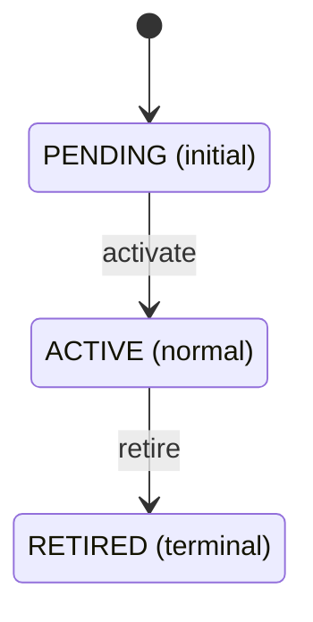

<!-- AUTOGENERATED from the domain graph.json — do not edit by hand. Edits: methodology/graph -> hotam gen-spec -->
reader: (unresolved-reader)

# Entities

> Generated by `hotam gen-spec` from `domains/fixture-domain/graph.json`. Do not hand-edit.

## fixture-entity

A synthetic entity type exercising the §Entity render branches.

### Lifecycle

- States: `PENDING` (initial), `ACTIVE` (normal), `RETIRED` (terminal)
- Transitions: `activate`, `retire`
- Cyclic: false

### Fields

| name | kind | required | ref_target |
|------|------|----------|------------|
| label | string | true |  |
| weight | number | false |  |
| owner_ref | reference | false | stakeholder |

### Covered by

- `check_entity_type_lifecycle_wellformed`
- `check_entity_instance_state_in_lifecycle`
- `check_entity_instance_required_fields`
- `check_entity_instance_id_prefix`
- `check_entity_instance_refs_resolve`
- `check_entity_field_kind_known`
- `check_typed_anchors_entity`

### Instances

| id | state | label | weight | owner_ref |
| --- | ----- | ----- | ------ | --------- |
| ENT-fixture-entity-1 | PENDING | first fixture instance | 1 |  |
| ENT-fixture-entity-2 | ACTIVE | second fixture instance |  | S-ai-agent |

## Entity-state tensions

_(no entity-state tensions surfaced — clean)_
