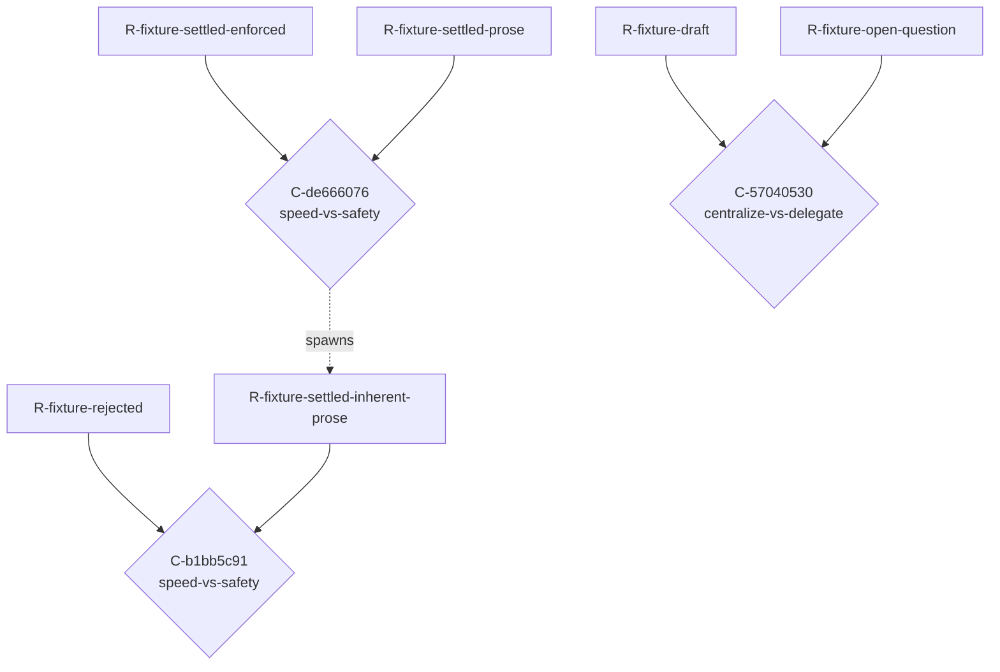

<!-- AUTOGENERATED from the domain graph.json — do not edit by hand. Edits: methodology/graph -> hotam gen-spec -->
reader: (unresolved-reader)

# TENSIONS.md — The tension map (Hotam-Spec)

Generated from the active domain's `graph.json` (the tension graph). A **Conflict** is a first-class connector NODE — `R-a -> C <- R-b` — carrying the tension axis, the colliding context, and the shared assumption that belong to neither requirement. Conflicts CLUSTER by axis: a cluster of size > 1 is one unresolved architectural choice, not N local disputes.

---

## Clusters by axis

### Axis `speed-vs-safety` — 2 conflict(s), ARCHITECTURAL CHOICE (cluster)

#### `C-de666076` — speed-vs-safety

- **context:** fixture decided conflict context
- **members:** `R-fixture-settled-enforced`, `R-fixture-settled-prose`
- **resolver:** `S-resolver`
- **lifecycle:** DECIDED(fixture chose safety for the render path)
- **shared assumption:** `A-holds-example`
- **spawned (lineage):** `R-fixture-settled-inherent-prose`
- **variants** (resolver chooses one):
  - `V-fast`
    - behavior: skip verification
    - implies: faster iteration
    - costs: risk of drift
  - `V-safe`
    - behavior: verify before render
    - implies: slower iteration
    - costs: more CI time

#### `C-b1bb5c91` — speed-vs-safety

- **context:** fixture freshly detected conflict, not yet acknowledged
- **members:** `R-fixture-rejected`, `R-fixture-settled-inherent-prose`
- **resolver:** `S-resolver`
- **lifecycle:** DETECTED

### Axis `centralize-vs-delegate` — 1 conflict(s), single tension

#### `C-57040530` — centralize-vs-delegate

- **context:** fixture held conflict context, unresolved variant choice
- **members:** `R-fixture-draft`, `R-fixture-open-question`
- **resolver:** `S-resolver`
- **lifecycle:** HELD
- **variants** (resolver chooses one):
  - `V-central`
    - behavior: one operator owns fixture growth
    - implies: simpler ownership
    - costs: single point of failure
  - `V-delegate`
    - behavior: sub-operators own fixture slices
    - implies: parallelism
    - costs: coordination overhead

## Hotam-Specn map (Mermaid)

## Controlled vocabulary of axes (this domain)

| axis slug | description |
|---|---|
| `speed-vs-safety` | Ship fast vs. verify thoroughly. |
| `centralize-vs-delegate` | One operator vs. many sub-operators. |

## Latent-connector suspicions (heuristic, for AI review)

Requirement pairs that SHOULD perhaps have a connector node but do not. This is a heuristic stub for the deferred detector — a suspicion to judge, never an auto-materialized conflict.

| left | right | hint |
|---|---|---|
| `R-fixture-draft` | `R-fixture-settled-prose` | shares assumption(s): A-uncertain-example |
| `R-fixture-open-question` | `R-fixture-settled-enforced` | shares assumption(s): A-holds-example |
| `R-fixture-open-question` | `R-fixture-settled-prose` | shares assumption(s): A-holds-example |
